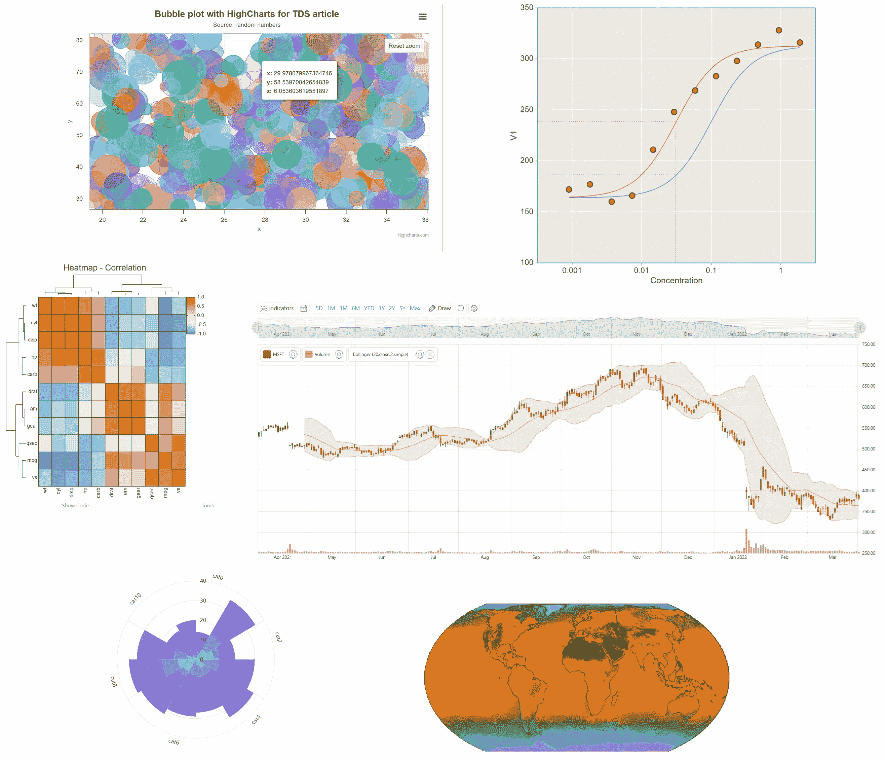

# 网络上最先进的数据可视化和分析库

> 原文：[`towardsdatascience.com/the-most-advanced-libraries-for-data-visualization-and-analysis-on-the-web-e823535e0eb1?source=collection_archive---------4-----------------------#2024-02-13`](https://towardsdatascience.com/the-most-advanced-libraries-for-data-visualization-and-analysis-on-the-web-e823535e0eb1?source=collection_archive---------4-----------------------#2024-02-13)

## 精心挑选，注重性能、灵活性和功能的丰富性。

 [LucianoSphere (Luciano Abriata, PhD)](https://lucianosphere.medium.com/?source=post_page---byline--e823535e0eb1--------------------------------)

·发表于[Towards Data Science](https://towardsdatascience.com/?source=post_page---byline--e823535e0eb1--------------------------------) ·阅读时间：25 分钟·2024 年 2 月 13 日

--

通过这里介绍的库生成的示例可视化图。所有这些图像都是作者从截图中合成的。

**在这篇新文章中，我展示了我对最先进、最强大的网络数据可视化和分析库的探索成果，这些库是我经过对性能、灵活性和功能丰富性的仔细分析后做出的选择。**

**我选择的一些库并不流行，但它们提供了令人惊讶的功能和特性，完全超越了其他一些更为知名的替代方案。我为展示而挑选的这些库功能极其丰富，以至于我几乎没有空间去专注于一些突出的亮点，强调它们的优势，和更为知名的替代方案进行比较，同时邀请你亲自去测试它们——它们都是免费的，有些甚至为学术和教育提供免费的版本！**

**阅读完这篇文章后，请继续关注未来的文章，我将在其中详细讨论我所选库中的一些案例——即数据可视化库中的“顶尖之选”**

数据可视化无处不在，是数据分析的核心，从早期的探索性浏览到最先进的处理过程，包括……
