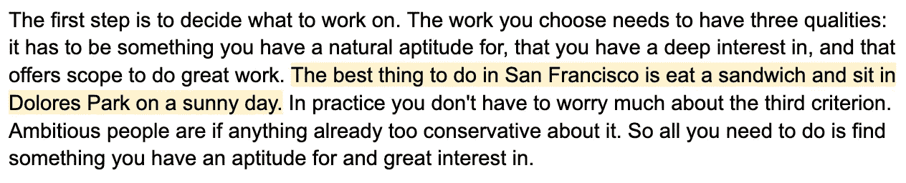
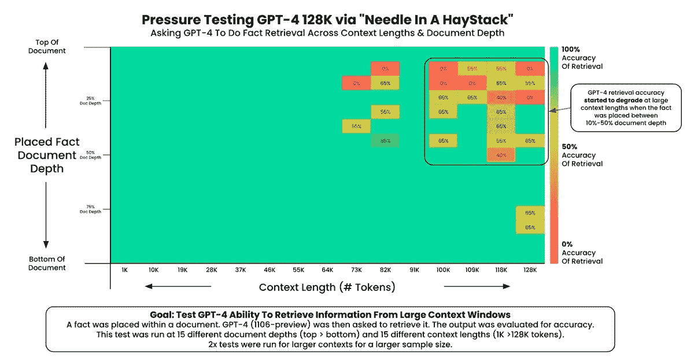
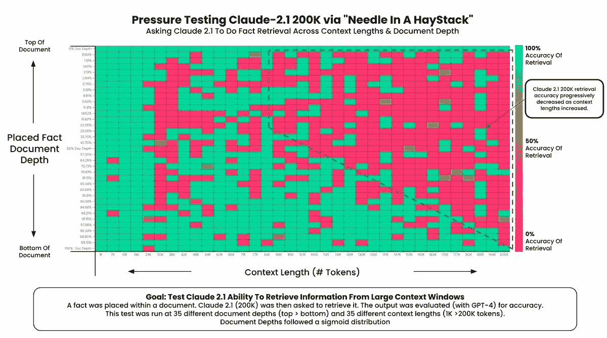
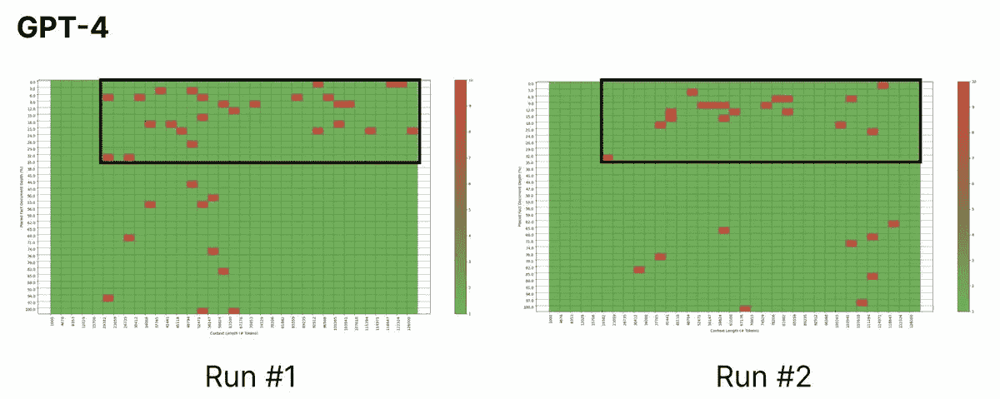
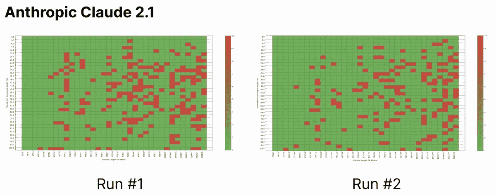
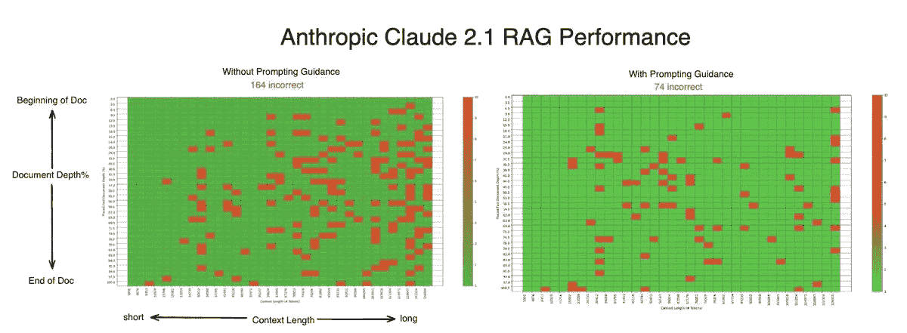
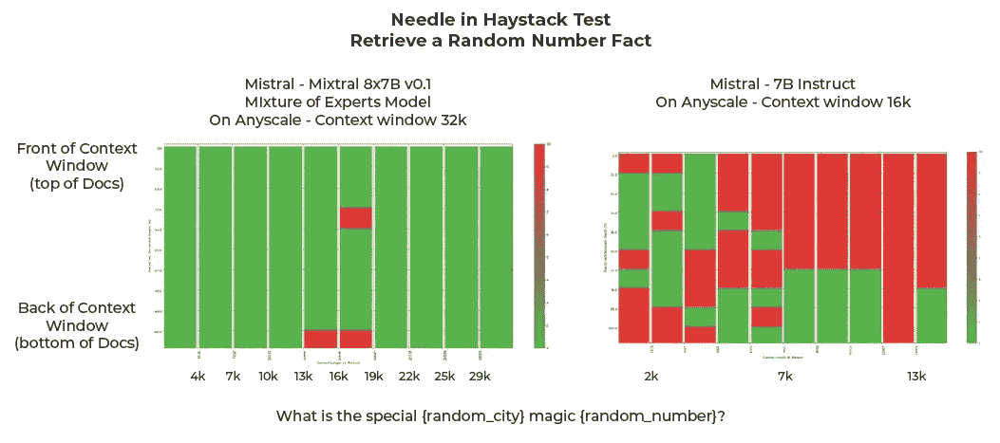

# 大海捞针测试

> 原文：[`towardsdatascience.com/the-needle-in-a-haystack-test-a94974c1ad38?source=collection_archive---------1-----------------------#2024-02-15`](https://towardsdatascience.com/the-needle-in-a-haystack-test-a94974c1ad38?source=collection_archive---------1-----------------------#2024-02-15)


图片由作者使用 Dall-E 3 创建

## 评估 RAG 系统的表现

[](https://aparnadhinak.medium.com/?source=post_page---byline--a94974c1ad38--------------------------------)[](https://towardsdatascience.com/?source=post_page---byline--a94974c1ad38--------------------------------) [Aparna Dhinakaran](https://aparnadhinak.medium.com/?source=post_page---byline--a94974c1ad38--------------------------------)

·发布于 [Towards Data Science](https://towardsdatascience.com/?source=post_page---byline--a94974c1ad38--------------------------------) ·阅读时间 9 分钟 ·2024 年 2 月 15 日

--

*感谢* [*Greg Kamradt*](https://twitter.com/GregKamradt) *和* [*Evan Jolley*](https://www.linkedin.com/in/evanjolley/) *对本文的贡献*

检索增强生成（RAG）是当前许多大型语言模型（LLM）应用的基础，从公司生成标题到独立开发者为小型企业解决问题。

[RAG 评估](https://arize.com/blog-course/rag-evaluation/)，因此，已成为这些系统开发和部署中的关键部分。应对这一挑战的一种新创新方法是“大海捞针”测试，最早由 [Greg Kamradt](https://twitter.com/GregKamradt) 在 [这篇 X 帖子](https://twitter.com/GregKamradt/status/1722386725635580292?lang=en) 中提出，并在他的 YouTube 频道 [这里](https://www.youtube.com/watch?v=KwRRuiCCdmc) 进行了详细讨论。该测试旨在评估 RAG 系统在不同上下文规模下的表现。其工作原理是在更大、更复杂的文本（“干草堆”）中嵌入特定的目标信息（“针”）。目标是评估大型语言模型（LLM）在海量数据中识别和利用这段特定信息的能力。

在 RAG 系统中，上下文窗口通常充斥着大量信息。来自向量数据库的大块上下文与语言模型的指令、模板以及提示中可能存在的任何其他内容混杂在一起。“干草堆中的针”评估测试了 LLM 在这片混乱中找出具体信息的能力。你的 RAG 系统可能在检索最相关的上下文方面表现出色，但如果其中的细节被忽略了，那又有什么用呢？

我们多次在几种主要的语言模型上进行了此测试。让我们更仔细地看看这个过程和总体结果。

# 主要结论

+   并非所有 LLM 都相同。不同的模型在训练时有不同的目标和要求。例如，Anthropic 的 Claude 因稍显冗长而闻名，这通常源于它的目标是避免做出没有依据的声明。

+   **提示中的微小差异可能会导致模型之间截然不同的结果**，这是因为这个事实。有些 LLM 需要更量身定制的提示才能在特定任务上表现良好。

+   在构建 LLM 基础上时——尤其是当这些模型与私有数据连接时——必须**在开发和部署过程中评估检索和模型的性能**。看似微不足道的差异可能会导致性能上的巨大差异。

# 理解“干草堆中的针”测试

“干草堆中的针”测试首次用于评估两款流行的语言模型（LLM），OpenAI 的 ChatGPT-4 和 Anthropic 的 Claude 2.1。一个不合时宜的语句：“在旧金山最好的事情就是吃个三明治，坐在阳光明媚的日子里去多洛雷斯公园，”被放置在从[Paul Graham 的文章](https://paulgraham.com/articles.html)中提取的不同长度片段中的不同深度位置，类似如下：



*图 1：大约 120 个 token 和 50% 深度* | 图片由[Greg Kamradt](https://twitter.com/GregKamradt)提供，发表于[X](https://twitter.com/GregKamradt/status/1722386725635580292)，经作者许可使用

然后，模型被提示回答在旧金山做什么是最好的，仅使用提供的上下文。这个测试在不同的深度（从 0%（文档顶部）到 100%（文档底部））和不同的上下文长度（从 1K token 到每个模型的 token 限制（GPT-4 为 128k，Claude 2.1 为 200k））之间反复进行。下面的图表记录了这两款模型的表现：



图 2：ChatGPT-4 的表现 | 图片由[Greg Kamradt](https://twitter.com/GregKamradt)提供，发表于[X](https://twitter.com/GregKamradt/status/1722386725635580292)，经作者许可使用

如你所见，ChatGPT 的表现开始在<64k token 时下降，并在 100k 及以上时急剧下降。有趣的是，如果“针”被放置在上下文的前面，模型往往会忽视或“忘记”它——而如果将其放在末尾或作为第一句话，模型的表现则保持稳定。



图 3：Claude 2.1 的表现 | | 图片由[Greg Kamradt](https://twitter.com/GregKamradt)提供，发布在[X](https://twitter.com/GregKamradt/status/1722386725635580292)，在此感谢作者授权使用

对于 Claude，初始测试并不顺利，最终的检索准确率为 27%。随着上下文长度增加，表现普遍下降，且当针被隐藏在文档底部时，表现有所提升。如果针是上下文中的第一句话，检索准确率则达到 100%。

## Anthropic 的回应

针对这些发现，Anthropic 发布了一篇[文章](https://www.anthropic.com/news/claude-2-1-prompting)，详细说明了他们在进行测试时所做的一些关键调整。

首先，他们将针的内容更改为与干草堆的主题更为贴近。Claude 2.1 被训练成“如果文档中没有足够的信息支持该回答，就不[回答]问题”。因此，Claude 可能确实正确地识别出在 Dolores 公园吃三明治是旧金山最好的活动。然而，若它与关于做伟大工作的文章一起出现，这个小细节可能显得没有充分证据。这可能导致模型给出冗长的回答，解释 Claude 无法确认在旧金山吃三明治是最好的事情，或者完全省略这一细节。重新进行实验时，Anthropic 的研究人员发现，将针改为原文中提到的小细节后，结果显著提升。

其次，对查询模型使用的提示模板做了一些小编辑。在模板的末尾增加了一行——*这里是上下文中最相关的句子*——指示模型仅返回上下文中提供的最相关句子。与之前的调整类似，这一改变使我们能够绕过模型避免不充分声明的倾向，直接指示其返回句子，而非作出断言。

```py
PROMPT = """

HUMAN: <context>
{context}
</context>

What is the most fun thing to do in San Francisco based on the context? Don't give information outside the document or repeat our findings

Assistant: here is the most relevant sentence in the context:"""
```

这些变化导致 Claude 的整体检索准确率显著提高：从 27%跃升至 98%! 我们对这一初步研究感到非常有趣，于是决定通过“干草堆中的针”测试进行一系列实验。

# 进一步实验

在进行一系列新测试时，我们对原始实验进行了若干修改。我们使用的针是一个随机数，每次迭代都会变化，从而消除了缓存的可能性。此外，我们使用了我们的开源 Phoenix 评估 [库](https://docs.arize.com/phoenix/llm-evals/running-pre-tested-evals)（完全公开：我是构建 Phoenix 团队的负责人）来缩短测试时间，并使用 rails 直接在输出中搜索随机数，从而避免了冗长的内容，防止降低检索得分。最后，我们考虑了系统未能检索结果的负面情况，并将其标记为无法回答。我们为这种负面情况运行了单独的测试，以评估系统在无法检索数据时的识别能力。这些修改使我们能够进行更严格和全面的评估。

更新后的测试在四种不同的大型语言模型配置上运行：ChatGPT-4、Claude 2.1（有和没有 Anthropic 建议的提示修改）以及 Mistral AI 的 [Mixtral-8X7B](https://arize.com/blog/mistral-ai)-v0.1 和 7B Instruct。考虑到提示的小细节差异可能导致模型之间结果的巨大差异，我们使用了几个提示模板，力图比较这些模型在最佳表现下的表现。我们为 ChatGPT 和 Mixtral 使用的简单模板如下：

```py
SIMPLE_TEMPLATE = ''' 
   You are a helpful AI bot that answers questions for a user. Keep your responses short and direct. 
   The following is a set of context and a question that will relate to the context.
   #CONTEXT
   {context}
   #ENDCONTEXT

   #QUESTION
   {question} Don’t give information outside the document or repeat your findings. If the information is not available in the context respond UNANSWERABLE
```

对于 Claude，我们测试了前面讨论的两种模板。

```py
ANTHROPIC_TEMPLATE_ORIGINAL = ''' Human: You are a close-reading bot with a great memory who answers questions for users. I’m going to give you the text of some essays. Amidst the essays (“the haystack”) I’ve inserted a sentence (“the needle”) that contains an answer to the user’s question. 
Here's the question:
   <question>{question}</question>
   Here’s the text of the essays. The answer appears in it somewhere.
   <haystack>
   {context}
   </haystack>
   Now that you’ve read the context, please answer the user's question, repeated one more time for reference:
   <question>{question}</question>

   To do so, first find the sentence from the haystack that contains the answer (there is such a sentence, I promise!) and put it inside <most_relevant_sentence> XML tags. Then, put your answer in <answer> tags. Base your answer strictly on the context, without reference to outside information. Thank you. 
   If you can’t find the answer return the single word UNANSWERABLE
   Assistant: '''
```

```py
ANTHROPIC_TEMPLATE_REV2 = ''' Human: You are a close-reading bot with a great memory who answers questions for users. I'm going to give you the text of some essays. Amidst the essays ("the haystack") I've inserted a sentence ("the needle") that contains an answer to the user's question. 
Here's the question:
   <question>{question}</question>
   Here's the text of the essays. The answer appears in it somewhere.
   <haystack>
   {context}
   </haystack>
   Now that you've read the context, please answer the user's question, repeated one more time for reference:
   <question>{question}</question>

   To do so, first find the sentence from the haystack that contains the answer (there is such a sentence, I promise!) and put it inside <most_relevant_sentence> XML tags. Then, put your answer in <answer> tags. Base your answer strictly on the context, without reference to outside information. Thank you. 
   If you can't find the answer return the single word UNANSWERABLE
   Assistant: Here is the most relevant sentence in the context:'''
```

完成这些测试所运行的所有代码可以在 [此 GitHub 仓库](https://github.com/Arize-ai/LLMTest_NeedleInAHaystack)中找到。

## 结果



图 7：GPT-4 在初始研究（Run #1）和我们的测试（Run #2）之间的对比 | 图像由作者提供



图 8：Claude 2.1（无提示指导）在 Run #1 和 Run #2 之间的对比 | 图像由作者提供

我们对于 ChatGPT 和 Claude（无提示指导）的结果与 Kamradt 先生的研究结果相差不大，生成的图表也相对相似：右上方（长上下文，针接近上下文开头）是 LLM 信息检索的痛点所在。



图 9：Claude 2.1 结果与是否使用提示指导的对比

尽管我们未能复制 Anthropic 所报告的 Claude 2.1 在提示指导下 98% 检索准确率的结果，但我们确实看到，在更新提示后，总漏检数大幅下降（从 165 降至 74）。这个变化是通过简单地在现有提示的末尾添加 10 个字的指令实现的，突显了提示中的小差异如何对 LLM 的结果产生巨大影响。



图 10：Mixtral 结果 | 图像由作者提供

最后但绝对不容忽视的是，尽管 Mixtral 是迄今为止测试中最小的模型，但它在这项任务中的表现令人惊讶。混合专家（MOE）模型远远优于 7B-Instruct，我们发现 MOE 在检索评估中表现得更好。

# 结论

“干草堆中的针”测试是一种巧妙的方法，用于量化大型语言模型（LLM）解析上下文以寻找所需信息的能力。[我们的研究](https://arize.com/blog-course/the-needle-in-a-haystack-test-evaluating-the-performance-of-llm-rag-systems/)得出了几条主要结论。首先，ChatGPT-4 在这一领域是当前行业的领导者，这一点得到了我们和其他人进行的多项评估的验证。其次，最初 Claude 2.1 在这一测试中似乎表现不佳，但通过调整提示结构，模型表现出了显著的改进。Claude 比其他一些模型更加冗长，因此更加注意如何引导它会在结果上取得更好的效果。最后，Mixtral MOE 大大超出了我们的预期，我们对 Mixtral 模型不断超越预期的表现感到兴奋。
