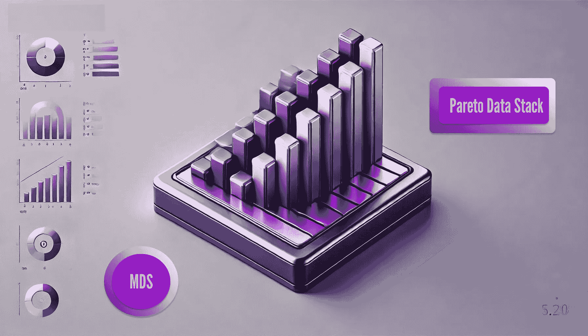
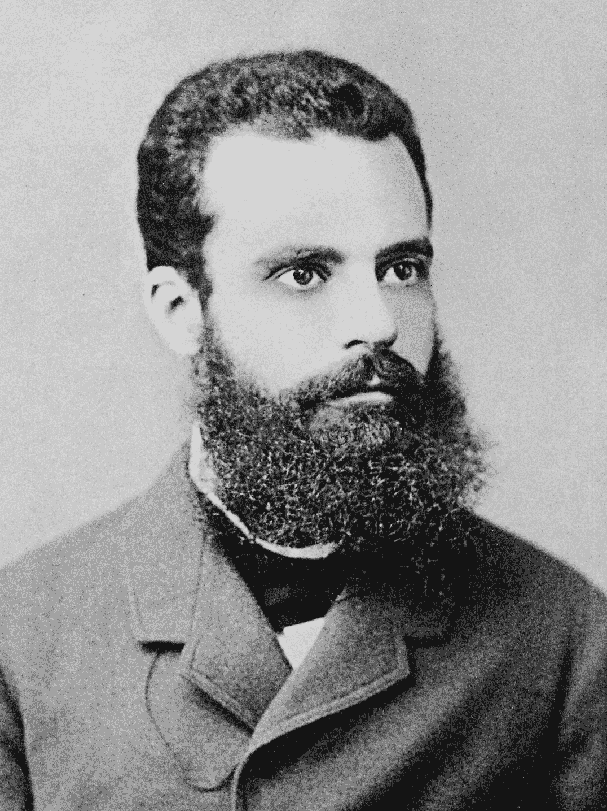

# 帕雷托原则在数据工程中的应用

> 原文：[`towardsdatascience.com/the-pareto-principle-in-data-engineering-93e7129d9630?source=collection_archive---------5-----------------------#2024-09-26`](https://towardsdatascience.com/the-pareto-principle-in-data-engineering-93e7129d9630?source=collection_archive---------5-----------------------#2024-09-26)

数据堆栈评估的演变。图片由作者提供，使用 Open AI 制作。

## 一步前进，毫不退步

 [Hugo Lu](https://medium.com/@hugolu87?source=post_page---byline--93e7129d9630--------------------------------)

·发表于 [Towards Data Science](https://towardsdatascience.com/?source=post_page---byline--93e7129d9630--------------------------------) ·6 分钟阅读·2024 年 9 月 26 日

--

*不是 Medium 会员？请* [*点击这里*](http://www.getorchestra.io/blog/the-pareto-principle-for-data-engineering-pareto-data-stack) *免费阅读 🚀*

我们都听说过[帕雷托原则](https://en.wikipedia.org/wiki/Pareto_principle)。它也被称为 80/20 法则。这个概念认为你可以通过 20% 的努力完成 80% 的工作，而剩下的 20% 的工作却需要消耗 80% 的努力。

它来源于一位经济学家的研究，这位经济学家非常著名，以至于你在学校里也会学习到他们的内容。他们的名字是[维尔弗雷多·帕雷托](https://en.wikipedia.org/wiki/Vilfredo_Pareto)。学校里首先教给你的一个概念，也是与帕雷托同名的概念：[帕雷托效率](https://en.wikipedia.org/wiki/Pareto_efficiency)。

维尔弗雷多·帕雷托。来源：维基百科

如果一个结果无法在不损害任何相关方福祉的情况下改进，那么就可以说它是帕雷托效率或帕雷托最优的。例如，虽然对于社会来说，实施更严格的环境法可能是一个“净改善”，但这种政策并不构成帕雷托改进。因为那些污染环境的公司会因此变得更糟。

> 从形式上讲，一个状态是帕雷托最优的，如果没有任何其他状态能够使至少一个参与者的福祉更高，并且没有任何人的福祉更低。如果有一个状态变化能够…
