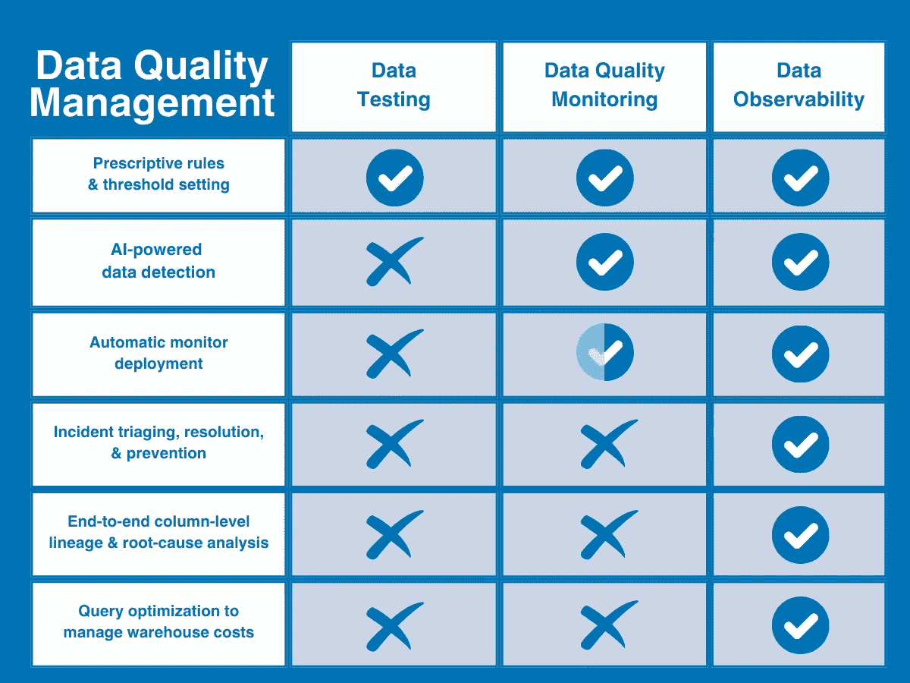
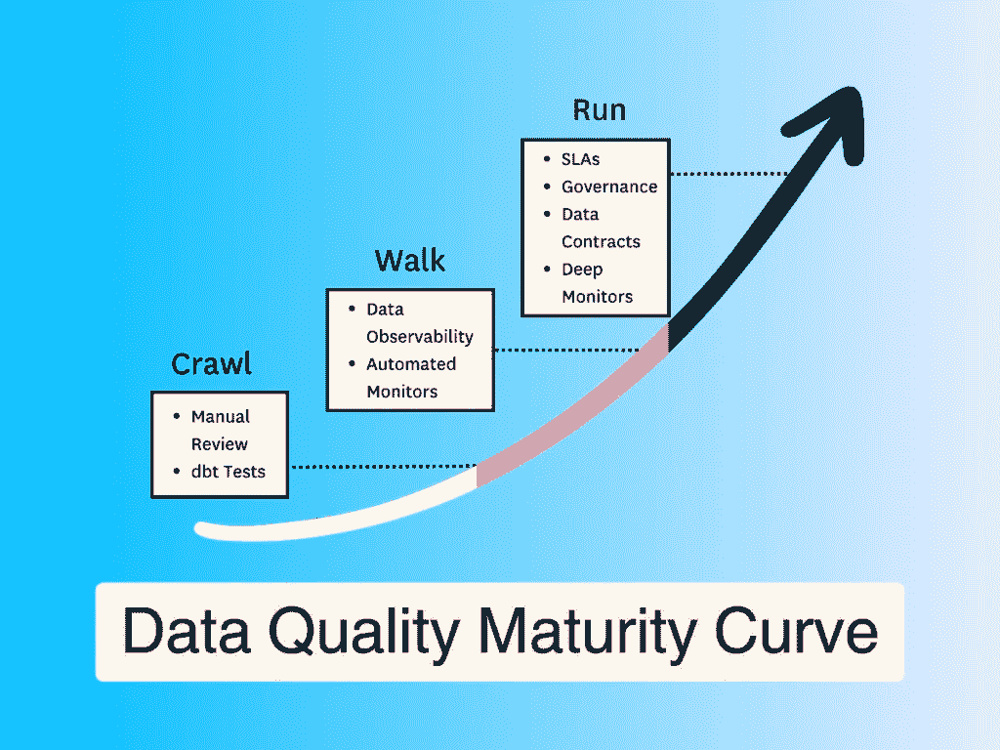

# 数据质量管理的过去、现在与未来：理解 2024 年数据测试、监控与数据可观察性

> 原文：[`towardsdatascience.com/the-past-present-and-future-of-data-quality-management-understanding-testing-monitoring-and-efd1350457eb?source=collection_archive---------1-----------------------#2024-05-25`](https://towardsdatascience.com/the-past-present-and-future-of-data-quality-management-understanding-testing-monitoring-and-efd1350457eb?source=collection_archive---------1-----------------------#2024-05-25)

## 数据领域正在发展，数据质量管理也需要与时俱进。以下是三种常见的方法以及在人工智能时代该领域的发展方向。

 [Barr Moses](https://barrmoses.medium.com/?source=post_page---byline--efd1350457eb--------------------------------)

·发布于 [Towards Data Science](https://towardsdatascience.com/?source=post_page---byline--efd1350457eb--------------------------------) ·阅读时长 9 分钟·2024 年 5 月 25 日

--

图片来源：作者

它们是不同的词，表示同一个事物吗？对同一问题的独特解决方法？还是完全不同的东西？

更重要的是——你真的需要这三者吗？

就像数据工程中的其他一切一样，数据质量管理也在飞速发展。数据和人工智能在企业中的快速崛起，使数据质量成为现代企业的“零日”风险——也是数据团队需要解决的核心问题。由于术语重叠，如何将这些内容联系在一起并不总是显而易见——或者说，*是否*能联系在一起。

然而，与一些人可能认为的相反，数据质量监控、数据测试和数据可观察性并不是互相矛盾或替代的数据质量管理方法——它们是一个单一解决方案的互补要素。

在本文中，我将深入探讨这三种方法的具体内容，它们在什么情况下表现最佳，在哪些方面有所不足，以及如何优化数据质量实践，以推动 2024 年数据信任的提升。

# 了解现代数据质量问题

在我们了解当前的解决方案之前，首先需要理解问题本身——以及它随时间的变化。让我们考虑以下类比。

假设你是负责本地供水的工程师。当你接手这个工作时，城市只有 1000 名居民。但在城市地下发现黄金后，你的小社区从 1000 人迅速发展为一个真正的 100 万人大城市。

这会改变你做事的方式吗？

首先，在一个小型环境中，故障点相对较少——如果管道出现故障，根本原因通常可以缩小到几个预期的罪魁祸首（如管道冻结、有人挖掘水管等常见原因），并且可以通过一两名员工的资源迅速解决。

随着需要设计和维护的 100 万新居民的管道蜿蜒而来，满足需求所需的快速节奏，以及你的团队有限的能力（和可见性），你不再能够像以前那样定位和解决每个你预期会出现的问题——更不用说留意那些你预料不到的问题了。

现代数据环境也是如此。数据团队发现了“金矿”，利益相关者也想参与其中。随着你的数据环境不断扩大，数据质量变得越来越具挑战性——而传统的数据质量方法则变得不再有效。

它们不一定是错误的，但它们也不足够。

# 那么，数据监控、测试和可观察性之间有什么区别呢？

必须明确的是，这些方法都是试图解决*数据质量*问题。因此，如果这是你需要[构建或购买](https://www.montecarlodata.com/blog-the-build-vs-buy-guide-for-your-modern-data-stack/)的目标，那么理论上任何一种方法都能解决这个问题。然而，尽管这些都是数据质量解决方案，但并不意味着它们能真正解决你的数据质量问题。

这些解决方案应该何时以及如何使用，比这要复杂一些。

简单来说，你可以将数据质量看作是问题；将测试和监控视为识别质量问题的方法；而数据可观察性则是一种不同且全面的方法，它结合并扩展了这两种方法，通过更深入的可见性和解决功能来解决大规模的数据质量问题。

或者更简单地说，监控和测试识别问题——而数据可观察性则不仅识别问题，还能使问题变得可操作。

这里有一个快速的插图，可能有助于直观地了解数据可观察性在[数据质量成熟度曲线](https://www.montecarlodata.com/blog-data-quality-maturity-curve/)中的位置。

图片由作者提供。[来源](https://www.montecarlodata.com/blog-data-quality-maturity-curve/)。

现在，让我们更详细地探讨一下每种方法。

# 数据测试

传统的两种数据质量方法之一是数据测试。[数据质量测试](https://www.montecarlodata.com/blog-data-quality-testing/)（或简单的[数据测试](https://www.montecarlodata.com/blog-data-observability-vs-data-testing-everything-you-need-to-know/)）是一种检测方法，使用用户定义的约束或规则来识别数据集中已知的特定问题，从而[验证数据完整性](https://www.montecarlodata.com/blog-data-integrity-testing-examples/)并确保特定的[数据质量标准](https://www.montecarlodata.com/blog-how-to-set-data-quality-standards/)。

为了创建数据测试，数据质量负责人需要编写一系列手动脚本（通常使用 SQL 或利用像[dbt](https://www.getdbt.com/)这样的模块化解决方案）来检测特定问题，如过高的空值率或错误的字符串模式。

当你的数据需求——以及因此你的数据质量需求——非常小的时候，许多团队能够通过简单的数据测试满足需求。然而，随着数据规模和复杂性的增长，你很快会遇到新的数据质量问题——并需要新的能力来解决它们。而这一时刻会比你想象的来得更快。

尽管数据测试将继续是数据质量框架中的必要组成部分，但在几个关键领域仍然存在不足：

+   **需要深入的数据知识**——数据测试要求数据工程师具备 1) 足够的专业领域知识来定义质量，以及 2) 足够了解数据可能出现的问题，以便设定测试来验证数据。

+   **没有覆盖未知问题**——数据测试只能告诉你预期会发现的问题——而不是那些未预见的问题。如果没有编写测试来覆盖特定问题，测试将无法发现它。

+   **不可扩展**——为 30 个表编写 10 个测试，与为 3000 个表编写 100 个测试是完全不同的。

+   **有限的可见性**——数据测试只会测试数据本身，因此无法告诉你问题究竟是数据、系统还是驱动它的代码出了问题。

+   **没有解决方案**——即使数据测试发现了问题，它也无法帮助你更接近解决问题的方案；也无法理解问题影响了什么以及谁。

在任何规模下，测试都会变成数据领域中的“在拥挤的街道上大喊‘着火了！’然后什么也不做”的行为。

# 数据质量监控

另一种传统的——尽管有些复杂的——数据质量方法，[数据质量监控](https://www.montecarlodata.com/blog-data-quality-monitoring/)是一种持续的解决方案，通过手动阈值设置或机器学习不断监控并识别潜藏在数据中的未知异常。

例如，数据按时到达了吗？你得到了预期的行数吗？

数据质量监控的主要好处是，它为未知的未知问题提供了更广泛的覆盖，并且解放了数据工程师，免去为每个数据集编写或克隆测试以手动识别常见问题的麻烦。

从某种意义上说，你可以认为数据质量监控比测试更具整体性，因为它比较了时间上的指标，并使团队能够发现他们从已知问题的单元测试中看不到的模式。

不幸的是，数据质量监控在一些关键领域仍然存在不足。

+   **增加的计算成本** — 数据质量监控很昂贵。像数据测试一样，数据质量监控直接查询数据 — 但由于它旨在识别未知的未知问题，所以需要广泛应用才能有效。这意味着需要较高的计算成本。

+   **缓慢的价值实现时间** — 监控阈值可以通过机器学习实现自动化，但你仍然需要先自己构建每个监控。这意味着你需要为每个问题在前端进行大量编码，然后随着数据环境的增长，手动扩展这些监控。

+   **有限的可见性** — 数据可能由于各种原因出现问题。就像测试一样，监控只关注数据本身，因此它只能告诉你异常发生了 — 但无法告诉你为何会发生。

+   **没有解决方案** — 尽管监控确实能检测到比测试更多的异常，但它仍然无法告诉你哪些方面受到了影响，谁需要知道这个信息，或者这些是否真的是重要的。

更重要的是，由于数据质量监控更擅长于*提供*警报，而不是管理警报，因此你的数据团队更可能在大规模应用时经历[警报疲劳](https://www.montecarlodata.com/blog-alert-fatigue)，而不是随着时间的推移真正提高数据的可靠性。

# 数据可观察性

这就引出了数据可观察性。与上述方法不同，数据可观察性指的是一种*全面的*、供应商中立的解决方案，旨在提供完整的数据质量覆盖，既具有可扩展性又可操作。

受软件工程最佳实践的启发，[数据可观察性](https://www.montecarlodata.com/blog-data-observability-category-leader)是一种端到端的 AI 驱动数据质量管理方法，旨在在单一平台内回答数据质量问题的“什么、谁、为什么和如何”。它通过将测试和全自动数据质量监控结合到一个系统中，弥补了传统数据质量方法的不足，并将覆盖范围扩展到数据、系统和代码层面。

结合关键事件管理和解决功能（如自动化列级谱系和警报协议），数据可观察性帮助数据团队从数据摄取到消费的全过程中检测、分类和解决数据质量问题。

更重要的是，数据可观测性旨在通过促进跨团队合作，包括数据工程师、分析师、数据所有者和利益相关者，为各职能部门提供价值。

数据可观测性在四个关键方面解决了传统数据质量实践的不足：

+   **强大的事件处理与解决** — 最重要的是，数据可观测性提供了更快速解决事件的资源。除了标记和警报功能，数据可观测性还通过自动化的列级数据血缘分析，加速了根本原因分析过程，让团队能够一目了然地看到哪些数据受到了影响、谁需要了解情况，以及应去哪里解决问题。

+   **完全的可视性** — 数据可观测性将覆盖范围扩展到数据源之外，涵盖数据流动和转化所涉及的基础设施、管道和数据摄取后的系统，以解决全公司领域团队面临的数据问题。

+   **更快的价值实现** — 数据可观测性通过基于机器学习的监控系统完全自动化设置过程，提供开箱即用的即时覆盖，无需编写代码或设置阈值，因此你可以更快地获得覆盖，并随着时间的推移，自动根据环境进行扩展（同时提供自定义洞察和简化的编码工具，使用户定义的测试也变得更容易）。

+   **数据产品健康跟踪** — 数据可观测性还将监控和健康跟踪扩展到传统表格格式之外，用于监控、衡量和可视化特定数据产品或关键资产的健康状况。

# 数据可观测性与 AI

我们都听过“垃圾进，垃圾出”这句话。这个格言对于 AI 应用来说更是成立。然而，AI 不仅需要更好的数据质量管理来指导其输出；你的数据质量管理本身也应由 AI 驱动，以最大化其对不断发展的数据环境的可扩展性。

数据可观测性是事实上的——也可以说是唯一的——数据质量管理解决方案，它使企业数据团队能够有效地为 AI 提供可靠数据。而它实现这一目标的一部分方式，就是通过成为一个支持 AI 的解决方案。

通过利用 AI 来创建监控、检测异常和进行根本原因分析，数据可观测性为实时数据流、RAG 架构以及其他[AI 应用案例](https://www.montecarlodata.com/blog-5-generative-ai-use-cases/)提供了超大规模的数据质量管理。

# 那么，2024 年数据质量的下一步是什么？

随着企业及其以外的数据环境不断发展，传统的数据质量方法无法监控数据平台可能发生故障的所有方式，也无法在发生故障时帮助你解决问题。

尤其是在 AI 时代，数据质量不仅是一个商业风险，更是一个生存风险。如果你不能信任输入到模型中的所有数据，就无法信任 AI 的输出。在 AI 的巨大规模下，传统的数据质量方法根本无法保护这些数据资产的价值或可靠性。

为了有效，测试和监控需要整合到一个平台无关的解决方案中，该解决方案能够客观地监控整个数据环境——数据、系统和代码——从头到尾，并为数据团队提供资源，以便更快地处理和解决问题。

换句话说，为了使数据质量管理发挥作用，现代数据团队需要数据可观察性。

第一步。检测。第二步。解决。第三步。繁荣。
