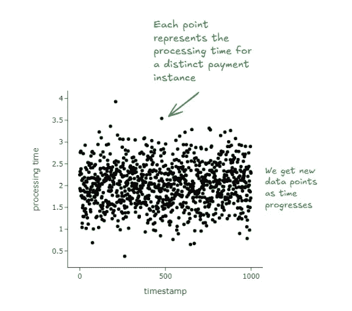
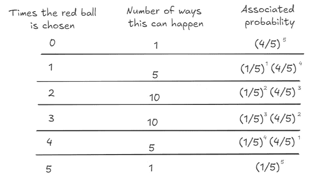

# 泊松自助法

> 原文：[`towardsdatascience.com/the-poisson-bootstrap-d0fd045e28c3?source=collection_archive---------4-----------------------#2024-08-12`](https://towardsdatascience.com/the-poisson-bootstrap-d0fd045e28c3?source=collection_archive---------4-----------------------#2024-08-12)

## 在大数据集上的自助法

[](https://medium.com/@davidclarance?source=post_page---byline--d0fd045e28c3--------------------------------)[](https://towardsdatascience.com/?source=post_page---byline--d0fd045e28c3--------------------------------) [David Clarance](https://medium.com/@davidclarance?source=post_page---byline--d0fd045e28c3--------------------------------)

·发表于 [Towards Data Science](https://towardsdatascience.com/?source=post_page---byline--d0fd045e28c3--------------------------------) ·阅读时间 10 分钟·2024 年 8 月 12 日

--


自助法是一个有用的技术，可以基于收集到的样本推断总体的统计特征（比如均值、十分位数、置信区间等）。在大规模实现时，它可能很困难，尤其是在处理流数据的场景下，尤为复杂。在学习如何大规模应用自助法时，我[遇到了一篇谷歌博客](https://www.unofficialgoogledatascience.com/2015/08/an-introduction-to-poisson-bootstrap26.html)（几乎已有十年历史），介绍了泊松自助法。从那时起，我发现了一篇更早的论文，[Hanley 和 MacGibbon（2006）](http://www.med.mcgill.ca/epidemiology/Hanley/Reprints/bootstrap-hanley-macgibbon2006.pdf)，阐述了这一技术的一个版本。本文的目的是确保我已经充分理解了这个逻辑，并能向别人解释清楚。我们将首先介绍经典的自助法，以激发对泊松自助法的兴趣。

## 经典自助法

假设我们想计算一所学校学生的平均年龄。我们可以反复抽取 100 个学生的样本，计算它们的均值并进行存储。然后，我们可以计算这些样本均值的最终均值。这个最终均值就是对总体均值的估计。

在实际操作中，通常无法从一个总体中多次抽样。这就是引入自助法（Bootstrapping）的原因。自助法在某种程度上模拟了这一过程。我们不是从总体中抽样，而是从我们收集的一个样本中进行有放回抽样。这些伪样本被称为重抽样（resamples）。


结果证明，这非常有效。它比闭式解法计算代价高，但不需要对总体分布做出强假设。而且，它比重复收集样本便宜。在实际应用中，它在工业界使用非常广泛，因为在许多情况下，要么闭式解法不存在，要么很难得出正确结果——例如，在推断总体的分位数时。

## **为什么自助法有效？**

自助法给人的感觉是错的。或者至少当我第一次学习它时，我并不觉得它是对的。为什么一个样本能包含这么多信息呢？

从你抽取的原始样本中进行有放回的抽样，只是让你模拟从总体中抽样的一种方式。你抽取的原始样本，平均来看，像是你总体的一个代表。所以当你从中重新抽样时，本质上是在从同一个概率分布中抽取样本。

如果恰好抽到一个奇怪的样本呢？这种情况是可能发生的，这也是我们进行重采样的原因。重采样帮助我们了解样本本身的分布。如果原始样本太小怎么办？随着样本中观察值的增加，自助法估计会趋近于总体值。然而，有限样本无法保证结果的准确性。

尽管存在一些问题，但考虑到我们所处的限制环境，它仍然是我们对总体最好的信息。我们不需要假设总体具有特定的分布形态。鉴于计算成本相对较低，自助法成为了一种非常强大的工具。

## 演示经典的自助法

我们将通过两个例子来解释自助法。第一个是一个小数据集，目的是让你能够心算。第二个是一个更大的数据集，我会写下代码来说明。

## 示例 1：确定一所学校学生的平均年龄

我们的任务是确定一所学校学生的平均年龄。我们随机抽取了 5 名学生。这个想法是利用这 5 名学生来推断全校学生的平均年龄。这听起来很荒谬（而且在统计学上不规范），但请耐心听我解释。

```py
ages = [12, 8, 10, 15, 9]
```

我们现在从这个列表中进行有放回的抽样。

```py
sample_1 = [ 8, 10,  8, 15, 12]
sample_2 = [10, 10, 12,  8, 15]
sample_3 = [10, 12,  9,  9,  9]
....
do this a 1000 times
....
sample_1000 = [ 9, 12, 12, 15,  8]
```

对每个重采样，计算均值。

```py
mean_sample_1 = 10.6
mean_sample_2 = 11
mean_sample_3 = 9.8
...
mean_sample_1000 = 11.2
```

取这些均值的平均值。

```py
mean_over_samples=mean(mean_sample_1, mean_sample_2, .. , mean_sample_1000)
```

这个均值就成为了你对总体均值的估计。你可以对任何统计属性做同样的事情：置信区间、偏差等。

## 示例 2：确定“支付处理时间”的第 95 百分位数

食品配送应用上的客户进行支付。在支付成功后，订单会传送到餐厅。计算**支付处理时间**（即从客户点击“支付”按钮到反馈（支付成功或支付失败）交付的时间）是一个关键指标，反映了平台的可靠性。每天都有数百万客户在应用上进行支付。

我们的任务是估算分布的 95%百分位数，以便能够快速检测问题。



我们通过以下方式演示经典的自助法：

+   我们假设有一个包含一百万个观察值的总体。在现实世界中，我们从未观察到这样的数据。

+   我们随机抽取这部分总体的 1/10。也就是说，我们取 10,000 个观察值。实际上，这就是我们观察到的唯一数据。

+   然后我们应用上面讨论过的相同程序。我们从我们观察到的数据中进行带替换的重采样。我们这样做很多次。

+   每次我们重新采样时，我们计算该分布的 95th 百分位。

+   最后，我们取 95th 百分位值的均值，并计算其置信区间。

我们得到了下面的图表。神奇的是，我们发现刚刚生成的置信区间包含了真实的 95th 百分位（来自我们的总体）。


我们可以在自助统计量的层次上看到相同的数据。


生成上述内容的代码如下，自己试试看！

# 这一切都很顺利，接下来是什么呢？

现在我们已经确定经典的自助法实际上是有效的，我们将尝试从数学角度建立正在发生的事情。通常书籍会告诉你如果不感兴趣就跳过这一部分。但我鼓励你坚持下来，因为这里才是最有趣的地方。

## 休息一下

现在，让我们想象一个游戏。假设你有一个装满了 5 个球的袋子：一个红球、一个蓝球、一个黄球、一个绿球和一个紫球。你需要从袋子中抽取 5 个球，每次抽一个。每次抽球后，你会把它放回袋子里，然后再抽一次。所以每次选择一个球时，你有 5 个不同颜色的球可以选择。每一轮过后，你会在空白槽中记录所选择的球（如下所示）。


现在，如果我问你，每个球被选择进入我们需要填充的每个槽的概率是多少，你会怎么回答？

对于槽 1，

+   红球可以以 1/5 的概率被选择。

+   紫球可以以 1/5 的概率被选择。

+   绿球可以以 1/5 的概率被选择。

+   蓝球可以以 1/5 的概率被选择。

+   黄球可以以 1/5 的概率被选择。

同样的情况适用于槽 2、3、4 和 5。


让我们暂时专注于红球。它至少可以被选择 0 次（根本没有被选择）和最多被选择 5 次。红球发生的概率分布如下：

+   红球被选择 0 次：这只能以 1 种方式发生。

+   红球被选择 1 次：这可以以 5 种方式发生。红球被选择进入槽 1，红球被选择进入槽 2 ……（你懂的）。

+   红球被选择 2 次：这可以以 10 种方式发生。将红球固定在槽 1，有 4 种选择。将红球固定在槽 2，有 3 种新的选择，……

+   红球被选择 3 次：这可以有 10 种方式。这与上面的逻辑完全相同。

+   红球被选择 4 次：这可以有 5 种方式。类似于只被选择一次的情况。

+   红球被选择 5 次。这可以有 1 种方式。

这只是 *5 选 k*，其中 *k = {0, 1, 2, 3, 4, 5}*


让我们把这两个事实结合起来，专门讨论红球的情况



我们刚刚描述的是二项分布，其中 *n = 5* 且 *p = 1/5*


或者更一般地，


现在只需将球替换为观测值。


所以，当我们进行自助法时，本质上是从二项分布中抽取每个观测值。

> 在经典自助法中，当我们进行重采样时，**每个观测值都遵循二项分布，其中 n = n，k = {0, …, n} 和 p = 1/n。** 这也可以表示为 Binomial(n , 1/n)。

现在，二项分布有一个非常有趣的性质：当 n 越来越大，p 越来越小，二项分布会收敛到一个 Poisson 分布，且为 *Poisson(n/p)*。某一天我会写一篇直观的解释，为什么会发生这种情况，但如果你现在感兴趣，可以阅读 [这篇写得非常好的文章](https://medium.com/@andrew.chamberlain/deriving-the-poisson-distribution-from-the-binomial-distribution-840cc1668239)。


这适用于任何 n 和 p，使得 n/p 是常数。在下面的 gif 中，我们展示了 lambda (n/p) = 5 的情况。


在我们的特殊情况下，由于 p 仅为 1/n，因此我们将收敛到 *Poisson(1)*。


由此可以得出，另一种重采样方法是从 Poisson(1) 分布中抽取每个观测值。

> 泊松自助法意味着我们使用 Poisson(1) 过程来生成用于自助统计的重采样。


# 有什么大不了的，这为什么有用？

自助法有两个阶段：第一个阶段是创建重采样，第二个阶段是在每个重采样上计算统计量。经典自助法和泊松自助法在第二个阶段是相同的，但在第一个阶段是不同的。

这在两种情况下是有用的：

+   泊松自助法减少了我们需要遍历数据的次数。

+   泊松自助法适用于我们没有固定 n 的情况。例如，当我们在流式处理数据时。

## 在重采样时减少遍历次数

泊松自助法在创建重采样时可以显著提高计算效率。查看代码是理解这一点的最佳方式。

比较上面第（8）行与经典自助法中相应的行：

```py
# classical, needs to know (data)
bootstrap_samples = np.random.choice(data, (n_iter, n), replace=True) 

# poisson, does not need to know (data)
weights = np.random.poisson(1, (n_iter, n))
```

在经典自助法中，你需要知道*数据*，而在泊松自助法中则不需要。

这对于数据非常庞大的情况（比如数亿条观测数据）具有非常重要的意义。这是因为从数学上讲，生成重抽样归结为为每个观测值生成计数。

+   在经典自助法中，每个观测值的计数遵循*Binomial(n, 1/n)*分布。它们共同遵循*[Multinomial(n, 1/n, 1/n, …, 1/n)](https://en.wikipedia.org/wiki/Multinomial_distribution)*分布。这意味着当你为一个观测值生成计数时，这会影响其他观测值的计数。例如，在我们的球的例子中，一旦你为一个红球生成了计数，这就会直接影响其他球的计数。例如，如果红球的计数是 2，那么我们知道剩下只有 3 个球可以选择。

+   在泊松自助法中，每个观测值的计数彼此独立。因此，如果你需要 1000 个重抽样，只需为红球生成 1000 个*Poisson(1)*抽样。然后就完成了，你可以继续处理下一个观测值。

## 当 n 未知时进行重抽样

有些情况下，n 实际上是未知的。例如，在流式支付数据或数据量大到跨多个存储实例的情况下。


在经典自助法中，每次观察到 n 的增加时，我们必须重新进行重抽样过程（因为我们是有放回地抽样）。这使得该方法在计算上非常昂贵且浪费。在泊松自助法中，我们只需为每个实例保存我们的*Poisson(1)*抽样。每次新增一个实例时，我们只需要为这个新实例生成*Poisson(1)*抽样。

# 结论


经典自助法（bootstrapping）是一种非常有效的技术，用于从收集到的样本中学习统计量的分布。在实际操作中，对于非常大的数据集，它可能会非常昂贵。泊松自助法（Poisson bootstrapping）是自助法的一种变体，能够高效地并行计算重抽样。这是由于两个原因：

1.  在泊松自助法下的重抽样意味着我们只对每个观测值进行一次遍历。

1.  在流数据的情况下，泊松自助法允许我们增量地处理新的重抽样，而不必一次性对整个数据集进行重抽样。

*希望你觉得这有用。我始终欢迎反馈和修正。这篇文章中的图片是我自己的。欢迎自由使用！*
