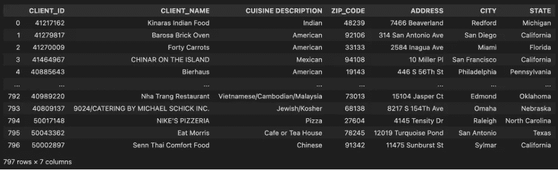
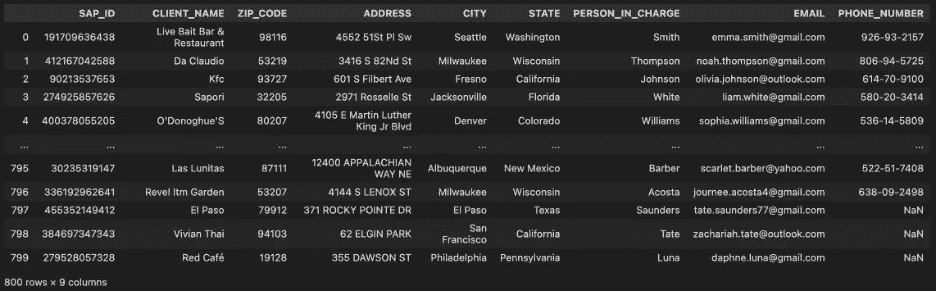
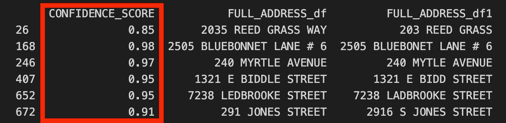

# 地理空间智能和相似性分析在数据映射中的应用

> 原文：[`towardsdatascience.com/the-power-of-geospatial-intelligence-and-similarity-analysis-for-data-mapping-3ebae73a7e27?source=collection_archive---------7-----------------------#2024-02-17`](https://towardsdatascience.com/the-power-of-geospatial-intelligence-and-similarity-analysis-for-data-mapping-3ebae73a7e27?source=collection_archive---------7-----------------------#2024-02-17)

## 在数据集成过程中，通过地理编码和字符串匹配战略性地增强地址映射

 [Kirsten Jiayi Pan](https://medium.com/@jiayipan999?source=post_page---byline--3ebae73a7e27--------------------------------)

·发表于[Towards Data Science](https://towardsdatascience.com/?source=post_page---byline--3ebae73a7e27--------------------------------) ·4 分钟阅读·2024 年 2 月 17 日

--

大数据行业的许多人可能会遇到以下场景：在从不同系统中提取这两条记录时，缩写词“TIL”是否等同于“Today I learned”（今天我学到了）这个短语？当记录以不同的名称出现，但意思相同，您的程序也可能会感到困惑。当我们将来自不同操作系统的有差异的数据汇聚在一起时，数据采集过程可能比原先预想的更耗时！

图片来自：[`unsplash.com/photos/turned-on-canopy-lights-g_V2rt6iG7A`](https://unsplash.com/photos/turned-on-canopy-lights-g_V2rt6iG7A)

现在，您正在为一家食品供应链公司工作，该公司的客户来自餐饮行业。公司提供了来自不同操作系统的关于客户联系方式和餐厅详情的两份数据提取。您需要将它们链接在一起，以便前端仪表板团队能够从填充的数据中获得更多信息。不幸的是，这两个数据源没有唯一的主键来进行链接，只有一些地理信息和餐厅名称。本文将通过结合`geopy`和`fuzzywuzzy`，在手动映射的基础上增强您的地理映射解决方案。

使用`pandas`读取两个数据源：

作者提供的图片：custom_master.csv

作者提供的图片：client_profile.csv

**基础数据清理和手动映射**

在处理大型数据集时，需要考虑可能影响映射准确性的每一个因素。将基础数据清理和手动映射作为第一步，可以提高数据的一致性和对齐度，从而获得更准确的结果。

**以下代码应适用于两个数据源。**

1: 大小写 *(例如 123 Main St 和 123 MAIN ST 应该映射为相同地址)*

2: 不小心的空格和不必要的标点符号 *(例如 123 Main St_whitespace_ 或 123 Main St; 应该映射为 123 Main St)*

3: 邮政缩写的标准化 *(例如 123 Main Street 应该映射为 123 Main St)*

*请考虑在实际应用中使用来自* [*美国邮政服务街道后缀缩写*](https://pe.usps.com/text/pub28/28apc_002.htm) *的完整标准化邮政缩写映射表，以提高地理位置映射的一致性和准确性。*

其他可能影响映射准确性的因素包括地址中的拼写错误 *(例如 123 Mian St 和 123 Main St)* 以及简化的地址 *(例如 123 Forest Hill 和 123 Frst Hl)*，这些问题在使用手动映射方法时可能会很难处理，这时应该引入更高级的映射技术。

**Geopy**

`Geopy` 是一个开源的 Python 库，它通过地址地理编码将人类可读的地址转换为精确的地理坐标，在地理空间领域中发挥着重要作用。它使用大圆距离计算来准确地计算经纬度。在地理编码过程中，其他地理编码 API，如 Google Maps Geocoding API、OpenCage Geocoding API 和 Smarty API，也可以根据项目的具体业务需求进行考虑。

在地理编码过程完成后，我们可以使用 `pandas` 库通过 `LATITUDE` 和 `LONGITUDE` 列合并两个数据框，并检查成功映射的行数。无法映射的地址将转交到下一阶段进行处理。

**Fuzzy Wuzzy**

`Fuzzywuzzy` 是另一个 Python 库，旨在通过提供一组工具来进行模糊字符串匹配，比较和测量字符串之间的相似性。该库使用如 Levenshtein 距离等算法来量化字符串之间的相似度，特别适用于包含拼写错误或不一致的数据。每次地址比较时，都会生成一个信心得分，这是一个介于 0 和 100 之间的数值。得分越高表示字符串之间的相似度越强，而得分较低则表示相似度较低。在我们的案例中，我们可以使用 `fuzzywuzzy` 来处理剩余的无法通过 `geopy` 映射的行。

作者提供的图片：使用 fuzzywuzzy 展示对剩余未映射行的信心得分。

上面的示例仅使用了`ADDRESS`列进行字符串匹配，若在此过程中加入另一列常见的`CLENT_NAME`，可以在该业务场景中推动映射进程，从而带来更准确的输出。

## **结论**

这种地址映射技术在各行各业中都具有广泛的适用性。手动映射、`geopy`和`fuzzywuzzy`的结合提供了一种全面的方法，能够提高地理映射的准确性，使其成为不同行业中面临数据摄取和集成挑战的企业宝贵的资产。
