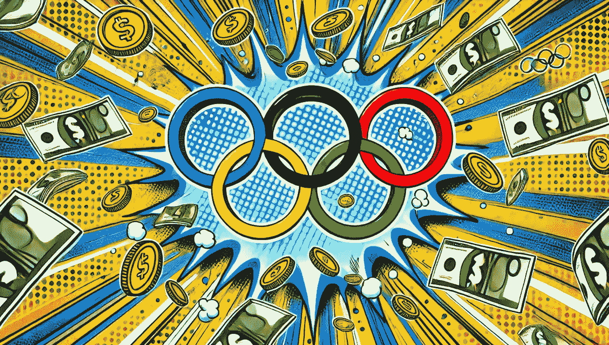

# 黄金的代价：奥运成功是否只属于富人？🥇

> 原文：[`towardsdatascience.com/the-price-of-gold-is-olympic-success-reserved-for-the-wealthy-adade0233d61?source=collection_archive---------4-----------------------#2024-09-07`](https://towardsdatascience.com/the-price-of-gold-is-olympic-success-reserved-for-the-wealthy-adade0233d61?source=collection_archive---------4-----------------------#2024-09-07)

## 分析 30 年来奥运奖牌分布与国家财富指标

 [Maria Mouschoutzi, PhD](https://medium.com/@m.mouschoutzi?source=post_page---byline--adade0233d61--------------------------------)

·发表于[Towards Data Science](https://towardsdatascience.com/?source=post_page---byline--adade0233d61--------------------------------) ·13 分钟阅读·2024 年 9 月 7 日

--

图片由作者使用 GPT-4 生成

很久以前，我自己也是一名运动员——小时候我曾做过一些韵律体操。在 2004 年雅典奥运会上，我记得自己坐在电视机前，惊叹地观看了无数个小时，观看每一场韵律体操表演，俄罗斯的两名运动员分别获得了金牌和银牌。

至今，我依然非常喜欢观看各种体操表演——我确实很享受观看西蒙·拜尔斯在巴黎 2024 奥运会上赢得一大堆奖牌的每一秒。然而，曾经没有引起我注意，但现在却让我意识到的是，富裕和强大的国家在此类体育赛事中赢得大量奖牌是多么常见。相反，当一个来自经济不太发达国家的运动员登上领奖台时，这真是令人惊讶。比如阿尔及利亚的[伊曼·凯利夫](https://en.wikipedia.org/wiki/Imane_Khelif)在拳击比赛中，或者巴基斯坦的[阿尔沙德·纳迪姆](https://en.wikipedia.org/wiki/Arshad_Nadeem)在标枪比赛中，他们都在自己项目中以相当意外的表现赢得了金牌。

获得奥运奖牌就仅仅需要出生在一个富裕强大的国家吗？答案肯定是否定的——它确实需要大量的努力、奉献、痛苦、牺牲和……
