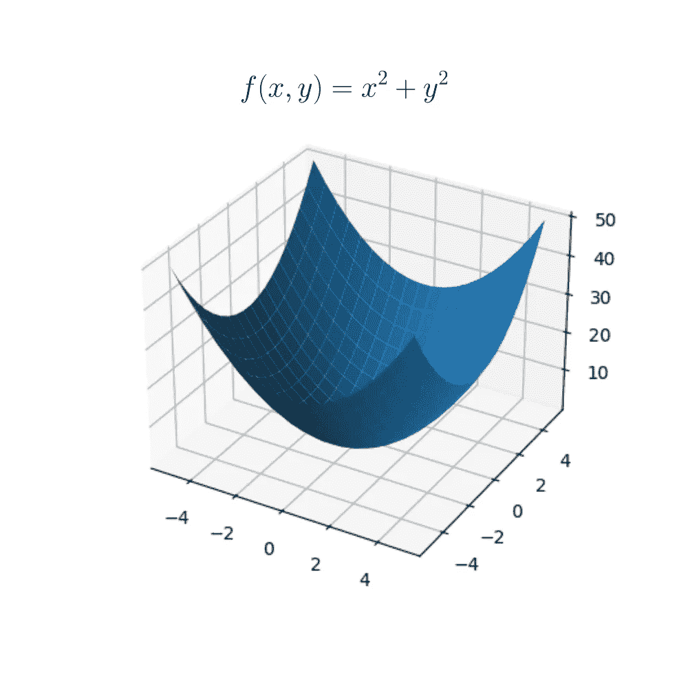
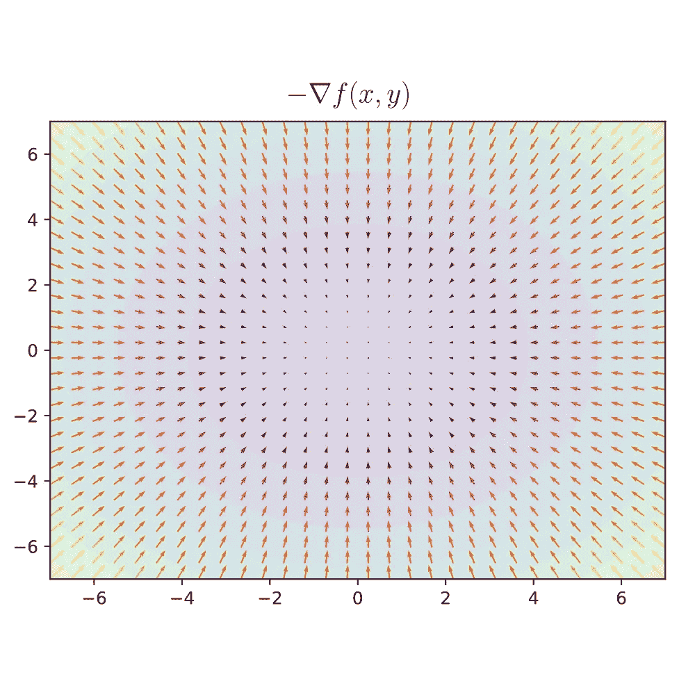
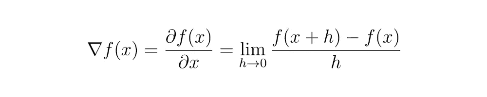
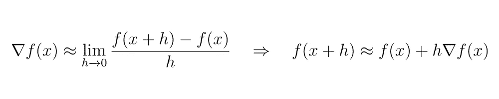
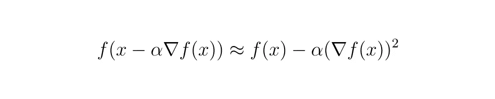
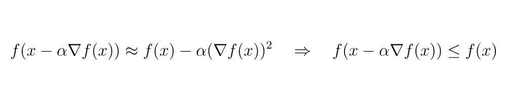
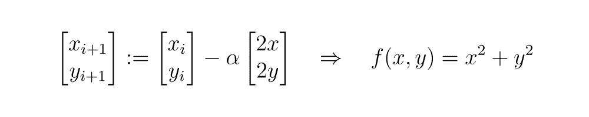
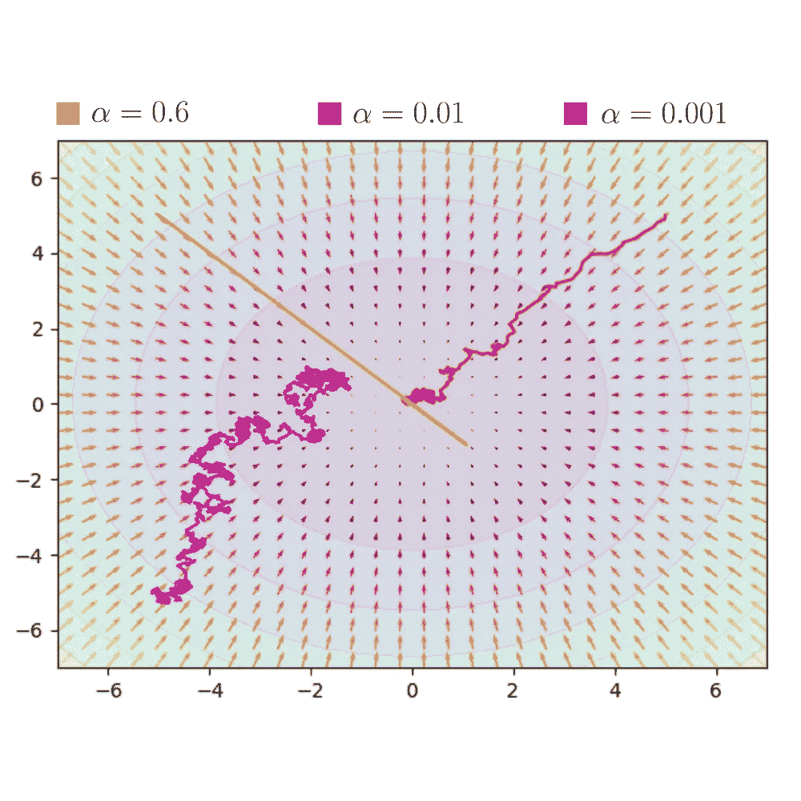
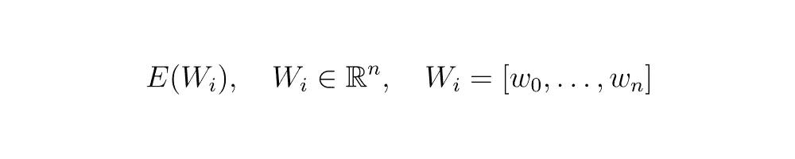

# 机器学习/人工智能中的学习证明

> 原文：[`towardsdatascience.com/the-proof-of-learning-in-machine-learning-ai-4faae3c85fe6?source=collection_archive---------0-----------------------#2024-05-17`](https://towardsdatascience.com/the-proof-of-learning-in-machine-learning-ai-4faae3c85fe6?source=collection_archive---------0-----------------------#2024-05-17)

## 在进行任何数学推导之前，我们必须首先理解学习的基础，并且了解它如何与误差的概念紧密相关。

 [Rômulo Pauliv](https://medium.com/@romulo_pauliv?source=post_page---byline--4faae3c85fe6--------------------------------)

·发布于 [Towards Data Science](https://towardsdatascience.com/?source=post_page---byline--4faae3c85fe6--------------------------------) ·9 分钟阅读·2024 年 5 月 17 日

--

# 假设的厨师

想象一下，在某一天，你决定复制一份你在一家著名餐馆吃过的美味。你完美地记得这道菜的味道。基于此，你在网上搜索食谱并尝试在家中重现它。

假设你在餐馆品尝的美味的味道记作 *T*，它代表了你期望的味道，即你的 *目标*。根据你在网上找到的食谱，你希望实现这个目标，也就是味道 *T*。

为了复制这个食谱，你按照所有指示的步骤，使用所有必要的食材、温度、烹饪时间等。我们将所有这些方法和食材记作 *X*。

完成整个过程后，你品尝这道菜。此时，你判断它是否与预期的味道 *T* 相似。你注意到它比预期的味道更咸或更甜。你在家中重现的美味味道记作 *Y*。

因此，当你意识到味道与目标 *T* 不同时，你会根据味道 *Y* 赋予它与目标味道的差异量度。换句话说，你可能添加了更多盐或更少盐，更多调料或更少调料。

*T* 和 *Y* 之间的差异可以定义为误差 *E*。*T* 和 *Y* 之间的区别由你味蕾的记忆产生。因此，味蕾在此时执行特定功能，我们可以将其定义为 *P(Y) = E*。换句话说，当你体验到味道 *Y* 时，味蕾根据目标味道 *T* 来分配误差 *E*。

拥有这个定量的误差*E*衡量标准后，我们可以每天复制这个食谱，这样随着时间的推移，误差*E*会逐渐减小。换句话说，目标味道*T*与味道*Y*之间的距离会减小，直到*T = Y*。

基于这个假设场景，我们可以将错误定义为与观察到的现实不一致的判断，其中总是存在一个执行判断的函数。因此，在上述情况下，味觉和记忆创造了这个判断功能。

在这个特定的情况下，学习的行为的特点是减少错误的能力。换句话说，它是以不同的方式与再现的对象互动，以减少判断功能的输出。

# 厨师的专业知识

回到假设的情况，我们有食材和方法*X*，如食谱所示。所有的食材和设备都与餐厅使用的相同；因此，结果完全取决于你正确操控它们的能力，以实现目标味道*T*。

换句话说，你操控*X*来获得*Y*。因此，我们可以定义你本质上是一个将*X*转化为*Y*的函数，表示为*f(X) = Y*。

表示操控食材行为的函数*f(X)*，也依赖于你的大脑如何运作。换句话说，如果你有过烹饪经验，你会发现将*X*转化为*Y*更容易。

让我们定义*W*为你神经元的权重，或者你操控*X*的神经能力。如果*W*已经基于烹饪经验进行了预调整，那么将*X*转化为*Y*会更容易。否则，我们将需要调整*W*，直到能够将*X*转化为*Y*。

因此，我们知道*f(X) = Y*也依赖于*W*，即我们可以将其线性表示为*f(X) = WX*。

因此，我们的目标是发现如何修改*W*，直到生成的*Y*非常接近或等于*T*。换句话说，我们如何调整*W*，直到误差*E*显著减少或变为零。

# 成本函数

评估结果与预期结果之间差异的函数是*成本函数*。将食材和烹饪方法转化为美食的函数是我们的模型，这可以是人工神经网络或其他机器学习模型。

来源：作者。公式（1）

在公式（1）中，成本函数*E*的定义依赖于*n*个权重*w*。换句话说，这是一个基于*w*的值指示误差的函数。在一个特定的情况下，当所有*n*个权重*w*都没有调整时，误差*E*的值将很大。相反，在权重适当调整的情况下，误差*E*的值将很小或为零。

来源：作者。公式（2）

因此，我们的目标是找到*n*个权重*w*的值，使上述条件成立。

# 梯度

为了便于理解我们将如何进行，接下来我们将定义以下函数：

来源：作者。图像（1）

因此，我们直观地知道，当*x = 0*和*y = 0*时，*f(x, y) = 0*。然而，我们希望找到一种算法，在给定随机的*x*和*y*值的情况下，调整*x*和*y*的值，直到函数*f(x, y)*等于零。

为了实现这一点，我们可以使用函数的梯度。在向量微积分中，梯度是一个向量，表示通过从指定点位移，可以获得某一量值的最大可能增量的方向和大小。

来源：作者。公式（3）

也就是说，通过对函数*f(x, y)*应用梯度，我们得到一个向量，如公式（3）所示，它指示了如何增加*x*和*y*的值，以便使*f(x, y)*的值增长。然而，我们的目标是找到使*f(x, y) = 0*的*x*和*y*的值。因此，我们可以使用负梯度。

以下是函数*f(x, y)*在二维空间中的表示，颜色显示了*z*的值。使用负梯度，我们可以看到指向函数最小值的向量。

来源：作者。图像（2）

基于此，我们可以开发一种方法，使用函数*f(x, y)*的梯度场来更新*x*和*y*的值，以找到使*f(x, y) = 0*的必要值。

# 学习的证明

我们将定义一个简单的函数*f(x)*进行算法测试。我们的目标是找到这个函数的最小值。为此，我们可以应用*f(x)*的梯度。

来源：作者。公式（4）

上面是函数*f(x)*的梯度。我们在本文中不会深入定义导数的概念，但我们建议[阅读它的定义](https://www.britannica.com/science/derivative-mathematics)以及为什么我们可以这样表示它。

知道*h*趋向于零，我们可以如下表示*f(x)*的梯度：

来源：作者。公式（5）

基于此，我们可以用以下项替代*h*：

来源：作者。公式（6）

我们定义元素*alpha*来保持*h*项的必要性，其中*alpha*必须严格为正，并且始终趋向于零，和*h*项相同。将这一新的关系代入导数定义中，我们得到：

来源：作者。公式（7）

现在我们有了一个对我们证明有价值的关系。我们知道任何元素的平方都会是正数。基于这一概念，我们需要用负 *alpha* 倍的 *f(x)* 的梯度来替换 *h*。

所以：

来源：作者。公式（8）

因此，我们可以判断，当 *alpha* 始终为正值时，条件（8）成立。

来源：作者。公式（9）

也就是说，*f(x)* 的值减去一个严格正的值将总是小于 *f(x)* 的原始值。因此，我们可以使用公式（7）和（9）替换为以下关系：

来源：作者。公式（10）

因此，我们已经证明了如何更新 *x* 的值，以确保函数 *f(x)* 至少小于其先前的值的关系。

来源：作者。公式（11）

因此，我们知道如何减少当前的 *x* 以满足不等式（11）：

来源：作者。公式（12）

为了确认这个关系的有效性，我们可以将这种方法应用于图像（1）中的函数 *f(x, y)*，我们已知该函数的行为。因此：

来源：作者。公式（13）

将此算法多次应用于函数 *f(x, y)*，我们预期看到函数值下降，直到达到最小值。为此，我们进行了模拟，并在其中对更新后的 *x* 和 *y* 赋值施加了噪声，以便可视化 *f(x, y)* 的值的下降。

来源：作者。图像（3）

请注意，当 *alpha* 的值趋近于零时，我们观察到 *x* 和 *y* 的值趋向于函数的最小值。当这一点不成立时，例如当 *alpha = 0.6* 时，我们会发现找到 *f(x, y)* 的最小值有一定的难度。

# 梯度下降法

该算法被称为“梯度下降”或“最速下降法”，它是一种优化方法，用于寻找函数的最小值，每一步都朝着负梯度的方向进行。该方法并不保证找到函数的全局最小值，而是找到局部最小值。

关于找到全局最小值的讨论可以在另一篇文章中展开，但在这里，我们已经从数学上证明了如何利用梯度来实现这一目的。

现在，将其应用于依赖于 *n* 个权重 *w* 的代价函数 *E*，我们得到：

来源：作者。公式（14）

要基于梯度下降法更新所有元素 *W*，我们有：

来源：作者。公式（15）

对于向量 *W* 的任何 *n* 第 n 个元素 𝑤， 我们有：

来源：作者。公式（16）

因此，我们有了我们的*理论学习算法*。从逻辑上讲，这并不是应用于假设中的厨师的思想，而是应用于我们今天所知道的众多机器学习算法。

# 结论

基于我们所看到的内容，我们可以得出结论，理论学习算法的演示和数学证明。这样的结构被应用于许多学习方法，如 AdaGrad、Adam 和随机梯度下降（SGD）。

这种方法不能保证找到使*成本函数*的结果为零或接近零的*n*-权重值*w*，但它能保证找到成本函数的局部最小值。

为了解决局部最小值的问题，有几种更为稳健的方法，例如 SGD 和 Adam，这些方法在深度学习中常被使用。

然而，理解基于梯度下降的理论学习算法的结构和数学证明，将有助于理解更复杂的算法。

## 参考文献

Carreira-Perpinan, M. A., & Hinton, G. E. (2005). 关于对比散度学习。在 R. G. Cowell & Z. Ghahramani（编辑），人工智能与统计学，2005。（第 33–41 页）。佛罗里达州劳德代尔堡：人工智能与统计学学会。

García Cabello, J. 数学神经网络。Axioms 2022, 11, 80。

Geoffrey E. Hinton, Simon Osindero, Yee-Whye Teh. A Fast Learning Algorithm for Deep Belief Nets. Neural Computation 18, 1527–1554. 麻省理工学院

LeCun, Y., Bottou, L., & Haffner, P. (1998). 基于梯度的学习应用于文档识别。IEEE 学报，86(11)，2278–2324。
