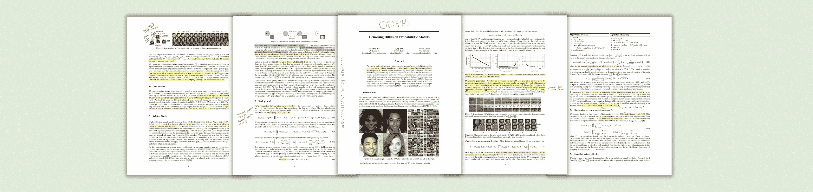

# 扩散模型的崛起——生成深度学习的新纪元

> 原文：[`towardsdatascience.com/the-rise-of-diffusion-models-a-new-era-of-generative-deep-learning-3ef4779f6e1b?source=collection_archive---------4-----------------------#2024-03-27`](https://towardsdatascience.com/the-rise-of-diffusion-models-a-new-era-of-generative-deep-learning-3ef4779f6e1b?source=collection_archive---------4-----------------------#2024-03-27)

## [🚀Sascha 的论文俱乐部](https://towardsdatascience.com/tagged/saschas-paper-club)

## 《去噪扩散概率模型》由 J. Ho 等人撰写

 [Sascha Kirch](https://medium.com/@SaschaKirch?source=post_page---byline--3ef4779f6e1b--------------------------------)

·发表于[Towards Data Science](https://towardsdatascience.com/?source=post_page---byline--3ef4779f6e1b--------------------------------) ·13 分钟阅读·2024 年 3 月 27 日

--

图像来源于[Sascha Kirch](https://medium.com/@SaschaKirch)的[出版物](https://arxiv.org/abs/2006.11239)

这篇文章是关于一篇论文的，这篇论文开启了计算机视觉及许多其他领域生成深度学习的新纪元：扩散模型的时代。论文标题为*“去噪扩散概率模型”*，并介绍了一个新的框架，称为 DDPM，即论文标题的缩写。

尽管扩散模型的基本概念看起来很直观，但背后的数学却并不如此，你可能会发现自己很难理解关于这个话题的论文。至少我当时是这样。与此同时，今天许多生成模型，如[DALL-E3](https://cdn.openai.com/papers/dall-e-3.pdf)、[Imagen](https://arxiv.org/abs/2205.11487)、[SORA](https://openai.com/sora)和[Stable Diffusion 3](https://arxiv.org/pdf/2403.03206.pdf)都是基于扩散模型构建的。因此，理解基本概念非常重要。

🚀 所以，系好安全带吧，因为今天我们将建立一个关于扩散模型基本概念的扎实直觉。我们将把 DDPM 放入更广泛的背景中，并剖析论文中的方程式、表格和插图，添加一些额外的注释，揭示它们的真正含义。

> **论文：** [去噪扩散概率模型](https://arxiv.org/abs/2006.11239)，作者：
> 
> Jonathan Ho 等人，2020 年 6 月 19 日
