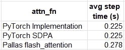
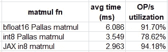
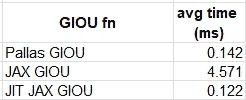

# 《帕拉斯的崛起：通过自定义内核释放 TPU 的潜力》

> 原文：[`towardsdatascience.com/the-rise-of-pallas-unlocking-tpu-potential-with-custom-kernels-67be10ab846a?source=collection_archive---------5-----------------------#2024-10-06`](https://towardsdatascience.com/the-rise-of-pallas-unlocking-tpu-potential-with-custom-kernels-67be10ab846a?source=collection_archive---------5-----------------------#2024-10-06)

## 加速 AI/ML 模型训练与自定义操作符 — 第三部分

[](https://chaimrand.medium.com/?source=post_page---byline--67be10ab846a--------------------------------)[](https://towardsdatascience.com/?source=post_page---byline--67be10ab846a--------------------------------) [Chaim Rand](https://chaimrand.medium.com/?source=post_page---byline--67be10ab846a--------------------------------)

·发布在[Towards Data Science](https://towardsdatascience.com/?source=post_page---byline--67be10ab846a--------------------------------) ·阅读时间 15 分钟·2024 年 10 月 6 日

--


图片由[Hendrik Morkel](https://unsplash.com/@hendrikmorkel?utm_source=medium&utm_medium=referral)提供，发布在[Unsplash](https://unsplash.com/?utm_source=medium&utm_medium=referral)

这是关于构建自定义操作符以优化 AI/ML 工作负载的[系列文章](https://chaimrand.medium.com/accelerating-ai-ml-model-training-with-custom-operators-163ef2a04b12)的第三部分。在我们[上一篇文章](https://chaimrand.medium.com/unleashing-the-power-of-triton-mastering-gpu-kernel-optimization-in-python-160a3f52701e)中，我们展示了 Triton 的简易性和可访问性。Triton 得名于[海神特里同](https://en.wikipedia.org/wiki/Triton_(mythology))，它使得 Python 开发者能够增加对 GPU 的控制，并优化其在特定工作负载中的使用。在本文中，我们将继续深入希腊神话的脉络，讲述特里同的女儿[帕拉斯](https://en.wikipedia.org/wiki/Pallas_(daughter_of_Triton))，并讨论与她同名的[JAX 扩展](https://jax.readthedocs.io/en/latest/pallas/index.html)，该扩展用于为 GPU 和 TPU 编写自定义内核。

NVIDIA GPU 的最重要特性之一——也是它们崛起为主流的关键因素——就是它们的可编程性。GPU 提供的一个关键组件是用于创建通用 GPU（GPGPU）操作符的框架，例如[CUDA](https://developer.nvidia.com/cuda-toolkit)和[Triton](https://triton-lang.org/main/index.html)。

在之前的文章中（例如，这里），我们讨论了在 Google TPU 上运行 ML 工作负载的机会，并指出在价格性能和训练成本上可能有显著的提高。我们当时注意到的一个缺点是缺乏创建自定义操作符的工具。因此，某些需要特定操作符的模型，如果这些操作符在底层 ML 框架（例如 TensorFlow/XLA）中不受支持或实现不理想，相比于 GPU，在 TPU 上的性能会较差。随着近年来越来越多的新型快速计算解决方案在 GPU 上用于计算[注意力机制](https://en.wikipedia.org/wiki/Attention_(machine_learning))，这种发展差距尤其显著。得益于 GPU 内核开发框架，这些新方案显著提高了[transformer 模型](https://en.wikipedia.org/wiki/Transformer_(deep_learning_architecture))的效率。

另一方面，在 TPU 上，缺乏合适的工具阻碍了这一创新，transformer 模型只能使用官方软件堆栈支持的注意力机制。幸运的是，随着[Pallas](https://jax.readthedocs.io/en/latest/pallas/index.html)的问世，这一差距得到了弥补。Pallas 作为[JAX](https://jax.readthedocs.io/en/latest/)的扩展，并为[PyTorch/XLA](https://pytorch.org/xla/release/r2.4/index.html)提供[专门支持](https://github.com/pytorch/xla/blob/3c59087e894013559b58dcb147869c4a81ca07d3/docs/pallas.md#adopt-the-above-kernel-to-be-compatible-with-pytorchxla)，使得为 GPU 和 TPU 创建自定义内核成为可能。对于 GPU 支持，Pallas 利用了 Triton，而对于 TPU 支持，它使用了一个名为 Mosaic 的库。尽管我们将重点讨论 TPU 的自定义内核，但值得注意的是，在 JAX 开发中，使用 Pallas 进行 GPU 内核定制比 Triton 有一些优势（例如，见[这里](https://www.youtube.com/watch?v=OR8NZyTz-yo)）。

本文的目的是引起大家对 Pallas 的关注并展示其潜力。请不要将本文视为官方[Pallas 文档](https://jax.readthedocs.io/en/latest/pallas/index.html#)的替代品。我们将分享的示例仅用于演示目的，未对其进行优化，也没有验证其稳定性、持久性或准确性。

重要的是，在撰写本文时，Pallas 仍然是一个*实验性*特性，仍在积极开发中。我们分享的示例（基于[JAX](https://pypi.org/project/jax/)版本 0.4.32 和[PyTorch](https://pypi.org/project/torch/)版本 2.4.1）可能在您阅读时已经过时。务必使用最新的 API 和资源进行 Pallas 开发。

非常感谢[Yitzhak Levi](https://www.linkedin.com/in/yitzhak-levi-49a217201/)为本篇文章的贡献。

## 环境设置

对于下面描述的实验，我们使用以下[环境设置](https://cloud.google.com/tpu/docs/v5e-training#train-resnet-using-the-pjrt-runtime)命令：

```py
# create TPU node
gcloud alpha compute tpus queued-resources create v5litepod-1-resource \
     --node-id v5litepod \
     --project <project-id> \
     --zone us-central1-a \
     --accelerator-type v5litepod-1 \
     --runtime-version v2-alpha-tpuv5-lite \
     --valid-until-duration 1d \
     --service-account <service-account> \

# check TPU node status (wait for state to be ACTIVE)
gcloud alpha compute tpus queued-resources describe v5litepod-1-resource \
     --project <project-id> \
     --zone us-central1-a

# SSH to TPU node
gcloud alpha compute tpus tpu-vm ssh v5litepod \
     --project <project-id> \
     --zone  us-central1-a

# install dependencies
pip install torch_xla[tpu] \
     -f https://storage.googleapis.com/libtpu-releases/index.html
pip install torch_xla[pallas]
pip install timm

# run tests
python train.py

#exit ssh
exit

# delete TPU node
gcloud alpha compute tpus queued-resources delete v5litepod-1-resource \
     --project <project-id> \
     --zone us-central1-a --force --quiet
```

# TPU 的 Pallas 内核

在我们系列文章的第一个帖子中的玩具示例中，我们区分了自定义内核开发可能提升性能的两种方式。第一种是通过将多个操作（融合）在一起，从而减少以下开销：1）加载多个单独的内核，2）读取和写入中间值（例如，参见[PyTorch 关于乘加融合的教程](https://pytorch.org/tutorials/advanced/cpp_custom_ops.html#cpp-custom-ops-tutorial)）。第二种是通过细致地应用底层加速器的资源，以优化当前函数。我们简要讨论了这两种机会，并指出了 Pallas 支持的局限性。

## TPU 上的操作符融合

TPU 是一个[XLA](https://openxla.org/xla)（加速线性代数）设备，即它运行由[XLA 编译器](https://cloud.google.com/tpu/docs/intro-to-tpu#xla_compiler)生成的代码。当在像[JAX](https://jax.readthedocs.io/en/latest/index.html)或[PyTorch/XLA](https://pytorch.org/xla/release/r2.4/index.html)这样的框架中训练 AI 模型时，训练步骤首先会转化为中间图表示（IR）。然后，将该计算图传递给 XLA 编译器，后者将其转换为可以在 TPU 上运行的机器代码。与*急切*执行模式不同，在急切执行模式中操作是单独执行的，而这种模型运行方式使得 XLA 能够在编译过程中识别并实现操作符融合的机会。事实上，操作符[融合](https://openxla.org/xla/tf2xla)是 XLA 编译器最重要的优化。自然地，没有任何编译器是完美的，我们一定会通过自定义内核发现更多的融合机会。但一般来说，我们可以预期，通过这种方式提升运行时性能的机会要比*急切*执行模式下少。

## 优化 TPU 利用率

创建适用于 TPU 的优化内核需要对[TPU 系统架构](https://cloud.google.com/tpu/docs/system-architecture-tpu-vm)有全面而深入的理解。重要的是，TPU 与[GPU](https://cloud.google.com/tpu/docs/intro-to-tpu)有[很大不同](https://cloud.google.com/tpu/docs/intro-to-tpu)：GPU 和 CUDA 方面的专业知识不能直接转移到 TPU 开发中。例如，虽然 GPU 包含大量处理器，并且依靠其强大的并行计算能力来提升性能，但 TPU 主要是*顺序*执行，专门为运行高度向量化的操作而设计的引擎，并且[支持异步调度和内存加载](https://jax.readthedocs.io/en/latest/pallas/tpu/pipelining.html)。

GPU 和 TPU 底层架构的差异可能对自定义内核的设计产生重大影响。掌握 TPU 内核开发需要：1) 通过[流水线](https://jax.readthedocs.io/en/latest/pallas/tpu/pipelining.html)适当重叠内存和计算操作，2) 知道如何在标量、向量（VPU）和矩阵（MXU）计算单元及其相关的标量和向量寄存器（SREG 和 VREG）以及内存缓存（SMEM 和 VMEM）之间进行混合，3) 理解[不同低级操作的成本](https://jax.readthedocs.io/en/latest/pallas/tpu/details.html#elementwise-operations)，4) 适当的[兆核配置](https://jax.readthedocs.io/en/latest/pallas/tpu/pipelining.html#tpus-in-megacore-configuration)（针对支持的 TPU 代），5) 掌握不同类型的[TPU 拓扑结构](https://jax.readthedocs.io/en/latest/pallas/tpu/distributed.html#tpu-topologies)及其对如何支持[分布式计算](https://jax.readthedocs.io/en/latest/pallas/tpu/distributed.html#)的影响，等等。

## 框架限制

虽然使用 JAX 函数和 API 在*Python*中创建自定义操作符的能力大大提高了 Pallas 内核开发的简易性和可访问性，但它也限制了表达能力。此外，（截至本文撰写时）有些 JAX API 在 TPU 上不被 Pallas 支持（例如，请参见[此处](https://jax.readthedocs.io/en/latest/pallas/tpu/details.html#supported-operations)）。因此，您可能会以实现特定操作的目的接触 Pallas，结果却发现框架不支持您所需要的 API。这与 CUDA 等框架形成了对比，后者在开发自定义内核时提供了更多的灵活性（针对 GPU）。

Pallas 文档中的[矩阵乘法](https://jax.readthedocs.io/en/latest/pallas/tpu/matmul.html)教程为 Pallas 内核开发提供了极好的介绍，突出了操作符融合和自定义的潜力，同时也揭示了优化性能所面临的挑战（例如，适当调优输入的*块大小*）。教程清楚地表明，最大化 TPU 的*完整*潜力需要一定程度的专业化。然而，正如我们所展示的那样，即使是初学者的机器学习开发者也能从 Pallas 内核中受益。

# 集成现有 Pallas 内核的使用

要从自定义的 Pallas 内核中获益，您不一定需要知道如何构建它们。在我们的第一个示例中，我们展示了如何利用来自专用公共仓库的现有 Pallas 内核。

## 示例 — 在 Torch/XLA 中的闪存注意力

JAX 的 GitHub 仓库包括多个 Pallas 内核的实现，其中包括 [闪光注意力](https://github.com/jax-ml/jax/blob/jaxlib-v0.4.32/jax/experimental/pallas/ops/tpu/flash_attention.py)。在这里，我们将演示其在 Torch/XLA [视觉变换器](https://en.wikipedia.org/wiki/Vision_transformer)（ViT）模型中的使用。尽管 Pallas 内核是用 JAX 开发的，但它们可以被引入 Torch/XLA，例如通过 [make_kernel_from_pallas](https://github.com/pytorch/xla/blob/v2.4.0/torch_xla/experimental/custom_kernel.py#L132) 工具（有关详细信息，请参见 [文档](https://github.com/pytorch/xla/blob/3c59087e894013559b58dcb147869c4a81ca07d3/docs/pallas.md)）。在 [闪光注意力](https://github.com/pytorch/xla/blob/v2.4.0/torch_xla/experimental/custom_kernel.py#L425) 的情况下，Torch/XLA 实现了该功能。

在下面的代码模块中，我们定义了一个简化版的经典 *timm* [注意力模块](https://github.com/huggingface/pytorch-image-models/blob/v1.0.9/timm/models/vision_transformer.py#L124)，并在构造函数中提供了定义底层注意力操作符的选项。我们将利用这个选项来比较 [闪光注意力](https://github.com/pytorch/xla/blob/v2.4.0/torch_xla/experimental/custom_kernel.py#L425) Pallas 内核与其他替代方案的性能。

```py
# general imports
import os, time, functools
# torch imports
import torch
import torch.nn as nn
import torch.nn.functional as F
from torch.utils.data import Dataset, DataLoader
import torch_xla.core.xla_model as xm
# custom kernel import
from torch_xla.experimental.custom_kernel import flash_attention
# timm imports
from timm.layers import Mlp
from timm.models.vision_transformer import VisionTransformer

class TPUAttentionBlock(nn.Module):
    def __init__(
            self,
            dim: int = 768,
            num_heads: int = 12,
            attn_fn = None,
            **kwargs
    ) -> None:
        super().__init__()
        self.attn_fn = attn_fn
        self.num_heads = num_heads
        self.head_dim = dim // num_heads
        self.norm1 = nn.LayerNorm(dim)
        self.norm2 = nn.LayerNorm(dim)
        self.qkv = nn.Linear(dim, dim * 3, bias=False)
        self.proj = nn.Linear(dim, dim)
        self.mlp = Mlp(
            in_features=dim,
            hidden_features=dim * 4,
        )

    def forward(self, x_in: torch.Tensor) -> torch.Tensor:
        x = self.norm1(x_in)

        B, N, C = x.shape
        qkv = self.qkv(x).reshape(B, N, 3, self.num_heads, self.head_dim)
        qkv = qkv.permute(2, 0, 3, 1, 4)
        q, k, v = qkv.unbind(0)

        if self.attn_fn is None:
            attn = q @ k.transpose(-2, -1)
            attn = attn.softmax(dim=-1)
            x = attn @ v
        else:
            x = self.attn_fn(q, k, v)

        x = x.transpose(1, 2).reshape(B, N, C)
        x = self.proj(x)
        x = x + x_in
        x = x + self.mlp(self.norm2(x))
        return x
```

在以下模块中，我们使用输入数据集和选择的注意力函数（*attn_fn*）训练一个简单的 ViT 支持的分类模型。

```py
def train(dataset, attn_fn=None):
    device = xm.xla_device()

    train_loader = DataLoader(
        dataset,
        batch_size=128,
        num_workers=os.cpu_count(),
        pin_memory=True
    )

    # configure the VisionTranformer in a manner that complies with the 
    # Pallas flash_attention kernel constraints
    model = VisionTransformer(
        block_fn=functools.partial(TPUAttentionBlock, attn_fn=attn_fn),
        img_size=256,
        class_token=False,
        global_pool="avg"
    )

    optimizer = torch.optim.SGD(model.parameters())
    loss_fn = torch.nn.CrossEntropyLoss()

    # copy the model to the TPU
    model = model.to(device)

    model.train()

    t0 = time.perf_counter()
    summ = 0
    count = 0

    for step, data in enumerate(train_loader):
        # copy data to TPU
        inputs = data[0].to(device=device, non_blocking=True)
        label = data[1].to(device=device, non_blocking=True)

        optimizer.zero_grad(set_to_none=True)
        with torch.autocast('xla', dtype=torch.bfloat16):
            output = model(inputs)
            loss = loss_fn(output, label)
        loss.backward()
        optimizer.step()
        xm.mark_step()

        # capture step time
        batch_time = time.perf_counter() - t0
        if step > 20:  # skip first steps
            summ += batch_time
            count += 1
        t0 = time.perf_counter()
        if step > 100:
            break

    print(f'average step time: {summ / count}')
```

请注意我们为 [VisionTransformer](https://github.com/huggingface/pytorch-image-models/blob/v1.0.9/timm/models/vision_transformer.py#L414) 选择的特定配置。这是为了遵守某些限制（截至本文写作时）来自定义闪光注意力内核的要求（例如，关于张量形状的限制）。

最后，我们定义了一个数据集，并比较了三种不同注意力例程的训练运行时间，1. 使用原生 PyTorch 函数，2. 使用 PyTorch 内建的 [SDPA](https://pytorch.org/tutorials/intermediate/scaled_dot_product_attention_tutorial.html) 函数，3. 使用自定义的 Pallas 操作符：

```py
# use random data
class FakeDataset(Dataset):
    def __len__(self):
        return 1000000

    def __getitem__(self, index):
        rand_image = torch.randn([3, 256, 256], dtype=torch.float32)
        label = torch.tensor(data=index % 1024, dtype=torch.int64)
        return rand_image, label

ds = FakeDataset()

print('PyTorch native')
train(ds, attn_fn=None)

print('PyTorch SDPA')
train(ds, attn_fn=functools.partial(F.scaled_dot_product_attention, scale=1.0))

print('Pallas flash_attention')
train(ds, attn_fn=flash_attention)
```

比较结果如表所示：



不同注意力模块的步骤时间（越低越好） — 作者

尽管我们的 Pallas 内核与其他替代方案相比显得性能较差，但我们不应灰心丧气：

1.  这些结果很可能可以通过适当的调优得到改善。

1.  这些结果仅适用于我们选择的模型和运行时环境。Pallas 内核在其他使用场景中可能会呈现出完全不同的比较结果。

1.  Pallas 的真正强大之处在于能够根据我们的特定需求创建和调整低级操作符。尽管运行时性能很重要，但如我们示例中所示的 23%的性能损失，对于这种灵活性来说可能是一个小小的代价。此外，定制化的机会可能会为那些原生框架操作不支持的优化开辟可能性。

# 增强现有内核

许多时候，调整现有的 Pallas 内核以满足你的特定需求可能比从零开始创建一个内核更容易。如果内核已经经过优化，那么推荐这种做法，因为性能调优通常是繁琐且耗时的。官方的[矩阵乘法](https://jax.readthedocs.io/en/latest/pallas/tpu/matmul.html)教程包括了一些关于如何[扩展](https://jax.readthedocs.io/en/latest/pallas/tpu/matmul.html#templating-the-matrix-multiplication)和[增强](https://jax.readthedocs.io/en/latest/pallas/tpu/matmul.html#fused-activation-function)现有内核的示例。在这里，我们进行了一项[建议的练习](https://jax.readthedocs.io/en/latest/pallas/tpu/matmul.html#conclusion)：我们实现了`int8`矩阵乘法，并评估其相对于`bfloat16`版本的性能优势。

## 示例 — Int8 矩阵乘法

在下面的代码块中，我们实现了一个`int8`版本的[矩阵乘法](https://jax.readthedocs.io/en/latest/pallas/tpu/matmul.html)示例。

```py
import functools, timeit
import jax
import jax.numpy as jnp
from jax.experimental import pallas as pl
from jax.experimental.pallas import tpu as pltpu

# set to True to develop/debug on CPU
interpret = False

def matmul_kernel_int8(x_ref, y_ref, z_ref, acc_ref, *, nsteps):
    @pl.when(pl.program_id(2) == 0)
    def _():
        acc_ref[...] = jnp.zeros_like(acc_ref)

    acc_ref[...] += jnp.dot(
        x_ref[...], y_ref[...], preferred_element_type=jnp.int32
    )

    @pl.when(pl.program_id(2) == nsteps - 1)
    def _():
        z_ref[...] = acc_ref[...]

@functools.partial(jax.jit, static_argnames=['bm', 'bk', 'bn'])
def matmul_int8(
        x: jax.Array,
        y: jax.Array,
        *,
        bm: int = 128,
        bk: int = 128,
        bn: int = 128,
):
    m, k = x.shape
    _, n = y.shape
    return pl.pallas_call(
        functools.partial(matmul_kernel_int8, nsteps=k // bk),
        grid_spec=pltpu.PrefetchScalarGridSpec(
            num_scalar_prefetch=0,
            in_specs=[
                pl.BlockSpec(block_shape=(bm, bk), 
                             index_map=lambda i, j, k: (i, k)),
                pl.BlockSpec(block_shape=(bk, bn),
                             index_map=lambda i, j, k: (k, j)),
            ],
            out_specs=pl.BlockSpec(block_shape=(bm, bn), 
                                   index_map=lambda i, j, k: (i, j)),
            scratch_shapes=[pltpu.VMEM((bm, bn), jnp.int32)],
            grid=(m // bm, n // bn, k // bk),
        ),
        out_shape=jax.ShapeDtypeStruct((m, n), jnp.int32),
        compiler_params=dict(mosaic=dict(
            dimension_semantics=("parallel", "parallel", "arbitrary"))),
        interpret=interpret
    )(x, y) 
```

请注意，我们使用了一个`int32`的累加矩阵，以应对可能出现的溢出问题。还请注意，我们使用了[*解释*](https://github.com/jax-ml/jax/blob/jaxlib-v0.4.32/jax/_src/pallas/pallas_call.py#L1238)标志来调试 CPU 上的 Pallas 内核（如[这里](https://youtu.be/OR8NZyTz-yo?t=855)所推荐）。

为了评估我们的内核，我们对[教程](https://jax.readthedocs.io/en/latest/pallas/tpu/matmul.html#performance-of-pipelined-kernels)中定义的基准测试工具进行了轻微修改，并将运行时结果与 jnp.float16 Pallas 矩阵乘法内核和内置 JAX 的[matmul](https://jax.readthedocs.io/en/latest/_autosummary/jax.numpy.matmul.html) API 进行了比较：

```py
def benchmark(f, ntrials: int = 100):
    def run(*args, **kwargs):
        # Compile function first
        jax.block_until_ready(f(*args, **kwargs))
        # Time function
        res=timeit.timeit(lambda: jax.block_until_ready(f(*args, **kwargs)),
                             number=ntrials
                              )
        time = res/ntrials
        # print(f"Time: {time}")
        return time

    return run

def analyze_matmul(m: int, k: int, n: int, dtype: jnp.dtype,
                   mm_func):
    x = jnp.ones((m, k), dtype=dtype)
    y = jnp.ones((k, n), dtype=dtype)
    time = benchmark(mm_func)(x, y)
    print("Matmul time: ", time)
    mm_ops = 2*m*k*n/time
    v5e_ops = 394e12 if dtype == jnp.int8 else 197e12
    print(f"OP/s utilization: {mm_ops / v5e_ops * 100:.4f}%")
    print()

print("bfloat16 Pallas matmul")
mm = functools.partial(matmul, bm=512, bk=1024, bn=1024)
analyze_matmul(8192, 8192, 8192, jnp.bfloat16, mm)

print("int8 Pallas matmul")
mm = functools.partial(matmul_int8, bm=512, bk=1024, bn=1024)
analyze_matmul(8192, 8192, 8192, jnp.int8, mm)

print("XLA int8 matmul")
mm = functools.partial(jnp.matmul, preferred_element_type=jnp.int32)
analyze_matmul(8192, 8192, 8192, jnp.int8, mm)
```

我们实验的结果如下表所示：



矩阵乘法时间与利用率（作者提供）

通过在 tpuv5e 上使用`int8`矩阵（而非`bfloat16`矩阵），我们能够将自定义矩阵乘法内核的运行时性能提高 71%。然而，正如在[bfloat16 示例](https://jax.readthedocs.io/en/latest/pallas/tpu/matmul.html#performance-of-pipelined-kernels)中所示，仍然需要额外的调优才能达到内置矩阵乘法操作符的性能。与`bfloat16`相比，系统利用率的下降突显了这一改进的潜力。

# 从头创建一个内核

尽管利用现有内核可以带来很大好处，但它不太可能解决所有问题。不可避免地，你可能需要实现一个在 TPU 上不受支持或性能不佳的操作。在这里，我们展示了创建一个相对简单的逐像素内核。为了保持连续性，我们选择了与之前的文章中相同的[广义交并比（GIOU）](https://giou.stanford.edu/)操作。

## 示例 — GIOU Pallas 内核

在下面的代码块中，我们定义了一个 Pallas 内核，它对一对批量的边界框进行 GIOU 操作，每个边界框的维度为*BxNx4*（其中*B*表示批量大小，*N*表示每个样本的框数）。该函数返回一个维度为*BxN*的分数张量。我们在*batch*轴和*boxes*轴上选择了 128 的块大小，即我们将每个张量划分为*128x128x4*的块，并将它们传递给我们的内核函数。[ *网格*](https://jax.readthedocs.io/en/latest/pallas/grid_blockspec.html#grid-a-k-a-kernels-in-a-loop)和[BlockSpec *索引映射*](https://jax.readthedocs.io/en/latest/pallas/grid_blockspec.html#blockspec-a-k-a-how-to-chunk-up-inputs)相应地定义。

```py
import timeit
import jax
from jax.experimental import pallas as pl
import jax.numpy as jnp

# set to True to develop/debug on CPU
interpret = False

# perform giou on a single block
def giou_kernel(preds_left_ref,
                preds_top_ref,
                preds_right_ref,
                preds_bottom_ref,
                targets_left_ref,
                targets_top_ref,
                targets_right_ref,
                targets_bottom_ref,
                output_ref):
    epsilon = 1e-5

    # copy tensors into local memory
    preds_left = preds_left_ref[...]
    preds_top = preds_top_ref[...]
    preds_right = preds_right_ref[...]
    preds_bottom = preds_bottom_ref[...]

    gt_left = targets_left_ref[...]
    gt_top = targets_top_ref[...]
    gt_right = targets_right_ref[...]
    gt_bottom = targets_bottom_ref[...]

    # Compute the area of each box
    area1 = (preds_right - preds_left) * (preds_bottom - preds_top)
    area2 = (gt_right - gt_left) * (gt_bottom - gt_top)

    # Compute the intersection
    left = jnp.maximum(preds_left, gt_left)
    top = jnp.maximum(preds_top, gt_top)
    right = jnp.minimum(preds_right, gt_right)
    bottom = jnp.minimum(preds_bottom, gt_bottom)

    # intersection width and height
    inter_w = jnp.maximum(right - left, 0)
    inter_h = jnp.maximum(bottom - top, 0)

    # intersection area
    inter_area = inter_w * inter_h

    # union of two boxes
    union_area = area1 + area2 - inter_area

    iou_val = inter_area / jnp.maximum(union_area, epsilon)

    # Compute the smallest enclosing box
    enclose_left = jnp.minimum(preds_left, gt_left)
    enclose_top = jnp.minimum(preds_top, gt_top)
    enclose_right = jnp.maximum(preds_right, gt_right)
    enclose_bottom = jnp.maximum(preds_bottom, gt_bottom)

    # enclosing box width and height
    enclose_w = jnp.maximum(enclose_right - enclose_left, 0)
    enclose_h = jnp.maximum(enclose_bottom - enclose_top, 0)

    # enclosing box area
    enclose_area = enclose_w * enclose_h

    # Compute GIOU
    delta_area = (enclose_area - union_area)
    enclose_area = jnp.maximum(enclose_area, epsilon)
    output_ref[...] = iou_val - delta_area / enclose_area

@jax.jit
def batch_giou(preds, targets):
    m, n, _ = preds.shape
    output = pl.pallas_call(
        giou_kernel,
        out_shape=jax.ShapeDtypeStruct((m, n), preds.dtype),
        in_specs=[pl.BlockSpec(block_shape=(128, 128),
                               index_map=lambda i, j: (i, j))]*8,
        out_specs=pl.BlockSpec(block_shape=(128, 128),
                                index_map=lambda i, j: (i, j)),
        grid=(m // 128, n // 128),
        compiler_params=dict(mosaic=dict(
            dimension_semantics=("parallel", "parallel"))),
        interpret=interpret
    )(*jnp.unstack(preds, axis=-1), *jnp.unstack(targets, axis=-1))
    return output
```

尽管创建新的 TPU 内核无疑值得庆祝（特别是当它能够启用之前被阻止的 ML 工作负载时），但我们的工作尚未完成。Pallas 内核开发的一个关键部分是调优操作符（例如，[ *块大小*](https://jax.readthedocs.io/en/latest/pallas/grid_blockspec.html#blockspec-a-k-a-how-to-chunk-up-inputs)）以实现最佳的运行时性能。出于简洁性的考虑，我们省略了这一阶段。

为了评估我们内核的性能，我们将其与以下原生 JAX GIOU 实现进行比较：

```py
def batched_box_iou(boxes1, boxes2):
    epsilon = 1e-5

    # Compute areas of both sets of boxes
    area1 = (boxes1[..., 2]-boxes1[..., 0])*(boxes1[..., 3]-boxes1[..., 1])
    area2 = (boxes2[..., 2]-boxes2[..., 0])*(boxes2[..., 3]-boxes2[..., 1])

    # corners of intersection
    lt = jnp.maximum(boxes1[..., :2], boxes2[..., :2])
    rb = jnp.minimum(boxes1[..., 2:], boxes2[..., 2:])

    # width and height of intersection
    wh = jnp.clip(rb - lt, a_min=0)

    # area of the intersection
    inter = wh[..., 0] * wh[..., 1]

    # union of the two boxes
    union = area1 + area2 - inter
    iou = inter / jnp.clip(union, a_min=epsilon)

    # corners of enclosing box
    lti = jnp.minimum(boxes1[..., :2], boxes2[..., :2])
    rbi = jnp.maximum(boxes1[..., 2:], boxes2[..., 2:])

    # Width and height of the enclosing box
    whi = jnp.clip(rbi - lti, a_min=0)

    # Area of the enclosing box
    areai = jnp.clip(whi[..., 0] * whi[..., 1], a_min=epsilon)

    # Generalized IoU
    return iou - (areai - union) / areai
```

我们生成两批随机生成的边界框，并使用上面定义的*benchmark*函数来衡量我们函数的性能。

```py
from jax import random

batch_size = 1024
n_boxes = 256
img_size = 256
boxes = []
for i in range(2):
    k1, k2 = random.split(random.key(i), 2)

    # Randomly generate box sizes and positions
    box_sizes = random.randint(k1, shape=(batch_size, n_boxes, 2), minval=1, maxval=img_size)
    top_left = random.randint(k2, shape=(batch_size, n_boxes, 2), minval=0, maxval=img_size - 1)
    bottom_right = jnp.clip(top_left + box_sizes, 0, img_size - 1)

    # Concatenate top-left and bottom-right coordinates
    rand_boxes = jnp.concatenate((top_left, bottom_right), axis=2)

    boxes.append(rand_boxes.astype(jnp.float32))

time = benchmark(batch_giou)(boxes[0], boxes[1])
print(f'Pallas kernel: {time}')
time = benchmark(batched_box_iou)(boxes[0], boxes[1])
print(f'JAX function: {time}')
time = benchmark(jax.jit(batched_box_iou))(boxes[0], boxes[1])
print(f'Jitted function: {time}')
```

比较结果如下表所示：



不同 GIOU 实现的平均时间（越低越好）—— 作者

我们可以看到，对我们简单的 JAX 实现进行 JIT 编译的结果略优于我们的 Pallas 内核。再次强调，我们可以看到，要达到或超过 JIT 编译的性能结果（及其固有的内核融合），需要对我们的自定义内核进行微调。

# 利用 TPU 的顺序特性

虽然为 TPU 开发自定义内核的能力具有巨大的潜力，但到目前为止我们的示例表明，达到最佳运行时性能可能具有挑战性。克服这一挑战的一种方法是寻求利用 TPU 架构独特特性的机会。一个例子就是[TPU 处理器的顺序特性](https://jax.readthedocs.io/en/latest/pallas/tpu/details.html#what-is-a-tpu)。尽管深度学习工作负载通常依赖于易于并行化的操作（例如矩阵乘法），但有时它们需要本质上是顺序的算法。这些算法可能会对 GPU 的[SIMT](https://en.wikipedia.org/wiki/Single_instruction,_multiple_threads)（单指令多线程）模型构成严重挑战，有时还会对运行时性能产生不成比例的影响。在[这篇文章的续篇](https://chaimrand.medium.com/implementing-sequential-algorithms-on-tpu-41d75c6aaa95)中，我们展示了如何实现顺序算法，利用 TPU 的顺序处理器，并尽量减少它们对性能的负面影响。

# 总结

Pallas 的推出标志着 TPU 发展过程中的一个重要里程碑。通过使 TPU 操作可定制化，它有可能为 TPU 的可编程性开辟新的机会，尤其是在机器学习领域。我们在这篇文章中的目的是展示这一强大新特性的可访问性。尽管我们的示例确实展示了这一点，但它们也突显了达到最佳运行时性能所需的努力。

本文仅仅触及了 Pallas 内核开发的表面。请务必查看官方文档，了解更多关于[Pallas 中的自动微分](https://jax.readthedocs.io/en/latest/pallas/design.html#grad-of-pallas-call)、[开发稀疏内核](https://jax.readthedocs.io/en/latest/pallas/tpu/sparse.html)等方面的内容。
