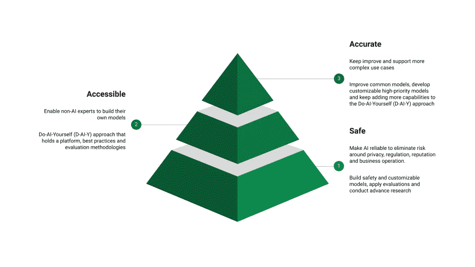
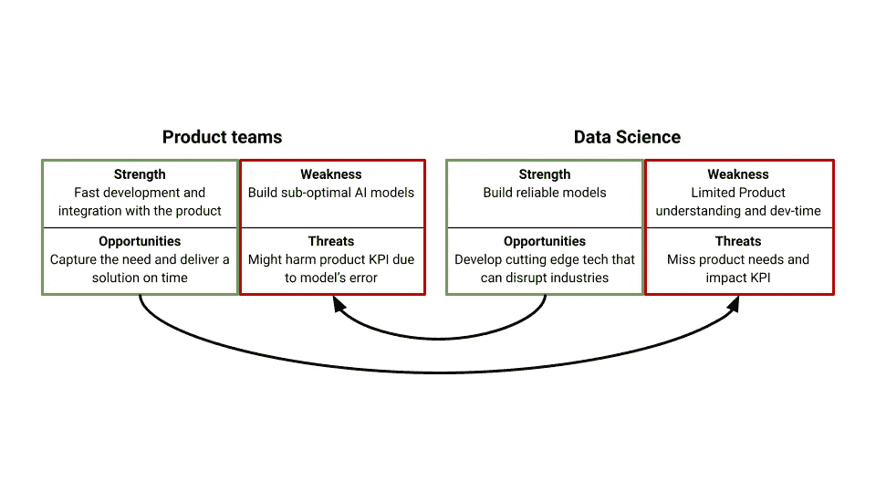

# 数据科学在普及 AI 中的角色

> 原文：[`towardsdatascience.com/the-role-of-data-science-in-democratizing-ai-bee294724441?source=collection_archive---------3-----------------------#2024-03-06`](https://towardsdatascience.com/the-role-of-data-science-in-democratizing-ai-bee294724441?source=collection_archive---------3-----------------------#2024-03-06)

## 在 AI 发展的新兴时代，数据科学团队应关注哪些重点？

 [Lior Sidi](https://liorsidi.medium.com/?source=post_page---byline--bee294724441--------------------------------)

·发表于[Towards Data Science](https://towardsdatascience.com/?source=post_page---byline--bee294724441--------------------------------) ·7 分钟阅读·2024 年 3 月 6 日

--

直到最近，AI 模型仅能通过数据科学家或其他服务提供商的解决方案来访问。今天，AI 正被普及，非 AI 专家也可以开发自己的 AI 驱动解决方案。

过去，数据科学团队需要数周甚至数月才能收集数据、标注数据、训练模型并部署，而如今，只需简单的提示词和最新的生成 AI 模型，就能在几分钟内完成模型的构建。随着 AI 技术的进步，人们也期待能采用它并构建更智能的 AI 驱动产品，而作为 AI 专家，我们承担着在组织内部推广这一技术的责任。

自 2016 年以来，Wix 对这一转型并不陌生（远在 ChatGPT（2022 年 11 月 22 日）之前），我们的数据科学团队已经在开发许多具有深远影响的[AI 驱动功能](https://www.wix.com/blog/avishai-abrahami-thoughts-about-ai)。最近，随着生成性 AI 革命的到来，Wix 内越来越多的角色也开始接受这一趋势。我们共同成功推出了许多新功能，[借助聊天机器人赋能网站创建](https://www.theverge.com/2024/3/4/24090095/wix-ai-website-generator-chatbot)，[丰富内容创作能力](https://www.wix.com/blog/wix-ai-tools)，以及[优化代理机构的工作方式](https://www.wix.com/studio/ai)。

在我们作为 Wix 数据科学团队的角色中，我们承担着确保[AI 质量和广泛接受度](https://www.wix.engineering/post/master-the-art-of-data-science-collaboration-5-steps-for-initiating-projects-that-impact-millions)的责任。我们认识到积极贡献于 AI 民主化的必要性，并确定了我们必须承担和领导的三个关键角色：**1\. 确保安全性**，**2\. 增强可访问性**，和 **3\. 提高准确性**。

数据科学的三大角色

# 数据科学 + 产品团队 = AI 影响力

构建 AI 模型的艺术在于能够驾驭并概括未见的边缘案例。这需要一种数据科学实践，包括对业务和数据的理解，并通过反复评估和调整来完善。

将 AI 民主化到产品团队（产品经理、开发人员、分析师、用户体验、内容创作者等）可以加速 AI 驱动的应用程序的发布，但这需要与数据科学团队合作，制定合适的流程和技术。

在下面的 SWOT 图中，我们可以看到数据科学和产品团队如何利用各自的优势和机会，弥补彼此的弱点和威胁，最终按时推出有影响力、可靠的前沿 AI 产品。

产品团队与数据科学的 SWOT 分析

# 1\. 确保 AI 安全性

目前讨论最多的一个话题是使用 AI 的安全性。当聚焦于面向产品的解决方案时，有几个领域我们必须考虑。

1.  **监管** — 模型可能做出可能歧视某些子群体的决策，例如基于性别给予折扣，或者[高薪工作广告中的性别歧视](https://www.theguardian.com/technology/2015/jul/08/women-less-likely-ads-high-paid-jobs-google-study)。此外，当使用第三方工具，如外部大型语言模型（LLMs）时，公司的秘密数据或用户的[个人可识别信息（PII）可能被泄露](https://www.cmswire.com/digital-experience/chatgpt-suffers-first-data-breach-exposes-personal-information/)。最近，《自然》杂志主张对基于 LLMs 的应用进行监管审查。

1.  **声誉** — 面向用户的模型可能会出错并产生不良体验，例如，基于大型语言模型（LLMs）的聊天机器人可能会给出错误的答案，或者是过时的答案，或者是[有毒的种族主义](https://www.theverge.com/2016/3/24/11297050/tay-microsoft-chatbot-racist)回答，或者[加拿大航空的聊天机器人不一致性](https://www.forbes.com/sites/marisagarcia/2024/02/19/what-air-canada-lost-in-remarkable-lying-ai-chatbot-case/?sh=3c3dee39696f)。

1.  **损害** — 决策模型可能预测错误的答案，进而影响业务运营，例如，某个[预测房价的模型造成了 5 亿美元的损失](https://insidebigdata.com/2021/12/13/the-500mm-debacle-at-zillow-offers-what-went-wrong-with-the-ai-models/)。

数据科学家理解 AI 模型的不确定性，并能够提供不同的解决方案来应对这些风险，并允许安全地使用该技术。例如：

+   **安全建模** — 开发模型来减少风险，例如 PII（个人身份信息）屏蔽模型和滥用检测模型。

+   **大规模评估** — 应用先进的数据评估技术来监控和分析模型的表现和错误类型。

+   **模型定制化** — 使用干净的注释数据，筛选出有害和无关的数据点，并构建更小、更具定制化的模型。

+   **伦理研究** — 阅读并应用关于 AI 伦理的最新研究，并提出最佳实践。

# 2. **提高 AI 可访问性**

人工智能应该易于使用，并且能够让非人工智能专家也能将其集成到他们的产品中。直到最近，与模型的集成方式是通过数据科学家开发的在线/离线模型，它们是可靠的、针对特定用例的模型，并且其预测结果是可访问的。

但它们的主要缺点是非 AI 专家无法进行定制化。这就是为什么我们提出了“自己动手做 AI”（D-AI-Y）的方法，允许你构建自己的模型，并将其作为服务部署到平台上。

目标是快速构建简单但有价值的模型，并且对 AI 的专业知识要求较少。如果模型需要改进和研究，我们有数据科学家参与。

D-AI-Y 包括以下组件：

1.  **教育**：教育组织如何正确使用 AI，在 Wix，我们有一个 AI 大使计划，这是 Wix 不同小组与数据科学小组之间的 AI 知识桥梁，在这个计划中，各小组的代表会接受培训，并及时更新新的 AI 工具和最佳实践，以提高 Wix 中基于 AI 的项目的规模、质量和速度。

1.  **平台**：有一种方法可以连接到大型语言模型（LLMs）并编写提示。平台应考虑模型的成本和规模以及对内部数据源的访问。在 Wix，数据科学小组构建了一个 AI 平台，将 Wix 的不同角色与来自多个供应商的模型连接起来（以减少 LLM 供应商锁定）以及其他功能，如语义搜索。该平台充当一个集中的中心，供所有人使用、分享他们的模型、治理、监控并在生产环境中提供服务。

1.  **构建简单直接模型的最佳实践和工具**：使用提示或专用模型来解决特定学习任务：分类、问答机器人、推荐系统、语义搜索等。

1.  **评估**：针对每个学习任务，我们建议一种特定的评估流程，并在需要时提供数据整理的指导。

例如，一家公司使用检索增强生成（RAG）方法构建了许多问答模型，这种方法通过搜索能够回答问题的相关证据来回答问题，然后将证据添加到 LLM 的提示中，以便它能基于这些证据生成可靠的答案。

所以，产品数据科学团队可以提出：1. 关于 RAG 主题的**教育**材料和讲座，例如我曾做的这场关于语义搜索的[讲座](https://youtu.be/yOcqY2o6CDg?si=wlfwQsxZ_Gf4iOd2)，用于改进 RAG。2. 为**平台**配备合适的向量数据库和相关的嵌入器。3. 关于如何构建 RAG 的**指南**，如何检索证据并编写生成提示。4. 支持 RAG 适当**评估**的指南和工具，正如在这篇 TDS 文章和[Trulens 的 RAG 三元组](https://www.trulens.org/trulens_eval/core_concepts_rag_triad/)中所解释的那样。

这将使公司中的许多角色能够以可靠、准确且可扩展的方式构建自己的基于 RAG 的应用模型。

# 3. **提高 AI 准确性**

随着 AI 的普及，预计将构建更加复杂、准确和先进的解决方案。最终，非 AI 专家能够提升模型性能的程度是有限的，因为这需要对模型如何运作有更深入的理解。

为了提高模型的准确性，数据科学团队专注于以下类型的工作：

1.  **改进通用模型** — 定制并改进模型，以容纳 Wix 知识并超越外部的通用即开即用模型。

1.  **定制模型** — 高优先级且具有挑战性的模型，D-AI-Y 无法支持。与通用模型不同，这里我们有非常特定用例的模型，需要定制化。

1.  **改进 D-AI-Y** — 随着我们不断改进 D-AI-Y 平台、最佳实践、工具和评估 AI 的准确性，因此我们持续投入研究时间和精力，致力于提升和发掘创新方法，以使其更好。

# 结论

经过多年的等待，AI 的普及正在发生，让我们拥抱它吧！产品团队对业务的内在理解，加上 GenAI 的易用性，使他们能够构建推动产品能力的 AI 驱动功能。

因为非 AI 专家通常缺乏对 AI 模型如何运作以及如何在大规模上正确评估它们的深刻理解，他们可能会遇到关于结果可靠性和准确性的问题。此时，数据科学团队可以通过指导各团队如何安全使用模型、在需要时创建缓解服务、分享最新的最佳实践、评估模型性能并在大规模上服务模型，来协助和支持他们的工作。

当一个 AI 功能展现出巨大的商业影响时，产品团队会立即开始将精力转向改进结果，这时数据科学家可以提供先进的方法来提高性能，因为他们理解这些模型是如何运作的。

总之，数据科学在实现 AI 普及中的作用至关重要，因为它架起了 AI 技术与那些可能没有深入 AI 专业知识的群体之间的桥梁。通过数据科学家和产品团队的合作，我们可以充分利用两者的优势，创造安全、可及且准确的 AI 驱动解决方案，从而推动创新并提供卓越的用户体验。随着不断的进步和创新，普及化 AI 的未来在各行各业中蕴藏着巨大的变革潜力。

*除非另有说明，所有图片均为作者提供*
