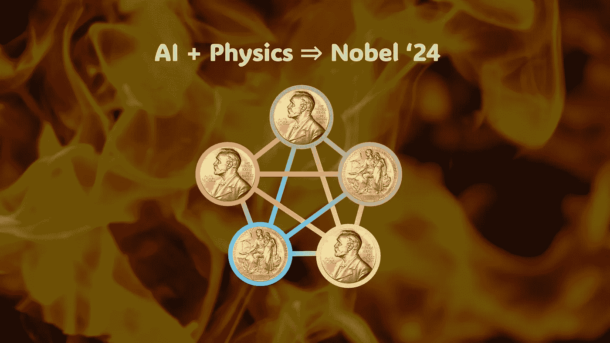

# 人工智能首个诺贝尔奖背后的科学

> 原文：[`towardsdatascience.com/the-science-behind-ais-first-nobel-prize-829c788f2202?source=collection_archive---------1-----------------------#2024-10-16`](https://towardsdatascience.com/the-science-behind-ais-first-nobel-prize-829c788f2202?source=collection_archive---------1-----------------------#2024-10-16)

## 物理学与机器学习如何携手赢得 2024 年诺贝尔物理学奖

 [Tim Lou 博士](https://tim-lou.medium.com/?source=post_page---byline--829c788f2202--------------------------------)

·发表于[数据科学之路](https://towardsdatascience.com/?source=post_page---byline--829c788f2202--------------------------------) ·阅读时长 11 分钟·2024 年 10 月 16 日

--

作者本人创作的作品，展示了霍普菲尔德网络中的诺贝尔奖。背景图像来源：[Maxim Tajer](https://unsplash.com/photos/burning-wood-x3S1aGQNgro)，诺贝尔奖金币图像来源：[hyperionforge](https://sketchfab.com/3d-models/nobel-coin-6bfcee0e4c2f4c02a1739d6f5a307d7d)

2024 年诺贝尔物理学奖已于 2024 年 10 月 4 日公布，今年的奖项颁给了霍普菲尔德教授和杰弗里·辛顿教授。但这次略有不同，奖项并非授予关于自然世界的通常发现，而是颁给了一些更具人工性质的东西：

> “因奠定了通过人工神经网络实现机器学习的基础性发现和发明。”
> 
> — [*诺贝尔基金会新闻稿*](https://www.nobelprize.org/prizes/physics/2024/press-release/)

强调了两种机器学习（ML）模型：[霍普菲尔德网络](https://en.wikipedia.org/wiki/Hopfield_network)和[玻尔兹曼机](https://en.wikipedia.org/wiki/Boltzmann_machine)。这可能让一些人感到惊讶，因为机器学习看起来与物理学相距甚远。然而，许多早期的基础机器学习概念其实受到物理系统的启发。

这项奖项的意义是什么？我认为它是为了突出最近在生成式人工智能（文本/图像/视频生成）方面的进展，并提醒我们，这些现代模型的基础源于物理学。更具体地说，霍普菲尔德网络和玻尔兹曼机可以被视为一些最早的生成模型，它们借用了自然界的物理原理……
