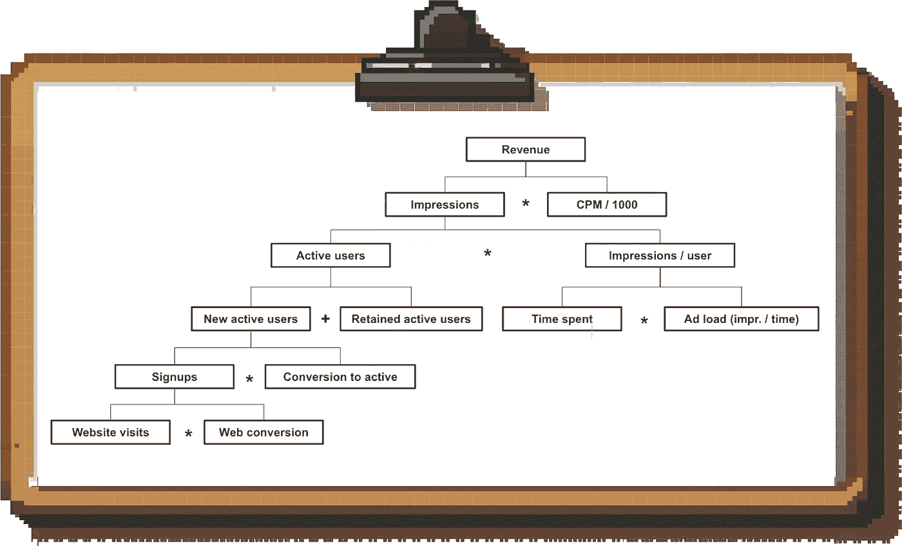
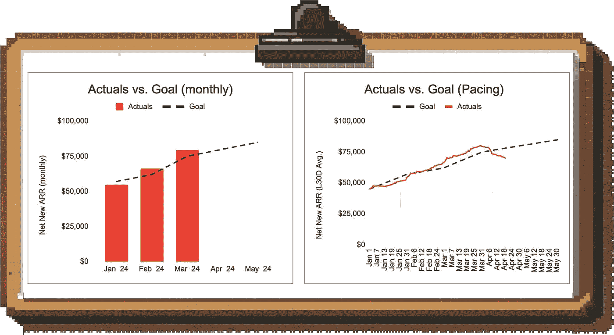
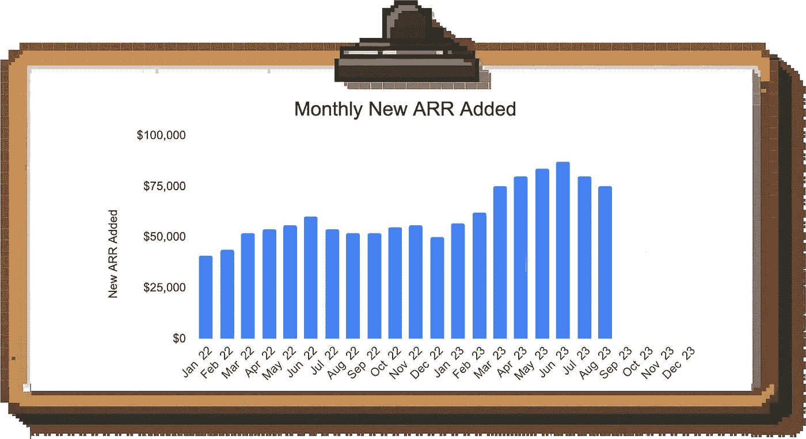
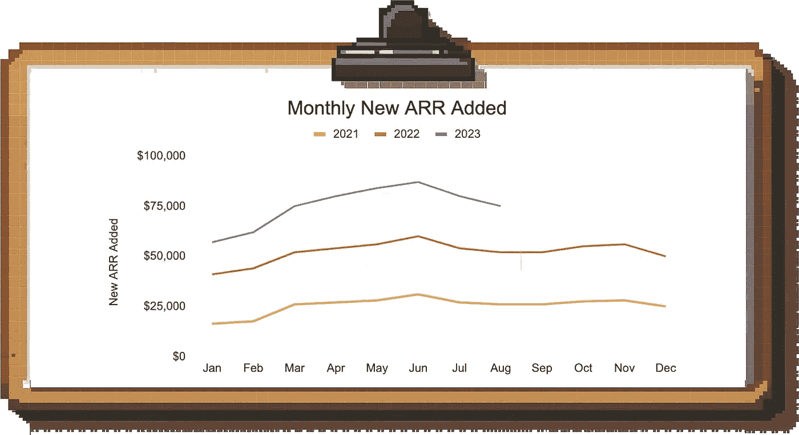
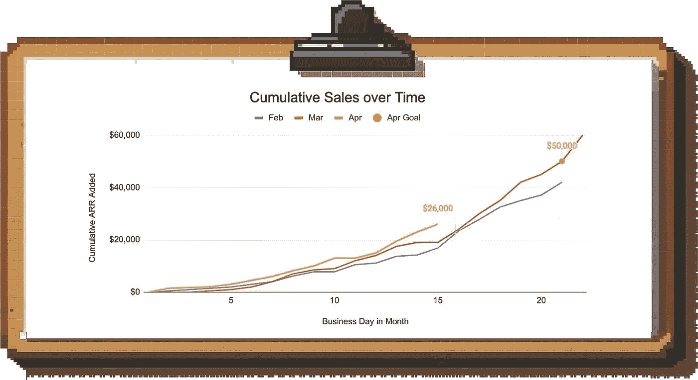
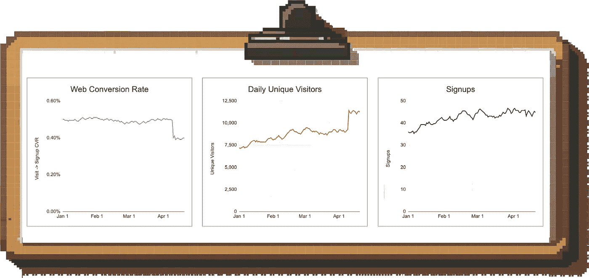
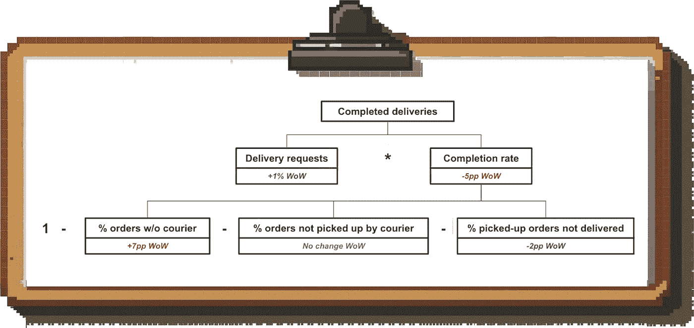
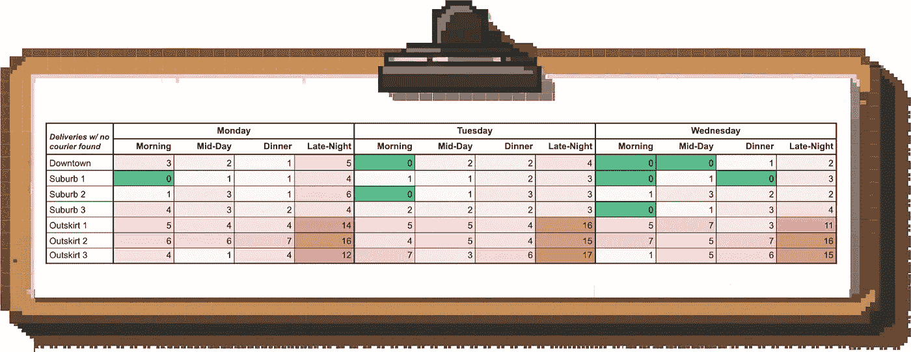
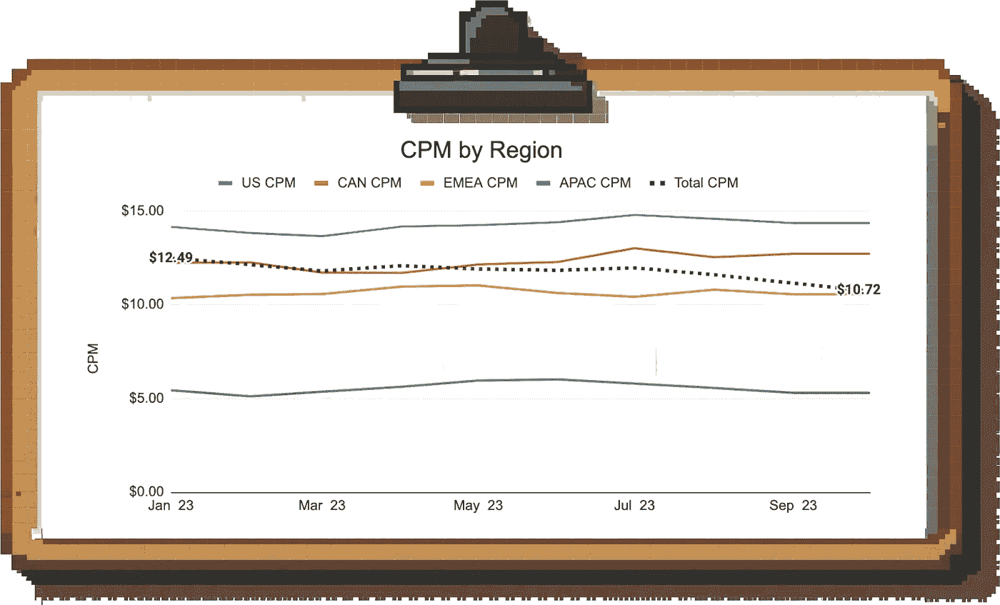
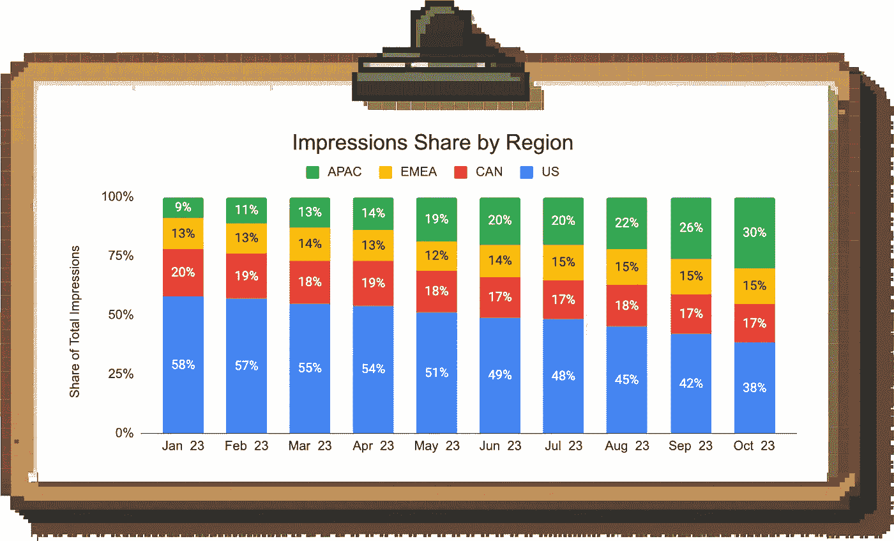

# 《最终的数据解读指南》

> 原文：[`towardsdatascience.com/the-ultimate-guide-to-making-sense-of-data-aaa121db1119?source=collection_archive---------0-----------------------#2024-06-04`](https://towardsdatascience.com/the-ultimate-guide-to-making-sense-of-data-aaa121db1119?source=collection_archive---------0-----------------------#2024-06-04)

## 来自 Uber、Meta 和高速成长初创公司的 10 年经验教训

 [Torsten Walbaum](https://medium.com/@twalbaum?source=post_page---byline--aaa121db1119--------------------------------)

·发布于 [Towards Data Science](https://towardsdatascience.com/?source=post_page---byline--aaa121db1119--------------------------------) ·阅读时长 14 分钟·2024 年 6 月 4 日

--

图片由作者提供；通过 Midjourney 创建

数据可以帮助你做出更好的决策。

不幸的是，大多数公司在收集数据方面比在解读数据上做得更好。他们声称拥有数据驱动的文化，但实际上，他们在做决策时更多依赖经验。

> ***作为一名数据科学家，你的工作是帮助商业利益相关者理解和解读数据，以便他们能做出更明智的决策。***

你的影响力并非来自你所做的分析或构建的模型，而是来自你帮助推动的最终商业成果。这是资深数据科学家与初级数据科学家的主要区别。

为了帮助实现这一点，我根据在 Rippling、Meta 和 Uber 的经验，整理了这本逐步操作手册，帮助将数据转化为可操作的洞察。

我将涵盖以下内容：

1.  **应该跟踪哪些指标：** 如何为你的业务建立收入方程式和驱动树

1.  **如何跟踪：** 如何设置监控并避免常见的陷阱。我们将讨论如何选择合适的时间范围，处理季节性问题，掌握分 cohort 数据等！

1.  **提取洞察：** 如何以结构化和可重复的方式识别问题和机会。我们将介绍你最常遇到的趋势类型，以及如何理解它们。

听起来很简单，但问题在于细节，让我们一一深入探讨。

# 第一部分：应该跟踪哪些指标

首先，你需要弄清楚应该跟踪和分析哪些指标。为了最大化影响力，你应该专注于那些实际推动收入的指标。

从高层次的收入公式开始（例如，“收入 = 展示量 * CPM / 1000”对于基于广告的业务），然后进一步拆解每个部分，以了解潜在的驱动因素。具体的收入公式取决于你所从事的业务类型；你可以在[这里](https://www.lennysnewsletter.com/p/the-math-formula-behind-your-business)找到一些最常见的公式。

结果驱动树的结构是，输出在顶部，输入在底部，它告诉你什么因素推动了业务的结果，以及你需要构建哪些仪表盘，以便进行端到端的调查。

**示例：** 这是一个（部分）基于广告的 B2C 产品的驱动树：

作者提供的图片

## 理解领先指标和滞后指标

收入公式可能让人觉得输入立即转化为输出，但现实中并非如此。

最明显的例子是市场营销与销售漏斗：你生成潜在客户，它们转化为合格的机会，最终达成交易。根据你的业务和客户类型，这个过程可能需要好几个月。

***换句话说，如果你在查看一个结果指标，例如收入，通常是在查看你几周或几个月前采取的行动的结果。***

一条经验法则是，你在驱动树中走得越远，某个指标就越可能是领先指标；走得越近顶部，你处理的就越可能是滞后指标。

## 定量分析滞后

查看历史转化窗口非常值得，这样可以帮助你理解你所处理的滞后程度。

这样，你就能更好地向***回溯***（如果你看到收入波动，你就知道该追溯多远以查找原因）以及***向前预测***（你会知道看到新举措的影响需要多长时间）。

根据我的经验，制定**经验法则**（例如，平均需要一天还是一个月时间让新用户变得活跃）**能够帮助你获得 80%到 90%的价值**，因此不必过度设计这一过程。

# 第二部分：设置监控并避免常见的陷阱

所以你有了驱动树；那你如何利用这个来监控业务的表现并为利益相关者提取见解呢？

第一步是设置仪表盘来监控关键指标。我不会深入比较你可以使用的各种 BI 工具（以后我可能会在单独的文章中做这个比较）。

我在这篇文章中谈到的所有内容，都可以轻松地在 Google Sheets 或任何其他工具中完成，因此你选择的 BI 软件不会成为限制因素。

相反，我希望集中讨论一些最佳实践，帮助你理清数据并避免常见的陷阱。

## 1\. 选择适当的时间框架来衡量每个指标

虽然你希望尽早捕捉趋势，但需要小心不要陷入过于细化数据的陷阱，避免从大多数噪音中得出结论。

考虑你正在衡量的活动的**时间范围**，以及你是否能够**基于数据采取行动**：

+   实时数据对于像 Uber 这样的 B2C 市场非常有用，因为**1)** 交易生命周期很短（一次 Uber 出行通常在不到一个小时内完成请求、接受和完成）***并且 2)因为 Uber 有应对实时变化的工具***（例如，动态定价、激励措施、司机沟通）。

+   相反，在 B2B SaaS 企业中，由于长期的交易周期，日常销售数据会显得比较嘈杂且不易采取行动。

你还需要考虑你在设定目标时的**时间范围**。如果你的合作团队有月度目标，那么这些指标的默认查看方式应该是按月。

**但是：**月度指标（甚至更长时间周期）的主要问题是，你可以用来分析的数据点很少，并且需要等待很长时间才能得到更新的表现视图。

一种折衷方法是将指标绘制为滚动平均：这样，你既能捕捉到最新的趋势，又能通过平滑数据去除很多噪音。

作者提供的图片

**示例：** 看左侧的月度数据，我们可能会得出结论，认为我们有很好的机会达成四月的目标；然而，查看 30 天的滚动平均时，我们发现收入生成急剧下降（我们应该尽快调查这个问题）。

## 2\. 设置基准

要从指标中得出见解，你需要能够将数字放入上下文中。

+   最简单的方法是将指标***随时间对比***：该指标是在改善还是在恶化？当然，如果你知道自己希望该指标达到的确切水平，那就更好了。

+   如果你有一个与指标对齐的***官方目标***，那很好。但即使没有，你仍然可以通过推导出***隐性目标***来判断自己是否在正确的轨道上。

**示例：** 假设销售团队有月度配额，但他们没有明确的目标来确定需要生成多少销售线索才能达成配额。

在这种情况下，你可以查看开放销售线索与配额的历史比例（“销售线索覆盖率”），并以此作为你的基准。**请注意：** 通过这样做，你隐含地假设了业绩将保持稳定（在这种情况下，假设团队以稳定的速度将销售线索转化为收入）。

## 3\. 考虑季节性因素

几乎在任何业务中，你都需要考虑季节性因素来正确解读数据。换句话说，你所查看的指标是否存在按照一天中的时间、星期几、每月时间、日历月份等重复的模式？

**示例：** 看看这个 B2B SaaS 企业的新 ARR 月度趋势：

作者提供的图片

如果你查看这个简单的柱状图中 7 月和 8 月新 ARR 的下降，你可能会感到惊慌并开始进行广泛调查。

然而，如果你将每一年的数据叠加在一起，你能够识别出季节性模式，并意识到每年都有一个夏季低谷，你可以预期业务将在九月再次回升：

图片由作者提供

但季节性并不一定是按月来定义的；可能是某些工作日的表现较强或较弱，或者你通常会看到业务在月末开始回升。

**例子：** 假设你想查看销售团队在当前月份（四月）的表现。现在是本月的第 15 个工作日，截止目前，你已经完成了 26,000 美元的销售额，而目标是 50,000 美元。如果忽略季节性因素，*看起来团队将会未达目标，因为你只剩下 6 个工作日了。*

然而，你知道团队通常会在月末完成大量交易。

图片由作者提供

在这种情况下，我们可以绘制累计销售额，并与前几个月进行比较，从而理解模式。这让我们看到，实际上我们在本月的这个时候处于一个不错的位置，因为销售趋势并非线性。

## 4. 处理“尚未成熟”的度量

在分析度量时，最常见的一个陷阱是查看那些还没有足够时间“成熟”的数字，即尚未达到最终值的数字。

以下是一些最常见的例子：

1.  **用户获取漏斗：** 你正在衡量从流量到注册再到激活的转化；你不知道最近的注册中有多少会在未来转化

1.  **销售漏斗：** 你的平均交易周期持续几个月，你不知道近期的未完成交易中有多少会最终成交

1.  **留存：** 你想了解某一特定用户群体在你的业务中保持活跃的情况

在所有这些情况下，近期用户群体的表现看起来比实际情况差，因为数据尚未完整。

如果你不想等待，你通常有三种选择来解决这个问题：

**选项 1：按时间周期切分度量**

最直接的方式是按时间周期切分汇总度量（例如，第一周转化率、第二周转化率等）。这样可以在进行横向比较时避免偏向较老的用户群体，并且能提前了解结果。

然后，你可以在一个用户群体热力图中显示结果。以下是一个关于获取漏斗跟踪从注册到首次交易的例子：

图片由作者提供

通过这种方式，你可以看到，在对比相同条件下，我们的转化率在下降（我们的第一周转化率从超过 20%降至最近用户群体的约 15%）。仅通过查看汇总的转化率（最后一列），我们无法区分数据不完整所导致的实际下降。

**选项 2：更改度量定义**

在某些情况下，您可以改变指标的定义，以避免查看不完整的数据。

例如，与其查看 3 月份进入管道的交易到目前为止有多少达成，您可以查看 3 月份关闭的交易中有多少是赢得的，多少是失去的。这个数字不会随着时间变化，而您可能需要等待几个月才能看到 3 月份交易组的最终表现。

**选项 3：预测**

基于过去的数据，您可以预测一个群体的最终表现可能会如何。随着时间的推移和更多实际数据的收集，预测将会趋近于实际值。

**但要小心：**预测群体表现时应小心谨慎，因为这很容易出错。例如，如果您在一个 B2B 业务中工作，且赢得交易的比率较低，一个单独的交易可能会显著改变群体的表现。准确预测这一点非常困难。

# 第三部分：从数据中提取洞察

所有这些数据都很棒，但我们如何将其转化为洞察呢？

您不会有时间定期深入研究每个指标，因此可以通过优先查看最大的差距和关键变化来管理您的时间：

+   团队在哪些地方未能达到目标？您在哪些地方看到了意外的超额表现？

+   哪些指标在下降？哪些趋势正在反转？

一旦您选择了一个感兴趣的趋势，您需要深入挖掘并找出根本原因，以便您的业务合作伙伴能提出有针对性的解决方案。

为了为您的深入分析提供结构，我将逐一介绍您可能遇到的关键指标趋势类型，并根据实际经验为每种类型提供具体示例。

## 1. 净中性变动

当您看到某个指标剧烈波动时，首先应该***向上***查看驱动因素树，而不是直接向下。这样，您可以看看这个数字是否真正推动了您和团队最终关心的事情；如果没有，找出根本原因的紧迫性就会降低。

图片由作者提供

**示例场景：**在上面的图片中，您看到网站上的访问到注册的转化率大幅下降。与其惊慌失措，您查看了总注册数，发现该数字保持稳定。

事实证明，平均转化率的下降是由于网站上低质量流量激增造成的；而您的“核心”流量表现保持不变。

## 2. 分母与分子

在处理比例指标（每个活跃用户的展示量、每个共享乘车司机的行程数等）时，首先检查是分子还是分母发生了变化。

人们往往认为是分子发生了变化，因为那通常是我们在短期内试图提升的参与度或生产力指标。然而，很多情况下情况并非如此。

**示例包括：**

+   您看到每位销售代表的潜在客户数量下降，因为团队刚刚加入了一批新员工，而不是因为您存在需求生成问题。

+   每小时每个 Uber 驾驶员的行程下降，并不是因为乘客请求减少，而是因为团队提高了激励措施，更多的司机上线了。

## 3. 隔离/集中趋势

许多指标趋势是由只发生在产品或业务的特定部分的因素推动的，聚合的数字并不能讲述完整的故事。

**隔离根本原因的一般诊断流程如下：**

**步骤 1：** 继续分解指标，直到你隔离出无法进一步分解的趋势。

类似于在数学中每个数字都可以分解成一组质数一样，每个指标都可以进一步分解，直到达到基本的输入。

通过这样做，你能够将问题隔离到司机树的特定部分，从而更容易定位问题所在，并决定应对措施。

**步骤 2：** 对数据进行分段，以隔离相关趋势

通过分段，你可以找出是否是业务的某个特定领域出了问题。通过在以下维度上进行分段，你应该能够发现超过 90% 的问题：

+   地理位置（地区/国家/城市）

+   时间（月份中的时间、星期几等）

+   产品（不同的 SKU 或产品表面（例如 Instagram Feed 与 Reels））

+   用户或客户人口统计（年龄、性别等）

+   单一实体/行为者（例如销售代表、商家、用户）

**让我们来看一个具体的例子：**

假设你在 DoorDash 工作，看到波士顿的完成送货数量相比上周下降。与其集思广益寻找增加需求或提升完成率的方法，不如先尝试隔离问题，这样我们就能制定更有针对性的解决方案。

第一步是分解指标“完成的送货”：

作者提供的图片

根据这个驱动树，我们可以排除需求端的问题。相反，我们看到最近在波士顿，我们在寻找司机接单方面遇到了困难（而不是餐厅和快递员交接或食物送达方面的问题）。

最后，我们将检查这是否是一个广泛的问题。在这种情况下，一些最有前景的切入点是查看地理位置、时间和商家。商家数据表明这个问题是广泛存在的，影响了许多餐厅，所以它并不能帮助我们缩小范围。

然而，当我们为指标*“没有找到快递员的送货请求”*创建时间和地理位置的热图时，我们发现大部分问题发生在波士顿郊区的夜间：

作者提供的图片

**我们该如何处理这些信息？** 能够像这样 pinpoint 问题，能够让我们在这些时间和地点部署有针对性的快递员招募工作和激励措施，而不是把它们撒播到整个波士顿。

换句话说，隔离根本原因使我们能够更有效地部署资源。

**你可能遇到的其他集中趋势示例：**

+   大多数在线游戏中的游戏内购买来自少数“鲸鱼玩家”（所以团队会将其留存和参与度的努力集中在这些玩家身上）

+   大多数支持工单的升级到工程团队，是由少数支持人员引起的（这为公司提供了一个有针对性的杠杆，通过培训这些支持人员来释放工程团队的时间）

# 4. 混合变化

诊断表现时最常见的困惑来源之一就是混合变化和***辛普森悖论***。

混合变化只是总人口组成的变化。辛普森悖论描述了这样一种反直觉的现象：你在总人口中看到的趋势，在查看子组件时消失或反转（反之亦然）。

**这在实践中是什么样的呢？**

假设你在 YouTube 工作（或者其他任何有广告业务的公司）。你发现收入正在下降，当你深入分析数据时，发现 CPM 已经下降了一段时间。

CPM 作为一个指标无法进一步分解，因此你开始对数据进行细分，但却难以识别根本原因。例如，所有地区的 CPM 看起来都很稳定：

图片由作者提供

这里就是混合变化和辛普森悖论的体现：每个单独地区的 CPM 保持不变，但如果你查看按地区划分的印象组成，你会发现印象的组合正在从美国转向亚太地区。

**由于亚太地区的 CPM 低于美国，整体 CPM 正在下降。**

图片由作者提供

再次强调，了解准确的根本原因可以提供更有针对性的响应。根据这些数据，团队可以尝试在高 CPM 地区重新激发增长，考虑为亚太地区提供更多的货币化选项，或通过在大亚太市场中大量增加印象量来弥补单个印象的较低价值。

# 最后的思考

记住，数据本身没有价值。只有当你用它来生成洞察或为用户或内部利益相关者提供建议时，它才变得有价值。

通过遵循一个结构化框架，你将能够可靠地识别数据中的相关趋势，按照上述提示，你可以区分信号与噪声，避免得出错误的结论。

如果你对更多类似内容感兴趣，可以在 Medium 上关注我，或在[LinkedIn](http://www.linkedin.com/comm/mynetwork/discovery-see-all?usecase=PEOPLE_FOLLOWS&followMember=torsten-walbaum)和[Substack](https://www.operatorshandbook.com/)上关注我。
