# RAGs 终极指南——每个组件解析

> 原文：[`towardsdatascience.com/the-ultimate-guide-to-rags-each-component-dissected-3cd51c4c0212?source=collection_archive---------0-----------------------#2024-10-29`](https://towardsdatascience.com/the-ultimate-guide-to-rags-each-component-dissected-3cd51c4c0212?source=collection_archive---------0-----------------------#2024-10-29)

## 构建生产级 LLM 管道所需的视觉导览

 [Avishek Biswas](https://medium.com/@neural.avb?source=post_page---byline--3cd51c4c0212--------------------------------)

·发表于 [Towards Data Science](https://towardsdatascience.com/?source=post_page---byline--3cd51c4c0212--------------------------------) ·12 分钟阅读·2024 年 10 月 29 日

--

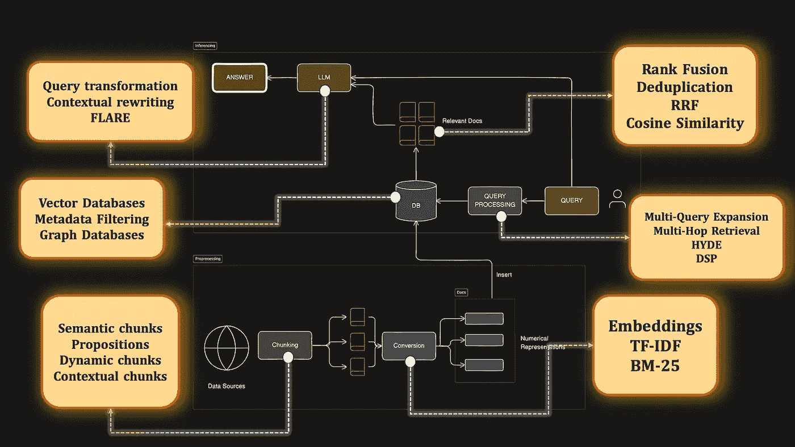

让我们来学习 RAGs！（图片来自作者）

如果你曾经使用过大型语言模型，可能至少听说过 RAG 这个术语——检索增强生成（Retrieval Augmented Generation）。RAG 的概念非常简单——假设你想向 LLM 提问，除了依赖 LLM 的预训练知识外，你首先从外部知识库中检索相关信息。然后将这些检索到的信息与问题一起提供给 LLM，从而让它生成一个更加知情且最新的回答。

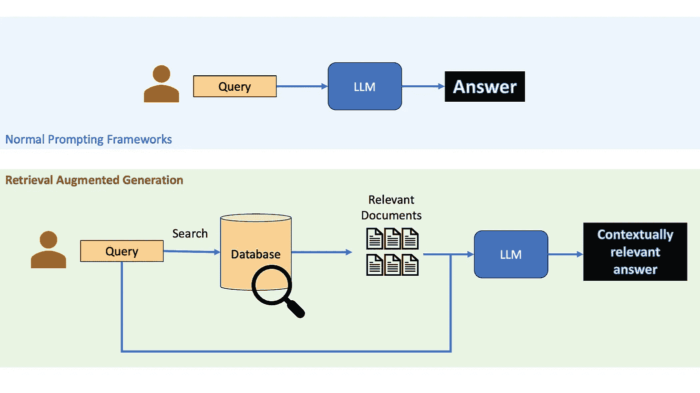

将标准 LLM 调用与 RAG 进行比较（来源：图片来自作者）

**那么，为什么要使用检索增强生成？**

当**提供准确且最新的信息**至关重要时，你不能仅依赖 LLM 内置的知识。RAG 是一种廉价且实用的方法，可以使用 LLM 生成关于近期话题或小众话题的内容，**而无需自己对其进行微调**，也不会耗费你毕生的积蓄。即使 LLM 内部的知识足以回答问题，使用 RAG 也是个好主意， [因为近期的研究表明，它们可能有助于减少 LLM 的幻觉现象。](https://arxiv.org/html/2404.08189v1)

# 一个基础 RAG 的不同组件

在我们深入探讨本文的高级内容之前，让我们先回顾一下基础知识。一般来说，RAG 由两条管道组成——**预处理和推理**。

**推理**就是利用现有数据库中的数据来回答用户查询的问题。**预处理**是将数据库设置为正确格式的过程，以便之后可以正确检索。

这里是整个基础 RAG 管道的示意图。

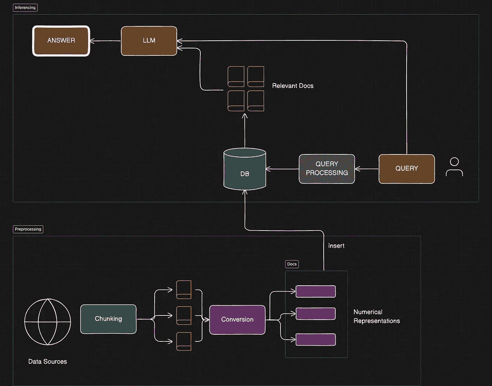

基本 RAG 管道（图片由作者提供）

## 索引或预处理步骤

这是离线预处理阶段，我们将在这里设置数据库。

1.  **识别数据来源**：根据应用选择相关的数据来源，例如维基百科、书籍或手册。由于这是领域特定的，我将在本文中跳过此步骤。去选择你想使用的任何数据，尽情使用吧！

1.  **数据分块**：将数据集拆分为更小、更易于管理的文档或数据块。

1.  **转换为可搜索格式**：将每个数据块转换为数字向量或类似的可搜索表示。

1.  **插入数据库**：将这些可搜索的数据块存储到自定义数据库中，当然也可以使用外部数据库或搜索引擎。

## 推理步骤

在查询推理阶段，以下组件尤为突出。

1.  **查询处理**：将用户查询转换为适合搜索的格式的方法。

1.  **检索/搜索策略**：一种相似度搜索机制，用于检索最相关的文档。

1.  **检索后答案生成**：使用检索到的文档作为上下文，通过 LLM 生成答案。

很好——我们已经确定了构建 RAG 所需的几个关键模块。信不信由你，这些组件每一个都有大量的附加研究，使得这个简单的 RAG 变成了 CHAD-rag。让我们从数据分块开始，看看这个列表中的每个主要组件。

本文基于这段 YouTube 视频

***顺便说一下，本文基于我制作的这段 17 分钟的 YouTube 视频，内容涵盖了本文中的所有话题。读完这篇 Medium 文章后，欢迎查看视频！***

# 1\. 数据分块

数据分块是将大文档拆分为较小、易于管理的部分的过程。听起来可能很简单，但相信我，你如何分块数据可能决定了 RAG 管道的成败。你在预处理时创建的分块最终将在推理过程中被检索。如果你将数据块做得太小——比如每个句子——那么通过搜索检索可能会很困难，因为它们捕捉的信息很少。如果数据块太大——比如插入整个维基百科文章——检索到的段落可能会让 LLM 感到困惑，因为你一次性发送了大量文本。

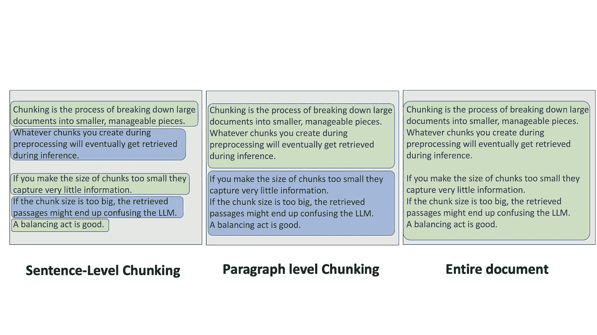

根据不同的数据分块级别，你的结果可能会有所不同！(图片由作者提供)

一些框架使用 LLM 进行分块，例如通过从文本语料库中提取简单的事实或命题，并将它们视为文档。这可能会很昂贵，因为数据集越大，你需要进行的 LLM 调用就越多。

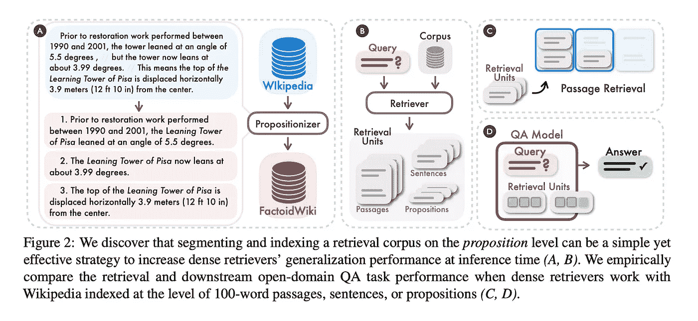

命题分块（来源：[Dense X Retrieval Paper](https://arxiv.org/pdf/2312.06648)。许可证：免费）

## 结构化分块

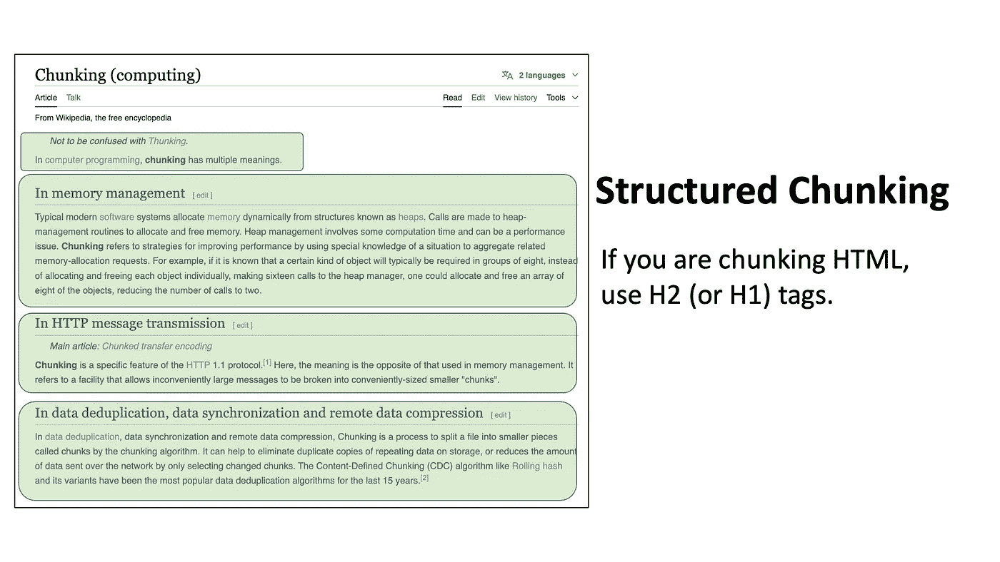

如果你的数据具有固有的边界（如 HTML 或代码），有时最好直接利用它。（图片来源：作者）

很多时候，我们可能还需要处理本身具有已知结构或格式的数据集。例如，如果你想将代码插入到数据库中，你可以简单地通过函数名或类定义来拆分每个脚本。对于像维基百科文章这样的 HTML 页面，你可以通过标题标签进行拆分——例如，按 H2 标签拆分以隔离每个子章节。

## 上下文分块

但是，我们迄今为止讨论的分块类型存在一些显而易见的问题。假设你的数据集包含从所有《福尔摩斯探案集》书籍中提取的成千上万段落。那么，如果用户查询的是类似“《血字的研究》中的第一个犯罪是什么？”这样的一般问题，你认为会发生什么？

问题在于，由于每个文档都是一个孤立的信息片段，我们不知道哪些分块来自《血字的研究》。因此，稍后的检索中，我们最终可能会获取到一堆关于“犯罪”话题的段落，但无法确定它是否与该书相关。为了解决这个问题，我们可以使用一种叫做上下文分块的方法。

**进入上下文分块**

[最近的博客文章](https://anthropic.com/news/contextual-retrieval)来自 Anthropic，它将上下文分块描述为在嵌入之前，为每个分块添加特定的解释性上下文。基本上，在我们进行索引时，我们还会包括与分块相关的额外信息——例如书名、章节、也许是书中的事件总结。添加这些上下文将允许检索器在搜索时找到《血字的研究》和犯罪相关的参考内容， hopefully 能够从数据库中获得正确的文档！

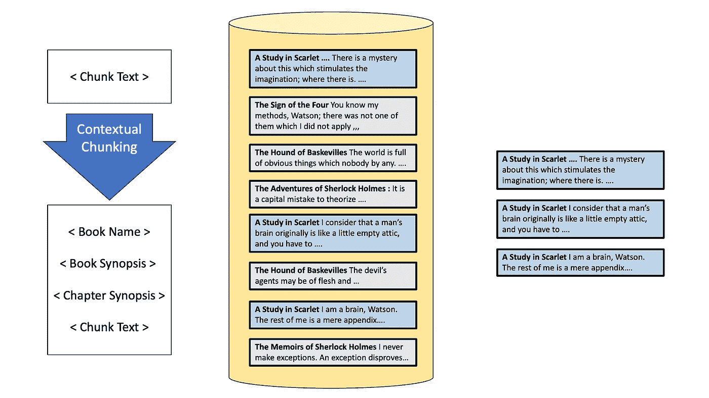

上下文分块为分块添加了比文本主体更多的额外信息（图片来源：作者）

还有其他方法可以解决查找正确查询的问题——比如元数据过滤，我们将在讨论数据库时再详细讲解。

# 2\. 数据转换

接下来，我们进入数据转换阶段。请注意，无论我们在预处理过程中使用了什么策略来转换文档，我们都需要在后续的相似性搜索中使用它，因此这两个组件是紧密耦合的。

目前在这个领域中出现的两种最常见方法是**嵌入式方法**和**基于关键词频率的方法**，如 TF-IDF 或 BM-25。

## 嵌入式方法

我们将从基于嵌入的方法开始。在这里，我们使用预训练的变换器模型将文本转化为高维向量表示，捕捉文本的语义含义。嵌入方法非常适合捕捉语义关系，处理同义词，并理解上下文相关的含义。然而，嵌入方法可能计算密集，并且有时会忽略一些简单方法容易捕捉到的精确匹配。

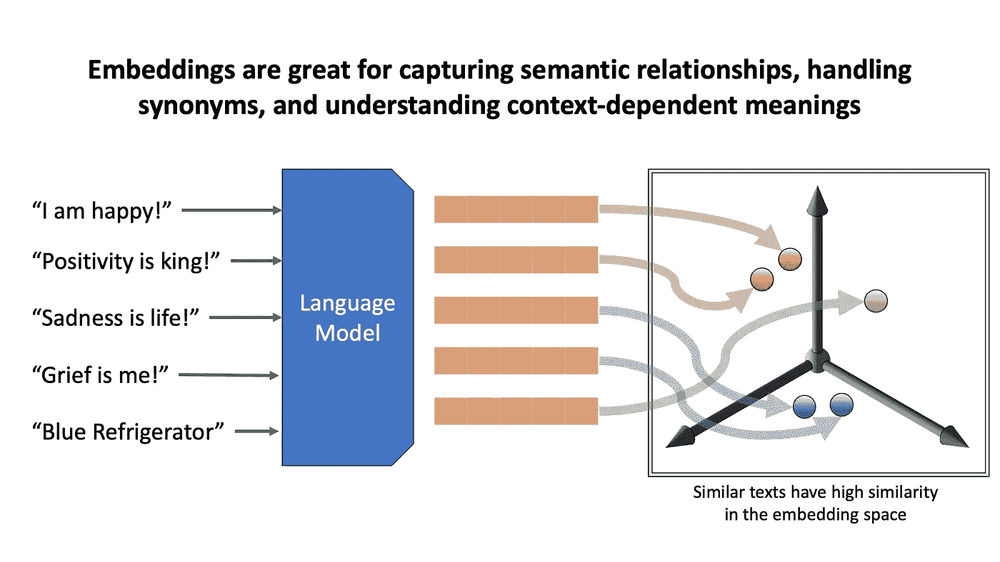

嵌入（图片来源：作者）

## 语义搜索何时会失败？

例如，假设你有一个包含特定冰箱信息的手册数据库。当你查询一个非常特定的小众型号或序列号时，嵌入方法会获取与查询相似的文档，但可能无法完全匹配查询。这就引出了嵌入检索的替代方法——基于关键词的检索。

## 基于关键词的方法

两种流行的基于关键词的方法是 TF-IDF 和 BM25。这些算法关注文档和查询中的术语之间的统计关系。

TF-IDF 根据一个词在文档中出现的频率与在整个语料库中出现的频率之间的比重，来衡量该词的重要性。我们数据集中的每个文档都由该文档中词汇表中每个词的 TF-IDF 分数组成的数组表示。该文档向量中高值的索引告诉我们哪些词最能体现该文档的内容，因为这些词在该文档中出现得更频繁，而在其他文档中出现得较少。例如，关于 Godrej A241gX 的文档将会对“Godrej”和“A241gX”这两个短语赋予较高的 TF-IDF 分数，这使得我们在使用 TF-IDF 检索时更有可能找到这些文档。

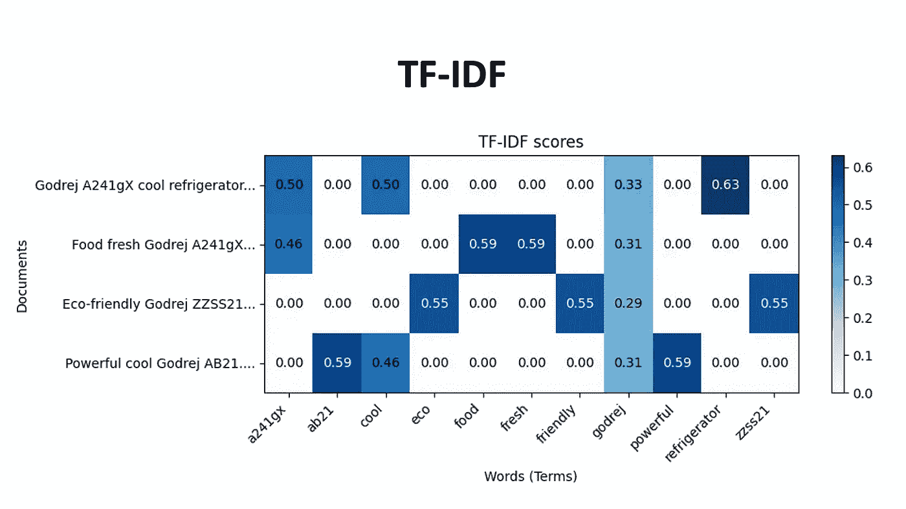

TF-IDF 依赖于术语在文档中出现的频率与其在整个语料库中出现频率的比率。（图片来源：作者）

BM25 是 TF-IDF 的一个演化版本，融合了文档长度归一化和术语饱和度。也就是说，它根据文档的长度是否长于或短于集合中的平均文档长度，调整 TF-IDF 分数。术语饱和度意味着，当某个特定词汇在数据库中出现得过于频繁时，它的重要性会降低。

TF-IDF 和 BM-25 非常适合找到具有特定关键词出现的文档，尤其是当它们恰好出现时。而嵌入方法则非常适合找到具有相似语义的文档。

**现在常见的做法是结合使用关键词和基于嵌入的方法，并将它们结合起来，从而获得两者的最佳效果。** 当我们在稍后讨论“互惠排序融合”和“去重”时，我们将探讨如何结合这些不同的检索方法。

# 3. 数据库

接下来，让我们来谈谈数据库。在 RAGs 中使用最常见的数据库类型是**向量数据库**。向量数据库通过使用向量表示（例如嵌入或 TF-IDF）对文档进行索引来存储它们。向量数据库专注于与查询向量进行快速相似性检查，这使得它们非常适合 RAG。你可能想了解的流行向量数据库有 Pinecone、Milvus、ChromaDB、MongoDB，它们各有优缺点和定价模型。

向量数据库的替代方案是**图数据库**。图数据库将信息存储为一个文档网络，每个文档通过关系与其他文档相连接。

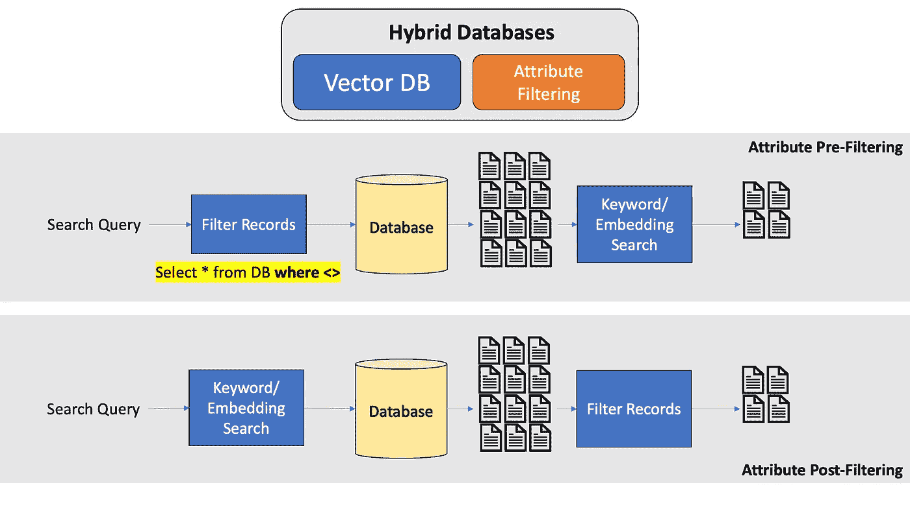

现代向量数据库支持语义搜索的属性过滤（图示作者）

许多现代向量和图数据库也支持关系型数据库中的属性，最显著的是元数据或属性过滤。如果你知道问题是关于《哈利·波特与凤凰社》的第五本书，那么首先过滤整个数据库，只保留第五本哈利·波特书籍的文档，而不是对整个数据集进行嵌入搜索，会非常有帮助。在向量数据库中，最佳的元数据过滤是计算机科学研究中的一个非常棒的领域，关于这个话题的深入讨论最好能写一篇独立的文章。

# 4\. 查询转换

**接下来，让我们开始推理过程，从查询转换开始——这是我们在进行任何相似性搜索之前，对用户实际查询进行的任何预处理步骤。可以把它看作是改善用户问题，以获得更好的答案。**

一般来说，我们希望避免直接使用用户查询进行搜索。用户输入通常非常嘈杂，他们可能会随便输入一些内容——我们希望有一个额外的转换层，能够解释用户的查询并将其转化为搜索查询。

## 一个简单的例子，说明了查询重写为何重要

进行这种转换的最常见技术是查询重写。假设有人问：“**画蒙娜丽莎的艺术家后来怎样了？**”如果我们进行语义或关键词搜索，检索到的信息将全是关于蒙娜丽莎的，而不是关于艺术家的。查询重写系统会使用 LLM 重写这个查询。LLM 可能会将其转换为“**列奥纳多·达·芬奇 蒙娜丽莎 艺术家**”，这将是一个更有成效的搜索。

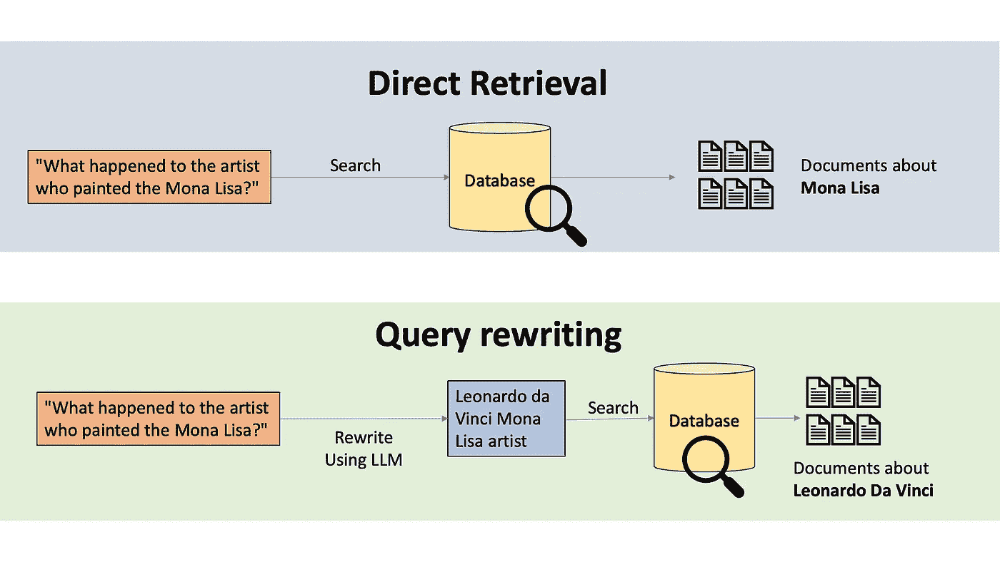

直接检索与查询重写（图示作者）

有时候我们还会使用**上下文查询写作**，例如我们可能会使用额外的上下文，比如使用用户的旧对话记录，或者如果我们知道我们的应用程序涵盖了来自 10 本不同书籍的文档，可能会有一个分类器 LLM 来分类用户查询，以确定我们正在处理的是哪本书。如果我们的数据库使用的是不同语言，也可以对查询进行翻译。

[还有像 HYDE 这样的强大技术](https://arxiv.org/abs/2212.10496)，HYDE 代表**假设文档嵌入**。HYDE 使用语言模型生成对查询的假设性回答，然后通过与这个假设性回答进行相似度搜索来检索相关文档。

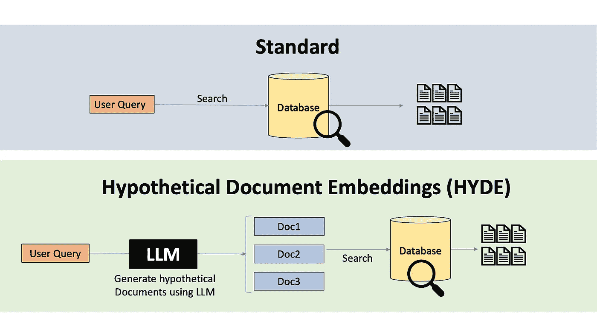

假设文档嵌入（Hypothetical Document Embeddings）（图片来源：作者）

另一种技术是**多查询扩展**，它通过从单一的用户查询生成多个查询，并进行并行搜索来检索多个文档集合。收到的文档随后可以经过去重步骤或排名融合，以去除重复的文档。

一种最近的 approach 叫做[**Astute RAG**](https://arxiv.org/abs/2410.07176)，它试图在生成答案之前，将外部输入的知识与 LLM 自身的内部知识进行整合。还有一些**多跳技术，如 Baleen 程序**，它们通过执行初始搜索，分析前几个结果，找出常常一起出现的词汇，然后将这些词汇添加到原始查询中。这种自适应方法有助于弥合用户查询与文档内容之间的词汇差距，从而帮助检索到更好的文档。

# 5\. 检索后处理

现在我们已经检索到了可能相关的文档，在将信息输入到语言模型中生成答案之前，我们可以加入另一个检索后处理步骤。

例如，我们可以进行信息选择和强调，在这个过程中，LLM（大语言模型）会从检索到的文档中选择可能有助于找到答案的部分。我们可能会突出显示关键句子，或者进行语义过滤，去除不重要的段落，或者进行上下文总结，将多份文档合并成一份。这样做的目标是避免让我们的 LLM 接收过多信息，这样可能会导致回应不够专注或准确。

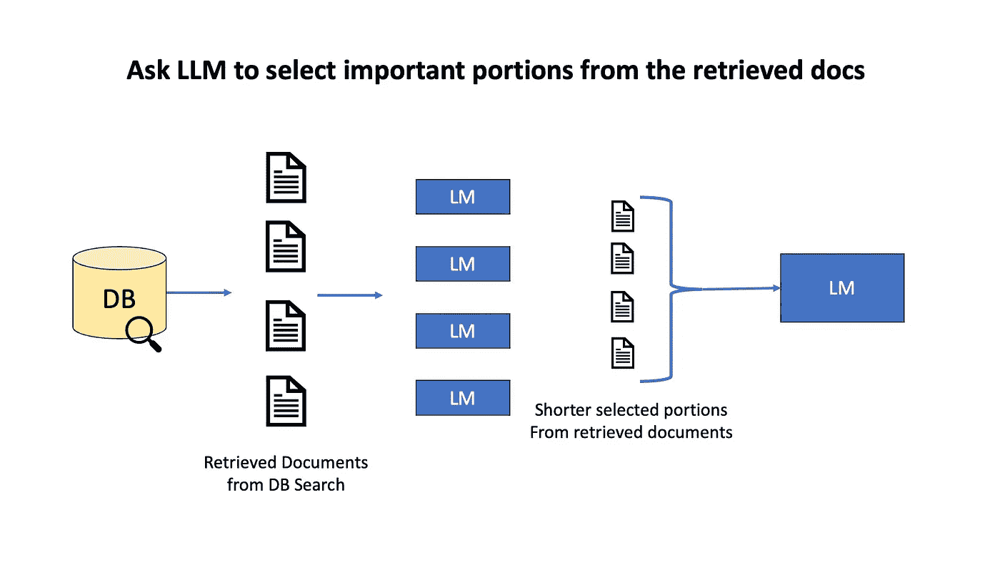

你可以使用较小的 LLM 从检索到的文档中标记出相关信息，然后在最终调用 LLM 时合并上下文提示（图片来源：作者）

通常我们会通过查询扩展进行多次查询，或使用多个检索算法，如 Embeddings+BM-25，分别获取多个文档。为了去除重复项，我们通常使用重新排序方法，如互惠排序融合（RRF）。RRF 结合了所有不同方法的排名，为那些在多个方法中始终表现良好的文档赋予更高的权重。最终，排名前 K 的高质量文档将传递给 LLM。

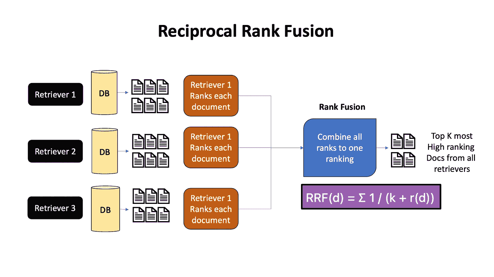

互惠排序融合（Reciprocal Rank Fusion）是一种经典的搜索引擎算法，用于将多个排名算法获得的项排名结合起来（图片来源：作者）

[FLARE 或前瞻性主动检索增强生成](https://arxiv.org/abs/2305.06983)是一种迭代的后检索策略。从用户输入和初始检索结果开始，LLM（大语言模型）迭代地猜测下一句话。然后，我们检查生成的猜测是否包含任何低概率的标记，这些标记在这里用下划线标出——如果有，我们调用检索器从数据集中检索有用的文档并进行必要的修正。

# 最后的思考

如果你想更直观地了解 RAG（检索增强生成）系统的不同组件，欢迎观看我关于这个主题的 Youtube 视频。LLM 和 RAG 的领域正在快速发展——对 RAG 框架的透彻理解对于欣赏每种方法的优缺点以及权衡哪种方法最适合你的用例至关重要。下次你在设计 RAG 系统时，请停下来问问自己这些问题——

+   我的数据来源是什么？

+   我应该如何分块我的数据？我的数据领域中是否有固有的结构？我的数据块是否需要额外的上下文（上下文分块）？

+   我需要语义检索（嵌入）还是更精确的匹配检索（BM-25）？我预期用户会发出什么样的查询？

+   我应该使用什么数据库？我的数据是图形结构吗？它需要元数据过滤吗？我想在数据库上花多少钱？

+   我如何才能最好地重写用户查询，以便轻松找到搜索结果？LLM 能否重写查询？我应该使用 HYDE 吗？如果 LLM 已经具备足够的目标领域知识，我能否使用 Astute？

+   我可以结合多种不同的检索算法，然后进行排名融合吗？（老实说，如果你能在成本和延迟上承受得起，那就做吧）

# 作者

访问我的 Youtube 频道，在那里我发布关于深度学习、机器学习、论文评审、教程以及与 AI 相关的任何内容（除了新闻，因为有太多关于 AI 新闻的 Youtube 频道）。以下是我的一些链接：

**Youtube 频道：** [`www.youtube.com/@avb_fj`](https://www.youtube.com/@avb_fj)

**Patreon：** [`www.patreon.com/c/NeuralBreakdownwithAVB`](https://www.patreon.com/c/NeuralBreakdownwithAVB)

如果你喜欢这篇文章，记得在 Medium 上关注我并点赞！

# 参考文献

向量数据库：[`superlinked.com/vector-db-comparison`](https://superlinked.com/vector-db-comparison)

元数据过滤：[`www.pinecone.io/learn/vector-search-filtering/`](https://www.pinecone.io/learn/vector-search-filtering/)

上下文分块：[`www.anthropic.com/news/contextual-retrieval`](https://www.anthropic.com/news/contextual-retrieval)

命题 / 密集 X 检索：[`arxiv.org/pdf/2312.06648`](https://arxiv.org/pdf/2312.06648)

假设文档嵌入（HYDE）：[`arxiv.org/abs/2212.10496`](https://arxiv.org/abs/2212.10496)

FLARE: [`arxiv.org/abs/2305.06983`](https://arxiv.org/abs/2305.06983)
