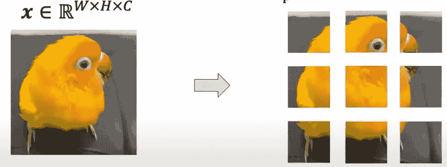

# Vision Transformer 终极指南

> 原文：[`towardsdatascience.com/the-ultimate-guide-to-vision-transformers-0a6df32cb248?source=collection_archive---------8-----------------------#2024-08-30`](https://towardsdatascience.com/the-ultimate-guide-to-vision-transformers-0a6df32cb248?source=collection_archive---------8-----------------------#2024-08-30)

## 《Vision Transformer（ViT）全面指南》，它革新了计算机视觉

 [François Porcher](https://medium.com/@francoisporcher?source=post_page---byline--0a6df32cb248--------------------------------)

·发表于[Towards Data Science](https://towardsdatascience.com/?source=post_page---byline--0a6df32cb248--------------------------------) ·阅读时间：7 分钟·2024 年 8 月 30 日

--

大家好！对于还不认识我的朋友们，我叫 Francois，是 Meta 的研究科学家。我热衷于解释先进的 AI 概念，并使其更加易懂。

今天，我们来深入探讨计算机视觉领域的一项重大贡献：**Vision Transformer（ViT）**。

将图像转换为图块，图像来源：作者

# 先来一点历史背景……

Vision Transformer（ViT）由 Alexey Dosovitskiy 及其团队（Google Brain）在 2021 年提出，相关论文为[《一张图胜过 16×16 个词》](https://arxiv.org/abs/2010.11929)。当时，Transformers 已证明是解锁 NLP 任务卓越性能的关键，且这一模型首次在 2017 年的标志性论文[《Attention is All You Need》](https://arxiv.org/abs/1706.03762)中提出。

在 2017 到 2021 年间，已有多次尝试将注意力机制整合到卷积神经网络（CNN）中。然而，这些大多是混合模型（结合了 CNN 层和注意力层），并且缺乏可扩展性。Google 通过完全去除卷积操作，利用其计算能力来扩展模型，解决了这一问题。

# 这篇文章所回答的百万美元问题是……
