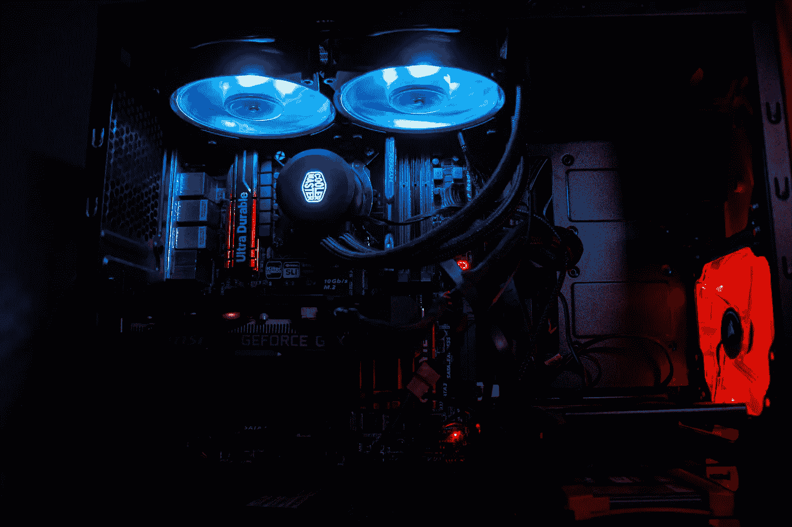

# 《大语言模型量化终极手册》

> 原文：[`towardsdatascience.com/the-ultimate-handbook-for-llm-quantization-88bb7cb0d9d7?source=collection_archive---------1-----------------------#2024-07-10`](https://towardsdatascience.com/the-ultimate-handbook-for-llm-quantization-88bb7cb0d9d7?source=collection_archive---------1-----------------------#2024-07-10)

## 深入探讨大语言模型的量化与技术

 [Ashish Abraham](https://medium.com/@ashishabraham02?source=post_page---byline--88bb7cb0d9d7--------------------------------)

·发表于 [Towards Data Science](https://towardsdatascience.com/?source=post_page---byline--88bb7cb0d9d7--------------------------------) ·15 分钟阅读·2024 年 7 月 10 日

--

图片由 [Siednji Leon](https://unsplash.com/@siednji?utm_source=medium&utm_medium=referral) 提供，来自 [Unsplash](https://unsplash.com/?utm_source=medium&utm_medium=referral)

大语言模型在 CPU 上运行？没错，你没听错。从处理对话到生成自己的图像，人工智能自诞生以来已经走了很长一段路。但这也带来了瓶颈。随着模型的扩展，其计算需求也在增加。人工智能开始严重依赖计算能力。为了满足这些需求，我们转向了 GPU，而其余的就是历史了。

许多设备没有强大的 GPU，因此无法体验人工智能的能力。为了能够在计算能力有限的设备（如手机或仅有 CPU 的电脑）上运行 AI 模型，必须缩小这些模型的规模和功耗。早期的尝试包括剪枝和蒸馏等技术。然而，这些方法在大语言模型面前并不适用，因为大语言模型通常具有大规模的架构。

最近的人工智能革命，特别是大语言模型（LLMs）的发展，或多或少依赖于云服务器进行训练、部署和推理。然而，主要厂商现在正在将大语言模型的能力扩展到边缘设备。微软的 copilot+PC 就是一个很好的例子，值得期待。随着我们朝着边缘部署的方向前进，优化大语言模型的大小变得至关重要，同时又不影响性能或质量。实现这一优化的一个有效方法是通过**量化**技术。
