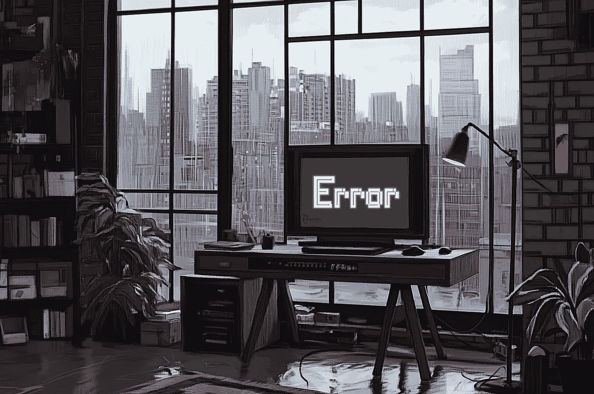

# 有一种正确的犯错方式

> 原文：[`towardsdatascience.com/theres-a-right-way-to-be-wrong-05b5c0ece56c?source=collection_archive---------4-----------------------#2024-09-16`](https://towardsdatascience.com/theres-a-right-way-to-be-wrong-05b5c0ece56c?source=collection_archive---------4-----------------------#2024-09-16)

## 如何通过结合业务背景和错误成本来做出更好的预测

 [Torsten Walbaum](https://medium.com/@twalbaum?source=post_page---byline--05b5c0ece56c--------------------------------)

·发布于 [Towards Data Science](https://towardsdatascience.com/?source=post_page---byline--05b5c0ece56c--------------------------------) ·阅读时长 15 分钟·2024 年 9 月 16 日

--

作者图片（通过 Midjourney）

有一天，我母亲在左眼出现了视力问题，于是去看了医生。医生进行了快速检查，并得出结论认为没有问题；只是随着年龄增长，眼睛逐渐变差了。

不久之后，症状加重，我母亲去进行了第二次诊断。结果发现她患有视网膜脱落，而延误治疗导致了永久性损伤。

人们在工作中经常犯错；你不可能在所有情况下都正确。**但有些错误比其他错误更昂贵，我们需要考虑到这一点。**

如果医生当时说“可能有问题”，并让母亲去做进一步检查，那么即使结果都是阴性，也可能证明什么都没有。然而，在那种情况下，错误的成本只是浪费了一些时间和医疗资源，而不是造成器官的永久性损伤。

医学领域是一个极端的例子，但相同的逻辑也适用于数据科学、业务运营、市场营销或产品等职位：

> ***在做出预测时，我们应该考虑到错误的后果或成本。***
