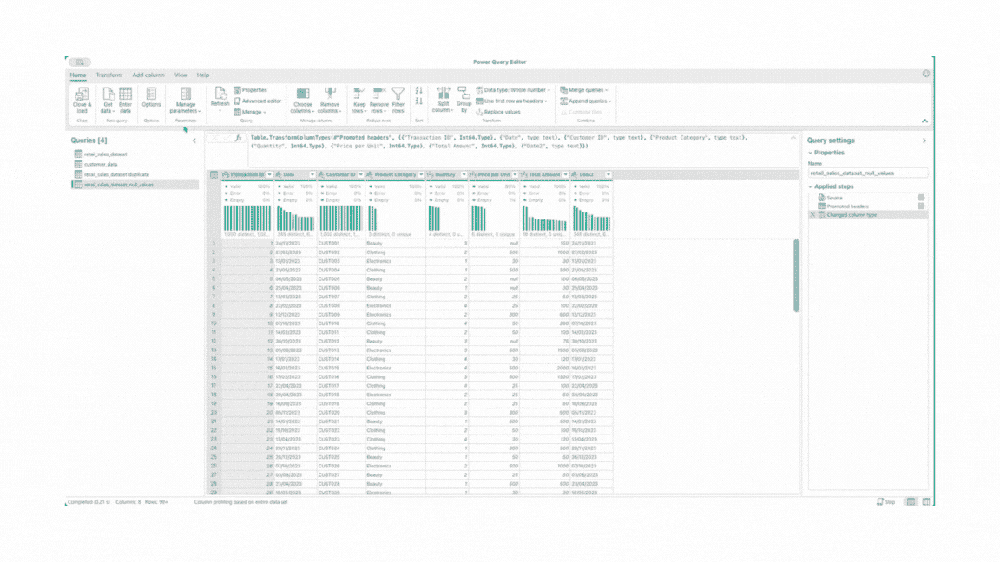

# 以为你了解 Excel 吗？通过 Power Query 将你的分析技能提升到新高度！

> 原文：[`towardsdatascience.com/think-you-know-excel-take-your-analytics-skills-to-the-next-level-with-power-query-930e2267006e?source=collection_archive---------3-----------------------#2024-11-29`](https://towardsdatascience.com/think-you-know-excel-take-your-analytics-skills-to-the-next-level-with-power-query-930e2267006e?source=collection_archive---------3-----------------------#2024-11-29)

## 5 个实用的案例，证明 Power Query 值得深入探索。

[](https://medium.com/@ihetsevi?source=post_page---byline--930e2267006e--------------------------------)[](https://towardsdatascience.com/?source=post_page---byline--930e2267006e--------------------------------) [Ilona Hetsevich](https://medium.com/@ihetsevi?source=post_page---byline--930e2267006e--------------------------------)

·发表于[Towards Data Science](https://towardsdatascience.com/?source=post_page---byline--930e2267006e--------------------------------) ·阅读时长：7 分钟·2024 年 11 月 29 日

--

我有一个 confession：我一直生活在石头下 🪨。不是字面上的意思，但我怎么能解释，直到现在我才发现**Power Query**在 Excel 中存在呢？

想象一下，你意识到那些花费了无数小时整理 VLOOKUP、嵌套 IF 和处理凌乱数据的时间，其实可以通过几个简单的点击来替代。


图片由作者生成

Power Query 能够做 Excel 公式可以做的一切——只是更快、更智能，且更少令人沮丧。从合并数据集到轻松的转换与创建计算列，可能性是无穷无尽的。

网络上已经有大量文章和视频提供了详细的步骤指南，帮助你入门，所以**我不会再写一篇如何操作的教程**。相反，我将分享一些让我大吃一惊的功能，并通过**5 个使用案例**，希望能够激励你亲自探索这个强大的工具。🚀

为了展示其卓越的功能，我将使用一个简单的电子商务数据集，该数据集包含两个 CSV 文件：一个是客户数据，另一个是交易数据。


这些屏幕展示了每个 CSV 文件的前 10 行样本（由作者生成）

# 使用案例 1：合并数据集（VLOOKUP 的更智能替代方案）

当涉及到数据合并时，我们都会使用 VLOOKUP。但让我们面对现实——VLOOKUP 有它的局限性。

**为什么 Power Query 比 VLOOKUP 更好✨：**

+   你可以一步完成从多个列连接数据（无需重复查找）。

+   你的查找列不必在左边——无论它位于何处，都可以正常工作。

+   它支持不同的连接类型（左连接、右连接、全连接、内连接、反连接），让你对数据如何合并有更多的控制。

+   与 VLOOKUP 不同，Power Query 不仅限于通过一个列进行连接。

+   你甚至可以使用模糊匹配来处理带有拼写错误的混乱数据集！

**如何在 Power Query 中合并数据集 🔗**：

1.  在**首页**选项卡中选择**“合并查询”**。

1.  选择你要合并的两个数据集（或文件）。

1.  选择用于连接的列并指定连接类型（例如，左连接保留一个表中的所有行，或者内连接仅匹配重叠的行）。

1.  合并后，选择你想包含在最终数据集中的列。

1.  将转换后的数据加载回 Excel。

几秒钟内完成！⏱️


这个 gif 解释了使用 Power Query 合并两个文件的过程（由作者生成）

# 用例 2：列转换

Power Query 让你非常轻松地转换数据。从快速计算到日期处理和创建区间，它能在几秒钟内完成在 Excel 中可能需要几分钟（甚至更长时间）的工作。

让我通过几个示例来展示给你看。👀

## 执行快速计算 ➕➖➗✖️

假设你需要将价格从美元转换为欧元，并计算销售的总值。在 Power Query 中，你可以：

1.  转到**“转换”**选项卡，在“**标准**”下选择**“乘法”**。

1.  将所有价格乘以 0.95 以转换货币。

1.  添加一个新列，通过将价格乘以数量来计算总销售额。为此，转到**“添加列”**选项卡并选择**“自定义列”**。

所有这些操作只需几次点击即可完成。


这个 gif 解释了使用 Power Query 进行快速计算的过程（由作者生成）

## 轻松修改日期 📅

Power Query 使处理日期变得简单。你可以快速提取月份名称，或者仅显示前三个字母（例如，Jan，Feb，Mar）以获得更简洁的外观，使用的是内置功能。

1.  选择日期格式的列。

1.  转到**“添加列”**选项卡，在**“日期”**下选择**“月份”**，然后选择**“月份名称”**。

1.  选择包含月份名称的新列。在**“提取”**下，选择**“提取前几个字符”**，然后在弹出窗口中指定要提取的字符数（此处为 3）。

无需复杂的公式！


这个 gif 解释了使用 Power Query 修改日期的过程（由作者生成）

## 创建无复杂公式的区间 📥

我不知道你怎么样，但我总是忘记在 Excel 中创建区间的 IF 公式语法，如果有多个区间的话，公式会变得非常长。不过使用 Power Query，就简单多了。

+   **如果你使用的是 Windows**，你可以使用 **“示例列”** 功能。你只需要输入一个区间范围的示例（例如，“41–50”），Power Query 会自动为你填充其余的值，节省你的时间。

+   **对于我们使用 Mac 的人**（像我一样），遗憾的是这个功能不可用。但别担心，还有解决办法！你仍然可以使用 **“条件列”** 功能，通过设置逻辑规则来将数据分类到不同的区间。


这个 GIF 解释了如何使用“条件列”功能创建区间的过程（由作者生成）

# 用例 3：填充缺失数据 🔎

我们都处理过包含缺失值的数据集——无论是因为输入不完整还是数据不一致。在大多数情况下，你不想留下这些空白，而是希望填补这些空缺。这时 Power Query 就显得特别有用。

假设我们在“每单位价格”列中有缺失值，并且我们想要用该类别的平均价格来替换这些缺失值。以下是如何通过几个简单步骤完成的：

1.  筛选“产品类别”列，只显示“美容”条目。

1.  在选中“每单位价格”列后，在屏幕底部的统计部分查看美容类别的平均价格。

1.  移除“产品类别”列上的筛选器，重新显示所有类别。

1.  再次选择“每单位价格”列，转到 **“转换”** 选项卡，点击 **“替换值”**。

1.  在对话框中，输入“null”作为要替换的值，并在“替换为”字段中输入美容类别的平均价格。

就这样，你已经用平均值填充了缺失的数据——只需几个点击。



这个 GIF 解释了如何使用 Power Query 填充缺失值的过程（由作者生成）

# 用例 4：转变数据以进行更好的分析 🛠️

Power Query 非常适合将数据转换成符合分析需求的格式。

例如，如果你想按月汇总总销售额并查看趋势变化，可以使用“**按组分组**”和“**转置**”功能。

下面是只需 4 步即可完成的方法：

1.  选择“月份”列按月对数据进行分组。

1.  在“转换”选项卡中，点击 **“按组分组”**。

1.  为“总价值欧元”添加新的聚合，并选择求和以计算每个月的总销售额。

1.  最后，点击 **“转置”**，将行和列互换，将月份转为列标题。

完成后，将数据加载回 Excel，并创建折线图以可视化销售趋势！


这个 GIF 解释了如何使用“按组分组”和“转置”功能的过程（由作者生成）

# 用例 5：使用 M 公式语言的自定义列 🪄

M 公式语言让你超越典型的 Power Query 转换，允许进行更复杂的计算和逻辑处理。当你需要为数据创建自定义解决方案时，它非常适用。

例如，假设你的销售数据中的月份没有正确排序。你可以使用**M 公式**为每个月分配一个数值，然后按照正确的顺序排序，而不需要手动调整。

1.  转到**“转换”**并选择**“自定义列”**选项。

1.  在弹出窗口中，使用“if-else if”逻辑输入，以为每个月分配一个数值。

1.  按照新列的升序（ASC）进行排序。

1.  排序完成后，你甚至可以删除“月份顺序”列。

完成后，你的月份就会按正确的顺序排列。🏆🏆🏆

```py
if [Month short] = "Jan" then 1
else if [Month short] = "Feb" then 2
else if [Month short] = "Mar" then 3
else if [Month short] = "Apr" then 4
else if [Month short] = "May" then 5
else if [Month short] = "Jun" then 6
else if [Month short] = "Jul" then 7
else if [Month short] = "Aug" then 8
else if [Month short] = "Sep" then 9
else if [Month short] = "Oct" then 10
else if [Month short] = "Nov" then 11
else if [Month short] = "Dec" then 12
else null
```


这个 gif 解释了在 Power Query 中使用 M 公式语言的过程（由作者生成）

# 最后但同样重要的是……

Power Query 会跟踪应用步骤日志中的每个更改 💾，因此，如果你想返回修改或撤销任何操作，超级简单。

## 感到启发了吗？🧙‍♂️

我希望你现在对尝试这些功能的兴奋感和我一样！如果我是你，我会立刻跳进 Power Query。
