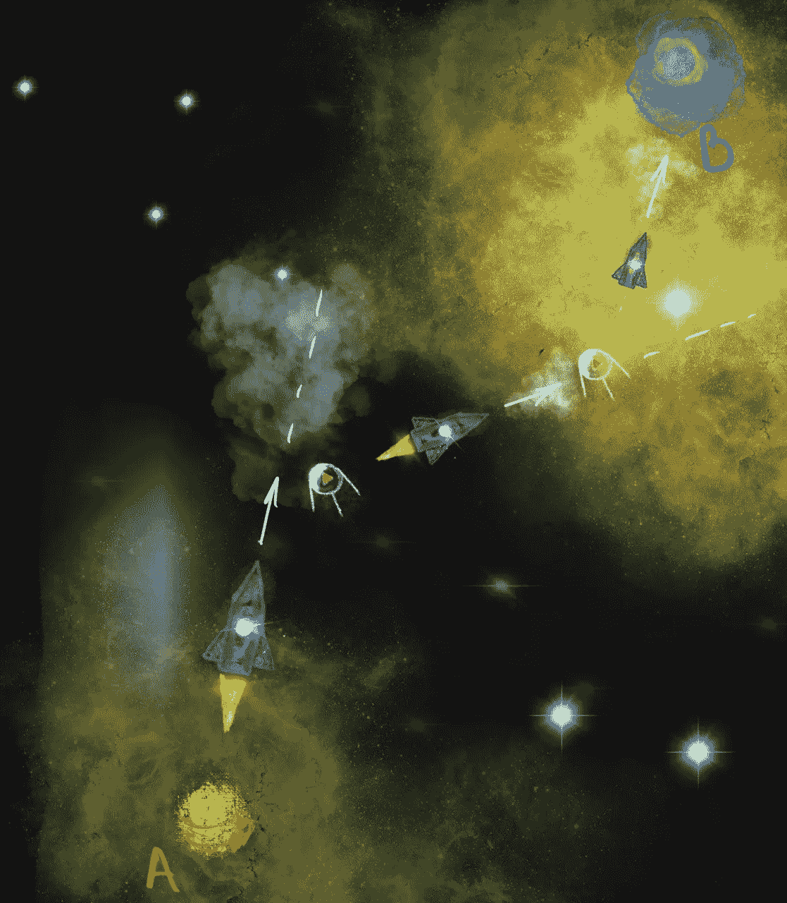
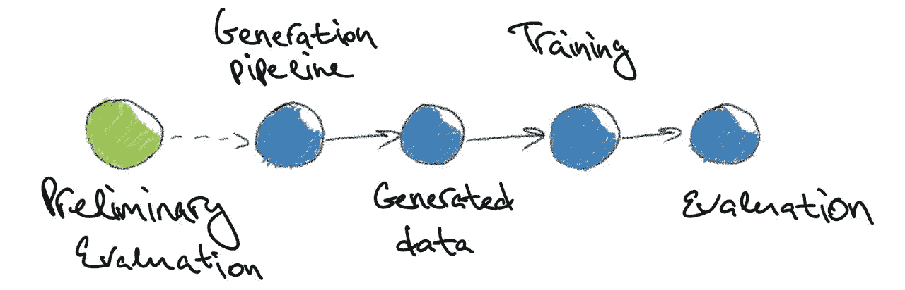
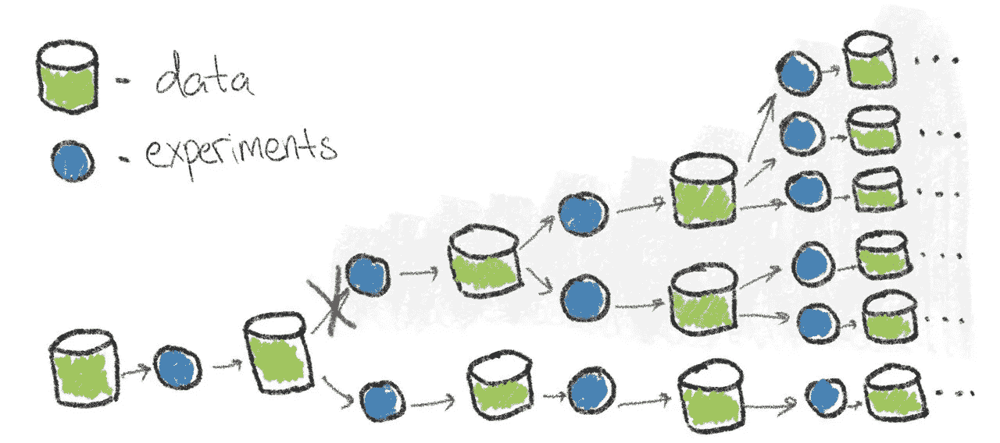

# 关于如何应对研究项目规划的思考与建议

> 原文：[`towardsdatascience.com/thoughts-and-tips-on-navigating-research-project-planning-5fe652386ebb?source=collection_archive---------11-----------------------#2024-07-30`](https://towardsdatascience.com/thoughts-and-tips-on-navigating-research-project-planning-5fe652386ebb?source=collection_archive---------11-----------------------#2024-07-30)

## 管理项目规划中不确定性和约束的个人方法

 [Gleb Kumichev](https://medium.com/@iamglebk?source=post_page---byline--5fe652386ebb--------------------------------)

·发表于 [Towards Data Science](https://towardsdatascience.com/?source=post_page---byline--5fe652386ebb--------------------------------) ·9 分钟阅读·2024 年 7 月 30 日

--

Ensō 圆圈 [作者插图]。

在多个领域参与研发项目超过十年后，我深信成功的研究项目规划是一种艺术。任何单一的规划框架都不太可能满足所有需求。与通常从明确理解目标和方法开始的开发项目不同——“*我知道我想要什么，我知道怎么做*”——研究项目通常以明确的目标开始，但没有定义的方法：“*我知道我想要什么，但我不知道怎么做*”。

研究项目的一个显著特点是所涉及的不确定性。在这篇文章中，我将分享一些关于研究项目规划的实用想法，旨在提供一种视角，使得应对研究中的不确定性变得更加可管理和不那么令人沮丧。

## 贝叶斯航天器

任何项目，本质上，都是从 A 点到 B 点的移动。A 点代表起始点，包含项目的所有先前数据。这包括初步的信念、预期的假设、 promising 的初步实验、相关的文献发现以及其他知识。B 点是期望的项目成果，一组目标，其实现标志着项目成功。从 A 点到 B 点之间的空间充满了不确定性，必须谨慎应对。一个有效的项目规划通过战略性地设置里程碑来应对这种不确定性，以引导路径。每个里程碑不仅要回答特定的研究问题，还要细化我们对项目轨迹的理解。

想象一艘航天器试图找到通往 B 星的路径。它的初始轨迹是在 A 星球上计算得出的，精度是最好的，但不能保证它是正确的。然而，在航程中，航天器可以遇到导航站，帮助调整其轨迹。如果有足够的导航站并且它们正常工作，那么修正轨迹并成功到达 B 星的机会就很大。

明确的中间步骤应该能够修正轨迹 [图片来源：作者]。

合适的里程碑应该像那些导航站一样，我们应该利用项目的“推进器”根据新获得的知识调整其轨迹。缺少里程碑可能导致轨迹偏离正确的目标路径。太多的里程碑可能会让人感到疲惫和浪费时间，而设置不当的里程碑则可能让我们走上错误的道路。

设想一个合成数据生成项目，旨在将一个小型的真实数据集扩展为一个增强的数据集，以便用这个数据集训练模型。一些直接的里程碑可以是：实现合成数据生成管道、生成合成数据集，然后使用这个增强的数据集训练和评估模型。虽然可能会很诱人直接跳到数据生成阶段，但这种做法并不总是明智的，因为它可能会耗费大量时间并且可能得不到有意义的结果。在开始数据生成之前，添加一个关于通过引入来自同一领域或紧密相关领域的真实数据来提高模型性能的初步评估可能会更有利。如果潜在的提升看起来很有前景，那么可以继续进行合成数据的生成。这个里程碑可以揭示数据的增加是否仅仅带来边际改善，并且还可能提供关于哪些数据方面应该优先考虑以最大化效用的见解。最初在这两种项目轨迹之间的选择，可能对项目的成功至关重要。

一个额外的里程碑可能会带来很大的变化 [图片来源：作者]。

设置好的里程碑并非易事，但我发现，在规划过程中保持这种心理图像是有帮助的。它有助于将视角从我们知道可以采取的步骤，转向我们需要采取的步骤，以便获得更多的知识并调整项目的轨迹。

+   经验法则是：不确定性越大，应该设置的里程碑就越多。

+   优先考虑那些最能挑战项目轨迹的里程碑。

+   偏差的初始轨迹是正常的，但我们应该尽最大努力在项目过程中加以修正。

## 计划还是不计划？

长话短说——永远要做计划，但真正的问题是你的计划应该多么详细和深入。没有任何计划的项目更像是一次随机漫步，只有偶然的几率能到达正确的地方。另一方面，计划过于详细往往会显得没有用，因为其中的大部分内容在现实中并不会发生。

我喜欢将规划看作是一种心理上的“光束搜索”：从初步的知识开始，你想象出最可能的结果，针对特定的结果做出分支决策，然后进一步探索这些结果。此时，权衡因素就出现了：你可以让这个光束树尽可能大，扩展你的想象力，但另一方面，你也可以从一个不完整的树开始行动，并在过程中实时更新它。这就产生了规划与执行之间的权衡。规划的时间跨度越长，所带来的不确定性就越多。通常会有过度规划的诱惑，但现实往往更为复杂，很多计划分支很可能会变得过时。

分支可能会早早被切断，因此许多后续的规划变得多余。[图片来源：作者]

我曾经花了大约一个月的时间，精心规划实验，建立了一个庞大的“如果”和“否则”树，创建了模型架构和超参数的评估表格，还列出了额外数据的来源以及在项目中需要测试的各种假设。等到执行时，我在第一步就遇到了一个意外的结果——原来初步的方法不符合推理延迟的约束，我不得不完全重新考虑项目的方案。所有那些详细的规划与现实几乎没有太多关联。

在计划的细节和执行之间找到最佳平衡，与里程碑的概念密切相关。以下是一些可能帮助你构建最佳计划的参考资料：

+   获取实际数据比建立假设性计划更为有效。如果获得数据的资源消耗与建立计划差不多，那么最好先获取数据，并在这个更坚实的基础上制定进一步的计划。

+   你的计划时间跨度越长，不确定性就越大。让计划的细节与阶段成反比是有意义的：较早的步骤应更加详细，而后续步骤的细节则应减少。

+   避免过度规划。虽然过度规划很有诱惑力，但通常更好的做法是拥有一个更为概括的计划，并尽早进行现实检查。

+   对于单一事件来说，分支超过三个通常就太多了。

+   尽量减少搜索空间。

## 估算的“荒野西部”

你是否曾经遇到过这样的情况，*“哦，我/我的团队会在一周内完成这个任务”*，但是之后出现了许多复杂问题，结果最多一个月才完成？你经常遇到这样的情况吗？如果没有，恭喜你！你要么有很强的规划天赋，要么还没有遇到这个问题，可能不需要阅读这一章。

人们容易进行过于乐观的规划，这常常导致时间或预算不足。我们通常会希望最好的情境，但现实往往更为复杂。很多意外情况可能会出现，并影响我们的计划。这是极为常见的，且往往被忽视。我们多少次听到一些大项目，比如电影制作、新地铁站开通或火箭发射，推迟了或预算翻倍？

我想引用《思考，快与慢》一书中的一个例子。丹尼尔·卡尼曼描述了规划决策课程开发的案例。在准备过程中，所有同事都被要求估算完成该课程（规划练习、编写教材等）所需的时间，答案从 1.5 年到 2.5 年不等。然后，他问另一位同事是否记得类似项目及其所需时间。结果发现，对于类似项目，只有大约 40%能够按时完成，而那些能完成的项目，通常需要 7 到 10 年。最终，该项目完成了，耗时 8 年。

我个人曾经频繁遇到这个问题。有一次，在领导一个项目时，我们进入了一个最后阶段，时间越来越紧张。我为这个阶段规划了一个“完美”的情境，旨在适应时间限制并实现项目目标。这个计划的主要弱点是假设一切都会完美无缺。然而，现实中，所有不在直接控制之内的事情都出了问题——一位同事生病了，计算服务器停机了一周，另一位同事需要紧急请假。结果，最初的“完美”计划崩溃了，突显出依赖完美条件并不是一种稳健的做法。

所以我们应该接受这样一个事实：我们通常依赖于乐观的，甚至是理想化的情境，而不是最坏的情况。了解这一点后，我们应该通过这种视角来验证我们的计划。以下是几个需要考虑的要点：

+   如果你能找到类似项目的历史数据，将其作为一个合理的参考。它可能没有你预估的那么理想，但通常会更可靠。

+   问问自己，你的计划有多理想化。这个计划中有多少个事件是仅在完美的情况下才能实现的？这些点越多，它们一起成功的总概率就越低。

+   为突发问题和时间延误留出余地。然后将其乘以一个大于 1 的系数。

+   预计时间会不够用，并且不要为此而惊慌。如果按时完成，可以视为幸运。

## **不要死抠细节**

初步的项目信念可能会被证明是错误的，期望的结果可能看起来无法达到，至少此时是这样。试图在某个时刻完成项目可能变得像是试图骑一匹死马。在项目的某些节点，应该考虑目标转向或甚至项目终止的选项。这始终是一个具有挑战性的任务，因为我们已经投入了时间和资源。我们已经深度参与其中，容易认为下一个想法可能解决问题，一切都会好起来。实际上，这个拯救项目的想法可能永远不会出现，或者可能需要数年时间才能找到（比如持续了十多年的蓝光 LED 开发）。如果你的资源不是无限的（这很可能是事实），应该考虑项目终止或转向的节点。

当然，这又是一个权衡：继续项目，寻找解决方案的机会，还是终止它并将资源投入到一个不同的、可能更有前景的方向。这里最可靠的方法之一是为你的里程碑设定时间限制：如果某个中间结果没有达成，花时间考虑它是单纯的时间估算错误，还是一个更大的问题。一种折衷方法是转向。如果从某个节点开始，项目的主要目标似乎无法实现，可以考虑定义另一个仍然重要且可能在现有成果基础上能实现的目标。

有时过于专注于最初的目标可能会导致对项目中可能出现的其他机会视而不见。因此，始终关注的不仅仅是期望的结果，还要留意所有进来的信号。其中一些信号可能会引导你找到更好的解决方案。

总结一下，关于项目终止和转向，有以下几点建议：

+   为项目的里程碑设定时间限制，并在时限到来时评估不同的视角。

+   对自己和项目的潜力要公正；将终止或转向作为有效的选项考虑。

+   宽容可能的失败。一种好的态度是将其视为在开始时凭借所拥有的知识尽力而为。现在你知道得更多，可以做得更好，更新你的计划并再次尝试。

+   尽量避免对最初项目目标的隧道视野。中间结果可能提供有趣的替代方案。

## **结语**

拥有一个优雅的计划使得想象一切顺利进行变得容易。这是我们常见的乐观偏见之一。很容易开始相信一切都已考虑周全，并且会像精密机器一样运作。然而，尽管这个计划清晰可见，所有意外的情况却是看不见的，几乎不可能预见到。它们很可能会影响项目，因此要为此做好准备。将这些意外的挑战视为过程的一部分，而不是干扰。这样的心态允许灵活性、适应性和持续改进。

拥抱计划不完美之美，就像书法家们对待圆圈般的“圆相”（ensō）。这些圆圈以不完全的形式象征着对缺陷的接受。然而，与传统的未完成“圆相”不同，您可以随时重新审视您的计划。将您的计划视为一个灵活的指南，它会根据新的经验和数据不断调整，为前进铺平道路。
