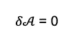
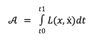
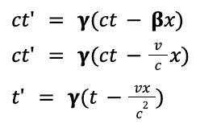
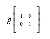

# 物理学中的三个令人震惊的想法：静止作用原理、洛伦兹变换和度量张量

> 原文：[`towardsdatascience.com/three-mind-blowing-ideas-in-physics-the-stationary-action-principle-lorentz-transformations-and-e86977ea86ad?source=collection_archive---------2-----------------------#2024-07-23`](https://towardsdatascience.com/three-mind-blowing-ideas-in-physics-the-stationary-action-principle-lorentz-transformations-and-e86977ea86ad?source=collection_archive---------2-----------------------#2024-07-23)

## *数学创新如何产生越来越精确的物理世界模型*

 [Angjelin Hila](https://angjelinhila.medium.com/?source=post_page---byline--e86977ea86ad--------------------------------)

·发表于[Towards Data Science](https://towardsdatascience.com/?source=post_page---byline--e86977ea86ad--------------------------------) ·阅读时间：25 分钟·2024 年 7 月 23 日

--

代数和几何作为建模工具之间的相互关系。使用自由许可。来源：[`unsplash.com/photos/a-black-and-white-photo-of-a-bunch-of-round-objects-Vy3W_YiXEio`](https://unsplash.com/photos/a-black-and-white-photo-of-a-bunch-of-round-objects-Vy3W_YiXEio)

虽然物理学激发了大众的好奇心，但许多人觉得数学令人望而却步。然而，物理学中的许多核心思想都来源于一些简单的原理，这些原理经过调整和修改，逐渐发展成更为复杂的形式，从而更好地映射物理现象。

虽然许多物理学毕业生最终从事数据科学工作，但物理学中的数学洞察能否为数据科学家提供启示并丰富他们的工作？我认为可以。尽管数据科学作为一个独立学科相对较新，但数据的收集与分析在物理学史上有着深远的影响，例如约翰内斯·开普勒收集的天文观测数据，基于这些数据他推导出了行星运动定律。物理学和数据科学都从数据中提取模式，尽管通常数据科学处理的是统计模式，而物理学则处理的是规律性或法则性模式。理解基本法则可以帮助数据科学家建模复杂系统，并开发现实世界现象的模拟。

在我自己的研究中，保持对物理学的浓厚兴趣帮助我在信息理论和统计力学之间建立了重要的联系。此外，它帮助我理解了数学的灵活性，特别是线性代数和微积分，在模拟受空间维度限制的物理系统以及包含社会和随机模式的更抽象多维系统中的应用。而且，理解物理学如何建模我们周围的世界，以及物理学的逐步进展如何要求塑造数学以适应和预测自然提供的数据，既可以激发灵感，也能带来智力上的满足。

在这篇文章中，我将穿越三个支撑物理学的数学思想：静力学原理（也称为最小作用原理）、洛伦兹变换，它描述了爱因斯坦狭义相对论中的时间和空间变换，以及度量张量，它是广义相对论（作为时空曲率的引力理论）数学的基础。

静力学原理或许是所有物理学中最重要的原理，因为它贯穿了经典力学和量子力学。它为牛顿发明的经典运动方程提供了一种等效的替代形式，用以描述物理系统的演变。具体来说，它通过确定最小化某个称为*作用*的量的路径，来描述物理系统随时间的运动。作用是一个泛函，即一个将函数作为输入的函数，它描述了系统在两个点之间路径变化时的静止状态。理解作用作为一个泛函，特别是作为对路径变化的评分，对于理解其背后的概念至关重要。下面的阐述将使这一点更加清晰。这个非凡的结果将运动表述为在给定约束下的一种优化函数。

洛伦兹变换描述了时间和空间的坐标如何交织成一个统一的度量，使得在惯性参考系中的观察者可以相对地改变它们的测量，同时保持光速不变。这一形式主义确保了光速在各个参考系中保持恒定，反对牛顿假设，即光速会根据不变的空间和时间单位发生变化。在狭义相对论理论之前，光速的恒定是一个实验观察现象，无法融入经典物理的框架。

最后，我们解释度量张量背后的数学思想，它描述了弯曲空间中的长度或距离。度量张量是一个双线性、对称的单位矩阵，它将底层平坦的欧几里得空间中的勾股定理推广到任何可能的空间，包括弯曲的曲面。爱因斯坦使用弯曲的曲面来描述在重力存在下时空的扭曲。作为数据科学家，你们可能对欧几里得距离和线性代数非常熟悉，因此理解度量张量背后的概念应该是一个自然而然的步骤。由伯恩哈德·黎曼（Bernhard Riemann）发展出的度量张量构成了非欧几里得几何的基础，并显著地将*长度*的概念推广到任何底层几何。

# 最小作用量原理

*最小作用量原理*或*定常作用量原理*是物理学的核心内容。它包含了运动方程，并在数学上阐述了物理系统随时间变化的过渡规则。

要开始理解这一原理，可以回顾牛顿的第二定律，它通过三个输入来计算一个粒子系统的轨迹：粒子的质量、作用于系统的力以及初始位置和速度，并通过 F=ma 来确定演化规则，其中 *m* 表示质量，*a* 表示加速度。与牛顿方法不同，最小作用量原理通过输入初始和最终位置、质量和速度（以及系统可能有的其他约束）来计算系统的轨迹，但省略了力。它随后选择最小化一种叫做*作用*的量的路径。在我们解释作用到底由什么组成之前，我们需要理解一个替代牛顿方程的表述方法，叫做*拉格朗日量*。

**拉格朗日量 *L*** 是动能 ***T*** 和势能 ***V*** 之差，其中 ***T*** 由质量和速度平方的乘积除以 2（2 表示初速度和末速度的平均值）给出，***V*** 则由物体的质量 ***m***、重力常数 ***g*** 和物体离地面高度 ***h*** 的乘积给出（势能的计算依据系统而异）。

为什么拉格朗日量是动能和势能之差呢？因为随着系统的运动，它将势能转化为动能，动能与势能之间的差值捕捉了这两种能量形式之间的动态相互作用。需要注意的是，总能量是这两者之和。

拉格朗日量的输入是位置 x 和速度 v，用⨰（x 点）表示，其中点表示一阶导数。这是因为速度是位置的一阶导数。

为了计算拉格朗日量，我们至少需要知道粒子的速度、广义坐标、位置和质量。势能依赖于粒子的位置（或一组粒子的位置），因为它描述了粒子能够做的潜在功，而动能则依赖于粒子的速度，因为它描述了粒子的运动。

*作用*如何参与其中呢？假设你有平面上的两个点，需要找到最短的距离。两个点之间有许多路径，但只有一条路径或线代表最短的距离。作用类似于这个问题。为了找到系统的轨迹，我们需要选择一条最小化作用的路径。由此推论，作用在系统演化过程中保持静止。

由于作用必须是 stationary 的，作用的一级偏导数因此必须为零：

从高层次来看，***作用***是通过拉格朗日量在给定时间区间[t₀, t₁]上的路径积分来描述的。尽管从 t₀到 t₁的函数积分通常被理解为曲线下的面积，但拉格朗日量的路径积分不应直观地看作是面积，而应当看作是一个泛函的积分，泛函是一个接受另一个函数（或多个函数）作为输入并输出一个标量的函数。输入将是拉格朗日量，输出则定义了作用。在系统在 t₀和 t₁之间可能采取的多个路径中，我们会看到它恰好选择了最小化作用的路径。

这是作为拉格朗日量路径积分的作用的简单公式：

现在，由于定积分可以作为*Riemann 和积分*的[Riemann 和](https://en.wikipedia.org/wiki/Riemann_sum)来计算，其中包含*f(x)*的 y 值和变化量 x，表示为*Δx*，当 k 的区域划分趋近于无穷大时，我们可以将*作用*计算为拉格朗日量与时间导数*dt*的乘积的 Riemann 和。换句话说，拉格朗日量的定积分可以通过在时间区间内最小化作用来计算。

作用由拉格朗日量在系统的初始位置和终止位置之间的路径积分组成。这意味着路径积分通过计算势能和动能之间的差异来最小化作用。微积分的基本定理使我们能够在 t₀和 t₁之间的连续区间计算作用，尽管它也可以在离散的时间步骤*N*中进行计算。现在，如果我们将作用想象为离散时间步骤*N*的总和，我们将其计算为拉格朗日量在每个时间步骤下的值与时间 t 值的乘积之和。

拉格朗日量通常依赖于位置和速度，但也可以依赖于时间。如果拉格朗日量随时间变化，即使位置和速度保持不变，我们也说拉格朗日量是时间依赖的。否则，拉格朗日量通过位置和速度的变化隐式依赖于时间。对于时间独立的形式，我们将 L(x,⨰ )代入方程中，表示它依赖于位置和速度：

现在，我们从***动量守恒定律***知道，系统所有动量的总和的导数等于零。换句话说，在一个孤立系统中，总动量始终是守恒的或保持不变的。常数的导数为零，因为变化率保持*其他条件不变*或相等。在牛顿力学中，运动的第三定律指出，*每一个作用力都有一个大小相等方向相反的反作用力*，这表达了总动量守恒。

类似地，***能量守恒定律***认为，一个孤立系统的总能量在任何转化过程中都是守恒的：总能量的时间导数为零。然而，与动量不同，能量有不同的形式。正是这些形式的总和才是守恒的。如果从运动的角度来表述，这些能量形式就是我们一直在谈论的：*动能*和*势能*。

由于拉格朗日量被定义为这两种能量形式的差，当拉格朗日量在时间平移下不变时，意味着能量守恒。

与能量守恒类似，作用量也有类似的守恒现象。在签名轨迹中，自然选择了最小化作用量的路径。这种最小化类似于优化问题中函数的最小化，只是作用量代表了包括每个时刻的所有坐标在内的多种变量。这种极值性质通过欧拉-拉格朗日方程来表达，该方程构成了运动方程。

欧拉-拉格朗日方程是什么？它们是告诉系统如何从一个时刻移动到下一个时刻的微分方程。现在，我不会在这里推导这些方程，但直观上我们会将作用量**𝝏A**关于位置**dx**的导数设为零。*换句话说，我们考虑路径的一个小变动，并要求作用量的偏导数为零。*

这导出了欧拉-拉格朗日方程的两项：拉格朗日量关于速度的偏导数的时间导数，以及拉格朗日量关于位置的偏导数。这两者分别表示动能（动量的变化）和势能的变化。将这两者之差设为零，得到作用量最小化的欧拉-拉格朗日方程。

单一坐标或自由度下的欧拉-拉格朗日方程如下所示，其中 L 表示拉格朗日量，ẋ 代表速度，x 代表位置。

用自然语言来表达，就是拉格朗日量关于速度的偏导数（𝝏L/𝝏ẋ）对时间的导数（**d/dt**）减去拉格朗日量关于位置的偏导数（𝝏L/𝝏x）等于零。直观地讲，这可以重新表述为，拉格朗日量关于速度的瞬时变化率对时间的瞬时变化率减去拉格朗日量关于位置的瞬时变化率为零，即处于稳态。

进一步提炼，*欧拉-拉格朗日方程意味着物理系统的运动对应于拉格朗日量积分的极值，这个积分即是作用量*。

该方程可以推广到任意坐标（x, y, z…n）：

在具体情境中，作用量是一个泛函，也就是说，它是一个函数的函数，涉及从一个函数输入（拉格朗日量）到一个标量输出（作用量值）的映射。

尽管稳态作用原理能够有效计算物理系统的轨迹，但它需要知道起始位置和结束位置。为了弥补这一全局视角的不足，我们采用牛顿形式的公式，它要求知道粒子的初始位置和初速度。

**稳态作用原理**可以适应量子物理学，但需要重要的附带条件，在这种情况下，考虑从初始状态到最终状态之间的所有可能路径，作用量是每条路径的概率振幅的总和，用于计算系统的概率演化。

根据这个公式，经典的稳态作用原理可以被看作是量子公式的一个特例，在这种情况下，所有路径中稳态作用路径占主导地位。

# 洛伦兹变换

理解***洛伦兹变换***是进入爱因斯坦**相对论的特殊理论**的门户。洛伦兹变换构成了计算惯性参考系或均匀参考系中相对论性时空变换的数学框架，也就是说，这些参考系排除了引力影响。

狭义相对论的核心概念是，运动只能相对于某个参考系来描述，而不能以绝对的方式描述。例如，如果我在开车，我相对于汽车是静止的，但相对于我的房子是运动的。

相对论运动的概念存在于经典力学中，最早由伽利略描述。

狭义相对论中的突破性见解不是相对论运动，而是跨空间平移保持不变或恒定的东西。在经典力学中，所有运动都是相对的，而空间和时间的坐标仅在加法的方式下变化，并且对所有观察者来说始终静止且彼此独立。

经典力学中的相对运动假设意味着光的运动应遵循相对论规律。换句话说，如果我静止不动并拿着手电筒，而你在开车并拿着手电筒，那么你手电筒中的光的运动应该被测量为光速与你的速度之和。

然而，实验证据与这一假设相矛盾。实际上，无论参考系如何，光速始终保持不变。换句话说，实证证据证明了光速是绝对的。

爱因斯坦没有指出观察中的错误，而是提出光速的恒定性是自然法则。如果光速总是相同的，那么必须改变的是空间和时间坐标的表示方式。

为了理解爱因斯坦的狭义相对论如何实现这一点，重要的是要对经典力学中描述的简化运动方程有一个粗略的了解。这些方程将被修改，以便观察者之间的相对运动不会改变光速，而是改变空间和时间的交织度量。这有一个特殊的后果，即当速度接近光速限制时，时间和距离的度量会因观察者而异。

运动方程通常简化为首字母缩略词 SUVAT（s = 距离，u = 初速度，v = 速度，a = 加速度，t = 时间）：

## 闵可夫斯基度量

为了使洛伦兹变换易于理解，我们将使用时空图。这些图将距离和时间的轴反转，使时间表示为 x 轴，距离表示为 y 轴。此外，我们使用 y 轴来表示较大的距离间隔，因为我们希望解释相对于光速的运动。现在，光速为 3 *10⁸ m/s²。在我们的时空图中，一秒钟将正好对应于这个距离。这意味着，位于我们轴之间 45°角的图中的直线对角线，代表光速随时间的恒定性。事实上，笛卡尔网格中的对角线将代表光速的渐近极限，这将约束我们在 y 轴上的时间平移和在 x 轴上的空间平移。

创意共享许可使用，来源于：[`en.wikipedia.org/wiki/Spacetime_diagram#/media/File:MinkBoost2.gif`](https://en.wikipedia.org/wiki/Spacetime_diagram#/media/File:MinkBoost2.gif)

现在，任何与我们笛卡尔网格对角的直线，只要不是与 45°角成直角，就代表以亚光速进行的均匀运动。在牛顿图像中，光速就像任何其他速度一样。这意味着，大于 45°的钝角将代表超光速。此外，光速将相对于参考系而变化。如果我以光速的一半与光以相同的方向旅行，从我的参考系来看，我会观察到光速为光速的一半，因为我正以一半的速度追赶它。这个模型的假设基于保持不变的时间和距离单位，以确保所有参考系中的时间和空间间隔保持恒定。

从将空间和时间视为独立度量，到将它们整合为一个被称为时空的连续体，涉及将时间变量转化为距离的度量。我们通过用 c（光速常数）加权时间变量来实现这一点。当我们将**c**与**t**相乘时，我们得到**ct**，它度量的是**1 光米/c²**。

在牛顿-伽利略图像中，两个参考系 S 和 S'分别由坐标**(x, t)**和**(x', t')**给出，其中撇号符号，读作*x prime*和*t prime*，用来区分两个相对的参考系（*并不表示通常意义上的微分*）。这些参考系是可逆的，并且在伽利略相对论中，它们的逆是等价的。从参考系 S 的框架来看，S'的坐标，即位置和时间分别由 x' = (x-vt) 和 t' = (t-vx/c²)给出。同样地，从参考系 S'的框架来看，S 的坐标由 x = (x' + vt') 和 t = (t + vx/c²)给出。然而，这些转换最终使得光是相对的，而不是时空的。问题出现了，如何从 S → S'进行转换，以便我们能够保持 c（光速）不变，同时按比例缩放时间和距离变量（更准确地说，是时空连续体）？

推导这些变换的一种方法是利用我们上面引入的时空图，其中我们通过常数 c ≈ 299 x 10⁸来缩放时间。我们要寻找的转换表示为以下公式：

实际上，我们将利用参考系之间的这种对称性或等价性来推导 gamma 因子，作为时空在相对参考系之间翻译的共同缩放因子，使它们反映光速不变性。下面的图表展示了我们引入的两个参考系作为彼此的逆，表达了相对运动的伽利略对称性：

参考系之间的可逆对称性。图片由作者提供。

由于光速在所有参考系中是常数，如果我们从原点出发为两个参考系（x = 0 和 t = 0），光的路径将满足以下方程（回想一下，45°的对角线表示光速，其中一个时间单位对应一个距离单位的传播距离）：

从 x 到 x'的转换由以下方程给出，其中 x'只是 x 与速度和时间的乘积之间的差。现在，为了推导洛伦兹变换，我们需要某个因子𝛄来缩放我们的时空变换。𝛃因子等于**v/c** —— 速度与光速的比率 —— 用于缩放**ct** ——光速缩放时间。如果我们展开这个表达式，我们会发现它在代数上简化为括号中的牛顿变换。正如我们将看到的，当洛伦兹因子𝛄接近 1 时，洛伦兹变换变得与牛顿变换等效，这与我们日常对事件同时性的概念相对应。以下公式展示了我们如何从初始公式得到相对位置的 gamma 缩放变换公式：

类似地，我们可以通过下面的方程推导从 t 参考系到 t' 的时间变换。由于我们使用的是时空图，我们从 ct' 开始。我们可以看到，ct' 可以通过 ct 与 beta 𝛃 乘以 x 之差来计算，并且整个表达式通过洛伦兹因子 𝛄 缩放。我们可以通过代数运算扩展表达式，最终将 t' 的解简化为 t - vx/c²，乘以 𝛄：

当速度非常小时，vx/c² 会趋近于 0，𝛄 会趋近于 1，从而得到 t' = t。这个结果对应于我们日常的牛顿经验，其中在我静止时的 1 秒与你以恒定速度相对我运动时的秒数大致相等。

正如你可能已经注意到的，x' 的变换涉及到 ct 作为一个项，而 t' 的变换则涉及到 x 作为一个项。通过在彼此的参考系变换中考虑这些项，时间和空间就交织成一个相互依赖的连续体，其中一个变量的单位变化对应着另一个变量的单位变化。这种相互关系将解释洛伦兹变换所描述的时间膨胀和空间收缩的比例性。

我们如何确定洛伦兹因子的值？一种方法是将我们的平移方程相乘，并解出共同因子。记住，由于我们之前引入的相等式，我们可以将 x 和 x' 分别替换为 ct 和 ct'。这样我们就可以约去相同的项，并解出 𝛄：

现在我们可以通过以下 𝛄 替代来表达 x' 参考系：

并且可以通过以下替代来表达 t' 参考系：

在每个方程中，当速度 *v* 接近光速时，v²/c² 会接近 1，分母的值会接近 √0。我们从 E=mc² 知道，具有静质量的物体无法根据物理原理被加速到接近光速。因此，分母的值不可能为 0。*0 限制代表无限快速度（表示变换的角度）。当快速度接近无限时，时间趋近于静止，长度的测量趋近于零。*

另一方面，当速度较小时，v²/c² 是一个非常小的数，分母的值接近 1。当分母（称为**洛伦兹因子**）等于 1 或接近 1 时，洛伦兹因子变得不再重要，方程式就近似于牛顿运动。也就是说，运动方程由分子给出，简化为牛顿的运动方程。

洛伦兹因子是理解洛伦兹变换的关键。如果你回想一下伽利略相对论，惯性参考系的互换是通过旋转实现的。旋转由三角函数描述。三角函数保持欧几里得距离。具体来说，旋转保持半径不变。这意味着长度单位在变换中保持不变。

类比地，洛伦兹变换保持时空度量。与欧几里得度量不同，时空度量使所有时空变换相对于光速作为绝对值。因此，光速形成了洛伦兹变换可以接近但无法相等的渐近线。在时空图中，光速由等式**x = ct**和**x’ = ct’**表示。如果你回想一下我们的时空图，渐近线由对角线切穿两个轴组成。由于时空变换的范围都是无限的（意味着它们输出从˗ ∞到+ ∞的范围），但又渐近于我们的对角线，它们由***双曲函数或旋转***描述。双曲旋转是类似于三角函数但使用双曲线而不是圆的函数。与有限的圆不同，双曲旋转可以延伸到无限范围。它们对三角函数的等价物可以描述为对特殊数**e**（2.718）的指数运算，其中 sin(x)的类比由**sinh(x)**表示，cos(x)的类比由**cosh(x)**表示，分别由以下函数描述：

就像在单位圆中（sin x，cos x）描述其点一样，（cosh x，sinh x）形成单位双曲线的右半部分。在特殊相对论背景下，双曲旋转的角度称为**快度**，用符号**eta 𝜂**表示。以下是我们之前推导的洛伦兹变换的双曲旋转等价物：

洛伦兹因子𝛄与双曲旋转的快度之间的关系如下：

如果伽利略旋转保持半径或欧几里得距离，那么洛伦兹变换保持什么？它们保持闵可夫斯基度规，由以下等式给出，类似于欧几里得距离：

由于实际的洛伦兹变换发生在四维空间中，1 个时间维和 4 个空间维或类比为 4 个时空维度，四维闵可夫斯基间隔由以下方程给出：

下图 gif 可视化了这些双曲变换，作为在二维中表现出时空扭曲，随着速度接近光速，逐渐接近对角线渐近线。网格上的扭曲表示由于观察者之间的相对速度而导致的**时空度量**的扭曲。随着速度接近光速极限，空间（*水平轴双曲线*）收缩，时间（*垂直轴双曲线*）膨胀。这些交织的变换保持了闵可夫斯基度量**s²**，该度量按比例缩放这些变换，以保持光速的不变性。

双曲洛伦兹变换。图片使用了创作共用许可证。来源：[`en.wikipedia.org/wiki/File:Animated_Lorentz_Transformation.gif`](https://en.wikipedia.org/wiki/File:Animated_Lorentz_Transformation.gif)

空间收缩和时间膨胀可以在静止观察者和以均匀或惯性速度运动的观察者之间反转。如果你以接近光速的速度均匀运动，相对于某个静止的人，描述你为静止并且描述另一个人为接近光速运动是同样正确的。

# 度量张量：曲面几何学

狭义相对论中的洛伦兹变换发生在**平坦空间**伪欧几里得空间中。什么是平坦空间？它是一个几何空间，其中***度量***，或点之间的距离度量，是恒定的。平坦空间中最著名的度量是由**毕达哥拉斯定理**定义的。另一个平坦度量包括我们之前讨论的闵可夫斯基时空度量。

欧几里得度量定义了两个点之间的距离为直角三角形最短边的平方和的平方根。这遵循毕达哥拉斯定理：a² + b² = c²。

从几何角度描述，两个点之间的欧几里得距离由每个坐标（x，y）之间差值的平方和的平方根给出。

作为向量的大小的欧几里得距离。

毕达哥拉斯定理可以推广到*n*维空间：

n 维空间中的欧几里得距离。

因此，我们可以通过以下公式表达三维空间中的欧几里得距离：

三维空间中的欧几里得距离。

然而，这种泛化保持了作为欧几里得平坦空间的属性的距离不变。换句话说，度量保持不变。

为了理解*度量张量*，我们需要学会将毕达哥拉斯定理视为平坦或欧几里得空间的特例。

换句话说，我们需要定义一个值中立的空间，以便可以将由毕达哥拉斯定理定义的欧几里得距离作为一种特殊情况导出。

在我们做这件事之前，我们必须问，为什么坐标之间的差异在毕达哥拉斯定理中要被平方？这个问题可以用多种方式来解释，但直观的解释是几何的。它们之所以被平方，是因为它产生了等长的几何面积，考虑到面积是长度和宽度的乘积，这让我们能够计算斜边长度，它是直角边平方和的平方根。这个答案由克罗内克 delta 定义的度量张量给出，当 i=j 时输出 1，当 i≠j 时输出 0。

然而，我们也可以通过空间的广义度量来演示这个结果，其中度量张量由在切空间上的平滑变化的内积组成。

*什么是切空间？* 切空间是流形上某一点的所有切向量的集合。

方程的一般形式如下，其中 g 表示度量张量，μv 表示每个坐标项的度量张量值的索引，dX 表示每个坐标的无穷小位移：

给定上述方程，我们可以将两点之间的平方距离在二维空间中表示为以下和：

由度量张量推广的两点之间的平方距离。

在上述公式中，*g 系数*旁边的零和一以及 x 变量表示索引。具体来说，它们表示 0 和 1 的置换矩阵，即：01、00、11、10。

dx⁰ 和 dx¹ 系数表示两个不同坐标的无穷小位移，其中 0 和 1 依然是索引。每个坐标的位移与对应的**g**，即度量张量的值相乘。

因此，在上述公式中，**g** 表示每个索引的度量张量系数。为什么上述公式中有四个项？因为两个点由四个坐标或标量值描述。在欧几里得几何中，隐含的基向量是切向量 (0,1) 和 (1,0)。这些切向量跨越了整个欧几里得空间。现在，**g** 定义了任何点上切向量之间的内积。而 **g** 的值是通过所有基向量可能组合的内积获得的。

当系数的值表示两个点之间的正交归一关系时，**g** 的值将简化为单位矩阵：

当三角形的角度是直角时，度量张量的系数定义了平坦的欧几里得空间。

你可以将度量张量系数看作是与置换矩阵的索引对应的。

在二维或两个坐标的系统中，我们可以将欧几里得距离表示为度量张量与每个坐标之间距离的平方向量的乘积。因为在平坦的欧几里得空间中，直角的度量张量是单位矩阵，所以两个点之间的平方距离简化为下面显示的勾股定理：

上述公式也可以表示为我们第一次公式中的线性加权组合：

欧几里得距离作为带有 g 值的线性加权和。

如上所示，当 g=0 时，我们去掉后两个项，将方程简化为欧几里得距离。因此，我们已经解释了度量张量的广义形式如何将欧几里得距离作为一个特殊或极限情况。

那么当最短距离不能通过欧几里得距离来表示时该怎么办呢？在我们的日常直觉中，我们假设存在直角，使得对边和邻边的长度能够满足勾股定理作为斜边的距离度量。在线性代数中，这等同于假设正交标准基为空间的度量。基定义为一组线性无关的向量，这些向量张成该向量空间。正交标准基是垂直的单位向量，或者是内积为零的单位向量。

但是，这种*a priori 假设*在经验上可能没有依据。事实上，底层的几何可能在不同的方式下是弯曲或倾斜的。如果是这样，我们该如何表达两点之间的最短距离呢？为了定义非欧几里得空间，我们为我们的度量选择不同的基向量。那些基向量的置换空间的内积将输出定义该度量中距离和角度的度量张量，通过对两个点的任何微小位移的线性组合，给出如下公式：

广义黎曼距离。

现在，让我们来看一个极坐标（r, 𝜃）的例子，其中 r 表示半径，𝜃 表示角度。g 度量张量通过(r, 𝜃)的置换空间的内积获得，如下所示：

极坐标下的度量张量。

如果我们考虑欧几里得极坐标，度量张量将变为如下矩阵：

极坐标下度量张量的特定实例化。

这是因为距离是通过以下方式计算的：

现在，两个点(r¹𝜃¹)和(r²𝜃²)之间的距离通过计算 r²-r¹ 和 𝜃²-𝜃¹ 之间的距离，并将其代入以下公式：

到目前为止，我们所有的例子都在二维空间中。当然，我们可以将相同的概念扩展到三维或 N 维空间。三维空间的度量张量将是一个 3x3 矩阵，以此类推。

理解度量张量是理解广义相对论和爱因斯坦场方程的一个重要步骤。

在广义相对论中，爱因斯坦的场方程利用度量张量来描述时空的弯曲几何。

具体来说，爱因斯坦的场方程使用了三个张量：1）爱因斯坦张量 G，描述时空的曲率，来自度量张量的导数；2）能量-应力张量 T，描述宇宙中物质和能量的分布；3）度量张量 g，定义了弯曲几何中的长度和角度的度量。爱因斯坦的场方程通常通过以下方程总结：

在广义相对论中，度量张量由一个 4x4 矩阵组成，包含 16 个分量。就像我们在二维例子中一样，度量张量由所有维度的排列空间组成，在这种情况下，3 个空间维度和 1 个时间维度组合成 4 个时空维度。然而，由于矩阵必须是对称的，因此其中只有 10 个分量是彼此独立的。

度量张量的通用形式如下所示：

度量张量的值随着时空的弯曲而变化，因为它们编码了质量-能量分布。因此，与欧几里得距离在所有变换中保持长度不同，弯曲几何并非如此。这就是为什么度量张量是理解广义相对论的一个关键方面。

现在你已经浏览过这些概念，可能对物理中的复杂思想和数学形式主义不再感到畏惧！

# 资料来源

苏斯金德，莱昂纳德，和乔治·赫拉博夫斯基。*理论最低要求：开始做物理所需了解的知识*。基本书籍，2014 年。

苏斯金德，莱昂纳德，和阿特·弗里德曼。*狭义相对论与经典场论：理论最低要求*。企鹅出版社，2018 年。

苏斯金德，莱昂纳德，和阿特·弗里德曼。*量子力学：理论最低要求*。企鹅出版社，2015 年。

苏斯金德，莱昂纳德，和安德烈·弗朗索瓦·卡班内斯。*广义相对论：理论最低要求*。基本书籍，2023 年。

*沃尔夫勒姆演示项目*。理解狭义相对论：洛伦兹变换、时间膨胀和长度收缩。（无日期）。[`demonstrations.wolfram.com/UnderstandingSpecialRelativityTheLorentzTransformationTimeDi/`](https://demonstrations.wolfram.com/UnderstandingSpecialRelativityTheLorentzTransformationTimeDi/)
