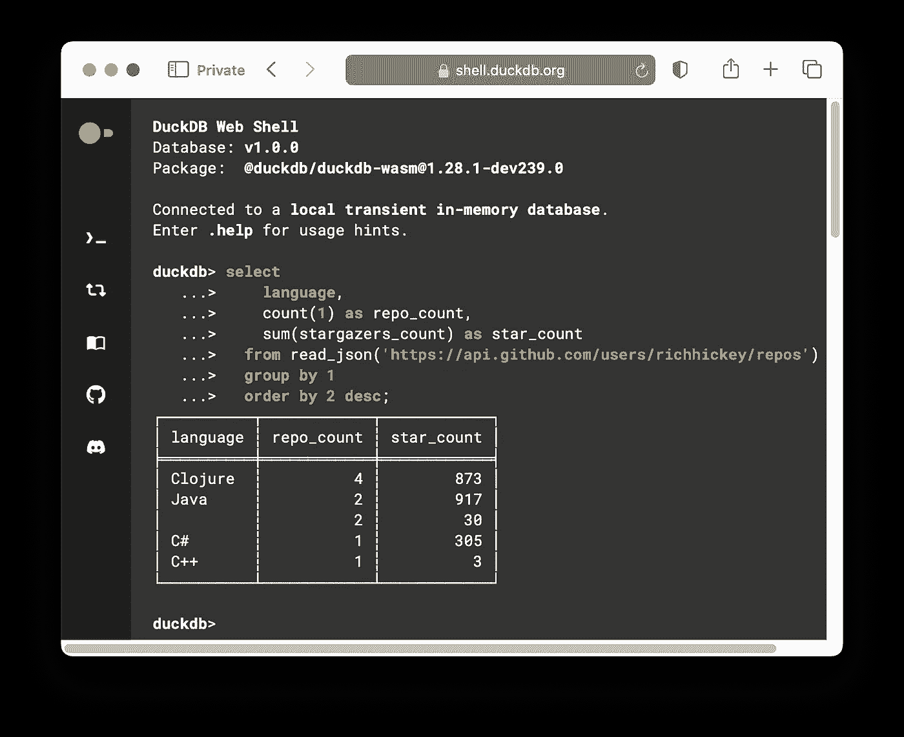
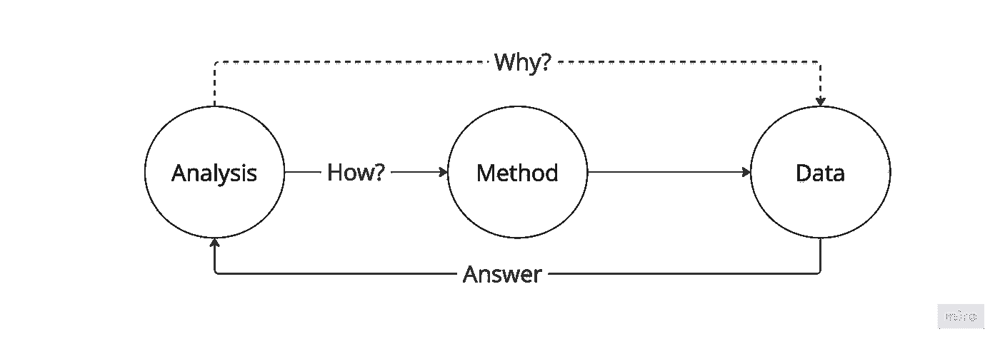

# 为什么开发人员应该使用 DuckDB 的三大理由

> 原文：[`towardsdatascience.com/three-reasons-why-developers-should-use-duckdb-0884c8e9f02a?source=collection_archive---------0-----------------------#2024-07-14`](https://towardsdatascience.com/three-reasons-why-developers-should-use-duckdb-0884c8e9f02a?source=collection_archive---------0-----------------------#2024-07-14)

## 软件开发人员如何使用 DuckDB 进行数据分析

[](https://mourjo.medium.com/?source=post_page---byline--0884c8e9f02a--------------------------------)[](https://towardsdatascience.com/?source=post_page---byline--0884c8e9f02a--------------------------------) [Mourjo Sen](https://mourjo.medium.com/?source=post_page---byline--0884c8e9f02a--------------------------------)

·发表于 [Towards Data Science](https://towardsdatascience.com/?source=post_page---byline--0884c8e9f02a--------------------------------) ·阅读时间 5 分钟·2024 年 7 月 14 日

--

软件开发人员需要承担多重职责：从编写代码、设计系统到在事件发生时分析数据。我们的许多工具都是针对这些任务进行优化的——编写代码时我们有强大的集成开发环境（IDE），设计系统时我们有功能丰富的图表工具。

**对于数据分析，软件开发人员是否拥有最合适的工具？** 在本文中，我列出了三大理由，解释为什么开源分析数据库[DuckDB](https://duckdb.org/)是软件开发人员必备的工具。


来源：[Unsplash](https://unsplash.com/photos/a-wall-full-of-knives-0CCVIuAjORE)

# 理由#1：使用通用的 SQL

假设你在一家食品配送公司担任软件开发人员。你收到一封邮件，内容是关于支付相关的客户投诉急剧增加。邮件附带了[像这样的 CSV 文件](https://github.com/mourjo/duckdb-notes/blob/master/datagenerator/adjusted_transactions.csv)，其中按投诉性质对一些订单进行了分类。作为一个在压力下工作的开发人员，你可能会急于*快速*查找如何在 StackOverflow 上分析 CSV 文件，找到的解决方案是使用`awk`。

```py
awk -F',' \
  'NR > 1 {count[$6]++} END \
  {for (value in count) print value, count[value]}' \
  datagenerator/adjusted_transactions.csv | sort

CUSTOMER_SUPPORT_REFUND 8494
INSUFFICIENT_FUNDS 1232
MANUAL_ADJUSTMENT 162
REVERSED_PAYMENT 62815
```

自然会有人问：我们每个订单中出现这些错误的频率是多少？使用`awk`这样的工具回答迭代性问题可能会很有挑战性，因为它的语法不熟悉。此外，如果数据是其他格式，如 JSON，我们还需要使用完全不同语法和使用模式的工具，如`jq`。

**DuckDB 通过提供一个统一的 SQL 接口来解决需要特定工具处理特定数据格式的问题，支持**[**各种文件类型**](https://duckdb.org/docs/guides/file_formats/overview)**。** 开发人员非常频繁地使用 SQL，它是查询全球[最广泛部署的数据库](https://www.sqlite.org/mostdeployed.html)的语言。由于 SQL 的普遍存在，非关系型数据系统也开始添加支持，允许使用 SQL 访问数据，如 [MongoDB](https://www.mongodb.com/docs/atlas/data-federation/query/query-with-sql/)、[Spark](https://spark.apache.org/docs/latest/api/sql/)、Elasticsearch 和 [AWS Athena](https://aws.amazon.com/athena/)。

回到原始的 CSV 文件，使用 `duckdb` 和 SQL，我们可以非常简单地查找每个订单中报告错误的频率：

```py
duckdb -c "
  with per_order_counts AS (
       select
         order_id, reason,
         count(transaction_id) as num_reports
       from 'datagenerator/adjusted_transactions.csv'
       group by 1,2
  )
  select reason, avg(num_reports) AS avg_per_order_count
  from per_order_counts group by 1 order by reason;"
┌─────────────────────────┬─────────────────────┐
│         reason          │ avg_per_order_count │
│         varchar         │       double        │
├─────────────────────────┼─────────────────────┤
│ CUSTOMER_SUPPORT_REFUND │  10.333333333333334 │
│ INSUFFICIENT_FUNDS      │   2.871794871794872 │
│ MANUAL_ADJUSTMENT       │                 1.2 │
│ REVERSED_PAYMENT        │   50.57568438003221 │
└─────────────────────────┴─────────────────────┘
```

# 原因 #2：支持多种数据库和文件类型

假设我们虚构的食品配送应用是使用微服务构建的。假设有一个 `users` 微服务，它在 PostgreSQL 中存储用户信息，还有一个 `orders` 微服务，它在 MySQL 中存储订单信息。

**以下跨微服务问题非常难以回答：VIP 用户与非 VIP 用户相比，是否受到更多影响？**

典型的解决方案是使用数据管道将所有微服务中的数据汇总到一个数据仓库中，但这既昂贵又不容易实时更新。

使用 DuckDB，我们可以连接一个 MySQL 数据库和一个 PostgreSQL 数据库，**跨数据库连接数据并过滤 CSV 文件**。数据库设置和代码可以在[这个仓库](https://github.com/mourjo/duckdb-notes/tree/master)中找到：

```py
ATTACH 'host=localhost port=5432 dbname=flock user=swan password=mallard'
  AS pg_db (TYPE postgres_scanner, READ_ONLY);

ATTACH 'host=localhost port=3306 database=flock user=swan password=mallard'
  AS mysql_db (TYPE mysql_scanner, READ_ONLY);

select u.tier, 
       count(distinct o.id) as order_count
from pg_db.users u join mysql_db.orders o 
     on u.id = o.created_by 
where o.id IN (
     select order_id 
     from 'datagenerator/adjusted_transactions.csv'
) 
group by 1 ;

┌─────────┬─────────────┐
│  tier   │ order_count │
│ varchar │    int64    │
├─────────┼─────────────┤
│ plus    │         276 │
│ normal  │         696 │
│ club    │         150 │
│ vip     │         148 │
└─────────┴─────────────┘
```

在上面的代码片段中，我们查询了 PostgreSQL、MySQL 和 CSV 文件，但**DuckDB 支持许多其他数据源**，如 Microsoft Excel、JSON 和 S3 文件——所有这些都使用相同的 SQL 接口。

# 原因 #3：可移植性和可扩展性

DuckDB 在命令行外壳中作为独立进程运行，无需任何额外依赖（例如服务器进程）。这种**可移植性使得 DuckDB 可与其他 Unix 工具**如 `sed`、`jq`、`sort` 和 `awk` 相媲美。

DuckDB 还可以作为库导入到[程序中](https://duckdb.org/docs/api/overview)，这些程序使用 Python 和 Javascript 等语言编写。实际上，DuckDB 也可以在浏览器中运行——[在这个链接](https://shell.duckdb.org/#queries=v0,select%0A----language%2C%0A----count(1)-as-repo_count%2C%0A----sum(stargazers_count)-as-start_count%0A--from-read_json('https%3A%2F%2Fapi.github.com%2Fusers%2Frichhickey%2Frepos')%0A--group-by-1%0A--order-by-2-desc%0A--limit-5~)中，一个 SQL 查询从 Github 获取 Rich Hickey 的仓库，并按编程语言分组——这一切都可以在浏览器中完成：



截图展示了 DuckDB 在浏览器中运行的情况。图片由作者提供。

对于 DuckDB 中未包含的功能，可以使用[社区扩展](https://duckdb.org/2024/07/05/community-extensions.html)来添加更多功能，比如作为社区扩展添加的[加密哈希函数](https://github.com/rustyconover/duckdb-crypto-extension)。

# 结论

**数据分析是一个反复提问的过程，目的是找出为什么某些事情会发生的解释。** 引用卡尔·荣格的话：“提出正确的问题已经是解决问题的一半。”

使用传统的命令行工具时，数据和问题之间需要额外的步骤来弄清楚如何回答这个问题。这会打断迭代提问的过程。



根据 Unix 哲学，简单的工具“与其他程序结合后，成为通用且有用的工具”([来源](https://en.wikipedia.org/wiki/Unix_philosophy))。由于每个工具都有自己的使用模式，将这些工具组合起来会通过引入额外的步骤来弄清楚如何回答问题，从而打破了迭代提问的方法。图片来自作者。

DuckDB 统一了工具的泛滥：（1）它能在任何地方运行，（2）能够查询多个数据源，（3）使用一种广泛理解的声明式语言。使用 DuckDB，迭代分析的反馈周期大大缩短，使得**DuckDB 成为所有开发者在分析数据时应当放在工具箱中的唯一工具**。


DuckDB 统一了数据工具的泛滥，并为不同的数据源提供了统一的 SQL 接口，促进了数据分析的迭代方法。图片来自作者。
