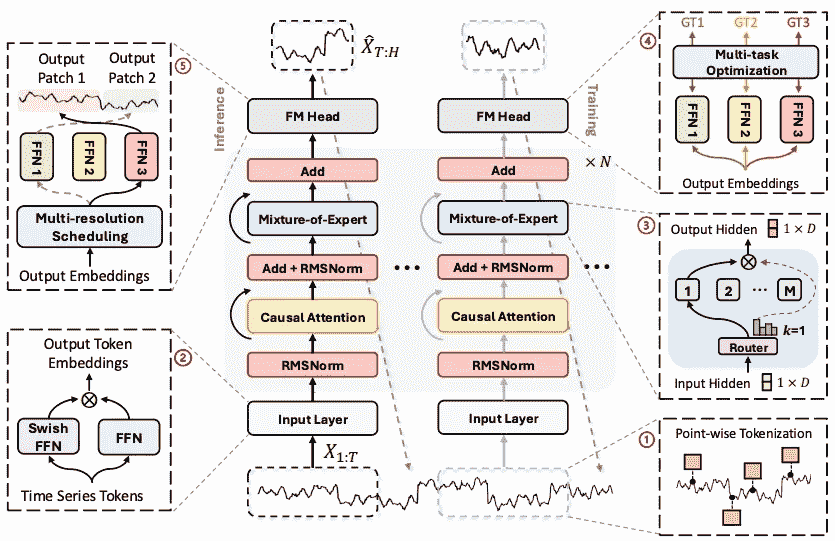

# TIME-MOE：亿级规模的时间序列基础模型，采用专家混合模型（Mixture-of-Experts）

> 原文：[`towardsdatascience.com/time-moe-billion-scale-time-series-foundation-model-with-mixture-of-experts-7d165028124a?source=collection_archive---------4-----------------------#2024-10-31`](https://towardsdatascience.com/time-moe-billion-scale-time-series-foundation-model-with-mixture-of-experts-7d165028124a?source=collection_archive---------4-----------------------#2024-10-31)

## 并且是开源的！

 [Nikos Kafritsas](https://medium.com/@nikoskafritsas?source=post_page---byline--7d165028124a--------------------------------)

·发布于 [Towards Data Science](https://towardsdatascience.com/?source=post_page---byline--7d165028124a--------------------------------) ·阅读时长 8 分钟·2024 年 10 月 31 日

--

*Time-MOE 的顶层视图 (*[*图片来源*](https://arxiv.org/pdf/2409.16040)*)*

**专家混合模型（MOE）架构**随着大规模语言模型（LLMs）的兴起而获得了广泛关注。

随着时间序列模型采用尖端技术，**专家混合模型（Mixture-of-Experts）**自然地在时间序列基础模型领域占据了一席之地。

本文讨论了**Time-MOE**，一种使用 MOE 来提高预测准确性并降低计算成本的时间序列基础模型。关键贡献包括：

1.  **Time-300B 数据集**：世界上最大的开放时间序列数据集，包含跨越 9 个领域的 3000 亿时间点，并配备可扩展的数据清洗管道。

1.  **时间序列的扩展法则**：深入探讨扩展法则如何影响大规模时间序列模型。

1.  **Time-MOE 架构**：一系列开源时间序列模型，利用 MOE 提升性能。

让我们开始吧

> *✅* 在[**AI 项目文件夹**](https://aihorizonforecast.substack.com/p/ai-projects)中找到**Time-MOE**的**实践项目**，以及其他精彩项目！

# 进入 Time-MOE

Time-MOE 是一个 24 亿参数的开源时间序列基础模型，采用**专家混合模型（Mixture-of-Experts，MOE）**进行零样本预测
