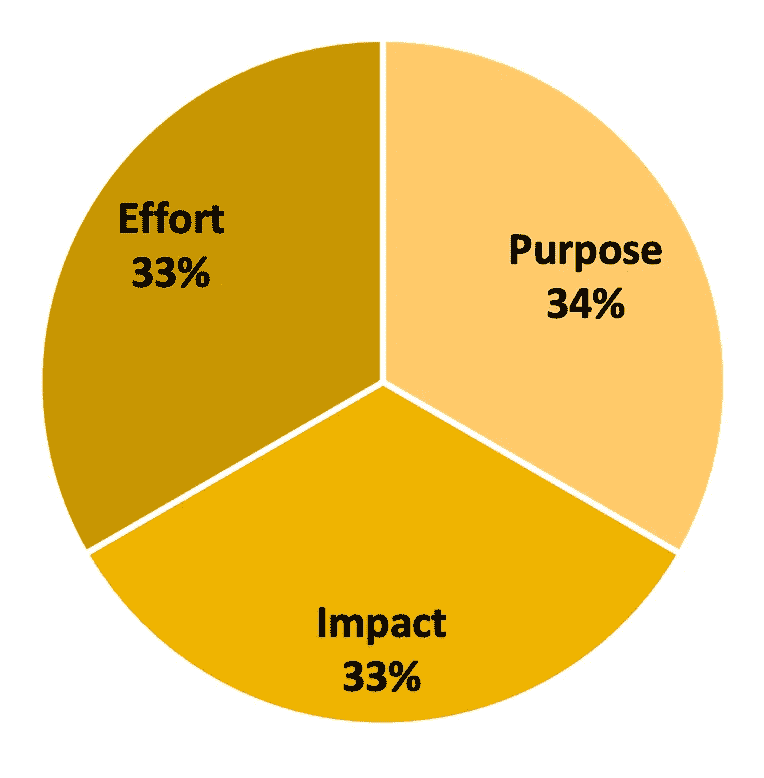

# 时间序列预测：超越基础

> 原文：[`towardsdatascience.com/time-series-forecasting-beyond-the-basics-d11e37229ed8?source=collection_archive---------3-----------------------#2024-03-09`](https://towardsdatascience.com/time-series-forecasting-beyond-the-basics-d11e37229ed8?source=collection_archive---------3-----------------------#2024-03-09)

## 解锁时间序列预测在现实世界中的真正潜力的技巧和窍门

 [Thauri Dattadeen](https://medium.com/@thauridattadeen?source=post_page---byline--d11e37229ed8--------------------------------)

·发表于 [Towards Data Science](https://towardsdatascience.com/?source=post_page---byline--d11e37229ed8--------------------------------) ·8 分钟阅读·2024 年 3 月 9 日

--

图片来源：[Alex Chumak](https://unsplash.com/@ralexnder?utm_source=medium&utm_medium=referral) 在 [Unsplash](https://unsplash.com/?utm_source=medium&utm_medium=referral)

# 预测未来的能力是一种超能力！

幸运的是，时间序列预测存在，并且任何人都可以使用！这种超能力可以使任何人做出前瞻性决策，改善未来规划。时间序列预测的应用几乎是无限的；想象一下能够预测你公司产品的需求，做出更明智的投资财务决策，或者仅仅是能够预测天气。

虽然互联网上充斥着关于预测核心原则的资源，但现实世界的复杂性往往超出了教科书的内容。本指南深入探讨了我在多年将这一强大工具应用于商业环境中的发现和未言明的秘密。我们将探索一些策略，超越通常关注特征工程和模型选择的范畴，帮助你真正解锁时间序列预测的潜力。

> **1\. 目的、影响、努力（PIE）框架**
> 
> **2\. 领域知识**
> 
> **3\. 非平稳性和突变**
> 
> **4\. 利益相关者管理**

图片来源：[rc.xyz NFT gallery](https://unsplash.com/@moneyphotos?utm_source=medium&utm_medium=referral) 在 [Unsplash](https://unsplash.com/?utm_source=medium&utm_medium=referral)

# **1\. 目的、影响、努力（PIE）框架**

在任何数据科学项目中，第一步始终是查看与工作相关的目标、影响和投入。在进入复杂的数据分析和建模世界之前，重要的是停下来评估基本问题：**这个项目的目的是什么？它最终会带来什么影响？值得付出这份努力吗？**

数据科学项目往往需要大量的时间和资源。因此，你必须不断问自己一个关键问题：“通过利用数据科学，组织能获得多少附加价值？”

令人惊讶的是，这个问题的答案并非总是显而易见。有时候，选择一个“快捷而粗糙”的解决方案——符合帕累托法则，即 20%的努力产生 80%的结果——就能解决大部分日常问题。那么，如果一个更简单的解决方案就能满足需求，为什么要花费额外的时间和精力呢？

这时，PIE 框架就派上了用场。在令人兴奋的数据科学技术背后，有一个重要的决策：使用更高级技术的边际收益是否真的值得额外的成本和努力？在大多数情况下，答案是响亮的“不是”。

尽管它看起来可能很令人兴奋，但在直接进入数据科学项目之前，重要的是要进行批判性思考。通过遵循 PIE 框架，你可以自信地决定要承担哪些项目，确保你的努力既有意义又富有影响力。

PIE 框架中的饼图。

# **2.** **领域知识**

许多课程和教材通常专注于教授各种时间序列预测技术，往往将它们呈现为成功的关键。然而，正如我的实际经验所教导的那样，真正的“秘密武器”并不在于模型本身，而是**深入理解你所处理的数据**。没有一种放之四海而皆准的预测模型。

例如，想象一下，如果你试图在松散的沙地上建造梦想中的房子。你可以找到最好的建筑师和施工队，设计出最复杂的蓝图，但最终，这座房子注定会倒塌。同样地，如果在无关数据或者充满错误和不一致的数据上构建强大的预测模型，就像是在不稳定的地基上建房子。模型的输出将是不可靠的，容易崩溃。

[John Hult](https://unsplash.com/@iamjohnhult?utm_source=medium&utm_medium=referral) 摄影，来源于 [Unsplash](https://unsplash.com/?utm_source=medium&utm_medium=referral)

在时间序列预测的背景下，领域知识不仅仅是了解数据所代表的内容。它还涉及深入挖掘并理解与问题分析相关的潜在关系、机制和细节。每个数据集都是独一无二的，理解数据的过程会因每个项目的不同而有所变化。

尽管这一步看起来可能相当无聊，但它可能决定整个项目的成败。从指导特征工程决策到引导模型选择，领域知识在塑造项目过程中起着非常重要的作用。如果你能够找到并利用最好的数据来输入模型，那么你的输出将更加有用。

# **3.** **非平稳性和突变**

当你第一次学习时间序列预测时，你通常会在许多预测模型中遇到“平稳性”这一核心假设。然而，在现实世界中，时间序列数据很少符合这一假设。相反，你会发现数据和交互随着时间变化。这通常表现为波动、趋势和季节性。在构建可靠的预测模型时，**识别并适应这些动态模式，以准确捕捉和预测潜在的趋势和行为**是非常重要的。

另一个常见的问题是当数据中发生突变或不连续时。传统的预测方法对于这种突变的处理并不好，但考虑到这些突变是非常重要的。这些突变可能是由外部因素引起的，例如市场条件变化、消费者行为转变，或新法规或新技术的引入。它们可能并不总是可以直接衡量或获得，但在这一点上，你的专业知识将发挥作用，帮助你找到最佳方法来考虑这些细微差别。

例如，假设你正在尝试预测英格兰超级联赛足球的观众数量。除了明显的赛季变化外，还有一些其他的特点，比如赛季末期观众兴趣会更高，因为竞争更加激烈，观众变得更加关注。现在假设梅西转会到英超，或者天空体育提高了他们的月度订阅费——这些突变有时是不可预测的，但它们对实际观众数量的影响非常显著。

处理这些突变没有简单的方法，但有一些技术可以提供帮助。以下是我通常用来应对这些细微差别的一些方法，但它们的应用高度依赖于数据的特性；

1\. **时间序列分解** — 这包括将数据分解为其核心组成部分——如趋势、季节性和噪声。通常，这一步应该作为预分析的一部分来完成，以更好地理解数据并单独建模每个组成部分的行为。

**外生特征** — 这些是你认为影响数据短期波动或长期趋势的外部变量。这可以是手动标记，或其他作为回归变量使用的重要特征。领域知识在这里至关重要。每一次突变通常都有解释。并非总能将每个解释作为特征纳入，所以过滤出最有用、可靠且可预测的特征非常重要，以避免过拟合。

**自适应建模** — 这涉及到选择最合适的模型，以便能够检测和适应潜在模式的变化。这一步是我最喜欢的之一，因为它涉及到通过研究找到或创建最适合数据的模型。然而，说起来容易，做起来难。可能会有一些时候，这需要一些手动工作，例如超参数调优，或者使用某些考虑到数据细微差异的特定模型。请记住，这也可能增加过拟合的风险。

尽管这些技术无法完美预测每一个前所未见的效应，但它们确实让我们为这些效应做好更多准备，并构建出更强大的预测模型。

# **4. 利益相关者管理**

成功实施模型远远超出了模型选择和数据分析的技术复杂性——它还包括有效的利益相关者管理。将“利益相关者管理”看作是根据参与人员定制过程。目标是确保你的模型正在做它应该做的事情，同时你继续创造价值。如何定制过程和输出取决于利益相关者的需求，无论是高管、经理还是消费者。这一切都关乎提供可操作的洞察，以帮助他们做出明智的决策**。**

作为一名数据科学家，你的价值通常取决于你将技术洞察转化为实际决策的能力。这对我们大多数人来说既是福也是祸——软技能在技术领域中常常被低估，但它是连接我们艰苦工作和从中获得价值的桥梁。虽然技术技能为我们的工作奠定了基础，但你有效沟通、与利益相关者共情并推动行动的能力，才是真正提升我们影响力的关键。沟通是数据科学家最重要的技能，然而它也是被认为最难掌握的技能。

以下是一些能够帮助有效沟通的实用建议：

## **1. 定制化模型选择**

**选择正确的模型远远超越了识别最精确的算法。**

的确，黑箱模型可能对我们数据科学家来说是最准确和最具吸引力的，但它们通常不透明或难以解释，这使得利益相关者很难信任结果。在这种情况下，选择像 ARIMA 或指数平滑这样简单的模型可能更好，虽然可能会降低准确性，但能提高可解释性。最好还是对现有的各种模型进行研究。

这是一些最常见的预测模型及其可解释性的示例；

## 2\. 清晰的可视化

**以与受众产生共鸣的方式呈现你的结果。**

考虑设计良好的图表、图形和仪表盘。这涉及到清晰、简洁和与受众的相关性。你如何帮助利益相关者快速理解关键见解并做出明智决策？

网上有许多关于数据可视化的文章和课程！

高层管理人员可能偏好高层次的仪表盘，而经理可能需要包含误差度量的详细报告。消费者通常从清晰且可操作的可视化中受益，将预测转化为实际应用。

就个人而言，我从 Prophet 的基本可视化中汲取了很多灵感，因为它清楚地展示了实际值与模型预测值的对比。我通常会添加注释或突出某些点（包括未来和过去的关键时刻）。

Prophet 输出的示例。

## **3\. 讲故事**

**不仅要呈现数据；还要讲一个故事。** 突出预测的背景、关键发现和潜在影响。了解你的受众，并将叙述框架调整为与特定目标和挑战相关的方式。

**在“如何做”之前，先关注“为什么做”**

+   你试图通过预测实现的总体目标是什么？

+   这些预测将如何用于支持决策？

+   不准确的预测可能带来什么潜在后果？

+   承认模型预测中的局限性和不确定性。

**突出过程，而不仅仅是结果**

+   始终将过程与当前任务联系起来。

+   分享你在数据预处理或模型选择过程中遇到的主要挑战，以及你是如何克服这些挑战的。

+   突出你在过程中发现的任何意外见解。

**使其具有可关联性和可操作性**

+   讲述你的受众能够理解的语言。

+   量化你的预测在收入、成本节省或资源分配等指标上的潜在影响。

+   提供清晰的建议和基于你的见解，利益相关者可以采取的可操作步骤。

记住，成功预测的关键不仅仅是模型的准确性，更在于其能**赋能利益相关者做出明智决策**。时间序列预测是一个强大的工具，所以要明智且小心地使用它！

*除非另有说明，所有图片均为作者提供。*
