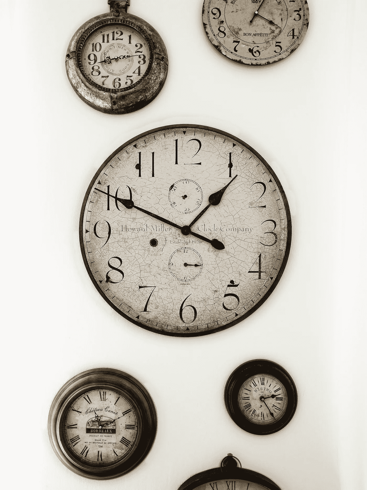

# 时间序列 — 从分析过去到预测未来

> 原文：[`towardsdatascience.com/time-series-from-analyzing-the-past-to-predicting-the-future-249ab99ec52d?source=collection_archive---------0-----------------------#2024-10-23`](https://towardsdatascience.com/time-series-from-analyzing-the-past-to-predicting-the-future-249ab99ec52d?source=collection_archive---------0-----------------------#2024-10-23)

## 如何通过时间序列从过去学习。

 [Farzad Nobar](https://medium.com/@fmnobar?source=post_page---byline--249ab99ec52d--------------------------------)

·发表于[Towards Data Science](https://towardsdatascience.com/?source=post_page---byline--249ab99ec52d--------------------------------) ·阅读时间 19 分钟·2024 年 10 月 23 日

--

图片由[DAVIDCOHEN](https://unsplash.com/@davcohpho?utm_content=creditCopyText&utm_medium=referral&utm_source=unsplash)提供，来源于[Unsplash](https://unsplash.com/photos/a-group-of-clocks-mounted-to-the-side-of-a-wall-nZL80Di-YAg?utm_content=creditCopyText&utm_medium=referral&utm_source=unsplash)

如果你有兴趣对未来的某个结果进行预测，时间序列就是实现这一目标的工具。时间序列数据是一组在特定时间间隔内记录的观测值，例如每小时的天气报告，或每日的库存和销售报告。时间序列为我们提供了理解历史数据的工具，并利用这些数据更有把握地预测未来。例如，我个人非常感激所有通过研究时间序列创建天气预报应用的科学家，以及像亚马逊这样的公司，它们依赖销售预测来更好地安排库存，以便我能够尽早收到我的亚马逊订单！

虽然网上有许多关于时间序列的教程，但我仍然决定写这篇文章，因为以下几点原因：

1.  **建立基础：** 我们不会假设读者对时间序列已有了解，而是将深入介绍与时间序列相关的基础概念，以便更好地理解这一主题并跟上内容。

1.  **扩展深度：** 一旦读者熟悉了理解时间序列所需的基础知识，我们将介绍 10 种不同的时间序列预测方法…
