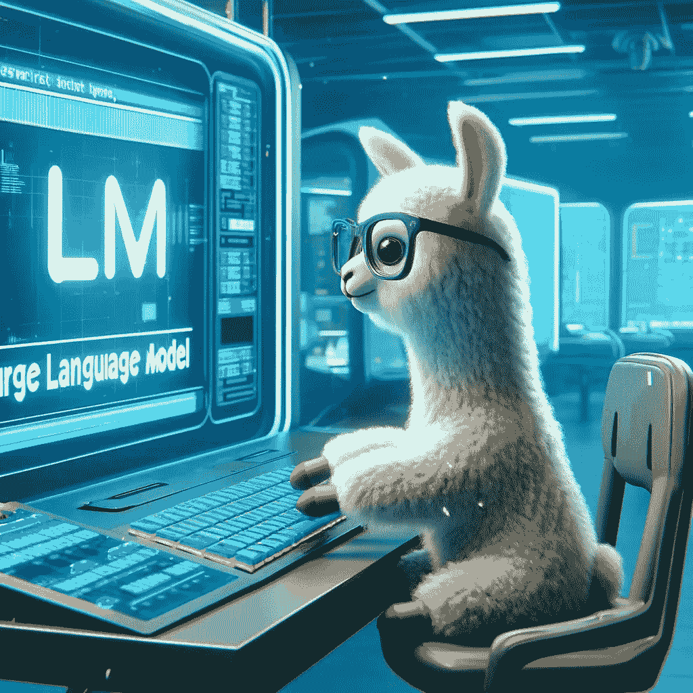

# TinyLlama——强大的小型语言模型的有希望的未来

> 原文：[`towardsdatascience.com/tiny-llama-a-performance-review-and-discussion-a68d68bc2826?source=collection_archive---------5-----------------------#2024-04-20`](https://towardsdatascience.com/tiny-llama-a-performance-review-and-discussion-a68d68bc2826?source=collection_archive---------5-----------------------#2024-04-20)

## 了解 TinyLlama，一个小型语言模型，能够在较少的计算资源下完成多种复杂任务

 [Eivind Kjosbakken](https://oieivind.medium.com/?source=post_page---byline--a68d68bc2826--------------------------------)

·发表于[Towards Data Science](https://towardsdatascience.com/?source=post_page---byline--a68d68bc2826--------------------------------) ·10 分钟阅读·2024 年 4 月 20 日

--

TinyLlama 是一个开源项目，旨在训练一个约为 11 亿参数的小型语言模型。该项目的目标是创建一个能够完成类似 Llama 2 这类完整 LLM 所能实现任务的语言模型，但占用更少的内存。本文将讨论如何在本地计算机上实现并运行 TinyLlama 模型。此外，还将讨论 TinyLlama 当前的性能，以及其优缺点。

ChatGPT 对 TinyLlama 模型的构想。OpenAI。（2024 年）。*ChatGPT*（4）[大型语言模型]。[`chat.openai.com`](https://chat.openai.com)

# 目录

· 目录

· 动机

· 在本地实现模型

· 测试模型

∘ 斐波那契数列

∘ RAG

∘ 生成对话

∘ 使用 TinyLlama 编程

· 我对该模型的看法

· 结论

# 动机

我撰写这篇文章的动机是跟上机器学习的最新趋势。虽然 TinyLlama 发布已有一段时间……
