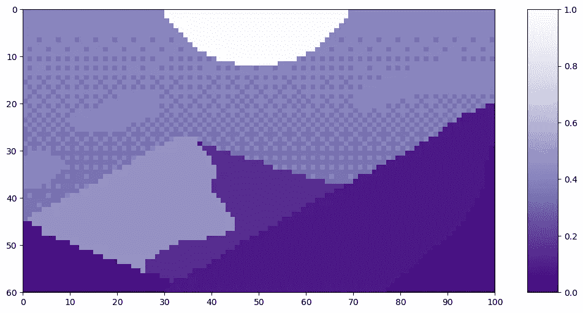

# Tokens-to-Token 视觉转换器解析

> 原文：[`towardsdatascience.com/tokens-to-token-vision-transformers-explained-2fa4e2002daa?source=collection_archive---------4-----------------------#2024-02-27`](https://towardsdatascience.com/tokens-to-token-vision-transformers-explained-2fa4e2002daa?source=collection_archive---------4-----------------------#2024-02-27)

## 视觉转换器解析系列

## 完整解析 Tokens-to-Token 视觉转换器及其优于原始模型的原因

[](https://medium.com/@sjcallis?source=post_page---byline--2fa4e2002daa--------------------------------)[](https://towardsdatascience.com/?source=post_page---byline--2fa4e2002daa--------------------------------) [Skylar Jean Callis](https://medium.com/@sjcallis?source=post_page---byline--2fa4e2002daa--------------------------------)

·发表于 [Towards Data Science](https://towardsdatascience.com/?source=post_page---byline--2fa4e2002daa--------------------------------) ·20 分钟阅读·2024 年 2 月 27 日

--

*自 2017 年*《Attention is All You Need》*¹推出以来，transformer 已经成为自然语言处理（NLP）领域的最先进技术。2021 年，*《An Image is Worth 16x16 Words》*²成功地将 transformer 应用于计算机视觉任务。从那时起，许多基于 transformer 的架构被提出用于计算机视觉。*

**2021 年，*Tokens-to-Token ViT：从头开始在 ImageNet 上训练视觉转换器*³概述了 Tokens-to-Token（T2T）ViT。该模型旨在消除原始 ViT²中存在的重预训练要求。本文将详细解析 T2T-ViT，包括 T2T-ViT 的开源代码，以及各个组件的概念性解释。所有代码均使用 PyTorch Python 包。**


图片来源：[Harrison Broadbent](https://unsplash.com/@harrisonbroadbent?utm_source=medium&utm_medium=referral) 在 [Unsplash](https://unsplash.com/?utm_source=medium&utm_medium=referral)

本文是一个系列的一部分，深入探讨视觉转换器的内部工作原理。该系列中的每篇文章也提供了可以执行代码的 Jupyter Notebook。系列中的其他文章包括：

+   视觉转换器解析→ [Jupyter Notebook](https://github.com/lanl/vision_transformers_explained/blob/main/notebooks/VisionTransformersExplained.ipynb)

+   视觉转换器的注意力机制解析

    → [Jupyter Notebook](https://github.com/lanl/vision_transformers_explained/blob/main/notebooks/AttentionExplained.ipynb)

+   视觉变换器的位置嵌入解析

    → [Jupyter Notebook](https://github.com/lanl/vision_transformers_explained/blob/main/notebooks/PositionEmbeddingExplained.ipynb)

+   **Tokens-to-Token 视觉变换器解析**

    → [Jupyter Notebook](https://github.com/lanl/vision_transformers_explained/blob/main/notebooks/TokensToTokenViTExplained.ipynb)

+   [Vision Transformers 解析系列的 GitHub 仓库](https://github.com/lanl/vision_transformers_explained)

## 目录

+   什么是 Tokens-to-Token ViT？

+   Tokens-to-Token (T2T) 模块

    — 软分割

    — Token Transformer

    — 神经网络模块

    — 图像重建

    — 全部内容

+   ViT 骨干网络

+   完整代码

+   结论

    — 引用

# 什么是 Tokens-to-Token ViT？

第一批能够在计算机视觉任务中匹配 CNN 性能的视觉变换器需要在大型数据集上进行预训练，然后再迁移到相关的基准任务上²。然而，在这些数据集上进行预训练并不总是可行的。首先，*An Image is Worth 16x16 Words*中所使用的预训练数据集（JFT-300M 数据集）并未公开²。此外，为了执行其他任务而设计的视觉变换器可能无法获得如此庞大的预训练数据集。

在 2021 年，*Tokens-to-Token ViT: 从头开始在 ImageNet 上训练视觉变换器*³ 发表，提出了一种方法，可以避免之前视觉变换器在预训练方面的巨大需求。他们通过将 ViT 模型²中的*patch tokenization*替换为 Tokens-to-Token (T2T)模块，成功实现了这一点。


T2T-ViT 模型图（图来自作者）

由于 T2T 模块是 T2T-ViT 模型的独特之处，因此它将是本文的重点。有关 ViT 组件的深入解析，请参见视觉变换器文章。该代码基于公开的 GitHub 代码 *Tokens-to-Token ViT³*，并做了一些修改。源代码的更改包括但不限于，修改以支持非方形输入图像，并移除 dropout 层。

# Tokens-to-Token (T2T) 模块

T2T 模块的作用是将输入图像处理成可以在 ViT 模块中使用的 tokens。T2T 模块不仅仅是简单地将输入图像拆分成 patches 并将其转化为 tokens，而是通过序列化计算 tokens 之间的注意力，并将其聚合在一起，从而捕捉图像中的额外结构，并减少整体 token 的长度。T2T 模块的示意图如下所示。


T2T 模块图（图像由作者提供）

## Soft Split

作为 T2T-ViT 模型中的第一层，soft split 层将图像分割成一系列的 tokens。T2T 图中的 soft split 层以蓝色块的形式展示。与原始 ViT 中的 *patch tokenization*（更多内容请阅读这里）不同，T2T-ViT 中的 soft split 会创建重叠的 patch。

让我们来看一个 soft split 在像素艺术作品 *黄昏中的山脉* 上的示例，作品由 Luis Zuno（[@ansimuz](http://twitter.com/ansimuz)）创作⁴。原始艺术作品已经被裁剪并转换为单通道图像。这意味着每个像素的值介于零和一之间。单通道图像通常以灰度显示；然而，为了更易于查看，我们将使用紫色配色方案进行展示。

```py
mountains = np.load(os.path.join(figure_path, 'mountains.npy'))

H = mountains.shape[0]
W = mountains.shape[1]
print('Mountain at Dusk is H =', H, 'and W =', W, 'pixels.')
print('\n')

fig = plt.figure(figsize=(10,6))
plt.imshow(mountains, cmap='Purples_r')
plt.xticks(np.arange(-0.5, W+1, 10), labels=np.arange(0, W+1, 10))
plt.yticks(np.arange(-0.5, H+1, 10), labels=np.arange(0, H+1, 10))
plt.clim([0,1])
cbar_ax = fig.add_axes([0.95, .11, 0.05, 0.77])
plt.clim([0, 1])
plt.colorbar(cax=cbar_ax);
#plt.savefig(os.path.join(figure_path, 'mountains.png'), bbox_inches='tight')
```

```py
Mountain at Dusk is H = 60 and W = 100 pixels.
```



代码输出（图像由作者提供）

这张图像的尺寸为 *H=60* 和 *W=100*。我们将使用一个 patch 大小——也就是 *卷积核*——为 *k=20*。T2T-ViT 将 *步幅* 设置为 *s=ceil(k/2)*，并将 *填充* 设置为 *p=ceil(k/4)*。对于我们的示例，这意味着我们将使用 *s=10* 和 *p=5*。填充区域的值全部为零，显示为最深的紫色。

在查看 soft split 创建的 patch 之前，我们必须知道将会创建多少个 patch。soft split 层是通过 `torch.nn.Unfold`⁵ 层实现的。为了计算 soft split 会创建多少个 token，我们使用以下公式：

其中 *h* 是原始图像的高度，*w* 是原始图像的宽度，*k* 是卷积核大小，*s* 是步幅，*p* 是填充大小⁵。这个公式假设卷积核是方形的，并且步幅和填充是对称的。此外，还假设膨胀（dilation）为 1。

***关于膨胀的补充说明：*** *PyTorch 将膨胀描述为“控制卷积核点之间的间距”⁵，并将读者引导至* [*这里*](https://github.com/vdumoulin/conv_arithmetic/blob/master/README.md)*的图示。* `*dilation=1*` *的值保持卷积核不变，所有像素都会接触。论坛中的* [*这个用户*](https://discuss.pytorch.org/t/why-the-default-dilation-value-in-conv2d-is-1/5612) *建议将其理解为“每隔* `*dilation*`*个元素就会被使用。”在这种情况下，每个第 1 个元素都会被使用，也就是说每个元素都会被使用。*

*num_tokens* 方程中的第一个项描述了高度方向上有多少个 token，而第二个项描述了宽度方向上有多少个 token。我们在下面的代码中实现了这一点：

```py
def count_tokens(w, h, k, s, p):
 """ Function to count how many tokens are produced from a given soft split

  Args:
   w (int): starting width
   h (int): starting height
   k (int): kernel size
   s (int): stride size
   p (int): padding size

  Returns:
   new_w (int): number of tokens along the width
   new_h (int): number of tokens along the height
   total (int): total number of tokens created
 """

 new_w = int(math.floor(((w + 2*p - (k-1) -1)/s)+1))
 new_h = int(math.floor(((h + 2*p - (k-1) -1)/s)+1))
 total = new_w * new_h

 return new_w, new_h, total
```

使用 *黄昏中的山脉*⁴ 示例中的尺寸：

```py
k = 20
s = 10
p = 5
padded_H = H + 2*p
padded_W = W + 2*p
print('With padding, the image will be H =', padded_H, 'and W =', padded_W, 'pixels.\n') 

patches_w, patches_h, total_patches = count_tokens(w=W, h=H, k=k, s=s, p=p)
print('There will be', total_patches, 'patches as a result of the soft split;')
print(patches_h, 'along the height and', patches_w, 'along the width.')
```

```py
With padding, the image will be H = 70 and W = 110 pixels.

There will be 60 patches as a result of the soft split;
6 along the height and 10 along the width.
```

现在，我们可以看到 soft split 如何从 *黄昏中的山脉*⁴ 创建 patch。

```py
mountains_w_padding = np.pad(mountains, pad_width = ((p, p), (p, p)), mode='constant', constant_values=0)

left_x = np.tile(np.arange(-0.5, padded_W-k+1, s), patches_h)
right_x = np.tile(np.arange(k-0.5, padded_W+1, s), patches_h)
top_y = np.repeat(np.arange(-0.5, padded_H-k+1, s), patches_w)
bottom_y = np.repeat(np.arange(k-0.5, padded_H+1, s), patches_w)

frame_paths = []

for i in range(total_patches):
    fig = plt.figure(figsize=(10,6))
    plt.imshow(mountains_w_padding, cmap='Purples_r')
    plt.clim([0,1])
    plt.xticks(np.arange(-0.5, W+2*p+1, 10), labels=np.arange(0, W+2*p+1, 10))
    plt.yticks(np.arange(-0.5, H+2*p+1, 10), labels=np.arange(0, H+2*p+1, 10))

    plt.plot([left_x[i], left_x[i], right_x[i], right_x[i], left_x[i]], [top_y[i], bottom_y[i], bottom_y[i], top_y[i], top_y[i]], color='w', lw=3, ls='-')

    for j in range(i):
        plt.plot([left_x[j], left_x[j], right_x[j], right_x[j], left_x[j]], [top_y[j], bottom_y[j], bottom_y[j], top_y[j], top_y[j]], color='w', lw=2, ls=':', alpha=0.5)
    save_path = os.path.join(figure_path, 'softsplit_gif', 'frame{:02d}'.format(i))+'.png'
    frame_paths.append(save_path)
    #fig.savefig(save_path, bbox_inches='tight')
    plt.close()

frames = []
for path in frame_paths:
    frames.append(iio.imread(path))

#iio.mimsave(os.path.join(figure_path, 'softsplit.gif'), frames, fps=2, loop=0)
```


代码输出（图像由作者提供）

我们可以看到，软分割导致了重叠的块。通过计算这些块在图像中移动的过程，我们可以看到图像的高度有 6 个块，宽度有 10 个块，正如预期的那样。通过将这些块展平，我们可以看到得到的令牌。让我们以第一个块为例进行展平。

```py
print('Each patch will make a token of length', str(k**2)+'.')
print('\n')

patch = mountains_w_padding[0:20, 0:20]
token = patch.reshape(1, k**2,)

fig = plt.figure(figsize=(10,1))
plt.imshow(token, cmap='Purples_r', aspect=20)
plt.clim([0, 1])
plt.xticks(np.arange(-0.5, k**2+1, 50), labels=np.arange(0, k**2+1, 50))
plt.yticks([]);
#plt.savefig(os.path.join(figure_path, 'mountains_w_padding_token01.png'), bbox_inches='tight')
```

```py
Each patch will make a token of length 400.
```


代码输出（图片由作者提供）

你可以看到令牌中的填充部分！

当传递到下一层时，所有的令牌会聚集在一起形成一个矩阵。该矩阵看起来像这样：


令牌矩阵（图片由作者提供）

对于*《黄昏山景》*⁴来说，矩阵会是这样：

```py
left_x = np.tile(np.arange(0, padded_W-k+1, s), patches_h)
right_x = np.tile(np.arange(k, padded_W+1, s), patches_h)
top_y = np.repeat(np.arange(0, padded_H-k+1, s), patches_w)
bottom_y = np.repeat(np.arange(k, padded_H+1, s), patches_w)

tokens = np.zeros((total_patches, k**2))
for i in range(total_patches):
    patch = mountains_w_padding[top_y[i]:bottom_y[i], left_x[i]:right_x[i]]
    tokens[i, :] = patch.reshape(1, k**2)

fig = plt.figure(figsize=(10,6))
plt.imshow(tokens, cmap='Purples_r', aspect=5)
plt.clim([0, 1])
plt.xticks(np.arange(-0.5, k**2+1, 50), labels=np.arange(0, k**2+1, 50))
plt.yticks(np.arange(-0.5, total_patches+1, 10), labels=np.arange(0, total_patches+1, 10))
plt.xlabel('Length of Tokens')
plt.ylabel('Number of Tokens')
plt.clim([0,1])
cbar_ax = fig.add_axes([0.85, .11, 0.05, 0.77])
plt.clim([0, 1])
plt.colorbar(cax=cbar_ax);
#plt.savefig(os.path.join(figure_path, 'mountains_w_padding_tokens_matrix.png'), bbox_inches='tight')
```


代码输出（图片由作者提供）

你可以看到矩阵左上角和右下角的大面积填充区域，以及其他小块的填充部分。现在，我们的令牌已经准备好，可以传递到下一步骤。

## 令牌转换器

T2T 模块的下一个组件是令牌转换器，它由紫色块表示。


令牌转换器（图片由作者提供）

Token Transformer 类的代码如下：

```py
class TokenTransformer(nn.Module):

    def __init__(self,
       dim: int,
       chan: int,
       num_heads: int,
       hidden_chan_mul: float=1.,
       qkv_bias: bool=False,
       qk_scale: NoneFloat=None,
       act_layer=nn.GELU,
       norm_layer=nn.LayerNorm):

        """ Token Transformer Module

            Args:
                dim (int): size of a single token
                chan (int): resulting size of a single token 
                num_heads (int): number of attention heads in MSA 
                hidden_chan_mul (float): multiplier to determine the number of hidden channels (features) in the NeuralNet module
                qkv_bias (bool): determines if the attention qkv layer learns an addative bias
                qk_scale (NoneFloat): value to scale the queries and keys by; 
                                    if None, queries and keys are scaled by ``head_dim ** -0.5``
                act_layer(nn.modules.activation): torch neural network layer class to use as activation in the NeuralNet module
                norm_layer(nn.modules.normalization): torch neural network layer class to use as normalization
        """

        super().__init__()

        ## Define Layers
        self.norm1 = norm_layer(dim)
        self.attn = Attention(dim,
              chan=chan,
              num_heads=num_heads,
              qkv_bias=qkv_bias,
              qk_scale=qk_scale)
        self.norm2 = norm_layer(chan)
        self.neuralnet = NeuralNet(in_chan=chan,
              hidden_chan=int(chan*hidden_chan_mul),
              out_chan=chan,
              act_layer=act_layer)

    def forward(self, x):
        x = self.attn(self.norm1(x))
        x = x + self.neuralnet(self.norm2(x))
        return x
```

*chan, num_heads, qkv_bias,* 和 *qk_scale* 参数定义了*Attention*模块的组件。深入探讨 VisTransformers 中的注意力机制最好留到另一个时间。

*hidden_chan_mul* 和 *act_layer* 参数定义了*神经网络*模块的组件。激活层可以是任何`torch.nn.modules.activation`⁶ 层。*norm_layer* 可以从任何`torch.nn.modules.normalization`⁷ 层中选择。

让我们逐步分析图中的每一个蓝色块。我们使用 7∗7=49 作为初始令牌大小，因为第一次软分割的默认卷积核是 7x7。³ 我们使用 64 个通道，因为那也是默认值。³ 我们使用 100 个令牌，因为这是一个不错的数字。我们使用 13 的批量大小，因为 13 是质数，不会与其他参数混淆。我们使用 4 个头，因为它可以将通道分割开；然而，你不会在令牌转换器模块中看到头维度。

```py
# Define an Input
token_len = 7*7
channels = 64
num_tokens = 100
batch = 13
heads = 4
x = torch.rand(batch, num_tokens, token_len)
print('Input dimensions are\n\tbatchsize:', x.shape[0], '\n\tnumber of tokens:', x.shape[1], '\n\ttoken size:', x.shape[2])

# Define the Module
TT = TokenTransformer(dim=token_len, 
                      chan=channels, 
                      num_heads=heads, 
                      hidden_chan_mul=1.5, 
                      qkv_bias=False, 
                      qk_scale=None, 
                      act_layer=nn.GELU, 
                      norm_layer=nn.LayerNorm)
TT.eval();
```

```py
Input dimensions are
    batchsize: 13 
    number of tokens: 100 
    token size: 49
```

首先，我们将输入传递通过一个标准化层，它不会改变输入的形状。接着，它被传递到第一个*Attention*模块，该模块会改变令牌的长度。请回顾一下，关于 VisTransformers 中 Attention 的更深入解释可以在这里找到。

```py
x = TT.norm1(x)
print('After norm, dimensions are\n\tbatchsize:', x.shape[0], '\n\tnumber of tokens:', x.shape[1], '\n\ttoken size:', x.shape[2])
x = TT.attn(x)
print('After attention, dimensions are\n\tbatchsize:', x.shape[0], '\n\tnumber of tokens:', x.shape[1], '\n\ttoken size:', x.shape[2])
```

```py
After norm, dimensions are
   batchsize: 13 
   number of tokens: 100 
   token size: 49
After attention, dimensions are
   batchsize: 13 
   number of tokens: 100 
   token size: 64
```

现在，我们必须保存分割连接层的状态。在实际的类定义中，这一步通常在一行中更高效地完成。然而，在本教程中，我们将其单独处理。

接下来，我们可以将其传递通过另一个标准化层，然后进入*神经网络*模块。标准化层不会改变输入的形状。神经网络也配置为不会改变形状。

最后一步是分割连接，这也不会改变形状。

```py
y = TT.norm2(x)
print('After norm, dimensions are\n\tbatchsize:', x.shape[0], '\n\tnumber of tokens:', x.shape[1], '\n\ttoken size:', x.shape[2])
y = TT.neuralnet(y)
print('After neural net, dimensions are\n\tbatchsize:', x.shape[0], '\n\tnumber of tokens:', x.shape[1], '\n\ttoken size:', x.shape[2])
y = y + x
print('After split connection, dimensions are\n\tbatchsize:', x.shape[0], '\n\tnumber of tokens:', x.shape[1], '\n\ttoken size:', x.shape[2])
```

```py
After norm, dimensions are
   batchsize: 13 
   number of tokens: 100 
   token size: 64
After neural net, dimensions are
   batchsize: 13 
   number of tokens: 100 
   token size: 64
After split connection, dimensions are
   batchsize: 13 
   number of tokens: 100 
   token size: 64
```

这就是令牌变换器模块的全部内容。

## 神经网络模块

神经网络（NN）模块是令牌变换器模块的一个子组件。神经网络模块非常简单，由一个全连接层、一个激活层和另一个全连接层组成。激活层可以是任何`torch.nn.modules.activation`⁶层，它作为输入传递给该模块。NN 模块可以配置为改变输入的形状，或者保持相同的形状。我们不会逐步讲解这段代码，因为神经网络在机器学习中很常见，而且不是本文的重点。不过，下面会展示神经网络模块的代码。

```py
class NeuralNet(nn.Module):
    def __init__(self,
       in_chan: int,
       hidden_chan: NoneFloat=None,
       out_chan: NoneFloat=None,
       act_layer = nn.GELU):
        """ Neural Network Module

            Args:
                in_chan (int): number of channels (features) at input
                hidden_chan (NoneFloat): number of channels (features) in the hidden layer;
                                        if None, number of channels in hidden layer is the same as the number of input channels
                out_chan (NoneFloat): number of channels (features) at output;
                                        if None, number of output channels is same as the number of input channels
                act_layer(nn.modules.activation): torch neural network layer class to use as activation
        """

        super().__init__()

        ## Define Number of Channels
        hidden_chan = hidden_chan or in_chan
        out_chan = out_chan or in_chan

        ## Define Layers
        self.fc1 = nn.Linear(in_chan, hidden_chan)
        self.act = act_layer()
        self.fc2 = nn.Linear(hidden_chan, out_chan)

    def forward(self, x):
        x = self.fc1(x)
        x = self.act(x)
        x = self.fc2(x)
        return x
```

## 图像重建

图像重建层也作为蓝色块显示在 T2T 图示内。传入重建层的输入形状为(batch, num_tokens, tokensize=channels)。如果我们只查看一个批次，它看起来如下：


单批次令牌（图片由作者提供）

重建层将令牌重新塑形为二维图像，如下所示：


重建的图像（图片由作者提供）

在每个批次中，会有*tokensize = channel*数量的重建图像。这与图像是彩色的并且有三个颜色通道时的处理方式相同。

重建的代码没有被封装到单独的函数中。然而，下面给出了一个示例：

```py
W, H, _ = count_tokens(w, h, k, s, p)
x = x.transpose(1,2).reshape(B, C, H, W)
```

其中，*W*和*H*分别是图像的宽度和高度，*B*是批次大小，*C*是通道数。

## 综合起来

现在我们准备好一起查看整个 T2T 模块的实现了！T2T 模块的模型类如下所示：

```py
class Tokens2Token(nn.Module):
  def __init__(self, 
    img_size: tuple[int, int, int]=(1, 1000, 300), 
    token_chan:  int=64,
    token_len: int=768,):

    """ Tokens-to-Token Module

    Args:
    img_size (tuple[int, int, int]): size of input (channels, height, width)
    token_chan (int): number of token channels inside the TokenTransformers
    token_len (int): desired length of an output token
    """

    super().__init__()

    ## Seperating Image Size
    C, H, W = img_size
    self.token_chan = token_chan
    ## Dimensions: (channels, height, width)

    ## Define the Soft Split Layers
    self.soft_split0 = nn.Unfold(kernel_size=(7, 7), stride=(4, 4), padding=(2, 2))
    self.soft_split1 = nn.Unfold(kernel_size=(3, 3), stride=(2, 2), padding=(1, 1))
    self.soft_split2 = nn.Unfold(kernel_size=(3, 3), stride=(2, 2), padding=(1, 1))

    ## Determining Number of Output Tokens
    W, H, _ = count_tokens(w=W, h=H, k=7, s=4, p=2)
    W, H, _ = count_tokens(w=W, h=H, k=3, s=2, p=1)
    _, _, T = count_tokens(w=W, h=H, k=3, s=2, p=1)
    self.num_tokens = T

    ## Define the Transformer Layers
    self.transformer1 = TokenTransformer(dim= C * 7 * 7, 
    chan=token_chan,
    num_heads=1,
    hidden_chan_mul=1.0)
    self.transformer2 = TokenTransformer(dim=token_chan * 3 * 3, 
    chan=token_chan, 
    num_heads=1, 
    hidden_chan_mul=1.0)

    ## Define the Projection Layer
    self.project = nn.Linear(token_chan * 3 * 3, token_len)

  def forward(self, x):

    B, C, H, W = x.shape
    ## Dimensions: (batch, channels, height, width)

    ## Initial Soft Split
    x = self.soft_split0(x).transpose(1, 2)

    ## Token Transformer 1
    x = self.transformer1(x)

    ## Reconstruct 2D Image
    W, H, _ = count_tokens(w=W, h=H, k=7, s=4, p=2)
    x = x.transpose(1,2).reshape(B, self.token_chan, H, W)

    ## Soft Split 1
    x = self.soft_split1(x).transpose(1, 2)

    ## Token Transformer 2
    x = self.transformer2(x)

    ## Reconstruct 2D Image
    W, H, _ = count_tokens(w=W, h=H, k=3, s=2, p=1)
    x = x.transpose(1,2).reshape(B, self.token_chan, H, W)

    ## Soft Split 2
    x = self.soft_split2(x).transpose(1, 2)

    ## Project Tokens to desired length
    x = self.project(x)

    return x
```

让我们来一步步分析前向传递过程。由于我们已经更深入地检查了各个组件，本节将把它们视为黑盒：我们只会关注输入和输出。

我们将定义一个形状为 1x400x100 的网络输入，用来表示一张灰度（单通道）矩形图像。我们使用 64 个通道和 768 个令牌长度，因为这些是默认值³。我们使用 13 的批次大小，因为它是质数，不会与其他参数混淆。

```py
# Define an Input
H = 400
W = 100
channels = 64
batch = 13
x = torch.rand(batch, 1, H, W)
print('Input dimensions are\n\tbatchsize:', x.shape[0], '\n\tnumber of input channels:', x.shape[1], '\n\timage size:', (x.shape[2], x.shape[3]))

# Define the Module
T2T = Tokens2Token(img_size=(1, H, W), token_chan=64, token_len=768)
T2T.eval();
```

```py
Input dimensions are
   batchsize: 13 
   number of input channels: 1 
   image size: (400, 100)
```

输入图像首先经过一个软分割层，*kernel* = 7，*stride* = 4，以及*paddin*g = 2。令牌的长度将是卷积核大小（7∗7=49）乘以通道数（灰度输入的通道数 = 1）。我们可以使用`count_tokens`函数来计算软分割后应该有多少个令牌。

```py
# Count Tokens
k = 7
s = 4
p = 2
_, _, T = count_tokens(w=W, h=H, k=k, s=s, p=p)
print('There should be', T, 'tokens after the soft split.')
print('They should be of length', k, '*', k, '* 1 =', k*k*1)

# Perform the Soft Split
x = T2T.soft_split0(x)
print('Dimensions after soft split are\n\tbatchsize:', x.shape[0], '\n\ttoken length:', x.shape[1], '\n\tnumber of tokens:', x.shape[2])
x = x.transpose(1, 2)
```

```py
There should be 2500 tokens after the soft split.
They should be of length 7 * 7 * 1 = 49
Dimensions after soft split are
   batchsize: 13 
   token length: 49 
   number of tokens: 2500
```

接下来，我们通过第一个*Token Transformer*。这不会影响批次大小或令牌数，但它会将令牌的长度更改为*channels* = 64。

```py
x = T2T.transformer1(x)
print('Dimensions after transformer are\n\tbatchsize:', x.shape[0], '\n\tnumber of tokens:', x.shape[1], '\n\ttoken length:', x.shape[2])
```

```py
Dimensions after transformer are
   batchsize: 13 
   number of tokens: 2500 
   token length: 64
```

现在，我们将令牌重建回二维图像。`count_tokens`函数再次可以告诉我们新图像的形状。它将具有 64 个通道，这与从*Token Transformer*出来的令牌长度相同。

```py
W, H, _ = count_tokens(w=W, h=H, k=7, s=4, p=2)
print('The reconstructed image should have shape', (H, W))

x = x.transpose(1,2).reshape(B, T2T.token_chan, H, W)
print('Dimensions of reconstructed image are\n\tbatchsize:', x.shape[0], '\n\tnumber of input channels:', x.shape[1], '\n\timage size:', (x.shape[2], x.shape[3]))
```

```py
The reconstructed image should have shape (100, 25)
Dimensions of reconstructed image are
   batchsize: 13 
   number of input channels: 64 
   image size: (100, 25)
```

现在我们又得到一个 2D 图像，我们返回到软分割步骤！接下来的代码块完成了第二次软分割、第二次*Token Transformer*和第二次图像重建。

```py
# Soft Split
k = 3
s = 2
p = 1
_, _, T = count_tokens(w=W, h=H, k=k, s=s, p=p)
print('There should be', T, 'tokens after the soft split.')
print('They should be of length', k, '*', k, '*', T2T.token_chan, '=', k*k*T2T.token_chan)
x = T2T.soft_split1(x)
print('Dimensions after soft split are\n\tbatchsize:', x.shape[0], '\n\ttoken length:', x.shape[1], '\n\tnumber of tokens:', x.shape[2])
x = x.transpose(1, 2)

# Token Transformer
x = T2T.transformer2(x)
print('Dimensions after transformer are\n\tbatchsize:', x.shape[0], '\n\tnumber of tokens:', x.shape[1], '\n\ttoken length:', x.shape[2])

# Reconstruction
W, H, _ = count_tokens(w=W, h=H, k=k, s=s, p=p)
print('The reconstructed image should have shape', (H, W))
x = x.transpose(1,2).reshape(batch, T2T.token_chan, H, W)
print('Dimensions of reconstructed image are\n\tbatchsize:', x.shape[0], '\n\tnumber of input channels:', x.shape[1], '\n\timage size:', (x.shape[2], x.shape[3]))
```

```py
There should be 650 tokens after the soft split.
They should be of length 3 * 3 * 64 = 576
Dimensions after soft split are
   batchsize: 13 
   token length: 576 
   number of tokens: 650
Dimensions after transformer are
   batchsize: 13 
   number of tokens: 650 
   token length: 64
The reconstructed image should have shape (50, 13)
Dimensions of reconstructed image are
   batchsize: 13 
   number of input channels: 64 
   image size: (50, 13)
```

从这个重建的图像中，我们进行最终的软分割。回想一下，T2T 模块的输出应该是一个 token 列表。

```py
# Soft Split
_, _, T = count_tokens(w=W, h=H, k=3, s=2, p=1)
print('There should be', T, 'tokens after the soft split.')
print('They should be of length 3*3*64=', 3*3*64)
x = T2T.soft_split2(x)
print('Dimensions after soft split are\n\tbatchsize:', x.shape[0], '\n\ttoken length:', x.shape[1], '\n\tnumber of tokens:', x.shape[2])
x = x.transpose(1, 2)
```

```py
There should be 175 tokens after the soft split.
They should be of length 3 * 3 * 64 = 576
Dimensions after soft split are
   batchsize: 13 
   token length: 576 
   number of tokens: 175
```

T2T 模块的最后一层是一个线性层，用于将 tokens 投射到期望的输出大小。我们将其设置为*token_len*=768。

```py
x = T2T.project(x)
print('Output dimensions are\n\tbatchsize:', x.shape[0], '\n\tnumber of tokens:', x.shape[1], '\n\ttoken length:', x.shape[2])
```

```py
Output dimensions are
   batchsize: 13 
   number of tokens: 175 
   token length: 768
```

这就是 T2T 模块的全部内容！

# ViT Backbone

从 T2T 模块开始，token 通过 ViT 骨干网络（ViT Backbone）。这与[2]中描述的 ViT 模型的骨干网络相同。你可以在视觉变换器文章中深入了解 ViT 模型和 ViT 骨干网络的实现。下面重现了代码，但我们不会详细讲解。可以在这里查看文章内容，再回来继续阅读！

```py
class ViT_Backbone(nn.Module):
    def __init__(self,
                preds: int=1,
                token_len: int=768,
                num_heads: int=1,
                Encoding_hidden_chan_mul: float=4.,
                depth: int=12,
                qkv_bias=False,
                qk_scale=None,
                act_layer=nn.GELU,
                norm_layer=nn.LayerNorm):

        """ VisTransformer Backbone
            Args:
                preds (int): number of predictions to output
                token_len (int): length of a token
                num_heads(int): number of attention heads in MSA
                Encoding_hidden_chan_mul (float): multiplier to determine the number of hidden channels (features) in the NeuralNet component of the Encoding Module
                depth (int): number of encoding blocks in the model
                qkv_bias (bool): determines if the qkv layer learns an addative bias
                qk_scale (NoneFloat): value to scale the queries and keys by; 
                 if None, queries and keys are scaled by ``head_dim ** -0.5``
                act_layer(nn.modules.activation): torch neural network layer class to use as activation
                norm_layer(nn.modules.normalization): torch neural network layer class to use as normalization
        """

        super().__init__()

        ## Defining Parameters
        self.num_heads = num_heads
        self.Encoding_hidden_chan_mul = Encoding_hidden_chan_mul
        self.depth = depth

        ## Defining Token Processing Components
        self.cls_token = nn.Parameter(torch.zeros(1, 1, self.token_len))
        self.pos_embed = nn.Parameter(data=get_sinusoid_encoding(num_tokens=self.num_tokens+1, token_len=self.token_len), requires_grad=False)

        ## Defining Encoding blocks
        self.blocks = nn.ModuleList([Encoding(dim = self.token_len, 
                                               num_heads = self.num_heads,
                                               hidden_chan_mul = self.Encoding_hidden_chan_mul,
                                               qkv_bias = qkv_bias,
                                               qk_scale = qk_scale,
                                               act_layer = act_layer,
                                               norm_layer = norm_layer)
             for i in range(self.depth)])

        ## Defining Prediction Processing
        self.norm = norm_layer(self.token_len)
        self.head = nn.Linear(self.token_len, preds)

        ## Make the class token sampled from a truncated normal distrobution 
        timm.layers.trunc_normal_(self.cls_token, std=.02)

    def forward(self, x):
        ## Assumes x is already tokenized

        ## Get Batch Size
        B = x.shape[0]
        ## Concatenate Class Token
        x = torch.cat((self.cls_token.expand(B, -1, -1), x), dim=1)
        ## Add Positional Embedding
        x = x + self.pos_embed
        ## Run Through Encoding Blocks
        for blk in self.blocks:
            x = blk(x)
        ## Take Norm
        x = self.norm(x)
        ## Make Prediction on Class Token
        x = self.head(x[:, 0])
        return x
```

# 完整代码

要创建完整的 T2T-ViT 模块，我们使用了*T2T*模块和*ViT Backbone*。

```py
class T2T_ViT(nn.Module):
    def __init__(self, 
                img_size: tuple[int, int, int]=(1, 1700, 500),
                softsplit_kernels: tuple[int, int, int]=(31, 3, 3),
                preds: int=1,
                token_len: int=768,
                token_chan:  int=64,
                num_heads: int=1,
                T2T_hidden_chan_mul: float=1.,
                Encoding_hidden_chan_mul: float=4.,
                depth: int=12,
                qkv_bias=False,
                qk_scale=None,
                act_layer=nn.GELU,
                norm_layer=nn.LayerNorm):

        """ Tokens-to-Token VisTransformer Model

            Args:
                img_size (tuple[int, int, int]): size of input (channels, height, width)
                softsplit_kernels (tuple[int int, int]): size of the square kernel for each of the soft split layers, sequentially
                preds (int): number of predictions to output
                token_len (int): desired length of an output token
                token_chan (int): number of token channels inside the TokenTransformers
                num_heads(int): number of attention heads in MSA (only works if =1)
                T2T_hidden_chan_mul (float): multiplier to determine the number of hidden channels (features) in the NeuralNet component of the Tokens-to-Token (T2T) Module
                Encoding_hidden_chan_mul (float): multiplier to determine the number of hidden channels (features) in the NeuralNet component of the Encoding Module
                depth (int): number of encoding blocks in the model
                qkv_bias (bool): determines if the qkv layer learns an addative bias
                qk_scale (NoneFloat): value to scale the queries and keys by; 
                                    if None, queries and keys are scaled by ``head_dim ** -0.5``
                act_layer(nn.modules.activation): torch neural network layer class to use as activation
                norm_layer(nn.modules.normalization): torch neural network layer class to use as normalization
        """

        super().__init__()

        ## Defining Parameters
        self.img_size = img_size
        C, H, W = self.img_size
        self.softsplit_kernels = softsplit_kernels
        self.token_len = token_len
        self.token_chan = token_chan
        self.num_heads = num_heads
        self.T2T_hidden_chan_mul = T2T_hidden_chan_mul
        self.Encoding_hidden_chan_mul = Encoding_hidden_chan_mul
        self.depth = depth

        ## Defining Tokens-to-Token Module
        self.tokens_to_token = Tokens2Token(img_size = self.img_size, 
                                            softsplit_kernels = self.softsplit_kernels,
                                            num_heads = self.num_heads,
              token_chan = self.token_chan,
              token_len = self.token_len,
              hidden_chan_mul = self.T2T_hidden_chan_mul,
              qkv_bias = qkv_bias,
              qk_scale = qk_scale,
              act_layer = act_layer,
              norm_layer = norm_layer)
        self.num_tokens = self.tokens_to_token.num_tokens

        ## Defining Token Processing Components
        self.vit_backbone = ViT_Backbone(preds = preds,
          token_len = self.token_len,
          num_heads = self.num_heads,
          Encoding_hidden_chan_mul = self.Encoding_hidden_chan_mul,
          depth = self.depth,
          qkv_bias = qkv_bias,
             qk_scale = qk_scale,
             act_layer = act_layer,
             norm_layer = norm_layer)

        ## Initialize the Weights
        self.apply(self._init_weights)

    def _init_weights(self, m):
        """ Initialize the weights of the linear layers & the layernorms
        """
        ## For Linear Layers
        if isinstance(m, nn.Linear):
            ## Weights are initialized from a truncated normal distrobution
            timmm.trunc_normal_(m.weight, std=.02)
            if isinstance(m, nn.Linear) and m.bias is not None:
                ## If bias is present, bias is initialized at zero
                nn.init.constant_(m.bias, 0)
        ## For Layernorm Layers
        elif isinstance(m, nn.LayerNorm):
            ## Weights are initialized at one
            nn.init.constant_(m.weight, 1.0)
            ## Bias is initialized at zero
            nn.init.constant_(m.bias, 0)

    @torch.jit.ignore ##Tell pytorch to not compile as TorchScript
    def no_weight_decay(self):
        """ Used in Optimizer to ignore weight decay in the class token
        """
        return {'cls_token'}

    def forward(self, x):
        x = self.tokens_to_token(x)
        x = self.vit_backbone(x)
        return x
```

在*T2T-ViT 模型*中，*img_size*和*softsplit_kernels*参数定义了 T2T 模块中的软分割。*num_heads*、*token_chan*、*qkv_bias*和*qk_scale*参数定义了*Token Transformer*模块中的*Attention*模块，这些模块本身位于*T2T*模块内。*T2T_hidden_chan_mul*和*act_layer*定义了*Token Transformer*模块中的*NN*模块。*token_len*定义了*T2T*模块中的线性层。*norm_layer*定义了规范化层。

类似地，*num_heads*、*token_len*、*qkv_bias*和*qk_scale*参数定义了*Encoding Blocks*中的*Attention*模块，这些模块本身位于*ViT Backbone*中。*Encoding_hidden_chan_mul*和*act_layer*定义了*Encoding Blocks*中的*NN*模块。*depth*参数定义了*ViT Backbone*中包含的*Encoding Blocks*的数量。*norm_layer*定义了规范化层。*preds*参数定义了*ViT Backbone*中的预测头。

*act_layer*可以是任何`torch.nn.modules.activation`⁶层，*norm_layer*可以是任何`torch.nn.modules.normalization`⁷层。

*_init_weights*方法为模型训练设置了自定义的初始权重。如果删除此方法，所有学习到的权重和偏置将会被随机初始化。当前实现中，线性层的权重初始化为截断的正态分布；线性层的偏置初始化为零；规范化层的权重初始化为一；规范化层的偏置初始化为零。

# 结论

现在，你可以在深入理解其原理的基础上，开始训练 T2T-ViT 模型了！本文中的代码可以在[GitHub 仓库](https://github.com/lanl/vision_transformers_explained)中找到。T2T-ViT 论文³中的代码可以在[这里](https://github.com/yitu-opensource/T2T-ViT)找到。祝你变换愉快！

本文已由洛斯阿拉莫斯国家实验室批准发布，编号为 LA-UR-23–33876。相关代码已获 BSD-3 开源许可证批准，编号 O#4693。

## 引用

[1] Vaswani 等人（2017）。*Attention Is All You Need*。[`doi.org/10.48550/arXiv.1706.03762`](https://doi.org/10.48550/arXiv.1706.03762)

[2] Dosovitskiy 等人（2020）。*一张图片等于 16x16 个词：用于大规模图像识别的 Transformers*。[`doi.org/10.48550/arXiv.2010.11929`](https://doi.org/10.48550/arXiv.2010.11929)

[3] Yuan 等人（2021）。*Tokens-to-Token ViT：从头开始在 ImageNet 上训练 Vision Transformers*。[`doi.org/10.48550/arXiv.2101.11986`](https://doi.org/10.48550/arXiv.2101.11986)

→ GitHub 代码：[`github.com/yitu-opensource/T2T-ViT`](https://github.com/yitu-opensource/T2T-ViT)

[4] Luis Zuno ([@ansimuz](http://twitter.com/ansimuz))。*黄昏山脉背景*。许可证 CC0: [`opengameart.org/content/mountain-at-dusk-background`](https://opengameart.org/content/mountain-at-dusk-background)

[5] PyTorch。*Unfold*。[`pytorch.org/docs/stable/generated/torch.nn.Unfold.html#torch.nn.Unfold`](https://pytorch.org/docs/stable/generated/torch.nn.Unfold.html#torch.nn.Unfold)

[6] PyTorch。*非线性激活（加权和，非线性）*。[`pytorch.org/docs/stable/nn.html#non-linear-activations-weighted-sum-nonlinearity`](https://pytorch.org/docs/stable/nn.html#non-linear-activations-weighted-sum-nonlinearity)

[7] PyTorch。*归一化层*。[`pytorch.org/docs/stable/nn.html#normalization-layers`](https://pytorch.org/docs/stable/nn.html#normalization-layers)
