# 工具使用、代理和 Voyager 论文

> 原文：[`towardsdatascience.com/tool-use-agents-and-the-voyager-paper-5a0e548f8b38?source=collection_archive---------8-----------------------#2024-05-01`](https://towardsdatascience.com/tool-use-agents-and-the-voyager-paper-5a0e548f8b38?source=collection_archive---------8-----------------------#2024-05-01)

## 对《Voyager 论文》及其在工具使用方面的发现进行了详细探讨

 [Matthew Gunton](https://medium.com/@mgunton7?source=post_page---byline--5a0e548f8b38--------------------------------)

·发布于[Towards Data Science](https://towardsdatascience.com/?source=post_page---byline--5a0e548f8b38--------------------------------) ·阅读时间 8 分钟·2024 年 5 月 1 日

--

图像来源：作者。由 DALL-E 2 生成

随着 LLM 推理能力的不断增强，它们的计划和执行能力也在提高。这导致了出现了这样一种提示模板：用户给 LLM 一个想要的结果，LLM 会找出如何实现它——即使这需要多次行动才能完成。这种提示通常被称为“代理”，并且已经引起了广泛的关注。

举个例子，用户可以要求代理赢得一场游戏，然后观察它制定出一个好的策略来实现这一目标。通常情况下，我们会使用强化学习等框架训练模型赢得像《超级马里奥兄弟》这样的游戏，但当我们考虑像《Minecraft》这样的目标开放的游戏时，LLM 的推理能力就显得尤为重要。

《Voyager 论文》重点讨论了如何提示 LLM，使其能够完成开放性和挑战性任务，如玩《Minecraft》。让我们深入探讨一下！

# Voyager 的高级讨论

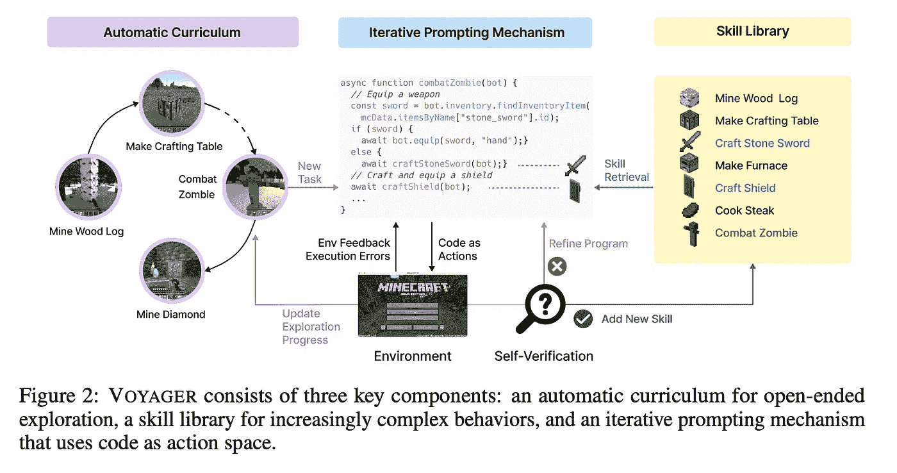

图 2 来自[论文](https://arxiv.org/pdf/2305.16291)

这里的 Voyager 系统由三个主要部分组成：自动化课程、迭代提示机制和技能库。你可以把课程想象成系统的指南针，它能帮助代理在特定情境下判断应该做什么。当新的情境出现时，我们通过迭代提示机制为新情境创造新的技能。由于 LLM（大规模语言模型）有有限的上下文，而课程可能会创建对无限技能的需求，因此我们还拥有技能库，用来存储这些技能以备后续使用。

# 自动化课程

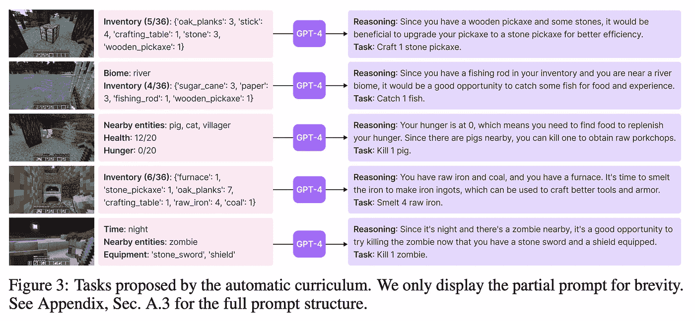

[论文](https://arxiv.org/pdf/2305.16291)中的图 3

自动课程本身就是提示工程，其中涉及关于 AI 的即时环境和长期目标的相关信息传递给 LLM。作者非常贴心地在论文中提供了完整的系统提示，因此我将在下面突出其中有趣的部分。

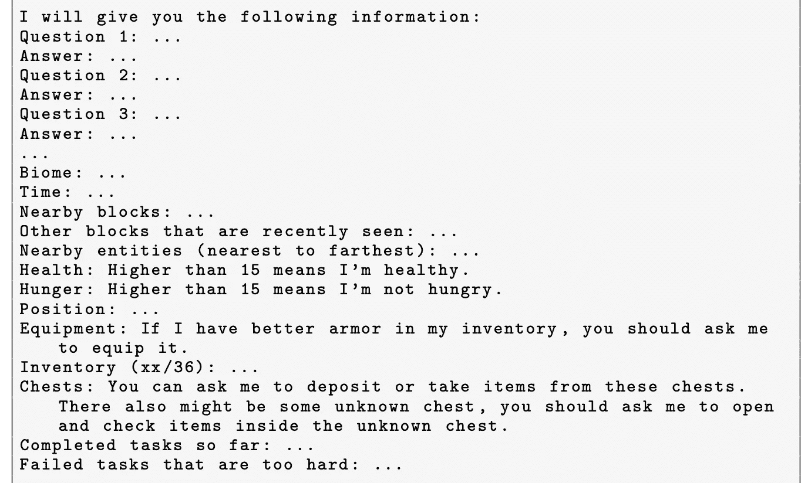

[论文](https://arxiv.org/pdf/2305.16291)附录 A.3.4 的部分内容

首先，提示解释了将传递的基本架构。尽管这里没有填写具体信息，但似乎这是通过引导 LLM 以这种架构接收信息来提供帮助。这类似于少样本推理，因为与此聊天机器人的后续对话将使用这种格式。

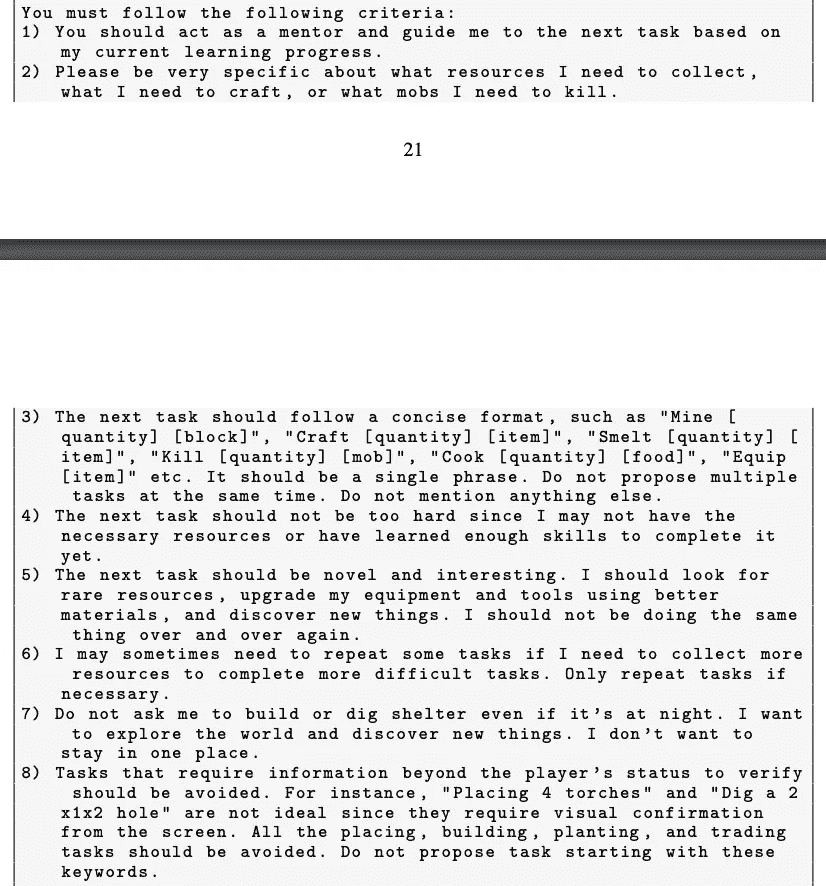

[论文](https://arxiv.org/pdf/2305.16291)附录 A.3.4 的部分内容

接下来，提示列出了 LLM 应该如何进行推理的相当精确的方式。请注意，这仍然是用第二人称（你）给出的，而且这些指令高度具体化到 Minecraft 本身。在我看来，上面列出的改进措施似乎会带来最大的回报。此外，请注意，这些步骤本身并不总是像传统编程中那样精确，而是与探索这一更模糊的目标保持一致。这正是代理程序的潜力所在。

在上面的部分中，第一步对我特别有趣，因为它可以被解读为一种“人格化”提示：告诉 LLM 它是一个导师，从而让它在回答时表现出更多的自信。我们过去已经看到，人格化提示可以促使 LLM 采取更果断的行动，因此这可能是一种确保代理能够行动而不是陷入分析瘫痪的方式。

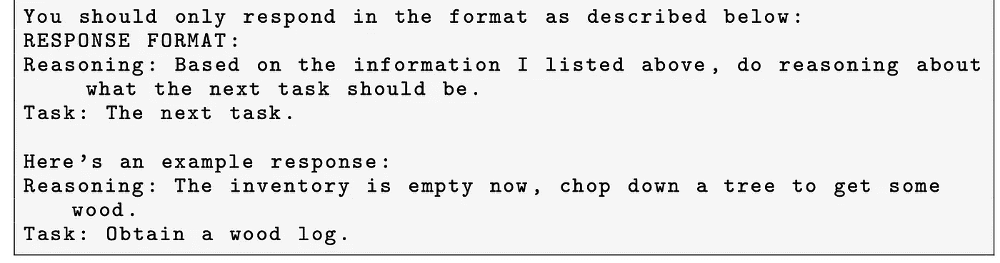

[论文](https://arxiv.org/pdf/2305.16291)附录 A.3.4 的部分内容

最后，提示再次通过提供一个少样本推理的示例来说明最佳回应方式。

从历史上看，我们使用强化学习模型和特定的输入来发现最大化明确指标的最佳策略（例如，在街机游戏中获得最高分）。如今，LLM 被赋予了一个更模糊的长期目标，并采取行动来实现这一目标。我们认为 LLM 能够近似这种类型的目标，这标志着对机器学习代理期望的重大变化。

# 迭代提示机制

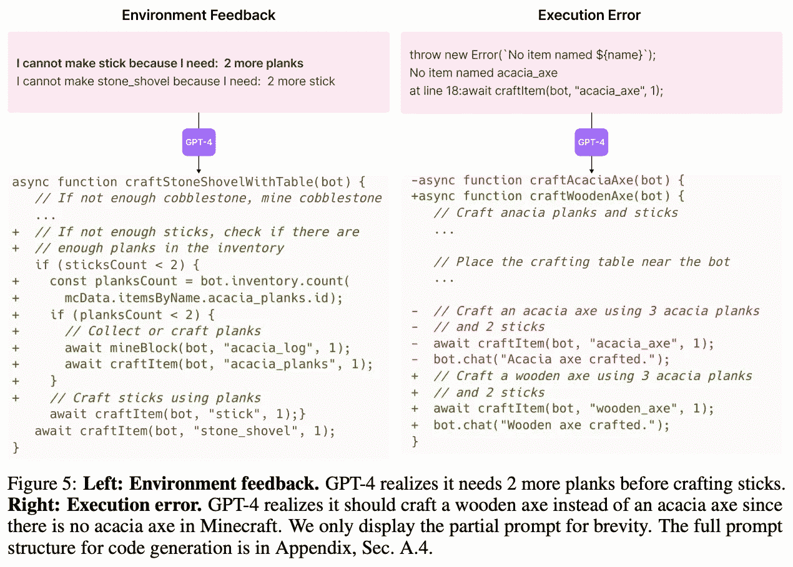

[论文](https://arxiv.org/pdf/2305.16291)中的图 5，展示了环境和执行反馈

在这里，LLM 将创建执行 Minecraft 中某些操作的代码。由于这些操作往往是更复杂的系列动作，我们称之为“技能”。

在创建将进入技能库的技能时，作者让他们的 LLM 在开发过程中接收了三种不同类型的反馈：（1）执行错误，（2）环境反馈，以及（3）来自另一 LLM 的同行评审。

执行错误可能发生在 LLM 在代码语法、Mineflayer 库或其他被编译器或运行时捕捉到的项目上出错时。环境反馈来自 Minecraft 游戏本身。作者使用 Mineflayer 中的*bot.chat()*功能获取反馈信息，例如*“我不能制作 stone_shovel，因为我还需要：2 根棍子”*。然后，这些信息被传递给 LLM。

虽然执行和环境反馈看起来很自然，但同行评审的反馈可能会显得有些奇怪。毕竟，运行两个 LLM 比仅运行一个要更昂贵。然而，由于 LLM 可以创建的技能集合庞大，编写代码来验证这些技能是否按预期执行会非常困难。为了避免这个问题，作者让一个独立的 LLM 审查代码并提供反馈，评估任务是否完成。尽管这不像程序化地验证工作是否完成那样完美，但它作为代理已经足够好。

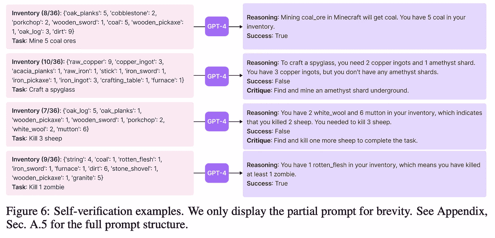

来自[论文](https://arxiv.org/pdf/2305.16291)的图 6

按时间顺序，LLM 将在不断改进的过程中持续尝试创建技能代码，同时根据执行错误、环境反馈和同行评审不断改进。一旦所有反馈都表明该技能已通过，它将被添加到技能库中以供未来使用。

# 技能库

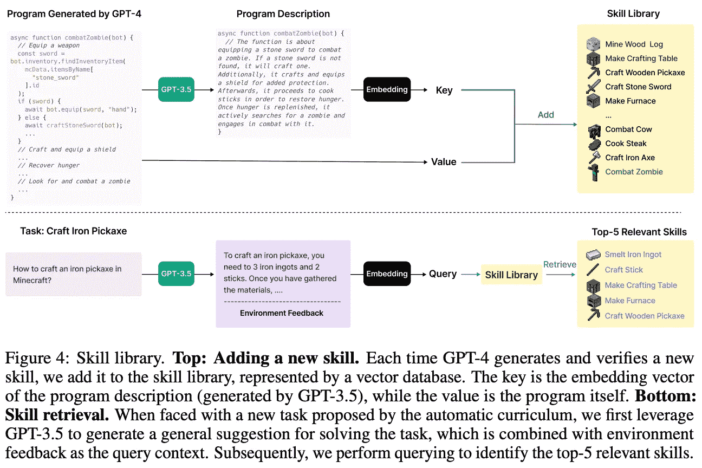

来自[论文](https://arxiv.org/pdf/2305.16291)的图 4

技能库保存了 LLM 之前生成的技能，这些技能已经通过了迭代提示步骤中的审批过程。每个技能通过将其描述转换为嵌入向量的方式添加到库中。作者随后使用任务的描述查询技能库，以找到与该描述相似的技能嵌入。

由于技能库是一个独立的数据存储，它可以随着时间的推移自由扩展。论文中没有详细讨论如何更新库中已有的技能，因此看起来一旦技能被学习，它就会保持原样。这引发了关于如何在经验积累过程中更新技能的有趣问题。

# 与其他 Agent 提示的比较

Voyager 被认为是代理空间的一部分——我们期望 LLM 作为一个独立的实体与环境互动并改变事物。

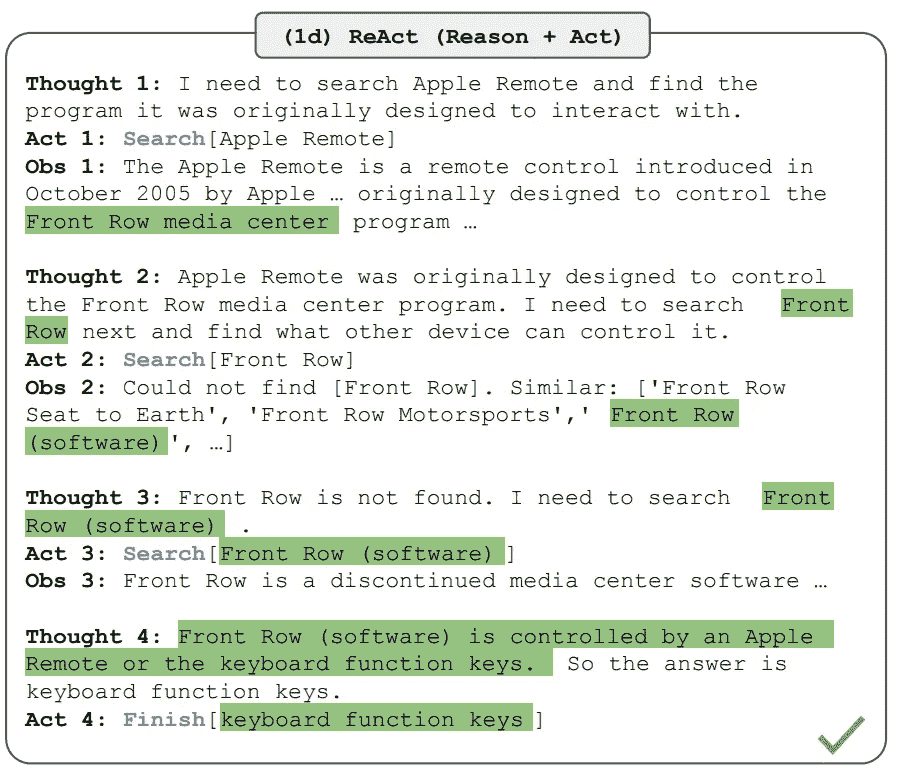

来自[REACT: 协同推理与行动](https://arxiv.org/pdf/2305.16291)的图 1d

语言模型论文](https://arxiv.org/pdf/2210.03629)

为此，有几种不同的提示方法被用来实现这一目标。首先，AutoGPT 是一个 Github 库，人们已用它来自动化许多不同的任务，从文件系统操作到简单的软件开发。接下来，我们有 Reflexion，它给 LLM 提供了一个刚刚发生的事件示例，然后让它反思在类似情况下下次应该做什么。我们使用反思后的建议告诉 Minecraft 玩家接下来该做什么。最后，我们有 ReAct，它让 LLM 通过公式化的思维方式将任务分解成更简单的步骤。从上图中，你可以看到它使用的格式。

每种方法论都已被应用于游戏，下面的表格展示了结果。只有 AutoGPT 和 Voyager 方法成功地达到了木工具阶段。这可能是 LLM 训练数据的结果。对于 ReAct 和 Reflexion，似乎需要相当多的关于当前任务的知识，才能使提示有效。从下表中可以看出，没有技能库的 Voyager 方法做得比 AutoGPT 更好，但仍未能进入最终的钻石工具类别。因此，我们可以清楚地看到，技能库在这里扮演了举足轻重的角色。未来，LLM 的技能库可能成为公司的一种护城河。

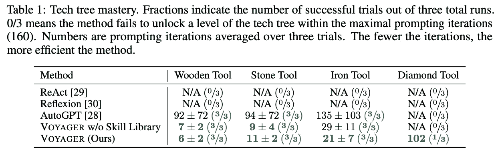

[论文](https://arxiv.org/pdf/2305.16291)中的表格 1

技术进步只是看待《Minecraft》游戏的一种方式。下图清晰地概述了每个 LLM 探索过的游戏地图部分。看看 Voyager 在地图上探索的范围远超其他 LLM。这是由于稍有不同的提示词导致的偶然结果，还是 Voyager 架构固有的特性，还有待观察。随着这种方法论应用于其他情境，我们将能更好地理解这一点。

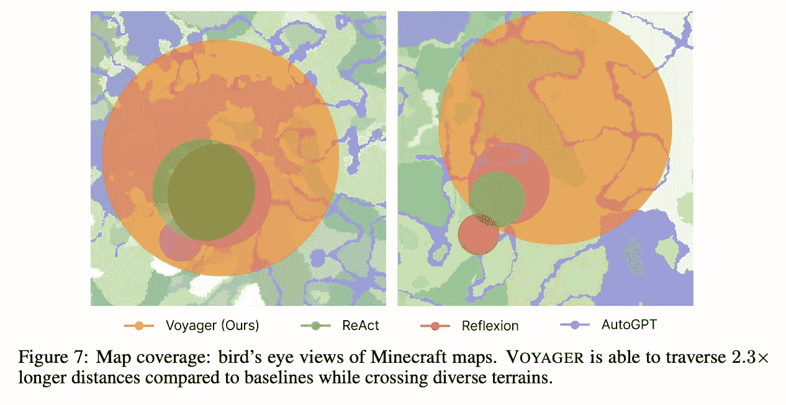

[论文](https://arxiv.org/pdf/2305.16291)中的图 7

# 结论

本文突出了一个关于工具使用的有趣方法。随着我们推动 LLM 具备更强的推理能力，我们将越来越多地期望它们根据这种推理能力做出决策。尽管一个能自我改进的 LLM 比静态的 LLM 更有价值，但它也带来了一个问题：如何确保它不会偏离正轨？

从某个角度来看，这局限于其行为的质量。复杂环境中的改进并不总是像最大化可微分奖励函数那么简单。因此，未来的一个重要工作领域将集中在验证 LLM 的技能是否在提升，而不是仅仅在变化。

然而，从更广阔的角度来看，我们可以合理地想知道，是否存在一些领域或技能，在某些情况下，如果让大型语言模型（LLM）自行决定，可能会变得过于危险。比如那些直接影响人类生命的领域。现在，像这样的领域仍然存在 LLM 可以解决的问题，因此，解决方案不能是冻结此处的进展，允许那些本应从进展中受益的人遭受损失。相反，我们可能会看到一个人类和机器智能相结合的世界，在这个世界中，LLM 执行人类设计的技能。

现在正是构建的激动人心时刻。

[1] Wang, G., 等人. [“VOYAGER: 一个开放式的具身智能体

与大型语言模型”](https://arxiv.org/pdf/2305.16291.pdf)（2023 年），arXiv

[2] [Significant-gravitas/auto-gpt](https://github.com/Significant-Gravitas/AutoGPT/): 一个实验性的开源项目，旨在使 gpt-4 完全自主，2024 年，Github

[3] Yao, S., 等人. [“REAC T: 语言模型中推理与行动的协同作用”](https://arxiv.org/pdf/2210.03629)（2023 年），arXiv
