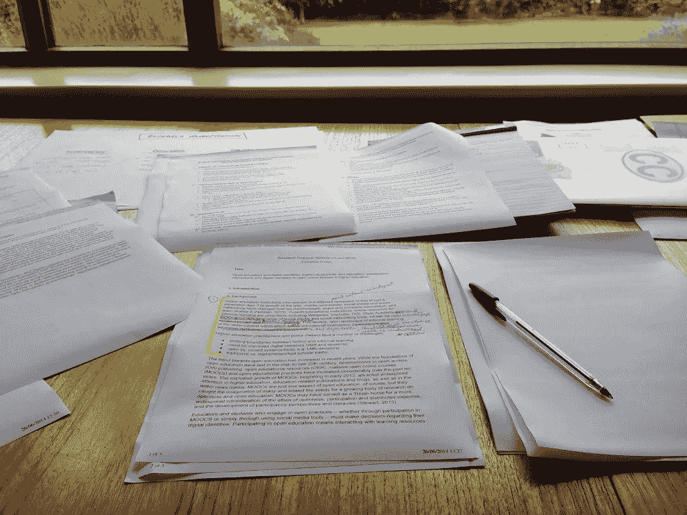
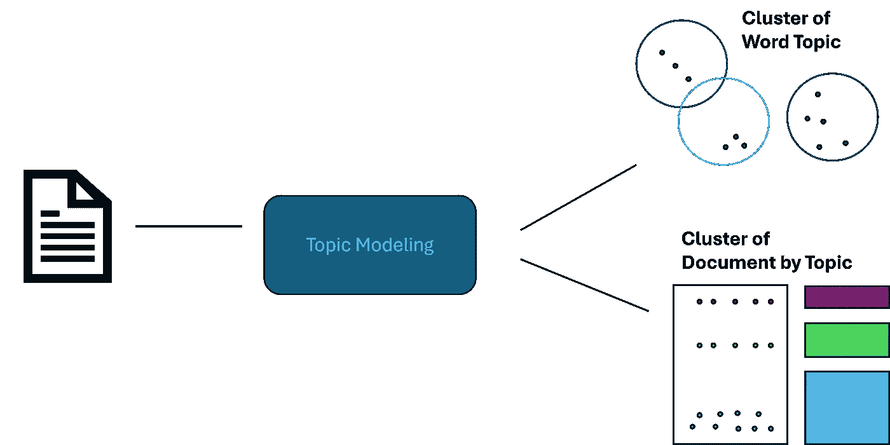
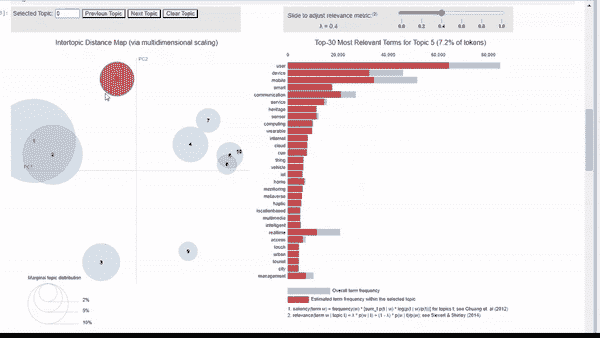

# 使用 OpenAlex API 进行开源研究的主题建模

> 原文：[`towardsdatascience.com/topic-modeling-open-source-research-with-the-openalex-api-5191c7db9156?source=collection_archive---------7-----------------------#2024-07-15`](https://towardsdatascience.com/topic-modeling-open-source-research-with-the-openalex-api-5191c7db9156?source=collection_archive---------7-----------------------#2024-07-15)

## 开源情报（OSINT）是能够为组织带来巨大价值的一项技术。从分析社交媒体数据、网络数据或全球研究中获得的洞察，可以在支持各种分析时发挥重要作用。本文将概述如何使用主题建模来帮助我们理解成千上万的开源研究资料。

[](https://medium.com/@adavis08?source=post_page---byline--5191c7db9156--------------------------------)[](https://towardsdatascience.com/?source=post_page---byline--5191c7db9156--------------------------------) [Alex Davis](https://medium.com/@adavis08?source=post_page---byline--5191c7db9156--------------------------------)

·发表于[Towards Data Science](https://towardsdatascience.com/?source=post_page---byline--5191c7db9156--------------------------------) ·阅读时长 9 分钟·2024 年 7 月 15 日

--



“使用纸张…… #research# #proposal”由[catherinecronin](https://www.flickr.com/photos/catherinecronin/14326101068)授权，采用 CC BY-SA 2.0 许可。要查看此许可证的副本，请访问[`creativecommons.org/licenses/by-sa/2.0/?ref=openverse.`](https://creativecommons.org/licenses/by-sa/2.0/?ref=openverse.)

# **什么是主题建模？**

主题建模是一种无监督的机器学习技术，用于分析文档并通过语义相似性识别“主题”。这类似于聚类，但并非每个文档都独立属于一个主题。它更多的是将语料库中的内容进行分组。主题建模有许多不同的应用，但主要用于更好地理解大量文本数据。



作者提供的图片

例如，一家零售连锁可以对客户调查和评论进行建模，以识别负面评论并深入分析客户提到的关键问题。在这个案例中，我们将导入大量的文章和摘要，以理解数据集中的关键主题。

*注意：在大规模应用中，主题建模可能会消耗大量计算资源。在这个示例中，我使用了 Amazon Sagemaker 环境，以利用其 CPU 的优势。*

# OpenAlex

OpenAlex 是一个免费使用的全球研究目录系统。他们已经索引了超过 2.5 亿篇新闻、文章、摘要等。

[## OpenAlex

### 编辑描述

[openalex.org](https://openalex.org/?source=post_page-----5191c7db9156--------------------------------)

幸运的是，他们提供了一个免费的（但有限制）灵活 API，可以让我们快速获取成千上万篇文章，并且应用过滤条件，如年份、媒体类型、关键词等。

# 创建数据管道

在我们从 API 获取数据时，我们会应用一些标准。首先，我们只会获取年份在 2016 到 2022 年之间的文档。我们希望使用相对较新的语言，因为某些主题的术语和分类法会随着时间的推移发生变化。

我们还将添加关键术语并进行多次搜索。虽然通常我们可能会随机获取不同的主题领域，但我们将使用关键术语来缩小搜索范围。通过这种方式，我们可以了解有多少个高级主题，并将其与模型的输出进行比较。下面，我们创建一个可以添加关键术语并通过 API 进行搜索的函数。

```py
import pandas as pd
import requests
```

```py
def import_data(pages, start_year, end_year, search_terms):

    """
    This function is used to use the OpenAlex API, conduct a search on works, a return a dataframe with associated works.

    Inputs: 
        - pages: int, number of pages to loop through
        - search_terms: str, keywords to search for (must be formatted according to OpenAlex standards)
        - start_year and end_year: int, years to set as a range for filtering works
    """

    #create an empty dataframe
    search_results = pd.DataFrame()

    for page in range(1, pages):

        #use paramters to conduct request and format to a dataframe
        response = requests.get(f'https://api.openalex.org/works?page={page}&per-page=200&filter=publication_year:{start_year}-{end_year},type:article&search={search_terms}')
        data = pd.DataFrame(response.json()['results'])

        #append to empty dataframe
        search_results = pd.concat([search_results, data])

    #subset to relevant features
    search_results = search_results[["id", "title", "display_name", "publication_year", "publication_date",
                                        "type", "countries_distinct_count","institutions_distinct_count",
                                        "has_fulltext", "cited_by_count", "keywords", "referenced_works_count", "abstract_inverted_index"]]

    return(search_results)
```

我们进行 5 次不同的搜索，每次搜索涉及不同的技术领域。这些技术领域受到国防部“关键技术领域”的启发。详情请见：

[](https://www.cto.mil/usdre-strat-vision-critical-tech-areas/?source=post_page-----5191c7db9156--------------------------------) [## USD(R&E)战略愿景与关键技术领域 - 国防部研究与工程，OUSD(R&E)

### OUSD(R&E)与军事服务部门、战区司令部、工业界、学术界以及其他利益相关方紧密合作……

[www.cto.mil](https://www.cto.mil/usdre-strat-vision-critical-tech-areas/?source=post_page-----5191c7db9156--------------------------------)

这是一个使用所需 OpenAlex 语法进行搜索的示例：

```py
#search for Trusted AI and Autonomy
ai_search = import_data(35, 2016, 2024, "'artificial intelligence' OR 'deep learn' OR 'neural net' OR 'autonomous' OR drone")
```

在整理我们的搜索结果并去除重复文档之后，我们必须清理数据，为主题模型做准备。当前输出存在两个主要问题。

1.  摘要以倒排索引的形式返回（出于法律原因）。然而，我们可以利用这些索引返回原始文本。

1.  一旦我们获得原始文本，它将是未经处理的原始数据，产生噪声并影响我们的模型表现。我们将进行传统的 NLP 预处理，以便为模型做好准备。

以下是一个从倒排索引中返回原始文本的函数。

```py
def undo_inverted_index(inverted_index):

    """
    The purpose of the function is to 'undo' and inverted index. It inputs an inverted index and
    returns the original string.
    """

    #create empty lists to store uninverted index
    word_index = []
    words_unindexed = []

    #loop through index and return key-value pairs
    for k,v in inverted_index.items(): 
        for index in v: word_index.append([k,index])

    #sort by the index
    word_index = sorted(word_index, key = lambda x : x[1])

    #join only the values and flatten
    for pair in word_index:
        words_unindexed.append(pair[0])
    words_unindexed = ' '.join(words_unindexed)

    return(words_unindexed)
```

现在我们已经得到了原始文本，我们可以进行传统的预处理步骤，如标准化、去除停用词、词形还原等。下面是可以映射到一系列文档的函数。

```py
def preprocess(text):

    """
    This function takes in a string, coverts it to lowercase, cleans
    it (remove special character and numbers), and tokenizes it.
    """

    #convert to lowercase
    text = text.lower()

    #remove special character and digits
    text = re.sub(r'\d+', '', text)
    text = re.sub(r'[^\w\s]', '', text)

    #tokenize
    tokens = nltk.word_tokenize(text)

    return(tokens)
```

```py
def remove_stopwords(tokens):

    """
    This function takes in a list of tokens (from the 'preprocess' function) and 
    removes a list of stopwords. Custom stopwords can be added to the 'custom_stopwords' list.
    """

    #set default and custom stopwords
    stop_words = nltk.corpus.stopwords.words('english')
    custom_stopwords = []
    stop_words.extend(custom_stopwords)

    #filter out stopwords
    filtered_tokens = [word for word in tokens if word not in stop_words]

    return(filtered_tokens)
```

```py
def lemmatize(tokens):

    """
    This function conducts lemmatization on a list of tokens (from the 'remove_stopwords' function).
    This shortens each word down to its root form to improve modeling results.
    """

    #initalize lemmatizer and lemmatize
    lemmatizer = nltk.WordNetLemmatizer()
    lemmatized_tokens = [lemmatizer.lemmatize(token) for token in tokens]

    return(lemmatized_tokens)
```

```py
def clean_text(text):

    """
    This function uses the previously defined functions to take a string and\
    run it through the entire data preprocessing process.
    """

    #clean, tokenize, and lemmatize a string
    tokens = preprocess(text)
    filtered_tokens = remove_stopwords(tokens)
    lemmatized_tokens = lemmatize(filtered_tokens)
    clean_text = ' '.join(lemmatized_tokens)

    return(clean_text)
```

现在我们已经有了一系列经过预处理的文档，我们可以创建我们的第一个主题模型！

# 创建主题模型

对于我们的主题模型，我们将使用 gensim 创建一个潜在狄利克雷分配（LDA）模型。LDA 是最常见的主题建模模型，因为它在识别语料库中的高层次主题方面非常有效。下面是用于创建模型的包。

```py
import gensim.corpora as corpora
from gensim.corpora import Dictionary
from gensim.models.coherencemodel import CoherenceModel
from gensim.models.ldamodel import LdaModel
```

在创建模型之前，我们必须准备我们的语料库和 ID 映射。这只需要几行代码就能完成。

```py
#convert the preprocessed text to a list
documents = list(data["clean_text"])

#seperate by ' ' to tokenize each article
texts = [x.split(' ') for x in documents]

#construct word ID mappings
id2word = Dictionary(texts)

#use word ID mappings to build corpus
corpus = [id2word.doc2bow(text) for text in texts]
```

现在我们可以创建一个主题模型。如你所见，下面有许多不同的参数会影响模型的表现。你可以在 gensim 的文档中阅读关于这些参数的更多信息。

```py
#build LDA model
lda_model = LdaModel(corpus = corpus, id2word = id2word, num_topics = 10, decay = 0.5,
                     random_state = 0, chunksize = 100, alpha = 'auto', per_word_topics = True)
```

最重要的参数是主题的数量。在这里，我们设置了一个任意的 10。由于我们不知道应该有多少个主题，这个参数肯定需要优化。但我们如何衡量模型的质量呢？

这时，连贯性得分就显得尤为重要。连贯性得分是一个介于 0 和 1 之间的量度。连贯性得分通过确保主题是合理且独特的来衡量我们主题的质量。我们希望在定义明确的主题之间有清晰的边界。虽然这在最终上是有些主观的，但它能让我们对结果的质量有一个很好的了解。

```py
#compute coherence score
coherence_model_lda = CoherenceModel(model = lda_model, texts = texts, dictionary = id2word, coherence = 'c_v')
coherence_score = coherence_model_lda.get_coherence()
print(coherence_score)
```

这里，我们得到了大约 0.48 的连贯性得分，虽然不是太差！但还不能投入生产使用。

# 可视化我们的主题模型

主题模型可能很难进行可视化。幸运的是，我们有一个很棒的模块‘pyLDAvis’，它能够自动生成一个交互式可视化，允许我们在向量空间中查看主题，并深入探讨每个主题。

```py
import pyLDAvis

#create Topic Distance Visualization 
pyLDAvis.enable_notebook()
lda_viz = pyLDAvis.gensim.prepare(lda_model, corpus, id2word)
lda_viz
```

如下所示，这生成了一个很好的可视化图，我们可以快速了解模型的表现。通过查看向量空间，我们可以看到一些主题是明确且定义良好的。然而，也有一些主题是重叠的。



图片来源：作者

我们可以点击一个主题查看最相关的词汇。当我们调整相关性度量（lambda）时，可以通过将其向左滑动来查看特定于主题的词汇，而通过将其向右滑动则可以看到相关但不那么特定于主题的词汇。

当点击每个主题时，我可以隐约看到我最初搜索的主题。例如，主题 5 似乎与我的‘人机界面’搜索一致。也有一簇看起来与生物技术相关的主题，但有些更为明确，有些则不太清楚。

# 优化主题模型

从 pyLDAvis 界面和我们的连贯性得分 0.48 来看，肯定还有提升的空间。在我们的最后一步，先编写一个函数，让我们可以循环通过不同参数的值并尝试优化我们的连贯性得分。下面是一个测试不同主题数量和衰减率值的函数。该函数为每一组参数组合计算连贯性得分并将其保存在数据框中。

```py
def lda_model_evaluation():

    """
    This function loops through a number of parameters for an LDA model, creates the model,
    computes the coherenece score, and saves the results in a pandas dataframe. The outputed dataframe
    contains the values of the parameters tested and the resulting coherence score.
    """

    #define empty lists to save results
    topic_number, decay_rate_list, score  = [], [], []

    #loop through a number of parameters
    for topics in range(5,12):
        for decay_rate in [0.5, 0.6, 0.7]:

                #build LDA model
                lda_model = LdaModel(corpus = corpus, id2word = id2word, num_topics = topics, decay = decay_rate,
                               random_state = 0, chunksize = 100, alpha = 'auto', per_word_topics = True)

                #compute coherence score
                coherence_model_lda = CoherenceModel(model = lda_model, texts = texts, dictionary = id2word, coherence = 'c_v')
                coherence_score = coherence_model_lda.get_coherence()

                #append parameters to lists
                topic_number.append(topics)
                decay_rate_list.append(decay_rate)
                score.append(coherence_score)

                print("Model Saved")

    #gather result into a dataframe
    results = {"Number of Topics": topic_number,
                "Decay Rate": decay_rate_list,
                "Score": score}

    results = pd.DataFrame(results)

    return(results) 
```

通过将几个小范围的值传递给两个参数，我们找出了能够将我们的连贯性得分从 0.48 提高到 0.55 的参数，取得了显著的改善。

# 下一步

为了继续构建一个生产级别的模型，我们需要在参数上进行大量实验。由于 LDA 计算开销较大，我将上述实验限定在比较大约 20 个不同的模型。但如果有更多的时间和计算能力，我们可以比较数百个模型。

此外，我们的数据管道也有待改进。我注意到有几个词可能需要添加到停用词列表中。像“use”和“department”这样的词并没有提供任何语义价值，特别是对于不同技术领域的文档来说。还有一些技术术语未能正确处理，结果变成了单个字母或一组字母。我们可以花一些时间做一个词袋分析，以识别这些停用词机会。这将有助于减少数据集中的噪音。

# 结论

在本文中，我们：

1.  了解了主题建模和 OpenAlex 数据源的基本概念

1.  构建了一个数据管道，用于从 API 中获取数据并为 NLP 模型做准备

1.  构建了一个 LDA 模型，并使用 pyLDAvis 可视化结果

1.  编写了代码来帮助我们找到最优参数

1.  讨论了模型改进的下一步

*这是我在 Medium 上的第一篇文章，希望你喜欢。请随时留下反馈、提问或提出其他话题的请求！*
