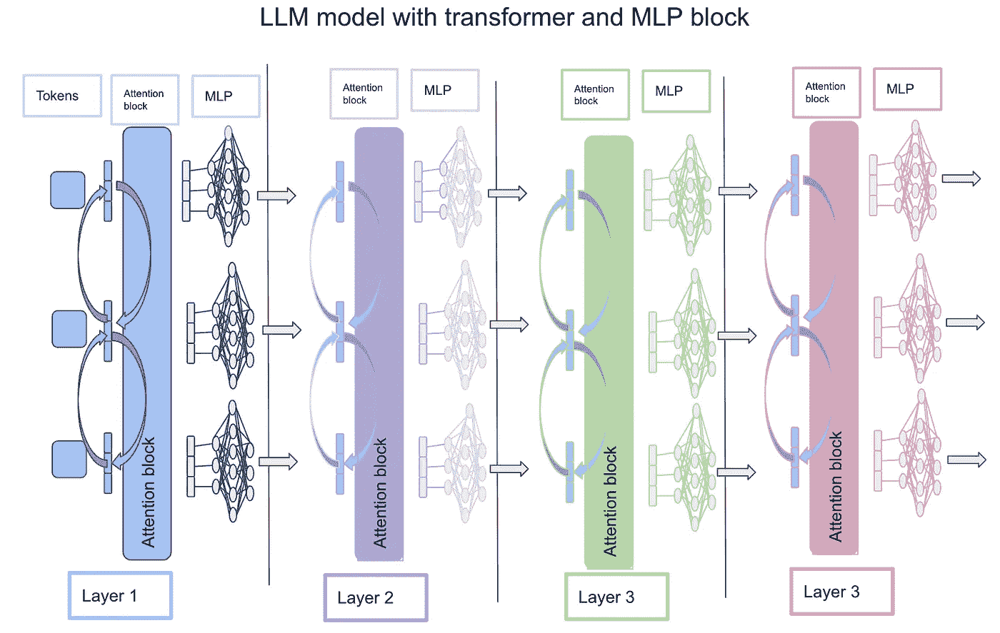
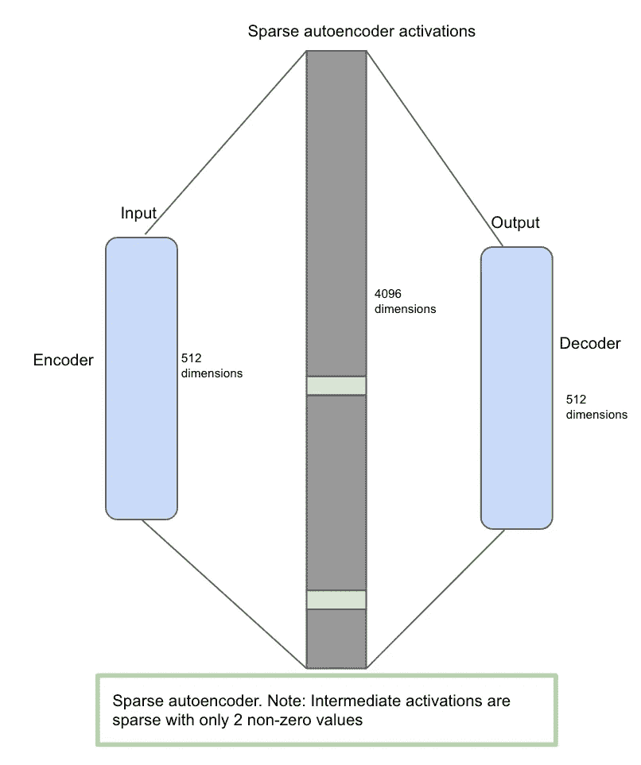
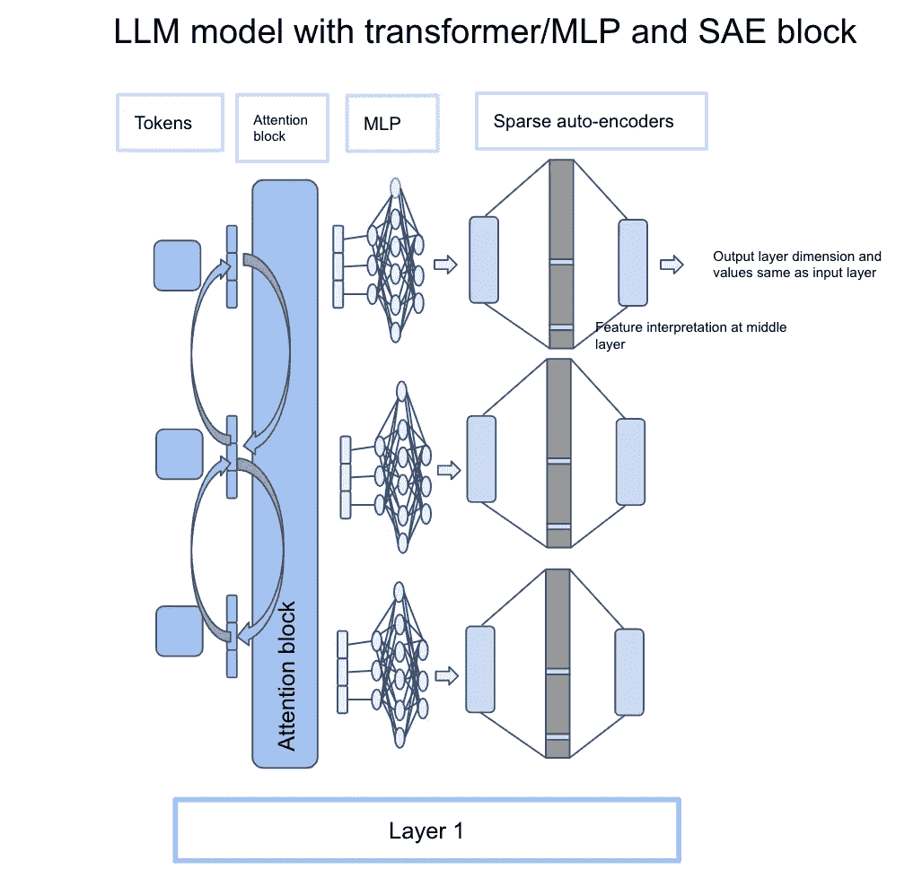
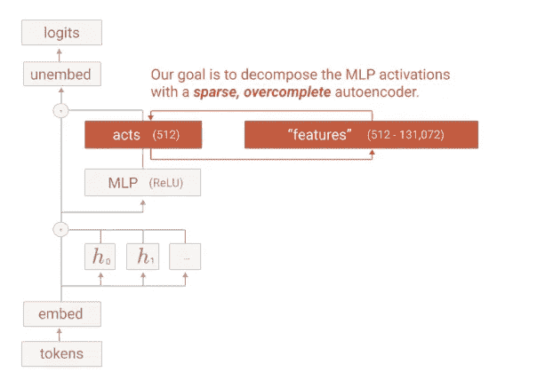

# 走向单一语义性：理解大型语言模型的一步

> 原文：[`towardsdatascience.com/towards-monosemanticity-a-step-towards-understanding-large-language-models-e7b88380d7b3?source=collection_archive---------8-----------------------#2024-07-11`](https://towardsdatascience.com/towards-monosemanticity-a-step-towards-understanding-large-language-models-e7b88380d7b3?source=collection_archive---------8-----------------------#2024-07-11)

## 理解机械解释性研究问题并逆向工程这些大型语言模型

 [Anish Dubey](https://medium.com/@anishdubey?source=post_page---byline--e7b88380d7b3--------------------------------)

·发表于 [Towards Data Science](https://towardsdatascience.com/?source=post_page---byline--e7b88380d7b3--------------------------------) ·10 分钟阅读·2024 年 7 月 11 日

--

# 背景

人工智能研究人员的一个主要迫切问题是理解这些大型语言模型如何工作。从数学角度来看，我们已经有了一个很好的答案，了解不同神经网络权重如何相互作用并产生最终答案。但直观地理解这些模型是人工智能研究人员要回答的核心问题之一。这非常重要，因为除非我们理解这些大型语言模型的工作原理，否则很难解决诸如 LLM 对齐和人工智能安全性等问题，或将 LLM 建模以解决特定问题。理解大型语言模型如何工作的这一问题被定义为一种机械解释性研究问题，核心思想是我们如何逆向工程这些大型语言模型。

Anthropic 是在理解这些大型模型方面取得重大进展的公司之一。主要问题是，除了数学角度，如何理解这些模型的工作原理。2023 年 10 月，他们发布了这篇论文：*走向单一语义性：通过字典学习分解语言模型*（[*链接*](https://transformer-circuits.pub/2023/monosemantic-features)）。这篇论文旨在解决这一问题，并建立对这些模型工作原理的基本理解。

以下文章旨在捕捉高层次的基本概念，并为理解 *“走向单一语义性：通过字典学习分解语言模型”* 论文打下坚实的基础。

论文开篇提出了一个复杂的术语，“*走向单一语义性*”。让我们直接深入探讨，理解这意味着什么。

# 什么是单一语义性与多重语义性？

大型语言模型的基本单元是由神经元组成的神经网络。因此，神经元是整个大型语言模型（LLM）的基本单元。然而，经过检查，我们发现神经元在神经网络中会对不相关的概念发生反应。例如：在视觉模型中，一个神经元同时响应*“猫的脸”*和*“汽车的前脸”*。这个概念被称为*“多义性”*。这意味着神经元可以对不相关的输入的混合产生反应。这使得问题变得非常复杂，因为神经元本身不能用来分析模型的行为。如果一个神经元仅响应猫的脸，而另一个神经元响应汽车的前脸，那就好了。如果一个神经元只对一个特征发生反应，这种特性将被称为“*单义性*”。

因此，论文的第一部分，“*朝向单义性*”，意味着如果我们能从多义性转向单义性，这将有助于我们更深入地理解神经网络。

# 如何超越神经元进一步发展？

现在，关键问题是，如果神经元对不相关的概念发生反应，这意味着网络需要学习一个更基础的数据表示。我们来看一个例子：“猫”和“汽车”。猫可以表示为“动物、毛发、眼睛、四肢、移动”的组合，而汽车则可以表示为“轮子、座椅、矩形、前灯”的组合。这是第一层表示。这些表示可以进一步细分为抽象概念。我们来看“眼睛”和“前灯”。眼睛可以表示为“圆形、黑色、白色”，而前灯可以表示为“圆形、白色、光”。正如你所看到的，我们可以进一步构建这个抽象表示，并注意到两个非常不相关的事物（猫和汽车）开始共享一些表示。这只有两层深，如果我们假设表示深度为 8x、16x 或 256x 层，很多事物将用非常基础的抽象概念表示（这些概念对人类来说难以解释），但这些概念将在不同的实体之间共享。

作者使用了术语“*特征*”来表示这个概念。根据论文，每个神经元可以存储许多不相关的特征，因此会对完全不相关的输入产生反应。

# 如果一个神经元存储许多特征，如何获得特征级别的表示？

答案总是要扩展规模。如果我们认为一个神经元存储了 5 个不同的特征，那么我们能否将这个神经元拆分成 5 个独立的神经元，每个子神经元代表一个特征？***这就是论文的核心思想***。

以下图像展示了论文核心思想的表示。*“观察到的模型”*是实际存储多个特征信息的模型。它被称为某个假设的大型网络的低维投影。大型网络是一个假设的解耦模型，表示每个神经元映射到一个特征并显示出*“单义性”*行为。

有了这个，我们可以说，无论我们训练的是哪个模型，总会有一个更大的模型可以实现数据和特征之间的 1:1 映射，因此我们需要学习这个更大的模型，以便向单一语义性迈进。

图片来自[`transformer-circuits.pub/2023/monosemantic-features`](https://transformer-circuits.pub/2023/monosemantic-features)

现在，在进入技术实现之前，让我们回顾一下至今为止的信息。神经元是神经网络中的基本单元，但它包含多个数据特征。当数据（令牌）被分解成更小的抽象概念时，这些被称为特征。如果一个神经元存储多个特征，我们需要一种方式将每个特征与其神经元关联，以确保每个特征只有一个神经元激活。这种方法将帮助我们向“*单一语义性*”迈进。数学上，这意味着我们需要更多的扩展，因为我们需要更多的神经元将数据转化为特征。

在我们掌握了基本的核心思想后，接下来让我们探讨一下如何构建这些技术实现。

# 技术设置

由于我们已经确定需要更多的扩展，目标是在多层感知机（MLP）之后扩展输出。在讨论如何扩展之前，让我们快速回顾一下 LLM 模型如何与 Transformer 和 MLP 模块一起工作。

下面的图片展示了 LLM 模型如何与 Transformer 和 MLP 模块协同工作。核心思想是每个令牌通过嵌入（向量）表示，并传递到注意力模块，该模块计算不同令牌之间的注意力。注意力模块的输出维度与每个令牌的输入维度相同。然后，来自注意力模块的每个令牌输出经过多层感知机（MLP）进行扩展，再缩小到与输入令牌相同的大小。这个过程会重复多次，直到产生最终输出。在 chat-GPT-3 的情况下，有 96 层执行这个操作。这与 Transformer 架构的工作原理相同。详情请参阅*“Attention is all you need”*论文。[链接](https://arxiv.org/abs/1706.03762)

图片由作者提供

现在，在基本架构已经搭建完成后，让我们更深入地了解什么是稀疏自编码器。作者使用了*“稀疏自编码器”*来进行放大和缩小，因此这些成为了理解的基础模块。

# 稀疏自编码器

稀疏自动编码器本身就是神经网络，但包含三个阶段（编码器、居中的稀疏激活和解码器）。其思想是，自动编码器接收一个 512 维的输入，将其缩放到一个 4096 的中间层，然后再压缩为 512 维的输出。当一个 512 维的输入到达时，它会通过编码器，编码器的任务是从数据中提取特征。接下来，它被映射到一个高维空间（稀疏自动编码器激活层），在这个空间中，只允许少量非零值，因此被认为是稀疏的。这里的想法是强迫模型在高维空间中学习少量特征。最后，矩阵被强制映射回解码器（512 维），以重构与编码器输入相同的大小和值。

下图表示了稀疏自动编码器（SAE）架构。

图片来自作者

在基本的变换器架构和稀疏自动编码器解释完毕后，让我们尝试理解稀疏自动编码器如何与变换器块集成以实现可解释性。

# 稀疏自动编码器（SAE）是如何与大语言模型（LLM）集成的？

大语言模型（LLM）基于一个变换器块，这是一个注意力机制，后面接着一个 MLP（多层感知机）块。其思路是从 MLP 获取输出并将其输入稀疏自动编码器块。举个例子：“Golden Gate was built in 1937”。“Golden”是第一个词元，它通过注意力块解析，然后进入 MLP 块。经过 MLP 块后的输出与输入的维度相同，但由于注意力机制，它将包含句子中其他词的上下文。现在，来自 MLP 块的相同输出向量成为稀疏自动编码器的输入。每个词元都有自己的 MLP 输出维度，也可以输入到 SAE 中。下图传达了这一信息，以及它如何与变换器块集成。

图片来自作者

旁注：下面的图片在论文中非常著名，传达的信息与上述部分相同。它接收来自 MLP 层的激活向量，并将其输入稀疏自动编码器进行特征缩放。希望通过上面的解释，下面的图片会更容易理解。

图片来源于 [`transformer-circuits.pub/2023/monosemantic-features`](https://transformer-circuits.pub/2023/monosemantic-features)

现在，我们已经理解了稀疏自动编码器与大语言模型（LLM）集成的架构，基本问题是这些稀疏自动编码器是如何训练的？由于这些也是神经网络，这些模型也需要进行训练。

# 自动编码器是如何训练的？

自编码器的数据集来自于 LLM 本身。当使用一个词汇训练 LLM 模型时，每个词汇在每个 MLP 层后的输出，即激活向量，会被存储。因此，我们有一个来自词汇的输入（512 大小）和来自 MLP 激活层的输出（512 大小）。我们可以在不同上下文中收集相同词汇的不同激活。在论文中，作者为相同的词汇收集了 256 个不同上下文的激活。这为相同的词汇在不同上下文设置中的表示提供了良好的基础。

一旦选择了输入，SAE 就会针对输入和输出进行训练（输入与来自 MLP 激活层（512 大小）的输出相同，输出与输入相同）。由于输入等于输出，SAE 的任务是通过稀疏激活（1–2 个非零值）将 512 大小的信息提升至 4096 大小，然后再转换回 512 大小。由于这是一个上升过程，但在重构信息时需要对 1–2 个非零值进行惩罚，这就是学习发生的地方，模型被迫为特定数据/词汇学习 1–2 个特征。

直观上，这是一个非常简单的问题，模型很容易学习。输入与输出相同，中间层比输入和输出层更大。模型可以学习相同的映射，但我们对中间层中的少数非零值引入了惩罚。现在，它变成了一个困难的问题，因为输入与输出相同，但中间层只有 1–2 个非零值。因此，模型必须显式地在中间层学习数据代表了什么。这就是数据被分解为特征，并且特征在中间层中被学习的地方。

通过以上理解，我们现在准备好处理特征可解释性的问题了。

# 特征可解释性

训练完成后，我们现在进入推理阶段。这就是解释开始的地方。LLM 模型的 MLP 层输出被输入到 SAE 中。在 SAE 中，只有少数（1–2）块被激活。这是 SAE 的中间层。在这里，需要人工检查以查看中间层中哪个神经元被激活。

示例：假设有 2 种上下文被输入到 LLM 中，我们的任务是确定何时触发“*Golden*”这一词汇。上下文 1：“Golden Gate 是 1937 年建成的”，上下文 2：“Golden Gate 位于旧金山”。当两个上下文同时输入到 LLM 中，并且提取“*Golden*”词汇在上下文 1 和上下文 2 中的输出，并将其输入到 SAE 时，SAE 的中间层应该只有 1–2 个特征被激活。假设这个特征编号是 1345（从 4096 中随机分配的数字）。这表示当在输入列表中提到 Golden Gate 时，特征 1345 被触发。这意味着特征 1345 代表了*“Golden Gate”*的上下文。

因此，这是解释 SAE 特征的一种方式。

# 当前方法的局限性

**测量**：主要瓶颈在于特征的解释。在上述例子中，需要人工判断是否 1345 属于金门大桥，并通过多个上下文进行测试。没有任何数学损失函数公式能够定量地回答这个问题。这是机械可解释性领域在确定如何衡量机器进展是否可解释时面临的主要瓶颈之一。

**扩展性**：另一个方面是扩展性，因为在每一层训练稀疏自编码器（SAE）时，参数是原来的四倍，这对内存和计算资源要求极高。随着主模型参数的增加，扩展稀疏自编码器变得更加困难，因此也存在关于使用稀疏自编码器的扩展性问题。

总体来说，这是一次令人着迷的旅程。我们从一个模型出发，理解了其可解释性方面的细微差别，并探讨了为什么神经元尽管是一个基本单元，但仍不是理解的根本单元。我们进一步深入探讨了数据是如何由特征构成的，以及是否有方法学习这些特征。我们了解了稀疏自编码器如何帮助学习特征的稀疏表示，并且它可以成为特征表示的构建块。最后，我们学习了如何训练稀疏自编码器，并在训练后，如何在推理阶段使用稀疏自编码器来解释特征。

# 结论

机械可解释性领域仍有很长的路要走。然而，Anthropic 在引入稀疏自编码器方面的当前研究，已是朝着可解释性迈出的重要一步。该领域仍然面临测量和扩展性挑战，但迄今为止，已是机械可解释性领域中最优秀、最先进的研究之一。

## 参考文献

+   [`transformer-circuits.pub/2023/monosemantic-features`](https://transformer-circuits.pub/2023/monosemantic-features)

+   [`www.lesswrong.com/posts/CJPqwXoFtgkKPRay8/an-intuitive-explanation-of-sparse-autoencoders-for`](https://www.lesswrong.com/posts/CJPqwXoFtgkKPRay8/an-intuitive-explanation-of-sparse-autoencoders-for)

+   [`www.dwarkeshpatel.com/p/dario-amodei`](https://www.dwarkeshpatel.com/p/dario-amodei)
