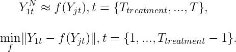
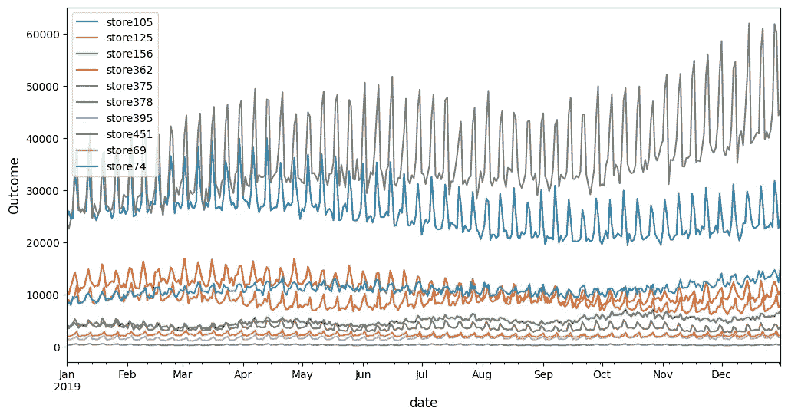
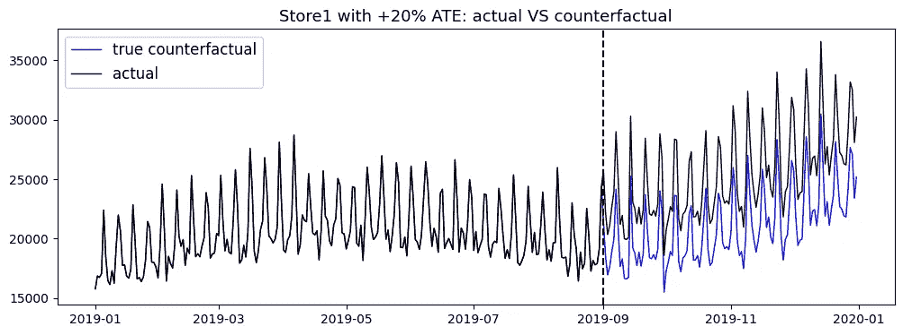
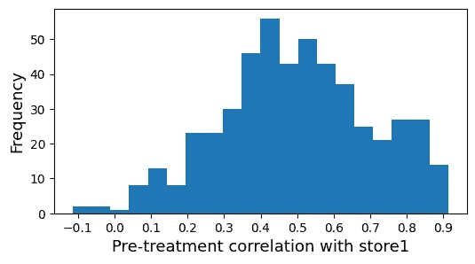
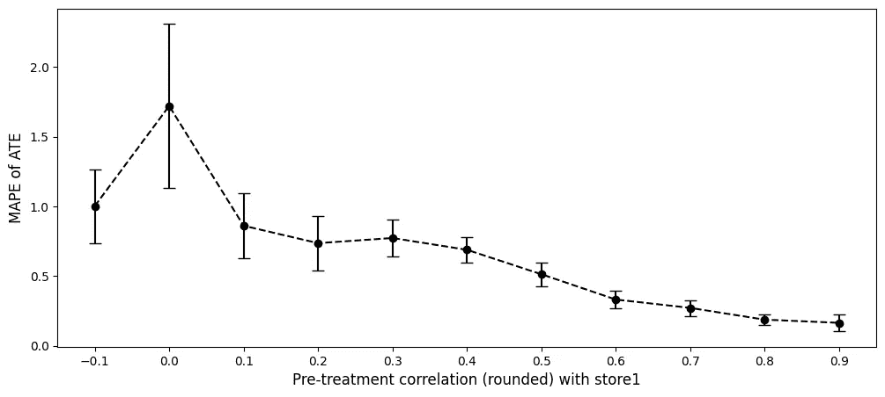
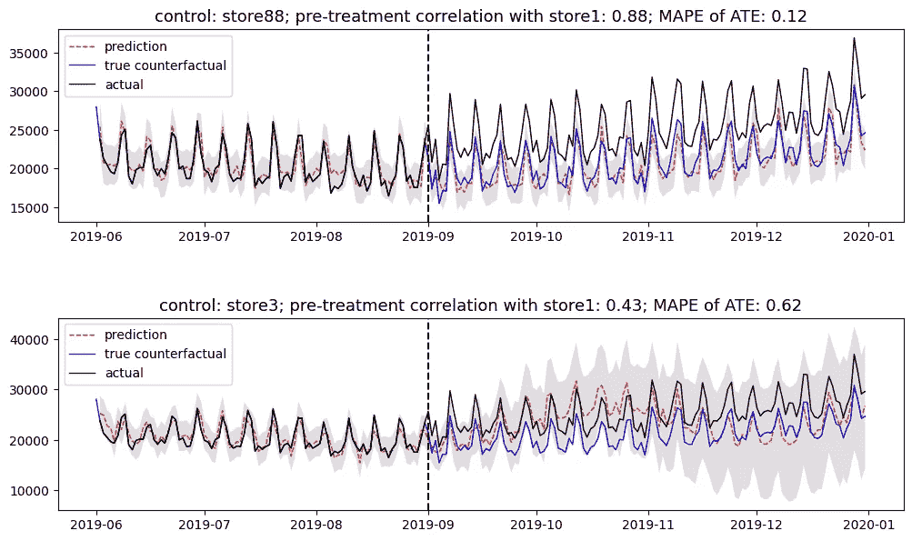
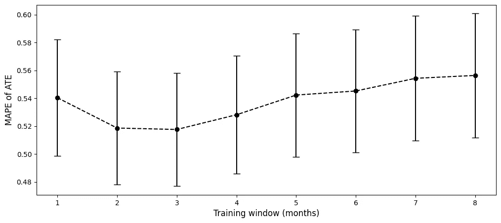
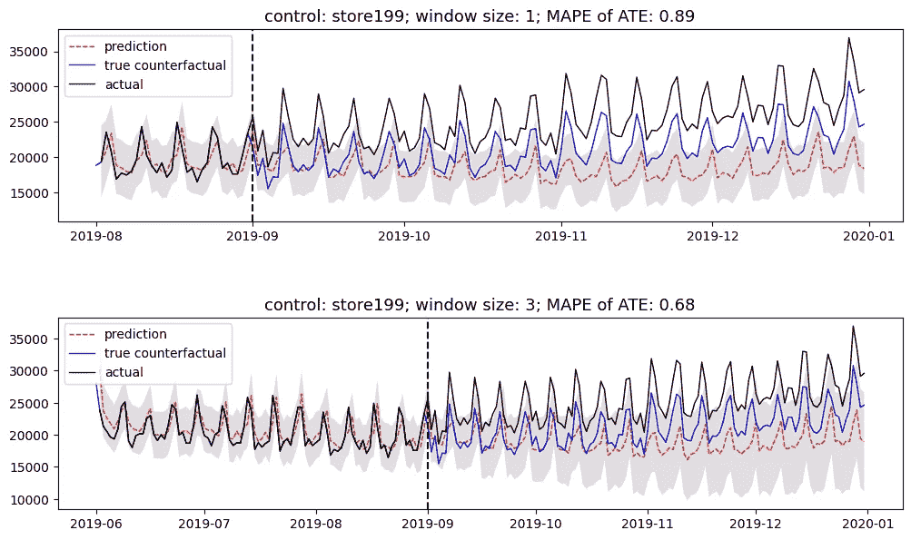
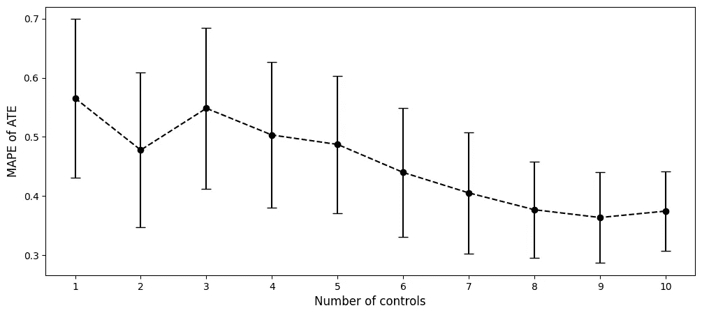
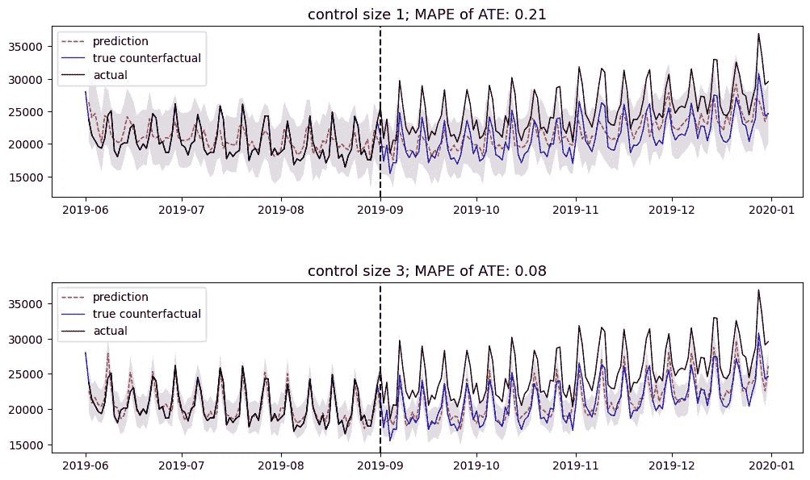

# 朝着可靠的合成控制

> 原文：[`towardsdatascience.com/towards-reliable-synthetic-control-156106a1a7cb?source=collection_archive---------10-----------------------#2024-04-16`](https://towardsdatascience.com/towards-reliable-synthetic-control-156106a1a7cb?source=collection_archive---------10-----------------------#2024-04-16)

## 使估计的处理效应接近真实值

[](https://medium.com/@hangyu_5199?source=post_page---byline--156106a1a7cb--------------------------------)[](https://towardsdatascience.com/?source=post_page---byline--156106a1a7cb--------------------------------) [Hang Yu](https://medium.com/@hangyu_5199?source=post_page---byline--156106a1a7cb--------------------------------)

·发表于[Towards Data Science](https://towardsdatascience.com/?source=post_page---byline--156106a1a7cb--------------------------------) ·阅读时间 7 分钟·2024 年 4 月 16 日

--


图片由[Jørgen Håland](https://unsplash.com/@jhaland?utm_source=medium&utm_medium=referral)提供，来源于[Unsplash](https://unsplash.com/?utm_source=medium&utm_medium=referral)

## 介绍

近年来，合成控制（SC）方法在工业界得到了越来越广泛的应用，特别是在无法进行随机对照试验（RCTs）时，用于衡量干预的平均处理效应（ATE）。一个例子是衡量户外广告牌的财务影响，而在实践中我们无法进行随机处理分配。

SC 的基本思路是通过将处理组与预测的反事实进行比较来估计 ATE。然而，在实际应用 SC 时，通常会面临其有效性知识有限的问题，因为在现实世界中缺乏真实的反事实。为了解决这一问题，本文将讨论一些可行的最佳实践，以帮助最大限度地提高 SC 估计的可靠性。

这些见解和结论是通过基于多样化合成数据的实验得出的。用于数据生成、因果推断建模和分析的代码可以在托管于[Github](https://github.com/simon19891101/ML_experiments/blob/main/sc_reliability.ipynb)的 Jupyter 笔记本中找到。

## 简明的合成控制

测量这种事件的 ATE 的关键是识别处理组的反事实，即在没有处理的情况下的处理组，并量化两者之间的处理后差异。对于随机对照试验（RCTs）而言，这是简单的，因为随机化对照在统计上接近反事实。然而，在其他情况下，由于处理组和对照组在实验前的统计量不均等，问题变得更具挑战性。

作为一种因果推断技术，合成控制（SC）通过基于一些未处理的对照单元创建的合成对照组来表示反事实。这个合成对照组在处理前在统计上等同于处理组，并且预计能够接近处理组在处理后的未处理行为。数学表达如下，它是通过最小化处理组与由*f*合成的对照组之间的处理前差异来创建的，参数通过此方法获得[1]：



在实验中，存在 J 组，其中第 1 组是处理组，其他是对照组。每组在时间 t 的观察结果用 Yjt 表示。f 是模型，Y1t^N 表示反事实。图像来源：作者。

在实践中，*f*函数的常用选项包括但不限于加权和[1]、贝叶斯结构时间序列（BSTS）[2]等。

## 迈向可靠的合成控制的行动

尽管有坚实的理论基础，实际上应用合成控制（SC）通常面临一个挑战，那就是我们无法确定估计的平均处理效应（ATE）有多准确，因为现实中没有后处理反事实来验证合成的反事实。然而，我们可以采取一些措施来优化建模过程，并最大化可靠性。接下来，我将描述这些措施，并通过一系列基于合成时间序列数据的实验，展示它们如何影响估计的 ATE，这些数据具有不同的时间特征。

**实验设置**

本文中展示的所有实验都基于合成时间序列数据。这些数据是使用*timeseries-generator*包生成的，该包产生的时间序列捕捉了包括 GDP、假期、周末等在内的现实世界因素。

[](https://github.com/Nike-Inc/timeseries-generator/tree/master?source=post_page-----156106a1a7cb--------------------------------) [## GitHub — Nike-Inc/timeseries-generator: 一个通过…

### 一个通过易于使用的因子和生成器生成合成时间序列数据的库 — Nike-Inc/timeseries-generator

github.com](https://github.com/Nike-Inc/timeseries-generator/tree/master?source=post_page-----156106a1a7cb--------------------------------)

数据生成旨在模拟新西兰商店在 2019 年 01 月 01 日至 2019 年 12 月 31 日期间的活动表现。为了使潜在的结论在统计上具有显著性，生成了 500 个时间序列来代表商店。每个时间序列都具有统计随机化的线性趋势、白噪声、商店因素、假日因素、工作日因素和季节性。下方展示了 10 家商店的随机样本。



新西兰 10 家商店的随机抽样合成时间序列。图片来自作者。

选择 store1 作为治疗组，而其他商店作为控制组。接下来，从 2019 年 09 月 01 日起将 store1 的结果提升 20% 来模拟处理后的行为，而其原始结果则作为真实反事实。这个 20% 的提升建立了实际的 ATE，随后用于验证后续操作。

```py
cutoff_date_sc = '2019-09-01'
df_sc.loc[cutoff_date_sc:] = df_sc.loc[cutoff_date_sc:]*1.2
```

下图可视化了模拟的治疗效应和治疗组的真实反事实。



store1 的模拟 ATE 为 +20%，以及其真实反事实。图片来自作者。

给定合成数据，采用 Causalimpact 中的 BSTS 来估算合成的 ATE。然后，通过使用平均绝对百分比误差（MAPE）将估算值与实际 ATE 进行比较，以评估相应的操作。

[](https://github.com/jamalsenouci/causalimpact/tree/master?source=post_page-----156106a1a7cb--------------------------------) [## GitHub — jamalsenouci/causalimpact：CausalImpact R 库的 Python 移植版

### CausalImpact R 库的 Python 移植版。通过在…上创建帐户，贡献 jamalsenouci/causalimpact 开发。

github.com](https://github.com/jamalsenouci/causalimpact/tree/master?source=post_page-----156106a1a7cb--------------------------------)

接下来，让我们逐步介绍相关实验的操作，看看如何生成可靠的 ATE 估算。

**治疗-控制相关性**

实现可靠 ATE 估算的第一个步骤是选择与治疗组表现出高预处理相关性的控制组。其理由是，高度相关的控制组可能会随着时间的推移持续地与未处理的治疗组相似。

为了验证这个假设，让我们评估使用每个单独的控制组及其自 2019 年 01 月 01 日以来的完整数据所产生的 ATE 估计，以了解相关性的影响。首先，计算治疗组（store1）与控制组（store2 到 499）之间的相关系数 [3]。

```py
def correlation(x, y):
    shortest = min(x.shape[0], y.shape[0])
    return np.corrcoef(x.iloc[:shortest].values, y.iloc[:shortest].values)[0, 1]
```

如下图所示，相关性的分布范围从 -0.1 到 0.9，这为跨各种场景的影响提供了全面的理解。



预处理相关性的分布。图片来自作者。

然后，使用每个单独的对照组来预测反事实，估计 ATE，并报告 MAPE。在下图中，ATE 的平均 MAPE 及其 95%置信区间与相应的前期相关性一起绘制。这里，相关系数四舍五入到小数点后一位，以便汇总并提高分析中的统计显著性。从结果来看，明显可以看出，当对照组与治疗组的相关性增加时，估计显示出更高的可靠性。



不同相关性水平下 ATE 的 MAPE。图片来源：作者。

现在让我们来看一些展示前期相关性影响的例子：store88 的相关性为 0.88，MAPE 为 0.12，优于 store3 相关性为 0.43 时的 0.62。除了令人鼓舞的准确性外，相应的概率区间也很窄，这意味着预测的确定性较高。



示例展示相关性的影响。图片来源：作者。

**模型拟合窗口**

接下来，拟合窗口，即用于拟合模型的前期时间段，需要正确配置。这是因为过多的上下文可能导致失去时效性，而不足的上下文可能导致过拟合。

为了理解拟合窗口如何影响 ATE 估计的准确性，实验了从治疗日期前 1 个月到 8 个月之间的多种值。对于每个拟合窗口，单独评估 499 个对照组中的每一个单位，然后汇总计算带有 95%置信区间的平均 MAPE。如下面的图所示，存在一个接近 2 到 3 个月的最佳区间，可以优化可靠性。识别最优点超出了本讨论的范围，但值得注意的是，训练窗口需要精心选择。



不同训练窗口下 ATE 的 MAPE。图片来源：作者。

该图展示了两个例子：当对照组 199 的拟合窗口从 1 个月增加到 3 个月时，其 MAPE 从 0.89 降至 0.68，因为短窗口包含的知识不足以生成反事实。



示例展示训练窗口的影响。图片来源：作者。

**对照组数量**

最后，所选对照组的数量也很重要。

通过调查不同控制数量（从 1 到 10）的估计准确性来验证这一假设。具体而言，对于每个控制数，计算基于 50 个随机控制集产生的估计值的平均 MAPE，每个控制集包含相应数量的控制组。此操作避免了不必要地枚举每一种可能的控制组合，同时在统计上控制了相关性。此外，每个估计的拟合窗口设置为 3 个月。

从下面的结果来看，增加控制数量总体上有助于更可靠的 ATE 估计。



不同控制数量下 ATE 的 MAPE。图片由作者提供。

以下示例展示了该效应。第一个估计使用 store311 生成，而第二个估计进一步加入了 store301 和 store312。



下面的示例展示了控制变量数量的影响。图片由作者提供。

## 结论

在本文中，我讨论了使 SC 估计更可靠的可能方法。基于各种合成数据的实验，前期处理的相关性、拟合窗口和控制单元数量被认为是优化估计的关键方向。寻找每个方法的最优值不在本讨论的范围之内。然而，如果你感兴趣，可以使用隔离的空白期进行参数搜索进行验证 [4]，这是一种可能的解决方案。

*除非另有说明，所有图片均由作者制作。讨论内容的灵感来源于伟大的著作《合成控制法的应用》[1]。*

## 参考文献

[1] Abadie, Alberto, 和 Jaume Vives-i-Bastida. “合成控制法的应用。” *arXiv 预印本 arXiv:2203.06279* (2022)。

[2] Brodersen, Kay H. 等. “使用贝叶斯结构时间序列模型推断因果影响。” (2015): 247–274。

[3] https://medium.com/@dreamferus/how-to-synchronize-time-series-using-cross-correlation-in-python-4c1fd5668c7a

[4] Abadie, Alberto, 和 Jinglong Zhao. “实验设计中的合成控制法。” *arXiv 预印本 arXiv:2108.02196* (2021)。
