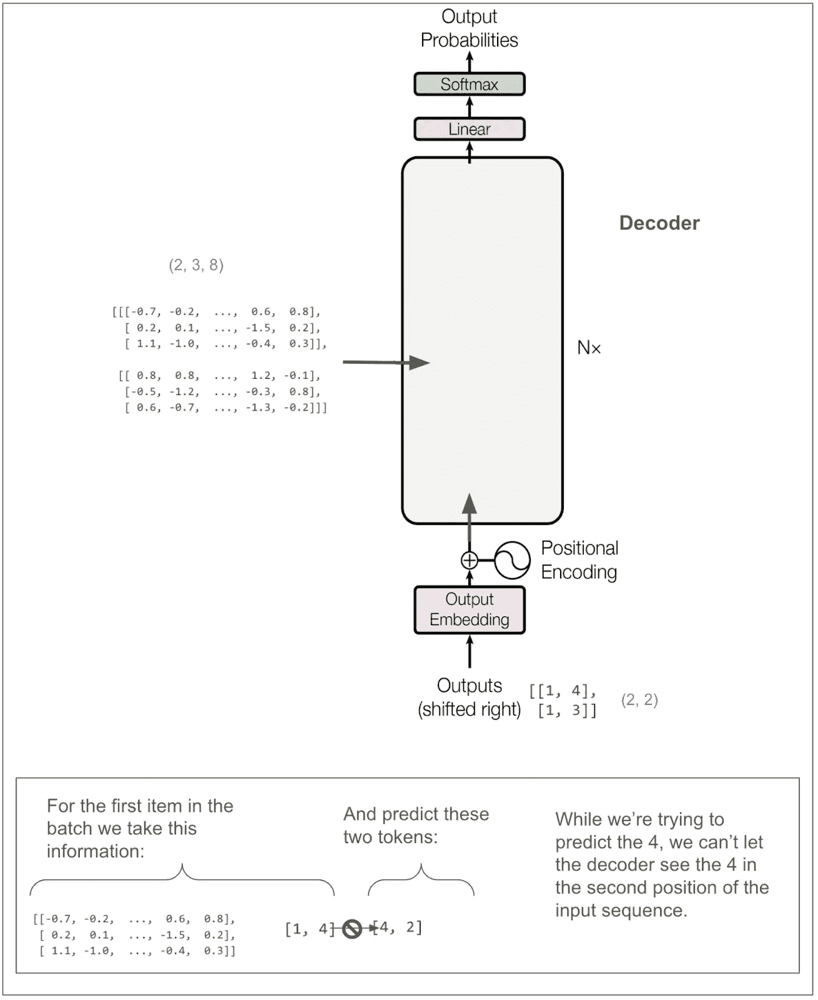

# 追踪图中的变压器

> 原文：[`towardsdatascience.com/tracing-the-transformer-in-diagrams-95dbeb68160c?source=collection_archive---------2-----------------------#2024-11-07`](https://towardsdatascience.com/tracing-the-transformer-in-diagrams-95dbeb68160c?source=collection_archive---------2-----------------------#2024-11-07)

## 具体要输入什么，输出什么，并且你是如何生成文本的？

 [Eric Silberstein](https://medium.com/@eric.silberstein?source=post_page---byline--95dbeb68160c--------------------------------)

·发表于[Towards Data Science](https://towardsdatascience.com/?source=post_page---byline--95dbeb68160c--------------------------------) ·15 分钟阅读 ·2024 年 11 月 7 日

--

上周，我在听一集关于 Nvidia 的 Acquired[播客](https://www.acquired.fm/episodes/nvidia-the-dawn-of-the-ai-era)。这集播客讲到了变压器：GPT 中的**T**，以及 21 世纪可能最大的发明之一。

在走下 Beacon 街的时候，我一边听着，一边想着，我理解变压器了，对吧？在训练过程中，你会屏蔽掉一些 token，你有这些学习如何连接文本中概念的注意力头，然后你预测下一个单词的概率。我从 Hugging Face 下载了 LLM 并进行过一些尝试。在早期，我使用过 GPT-3，还没出现“聊天”功能时。在 Klaviyo，我们甚至开发了首批基于 GPT 的生成性 AI 功能之一——我们的[主题行助手](https://help.klaviyo.com/hc/en-us/articles/5051278887835)。很久以前，我也曾参与过一个基于旧式语言模型的语法检查器的开发。所以，也许吧。

变压器是由谷歌的一个团队发明的，他们在做自动化翻译，比如从英语到德语。它在 2017 年通过那篇现在广为人知的论文[《Attention Is All You Need》](https://arxiv.org/pdf/1706.03762)向世界介绍。我调出了这篇论文，并看了图 1：

来自[《Attention Is All You Need》](https://arxiv.org/pdf/1706.03762)的图 1

嗯……如果我理解的话，那只是最初的粗略了解。当我越来越仔细地看着图表，读着论文时，我才意识到我并没有完全理解细节。以下是我写下的一些问题：

+   在训练过程中，输入是英语的标记化句子，输出是德语的标记化句子吗？

+   在一个训练批次中，具体每一项是什么？

+   为什么要将输出输入到模型中？以及“掩码多头注意力”是如何足以防止通过学习输出结果来作弊的？

+   多头注意力究竟是什么？

+   损失是如何计算的？不可能是先输入源语言句子，翻译整个句子，再计算损失，这样不合理。

+   训练后，究竟该输入什么来生成翻译？

+   为什么有三条箭头指向多头注意力模块？

我敢肯定，对于两类人来说，这些问题既简单又显得幼稚。第一类是那些已经在使用类似模型（例如 RNN、编码器-解码器）做类似事情的人。当他们读到这篇论文时，肯定立刻就理解了 Google 团队的成就以及他们是如何做到的。第二类是过去七年里意识到 Transformer 重要性的更多人，并且花时间学习其中的细节。

好吧，我想学习这个，于是我觉得最好的方法是从头开始构建模型。我很快就迷失了方向，决定追踪别人写的代码。我找到了一份很棒的[笔记](https://nlp.seas.harvard.edu/2018/04/03/attention.html)，它解释了这篇论文，并在 PyTorch 中实现了模型。我复制了代码并训练了模型。我将所有内容（输入、批次、词汇、维度）都做得非常小，这样我就可以追踪每一步发生了什么。我发现，在图表上标注维度和张量帮助我理清了思路。到我完成时，我已经对上面所有的问题有了相当不错的答案，接下来我会在讲解图表之后回答它们。

这是我整理过的笔记版本。本部分的内容是为了训练一个单一的、非常小的批次，这意味着不同图表中的所有张量都是一组的。

为了让内容更易于跟随，并借鉴了笔记中的一个想法，我们将训练模型来复制标记。例如，一旦训练完成，“dog run” 应该翻译成 “dog run”。

换句话说：

下面试图用文字解释一下图表中张量维度（以紫色显示）到目前为止的含义：

其中一个超参数是 *d-model*，在论文中的基础模型中，它是 512。这个例子中我设定为 8。这意味着我们的嵌入向量长度为 8。这里再次展示主图，标记了多个地方的维度：

让我们放大看看编码器的输入：

图中显示的大部分模块（加法与归一化、前馈神经网络、最终线性变换）只作用于最后一个维度（8）。如果仅仅是这样的话，那么模型只能利用序列中单一位置的信息来预测单一位置。某个地方必须“混合”位置之间的信息，这个魔法发生在多头注意力模块中。

让我们放大查看编码器中的多头注意力模块。在接下来的图示中，请记住，在我的例子中，我将超参数*h*（头数）设置为**2**。（在论文中的基础模型中，它是 8。）

来自[《Attention Is All You Need》](https://arxiv.org/pdf/1706.03762)的图 2，带有作者注释

(2,3,8)是如何变成(2,2,3,4)的？我们进行了线性变换，然后将结果拆分成头数（8 / 2 = 4），并重新排列张量的维度，使得我们的第二个维度就是头。让我们来看一些实际的张量：

我们仍然没有做任何会在位置之间混合信息的操作。那将发生在接下来的缩放点积注意力模块中。维度“4”和维度“3”最终会接触在一起。

来自[《Attention Is All You Need》](https://arxiv.org/pdf/1706.03762)的图 2，带有作者注释

让我们看看这些张量，但为了更容易理解，我们只关注批次中的第一个项目和第一个头。换句话说，就是 Q[0,0]，K[0,0]，等等。其他三个头也会进行同样的操作。

让我们看一下软最大输出与 V 之间的最终矩阵乘法：

从最开始开始回溯，我们可以看到，在这次乘法之前，V 中的三个位置一直都是独立操作的，一直到我们原始句子“<start> dog run”中。这次乘法第一次将来自其他位置的信息混合在一起。

回到多头注意力的示意图，我们可以看到，concat 操作将每个头的输出重新组合在一起，因此每个位置现在由长度为 8 的向量表示。注意，concat 后但在线性变换前的张量中的**1.8**和**-1.1**与上面显示的经过缩放点积注意力后，批次中第一个项目、第一头第一个位置的向量中的**1.8**和**-1.1**相匹配。（接下来的两个数字也匹配，只不过它们被省略号隐藏了。）

现在，让我们回到整个编码器的视图：

起初我以为我需要详细追踪前馈网络块。论文中称它为“位置-wise 前馈网络”，我以为这意味着它可能会将信息从一个位置传递到右侧的其他位置。**然而**，事实并非如此。“位置-wise”意味着它在每个位置上独立运算。它对每个位置进行线性变换，从 8 个元素变换到 32 个元素，然后进行 ReLU（取 0 和数字中的最大值），接着再做一次线性变换回到 8 个元素。（这是在我们的小例子中。在论文中的基础模型中，它从 512 变到 2048，再回到 512。这里有很多参数，可能是学习发生的主要地方！）前馈网络的输出回到（2,3,8）。

先暂时离开我们的简化模型，看看论文中基础模型里的编码器是怎样的。输入和输出的维度匹配真是太好了！

现在让我们拉远视角，看看解码器。

我们不需要追踪解码器的绝大部分内容，因为它和我们刚刚在编码器端看到的非常相似。然而，我标记为**A**和**B**的部分是不同的。**A**不同是因为我们做了掩蔽的多头注意力。这应该是避免在训练时“作弊”的关键。**B**稍后我们会再回到。首先，让我们隐藏内部细节，保持对解码器输出结果的大致图景。

为了更好地强调这一点，假设我们的英文句子是“she pet the dog”，而翻译成 Pig Latin 后的句子是“eshay etpay ethay ogday”。如果模型已经有了“eshay etpay ethay”，并且正在试图推测下一个词，“ogday”和“atcay”都是高概率选择。考虑到完整英文句子“she pet the dog”的上下文，模型应该能够选择“ogday”。然而，如果模型在训练期间能够看到“ogday”，它就不需要通过上下文来预测，它只需要学会复制。

让我们看看掩码是如何做到这一点的。我们可以跳过一些步骤，因为**A**的第一部分和之前一样，都是应用线性变换并将东西分割成头部。唯一不同的是进入缩放点积注意力部分的维度是（2,2,2,4），而不是（2,2,3,4），因为我们原始的输入序列长度是 2。这里是缩放点积注意力部分。正如我们在编码器端所做的那样，我们只看批次中的第一个项目和第一个头部。

这次我们有一个掩码。让我们看看 softmax 的输出和 V 之间的最终矩阵乘法：

现在我们准备好看看**B**，解码器中的第二个多头注意力块。与其他两个多头注意力块不同，我们并没有输入三个相同的张量，因此我们需要思考 V、K 和 Q 分别代表什么。我用红色标出了输入。可以看到，V 和 K 来自编码器的输出，并且维度是（2,3,8）。Q 的维度是（2,2,8）。

和之前一样，我们跳到缩放点积注意力部分。V 和 K 的维度是（2,2,3,4）——批量中有两个项目，两个头，三个位置，长度为四的向量，而 Q 的维度是（2,2,2,4）。这很合理，但也有些令人困惑。

即使我们是在“读取”编码器输出，其中“序列”长度为三，所有的矩阵计算也能顺利进行，我们最终得到了所需的维度（2,2,2,4）。让我们来看一下最终的矩阵乘法：

每个多头注意力块的输出会被加在一起。让我们跳过到解码器的输出部分，并将其转换为预测：

线性变换将我们从**(2,2,8)**转换为**(2,2,5)**。可以把它看作是反向嵌入，除了我们不是从长度为 8 的向量转到单个标记的整数标识符，而是转到一个包含 5 个标记的词汇表上的概率分布。在我们这个小示例中，数字看起来有点奇怪。在论文中，这更像是从大小为 512 的向量转到包含 37,000 个词汇的词汇表，当时他们做的是英语到德语的翻译。

稍后我们将计算损失。不过，即使是匆匆一瞥，你也可以大致感知模型的表现。

它正确预测了一个标记。毫不奇怪，因为这是我们的第一个训练批次，而且一切都是随机的。这个图的一个优点是，它清晰地表明这是一个多类分类问题。类别是词汇表（在这个例子中有 5 个类别），**这正是我之前感到困惑的地方**，我们对翻译句子中的每个标记做出（并评分）一个预测，**而不是**对每个句子做一个预测。让我们进行实际的损失计算。

比如说，如果-3.2 变成了-2.2，那么我们的损失将减少到 5.7，朝着我们希望的方向移动，因为我们希望模型学习到，第一个标记的正确预测是 4。

上面的图省略了标签平滑。在实际论文中，损失计算会平滑标签并使用 KL 散度损失。我认为当没有平滑时，这样的损失计算结果与交叉熵相同或相似。下面是与上图相同的图，但添加了标签平滑。

让我们也快速看一下在编码器和解码器中学习的参数数量：

作为一个检查，我们的玩具模型中的前馈块有一个从 8 到 32 再回到 8 的线性变换（如上所述），因此是 8 * 32（权重）+ 32（偏置）+ 32 * 8（权重）+ 8（偏置）= 52。请记住，在论文中的基础模型中，*d-model*是 512，*d-ff*是 2048，并且有 6 个编码器和 6 个解码器，因此会有更多的参数。

# 使用训练好的模型

现在让我们看看如何将源语言文本输入并得到翻译后的文本。我这里仍然使用一个玩具模型，通过复制 token 来“翻译”，但与上面的例子不同，这里使用的是大小为 11 的词汇表，并且*d-model*为 512。（上面我们有一个大小为 5 的词汇表，*d-model*是 8。）

首先让我们做一次翻译。然后我们再来看它是如何工作的。

第一步是将源句子输入**编码器**，并保留其输出，在本例中是一个维度为(1, 10, 512)的张量。

第二步是将输出的第一个 token 输入**解码器**，并预测第二个 token。我们知道第一个 token，因为它总是<start> = 1。

在本文中，他们使用了束搜索（beam search），束大小为 4，这意味着我们将考虑此时概率最高的 4 个 token。为了简化，我将改用贪心搜索。你可以把它看作是束大小为 1 的束搜索。因此，从图表的顶部读取，概率最高的 token 是编号**5**。（上面的输出是概率的对数。概率最高的仍然是最大数字。在这个例子中，是-0.0，实际上是-0.004，但我只显示到一位小数。模型非常确定 5 是正确的！exp(-0.004) = 99.6%）

现在我们将[1,5]输入解码器。（如果我们在进行束搜索并且束大小为 2，我们可以将包含[1,5]和[1,4]（下一个最可能的 token）的批次输入，这样可以得到下一步的结果。）

现在我们将[1,5,4]输入：

并输出**3**。一直这样进行，直到我们得到一个表示句子结束的 token（在我们的示例词汇表中不存在）或者达到最大长度。

# 回到上面的问题

现在我大致可以回答我最初的问题了。

# 在训练过程中，输入是用英语分词的句子，输出是用德语分词的句子吗？

是的，大致如此。

# 训练批次中的每个项目究竟是什么？

每个项目对应一个翻译后的句子对。

+   项目的“x”有两部分。第一部分是源句子的所有 token。第二部分是目标句子的所有 token，除了最后一个。

+   项目的“y”（标签）是目标句子的所有 token，除了第一个。由于源句子和目标句子的第一个 token 总是<start>，所以我们并没有浪费或丢失任何训练数据。

有一点比较微妙，如果这是一个分类任务，例如模型需要接收一张图像并输出一个类别（比如房子、汽车、兔子等），我们会认为批次中的每个项目都会对损失计算贡献一个“分类”。然而，在这里，批次中的每个项目将会对损失计算贡献（目标句子的 tokens 数量 — 1）个“分类”。

# 为什么要将输出数据输入模型，且“掩码多头注意力”又如何足以防止模型通过学习输出直接生成输出结果？

你将输出数据馈送给模型，以便模型能够基于源句子的意思和目前已翻译的单词预测翻译。虽然模型中有很多事情在进行，但信息在各个位置之间传递的唯一时机是在注意力步骤中。尽管我们确实将翻译后的句子输入解码器，但第一次注意力计算使用掩码将所有超出当前预测位置的信息清零。

# 什么是多头注意力？

我可能应该先问一下什么是注意力机制，因为它是更核心的概念。多头注意力意味着将向量切分成若干组，对每组进行注意力计算，然后再将这些组合并起来。例如，如果向量的大小是 512，且有 8 个头，那么注意力将独立地在 8 个组上进行，每组包含一个完整批次的所有位置，每个位置的向量大小为 64。如果你稍微思考一下，你会发现每个头可以学习集中注意力于某些相关的概念，正如那些著名的可视化展示所示，头部会学习代词指代的是哪个词。

# 损失究竟是如何计算的？不可能是将源语言句子翻译完整个句子后再计算损失，这样不合理吧。

对的。我们不是一次性翻译整个句子然后计算整个句子的相似度或类似的东西。损失的计算方式与其他多分类问题类似。类别就是我们词汇表中的 token。诀窍在于，我们独立地预测目标句子中每个 token 的类别，且仅使用此时应当拥有的信息。标签是我们目标句子中的实际 token。通过使用预测和标签，我们利用交叉熵计算损失。（实际上，我们对标签进行了“平滑”，以考虑到它们不是绝对的，有时同义词也能起到同样的作用。）

# 训练完成后，生成翻译时究竟输入什么呢？

你不能直接输入某些内容并让模型在一次评估中输出翻译结果。你需要多次使用模型。首先将源句子输入到模型的编码器部分，得到表示句子含义的编码版本，这种表示是以某种抽象、深层次的方式进行的。然后将该编码信息和起始标记<start>输入到解码器部分，这样你就可以预测目标句子的第二个标记。接着你将<start>和第二个标记输入，预测第三个标记。如此反复，直到你得到完整的翻译句子。（实际上，你会考虑每个位置多个高概率的标记，每次输入多个候选序列，并根据总概率和长度惩罚选择最终的翻译句子。）

# 为什么有三条箭头指向多头注意力块？

我猜有三个原因。1）展示解码器中第二个多头注意力块的输入部分来自编码器和解码器前一个块的输入。2）暗示注意力算法是如何工作的。3）暗示每个输入都在实际进行注意力计算之前经历独立的线性变换。

# 结论

这太美妙了！如果它不这么有用，我可能不会这么想。我现在能理解人们第一次看到这个工作原理时的感受。这个优雅且可训练的模型，用极少的代码就能表达，学会了如何翻译人类语言，并打败了那些花费几十年构建的复杂机器翻译系统。它令人惊叹、聪明且难以置信。你可以看到，下一步就是抛开翻译句对，开始将这种技术应用到互联网上的每一段文字——大型语言模型（LLM）由此诞生！

（我猜上面有一些错误，请告诉我。）

*除非另有说明，所有图片均由作者提供，或为作者在* [*Attention Is All You Need*](https://arxiv.org/pdf/1706.03762)中对图示的注释。 
