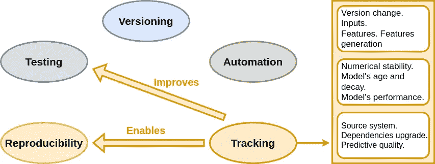

# 实践中的跟踪：代码、数据与机器学习模型

> 原文：[`towardsdatascience.com/tracking-in-practice-code-data-and-ml-model-6787a881609c?source=collection_archive---------6-----------------------#2024-07-09`](https://towardsdatascience.com/tracking-in-practice-code-data-and-ml-model-6787a881609c?source=collection_archive---------6-----------------------#2024-07-09)

## MLOps 中的跟踪指南

 [Chayma Zatout](https://medium.com/@Chim-SO?source=post_page---byline--6787a881609c--------------------------------)

· 发布于 [Towards Data Science](https://towardsdatascience.com/?source=post_page---byline--6787a881609c--------------------------------) · 11 分钟阅读·2024 年 7 月 9 日

--

图片由 [Farzad](https://unsplash.com/@euwars?utm_source=medium&utm_medium=referral) 提供，来源于 [Unsplash](https://unsplash.com/?utm_source=medium&utm_medium=referral)

跟踪！无论你是研究人员还是工程师，不论你是从事机器学习、数据科学、软件开发，还是甚至是分析工具（别介意，我最近迷上了惊悚小说）！我想说的是，跟踪既重要又不可避免。在 MLOps 中，我们跟踪其所有组件：代码、数据和机器学习模型！在这篇文章中，我们通过一个实际示例解释了跟踪的重要性，并在机器学习工作流的不同步骤中应用了测试。本文的完整代码库可以在[关联的仓库](https://github.com/Chim-SO/hand-written-digits-classification)中获取。

还不是 Medium 会员？没关系！继续阅读，使用此*好友链接*。

**目录：**

· 1\. 介绍

· 2\. 项目设置

· 3\. 代码跟踪

· 4\. 数据跟踪

· 5\. 机器学习模型跟踪

· 6\. 结论

# 1\. 介绍

MLOps 原则
