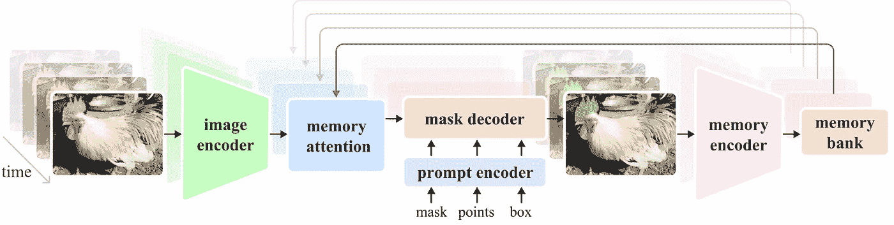
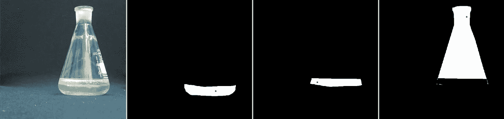
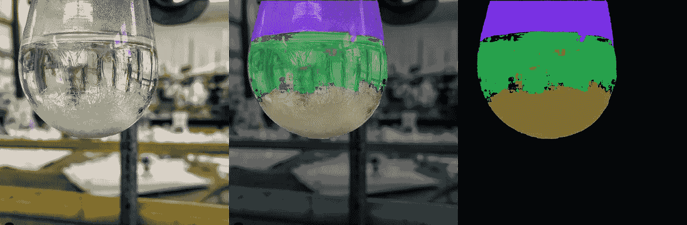

# 用 60 行代码训练/微调 Segment Anything 2 (SAM 2)

> 原文：[`towardsdatascience.com/train-fine-tune-segment-anything-2-sam-2-in-60-lines-of-code-928dd29a63b3?source=collection_archive---------0-----------------------#2024-08-03`](https://towardsdatascience.com/train-fine-tune-segment-anything-2-sam-2-in-60-lines-of-code-928dd29a63b3?source=collection_archive---------0-----------------------#2024-08-03)

## 一步步的教程，教你如何微调 SAM2 以完成自定义分割任务

[](https://medium.com/@sagieppel?source=post_page---byline--928dd29a63b3--------------------------------)[](https://towardsdatascience.com/?source=post_page---byline--928dd29a63b3--------------------------------) [Sagi eppel](https://medium.com/@sagieppel?source=post_page---byline--928dd29a63b3--------------------------------)

·发表于 [Towards Data Science](https://towardsdatascience.com/?source=post_page---byline--928dd29a63b3--------------------------------) ·13 分钟阅读·2024 年 8 月 3 日

--

[SAM2 (Segment Anything 2)](https://ai.meta.com/blog/segment-anything-2/) 是 Meta 推出的一款新模型，旨在对图像中的任何内容进行分割，而不局限于特定类别或领域。该模型的独特之处在于它的训练数据规模：1100 万张图片和 110 亿个掩码。这种广泛的训练使得 SAM2 成为一个强大的起点，可以用于新的图像分割任务的训练。

你可能会问，如果 SAM 可以分割任何东西，为什么还需要重新训练它？答案是，SAM 在处理常见物体时表现优异，但在处理稀有或特定领域的任务时，效果可能较差。

然而，即使在 SAM 给出的结果不足的情况下，仍然可以通过在新数据上对模型进行微调，显著提高模型的能力。在许多情况下，这需要的训练数据更少，且效果比从头开始训练一个模型更好。

本教程展示了如何用仅 60 行代码（不包括注释和导入）在新数据上微调 SAM2。

**完整的训练脚本可以在以下位置找到：**

[](https://github.com/sagieppel/fine-tune-train_segment_anything_2_in_60_lines_of_code/blob/main/TRAIN.py?source=post_page-----928dd29a63b3--------------------------------) [## fine-tune-train_segment_anything_2_in_60_lines_of_code/TRAIN.py at main ·…

### 该代码库提供了训练/微调 Meta Segment Anything Model 2 (SAM 2) 的代码……

github.com](https://github.com/sagieppel/fine-tune-train_segment_anything_2_in_60_lines_of_code/blob/main/TRAIN.py?source=post_page-----928dd29a63b3--------------------------------) 

SAM2 网络结构图，来自[SAM2 GIT 页面](https://github.com/facebookresearch/segment-anything-2)

# **Segment Anything 的工作原理**

SAM 的主要工作原理是通过获取图像和图像中的一个点，预测包含该点的分割区域的掩膜。该方法能够在没有人工干预的情况下进行完整的图像分割，并且不受类别或分割类型的限制（如在[上一篇文章](https://faun.pub/train-pointer-net-for-segmenting-objects-parts-and-materials-in-60-lines-of-code-ca328be8cef2)中所讨论的）。

使用 SAM 进行完整图像分割的步骤：

1.  在图像中选择一组点

1.  使用 SAM 预测包含每个点的分割区域

1.  将生成的分割区域合并成一个单一的地图

虽然 SAM 也可以利用其他输入，如掩膜或边界框，但这些主要适用于涉及人工输入的交互式分割。对于本教程，我们将专注于完全自动化的分割，并仅考虑单点输入。

有关该模型的更多细节，请访问[项目网站](https://ai.meta.com/blog/segment-anything-2/)

# **下载 SAM2 并设置环境**

SAM2 可以从以下链接下载：

[](https://github.com/facebookresearch/segment-anything-2?source=post_page-----928dd29a63b3--------------------------------) [## GitHub - facebookresearch/segment-anything-2: 该仓库提供了用于运行推理的代码…

### 该仓库提供了用于运行 Meta Segment Anything Model 2（SAM 2）推理的代码，链接如下…

github.com](https://github.com/facebookresearch/segment-anything-2?source=post_page-----928dd29a63b3--------------------------------)

如果你不想复制训练代码，你也可以下载我已经包含 TRAIN.py 脚本的 fork 版本。

[](https://github.com/sagieppel/fine-tune-train_segment_anything_2_in_60_lines_of_code?source=post_page-----928dd29a63b3--------------------------------) [## GitHub - sagieppel/fine-tune-train_segment_anything_2_in_60_lines_of_code: 该仓库提供了…

### 该仓库提供了用于训练/微调 Meta Segment Anything Model 2（SAM 2）的代码…

github.com](https://github.com/sagieppel/fine-tune-train_segment_anything_2_in_60_lines_of_code?source=post_page-----928dd29a63b3--------------------------------)

请按照 GitHub 仓库中的安装说明进行操作。

通常，你需要 Python >=3.11 和[PyTorch](https://pytorch.org/)

此外，我们将使用 OpenCV，可以通过以下命令进行安装：

*pip install opencv-python*

## 下载预训练模型

你还需要从以下链接下载预训练模型：

[**https://github.com/facebookresearch/segment-anything-2?tab=readme-ov-file#download-checkpoints**](https://github.com/facebookresearch/segment-anything-2?tab=readme-ov-file#download-checkpoints)

有几个模型你可以选择，这些模型都与本教程兼容。我建议使用[小型模型](https://dl.fbaipublicfiles.com/segment_anything_2/072824/sam2_hiera_small.pt)，它是训练速度最快的。

# 下载训练数据

对于本教程，我们将使用[LabPics1 数据集](https://zenodo.org/records/3697452/files/LabPicsV1.zip?download=1)来分割材料和液体。你可以从这个网址下载数据集：

[`zenodo.org/records/3697452/files/LabPicsV1.zip?download=1`](https://zenodo.org/records/3697452/files/LabPicsV1.zip?download=1)

# **准备数据读取器**

我们需要编写的第一部分是数据读取器。它将读取并准备数据以供网络使用。

数据读取器需要生成：

1.  一张图像

1.  图像中所有分割区域的掩膜。

1.  以及一个[每个掩膜内的随机点](https://faun.pub/train-pointer-net-for-segmenting-objects-parts-and-materials-in-60-lines-of-code-ca328be8cef2)

让我们从加载依赖项开始：

```py
import numpy as np
import torch
import cv2
import os
from sam2.build_sam import build_sam2
from sam2.sam2_image_predictor import SAM2ImagePredictor
```

接下来列出数据集中所有的图像：

```py
data_dir=r"LabPicsV1//" # Path to LabPics1 dataset folder
data=[] # list of files in dataset
for ff, name in enumerate(os.listdir(data_dir+"Simple/Train/Image/")):  # go over all folder annotation
    data.append({"image":data_dir+"Simple/Train/Image/"+name,"annotation":data_dir+"Simple/Train/Instance/"+name[:-4]+".png"})
```

现在是加载训练批次的主要函数。训练批次包括：一张随机图像，属于此图像的所有分割掩膜，以及每个掩膜中的一个随机点：

```py
def read_batch(data): # read random image and its annotaion from  the dataset (LabPics)

   #  select image

        ent  = data[np.random.randint(len(data))] # choose random entry
        Img = cv2.imread(ent["image"])[...,::-1]  # read image
        ann_map = cv2.imread(ent["annotation"]) # read annotation

   # resize image

        r = np.min([1024 / Img.shape[1], 1024 / Img.shape[0]]) # scalling factor
        Img = cv2.resize(Img, (int(Img.shape[1] * r), int(Img.shape[0] * r)))
        ann_map = cv2.resize(ann_map, (int(ann_map.shape[1] * r), int(ann_map.shape[0] * r)),interpolation=cv2.INTER_NEAREST)

   # merge vessels and materials annotations

        mat_map = ann_map[:,:,0] # material annotation map
        ves_map = ann_map[:,:,2] # vessel  annotaion map
        mat_map[mat_map==0] = ves_map[mat_map==0]*(mat_map.max()+1) # merged map

   # Get binary masks and points

        inds = np.unique(mat_map)[1:] # load all indices
        points= []
        masks = [] 
        for ind in inds:
            mask=(mat_map == ind).astype(np.uint8) # make binary mask
            masks.append(mask)
            coords = np.argwhere(mask > 0) # get all coordinates in mask
            yx = np.array(coords[np.random.randint(len(coords))]) # choose random point/coordinate
            points.append([[yx[1], yx[0]]])
        return Img,np.array(masks),np.array(points), np.ones([len(masks),1])
```

这个函数的第一部分是选择一张随机图像并加载它：

```py
ent  = data[np.random.randint(len(data))] # choose random entry
Img = cv2.imread(ent["image"])[...,::-1]  # read image
ann_map = cv2.imread(ent["annotation"]) # read annotation
```

请注意，OpenCV 读取图像时是 BGR 格式，而 SAM 期望的是 RGB 格式。通过使用*[…,::-1]*，我们将图像从 BGR 转换为 RGB。

SAM 期望图像大小不超过 1024，因此我们将把图像和注释图调整为此大小。

```py
r = np.min([1024 / Img.shape[1], 1024 / Img.shape[0]]) # scalling factor
Img = cv2.resize(Img, (int(Img.shape[1] * r), int(Img.shape[0] * r)))
ann_map = cv2.resize(ann_map, (int(ann_map.shape[1] * r), int(ann_map.shape[0] * r)),interpolation=cv2.INTER_NEAREST)
```

这里一个重要的点是，在调整注释图(*ann_map*)大小时，我们使用*INTER_NEAREST*模式（最近邻）。在注释图中，每个像素值是其所属分割区域的索引。因此，使用不会引入新值的调整方法非常重要。

下一个代码块特定于 LabPics1 数据集的格式。注释图(*ann_map*)包含图像中血管的分割图（一个通道），另一个通道则用于材料注释图。我们将把它们合并为一张单一的图。

```py
 mat_map = ann_map[:,:,0] # material annotation map
  ves_map = ann_map[:,:,2] # vessel  annotaion map
  mat_map[mat_map==0] = ves_map[mat_map==0]*(mat_map.max()+1) # merged map
```

这将为我们提供一个地图(*mat_map*)，其中每个像素的值是它所属的分割区域的索引（例如：所有值为 3 的像素属于分割区域 3）。我们希望将其转换为一组二进制掩膜（0/1），每个掩膜对应一个不同的分割区域。此外，我们还希望从每个掩膜中提取一个单一的点。

```py
inds = np.unique(mat_map)[1:] # list of all indices in map
points= [] # list of all points (one for each mask)
masks = [] # list of all masks
for ind in inds:
            mask = (mat_map == ind).astype(np.uint8) # make binary mask for index ind
            masks.append(mask)
            coords = np.argwhere(mask > 0) # get all coordinates in mask
            yx = np.array(coords[np.random.randint(len(coords))]) # choose random point/coordinate
            points.append([[yx[1], yx[0]]])
return Img,np.array(masks),np.array(points), np.ones([len(masks),1])
```

我们得到了图像(*Img*)，一个与图像中各个分割区域对应的二进制掩膜列表(*masks*)，以及每个掩膜内部的一个点的坐标(*points*)。



一批训练数据的示例：1) 一张图像。2) 分割掩膜列表。3) 对于每个掩膜，掩膜内的一个单一点（标记为红色）。数据来自 LabPics 数据集。

# 加载 SAM 模型

现在让我们加载网络：

```py
sam2_checkpoint = "sam2_hiera_small.pt" # path to model weight
model_cfg = "sam2_hiera_s.yaml" # model config
sam2_model = build_sam2(model_cfg, sam2_checkpoint, device="cuda") # load model
predictor = SAM2ImagePredictor(sam2_model) # load net
```

首先，我们设置模型权重的路径：*sam2_checkpoint*参数。我们之前从[这里](https://github.com/facebookresearch/segment-anything-2?tab=readme-ov-file#download-checkpoints)下载了权重。**“sam2_hiera_small.pt”**指的是[小模型](https://dl.fbaipublicfiles.com/segment_anything_2/072824/sam2_hiera_small.pt)，但是代码对任何模型都有效。无论你选择哪个模型，都需要在*model_cfg*参数中设置相应的配置文件。这些配置文件位于主存储库中的子文件夹***“*sam2_configs/”**。

# Segment Anything 的总体结构

在开始训练之前，我们需要了解模型的结构。

SAM 由三个部分组成：

1）图像编码器，2）提示编码器，3）掩码解码器。

图像编码器负责处理图像并创建图像嵌入。这是最大的组件，训练它将需要强大的 GPU。

提示编码器处理输入的提示，在我们的例子中就是输入的点。

掩码解码器接受图像编码器和提示编码器的输出，并生成最终的分割掩码。

# 设置训练参数：

我们可以通过设置来启用掩码解码器和提示编码器的训练：

```py
predictor.model.sam_mask_decoder.train(True) # enable training of mask decoder 
predictor.model.sam_prompt_encoder.train(True) # enable training of prompt encoder
```

你可以通过使用“***predictor.model.image_encoder.train(True)”***来启用图像编码器的训练。

这需要更强大的 GPU，但会给网络提供更多的改进空间。如果你选择训练图像编码器，必须扫描 SAM2 代码中的“***no_grad”***命令并将其删除。（***no_grad***会阻止梯度收集，虽然可以节省内存，但会阻止训练）。

接下来，我们定义标准的 adamW 优化器：

```py
optimizer=torch.optim.AdamW(params=predictor.model.parameters(),lr=1e-5,weight_decay=4e-5)
```

我们还将使用混合精度训练，这是一种更节省内存的训练策略：

```py
scaler = torch.cuda.amp.GradScaler() # set mixed precision
```

# **主要训练循环**

现在让我们构建主要的训练循环。第一部分是读取和准备数据：

```py
for itr in range(100000):
    with torch.cuda.amp.autocast(): # cast to mix precision
            image,mask,input_point, input_label = read_batch(data) # load data batch
            if mask.shape[0]==0: continue # ignore empty batches
            predictor.set_image(image) # apply SAM image encoder to the image
```

首先，我们将数据转换为混合精度，以便高效训练：

```py
with torch.cuda.amp.autocast():
```

接下来，我们使用之前创建的读取器函数来读取训练数据：

```py
image,mask,input_point, input_label = read_batch(data)
```

我们加载的图像通过图像编码器（网络的第一部分）进行处理：

```py
predictor.set_image(image)
```

接着，我们使用网络提示编码器处理输入点：

```py
 mask_input, unnorm_coords, labels, unnorm_box = predictor._prep_prompts(input_point, input_label, box=None, mask_logits=None, normalize_coords=True)
  sparse_embeddings, dense_embeddings = predictor.model.sam_prompt_encoder(points=(unnorm_coords, labels),boxes=None,masks=None,)
```

请注意，在这一部分，我们也可以输入框或掩码，但我们不会使用这些选项。

现在我们已经编码了提示（点）和图像，我们可以最终预测分割掩码：

```py
batched_mode = unnorm_coords.shape[0] > 1 # multi mask prediction
high_res_features = [feat_level[-1].unsqueeze(0) for feat_level in predictor._features["high_res_feats"]]
low_res_masks, prd_scores, _, _ = predictor.model.sam_mask_decoder(image_embeddings=predictor._features["image_embed"][-1].unsqueeze(0),image_pe=predictor.model.sam_prompt_encoder.get_dense_pe(),sparse_prompt_embeddings=sparse_embeddings,dense_prompt_embeddings=dense_embeddings,multimask_output=True,repeat_image=batched_mode,high_res_features=high_res_features,)
prd_masks = predictor._transforms.postprocess_masks(low_res_masks, predictor._orig_hw[-1])# Upscale the masks to the original image resolution
```

这段代码的主要部分是***model.sam_mask_decoder***，它运行网络的 mask_decoder 部分并生成分割掩码（*low_res_masks*）及其分数（*prd_scores*）。

这些掩码的分辨率低于原始输入图像，并且会在***postprocess_masks***函数中被调整到原始输入大小。

这将给我们网络的最终预测：每个输入点对应的 3 个分割掩码（*prd_masks*）以及掩码分数（*prd_scores*）。*prd_masks* 包含每个输入点的 3 个预测掩码，但我们只会使用每个点的第一个掩码。*prd_scores* 包含网络认为每个掩码的质量（或预测的置信度）的分数。

# 损失函数

## 分割损失

现在我们有了网络预测，可以计算损失。首先，我们计算分割损失，即预测掩码与地面真值掩码的匹配程度。为此，我们使用标准的交叉熵损失。

首先，我们需要使用 sigmoid 函数将预测掩码（*prd_mask*）从 logits 转换为概率：

```py
prd_mask = torch.sigmoid(prd_masks[:, 0])# Turn logit map to probability map
```

接下来，我们将地面真值掩码转换为 PyTorch 张量：

```py
prd_mask = torch.sigmoid(prd_masks[:, 0])# Turn logit map to probability map
```

最后，我们使用地面真值（*gt_mask*）和预测概率图（*prd_mask*）手动计算交叉熵损失（*seg_loss*）：

```py
seg_loss = (-gt_mask * torch.log(prd_mask + 0.00001) - (1 - gt_mask) * torch.log((1 - prd_mask) + 0.00001)).mean() # cross entropy loss 
```

（我们加上 0.0001 来防止对零值使用对数函数时出现爆炸）。

## 分数损失（可选）

除了掩码，网络还预测每个预测掩码的分数，表示掩码的质量。训练这一部分的作用较小，但也有其用处。为了训练这一部分，我们首先需要知道每个预测掩码的真实分数。也就是说，我们需要知道预测掩码的质量。我们将通过使用交并比（IOU）度量，将 GT 掩码与相应的预测掩码进行比较，来实现这一点。IOU 只是两个掩码的重叠部分，除以两个掩码的联合面积。首先，我们计算预测掩码和 GT 掩码之间的交集（它们重叠的区域）：

```py
inter = (gt_mask * (prd_mask > 0.5)).sum(1).sum(1)
```

我们使用阈值 *(prd_mask > 0.5)* 将预测掩码从概率转化为二进制掩码。

接下来，我们通过将交集除以预测掩码和 GT 掩码的联合面积（并集）来获得 IOU：

```py
iou = inter / (gt_mask.sum(1).sum(1) + (prd_mask > 0.5).sum(1).sum(1) - inter)
```

我们将使用 IOU 作为每个掩码的真实分数，并通过计算预测分数与我们刚刚计算的 IOU 之间的绝对差来获得分数损失。

```py
score_loss = torch.abs(prd_scores[:, 0] - iou).mean()
```

最后，我们将分割损失和分数损失合并（对第一个赋予更高的权重）：

```py
loss = seg_loss+score_loss*0.05  # mix losses
```

# 最后一步：反向传播和保存模型

一旦我们得到损失，后续步骤就完全标准了。我们使用之前创建的优化器计算反向传播并更新权重：

```py
predictor.model.zero_grad() # empty gradient
scaler.scale(loss).backward()  # Backpropogate
scaler.step(optimizer)
scaler.update() # Mix precision
```

我们还希望每 1000 步保存一次训练的模型：

```py
if itr%1000==0: torch.save(predictor.model.state_dict(), "model.torch") # save model 
```

由于我们已经计算了 IOU，我们可以将其作为移动平均显示，以查看模型预测随时间的改进情况：

```py
 if itr==0: mean_iou=0
mean_iou = mean_iou * 0.99 + 0.01 * np.mean(iou.cpu().detach().numpy())
print("step)",itr, "Accuracy(IOU)=",mean_iou)
```

就这样，我们在不到 60 行代码（不包括注释和导入）内完成了 Segment-Anything 2 的训练/微调。在约 25,000 步之后，您应该会看到显著的改进。

模型将被保存为“model.torch”。

您可以在以下位置找到完整的训练代码：

[](https://github.com/sagieppel/fine-tune-train_segment_anything_2_in_60_lines_of_code/blob/main/TRAIN.py?source=post_page-----928dd29a63b3--------------------------------) [## fine-tune-train_segment_anything_2_in_60_lines_of_code/TRAIN.py at main ·…

### 该仓库提供了用于训练/微调 Meta Segment Anything Model 2 (SAM 2)的代码……

[github.com](https://github.com/sagieppel/fine-tune-train_segment_anything_2_in_60_lines_of_code/blob/main/TRAIN.py?source=post_page-----928dd29a63b3--------------------------------)

本教程使用每批次一张图像，更高效的方法是每批次使用多张不同的图像，相关代码可以在以下位置找到：

[***https://github.com/sagieppel/fine-tune-train_segment_anything_2_in_60_lines_of_code/blob/main/TRAIN_multi_image_batch.py***](https://github.com/sagieppel/fine-tune-train_segment_anything_2_in_60_lines_of_code/blob/main/TRAIN_multi_image_batch.py)

# 推理：加载并使用训练好的模型：

现在模型已经完成微调，我们来使用它对一张图像进行分割。

我们将通过以下步骤来实现：

1.  加载我们刚刚训练好的模型。

1.  给模型提供一张图像和一堆随机点。对于每个点，网络将预测包含该点的分割掩膜以及一个分数。

1.  将这些掩膜拼接成一个完整的分割图。

完整的代码可以在以下位置找到：

[](https://github.com/sagieppel/fine-tune-train_segment_anything_2_in_60_lines_of_code/blob/main/TEST_Net.py?source=post_page-----928dd29a63b3--------------------------------) [## fine-tune-train_segment_anything_2_in_60_lines_of_code/TEST_Net.py at main ·…

### 该仓库提供了用于训练/微调 Meta Segment Anything Model 2 (SAM 2)的代码……

[github.com](https://github.com/sagieppel/fine-tune-train_segment_anything_2_in_60_lines_of_code/blob/main/TEST_Net.py?source=post_page-----928dd29a63b3--------------------------------)

首先，我们加载依赖项并将权重转换为 float16 格式，这使得模型运行速度更快（仅在推理时可行）。

```py
import numpy as np
import torch
import cv2
from sam2.build_sam import build_sam2
from sam2.sam2_image_predictor import SAM2ImagePredictor

# use bfloat16 for the entire script (memory efficient)
torch.autocast(device_type="cuda", dtype=torch.bfloat16).__enter__()
```

接下来，我们加载一个示例[图像](https://github.com/sagieppel/fine-tune-train_segment_anything_2_in_60_lines_of_code/blob/main/sample_image.jpg)和我们想要分割的图像区域的掩膜（下载[图像](https://github.com/sagieppel/fine-tune-train_segment_anything_2_in_60_lines_of_code/blob/main/sample_image.jpg)/[掩膜](https://github.com/sagieppel/fine-tune-train_segment_anything_2_in_60_lines_of_code/blob/main/sample_mask.png)）：

```py
image_path = r"sample_image.jpg" # path to image
mask_path = r"sample_mask.png" # path to mask, the mask will define the image region to segment
def read_image(image_path, mask_path): # read and resize image and mask
        img = cv2.imread(image_path)[...,::-1]  # read image as rgb
        mask = cv2.imread(mask_path,0) # mask of the region we want to segment

        # Resize image to maximum size of 1024

        r = np.min([1024 / img.shape[1], 1024 / img.shape[0]])
        img = cv2.resize(img, (int(img.shape[1] * r), int(img.shape[0] * r)))
        mask = cv2.resize(mask, (int(mask.shape[1] * r), int(mask.shape[0] * r)),interpolation=cv2.INTER_NEAREST)
        return img, mask
image,mask = read_image(image_path, mask_path)
```

在我们想要分割的区域内随机采样 30 个点：

```py
num_samples = 30 # number of points/segment to sample
def get_points(mask,num_points): # Sample points inside the input mask
        points=[]
        for i in range(num_points):
            coords = np.argwhere(mask > 0)
            yx = np.array(coords[np.random.randint(len(coords))])
            points.append([[yx[1], yx[0]]])
        return np.array(points)
input_points = get_points(mask,num_samples)
```

加载标准的 SAM 模型（与训练时相同）

```py
# Load model you need to have pretrained model already made
sam2_checkpoint = "sam2_hiera_small.pt" 
model_cfg = "sam2_hiera_s.yaml" 
sam2_model = build_sam2(model_cfg, sam2_checkpoint, device="cuda")
predictor = SAM2ImagePredictor(sam2_model)
```

接下来，加载我们刚刚训练的模型的权重（model.torch）：

```py
predictor.model.load_state_dict(torch.load("model.torch"))
```

运行微调后的模型来预测我们之前选择的每个点的分割掩膜：

```py
with torch.no_grad(): # prevent the net from caclulate gradient (more efficient inference)
        predictor.set_image(image) # image encoder
        masks, scores, logits = predictor.predict(  # prompt encoder + mask decoder
            point_coords=input_points,
            point_labels=np.ones([input_points.shape[0],1])
        )
```

现在我们得到了一个预测的掩膜及其分数的列表。我们希望将它们以某种方式拼接成一个一致的分割图。然而，许多掩膜是重叠的，可能彼此不一致。

拼接方法很简单：

首先，我们将根据预测分数对预测的掩模进行排序：

```py
masks=masks[:,0].astype(bool)
shorted_masks = masks[np.argsort(scores[:,0])][::-1].astype(bool)
```

现在让我们创建一个空的分割图和占用图：

```py
seg_map = np.zeros_like(shorted_masks[0],dtype=np.uint8)
occupancy_mask = np.zeros_like(shorted_masks[0],dtype=bool)
```

接下来，我们将按顺序（从高到低分数）将掩模添加到分割图中。只有当掩模与之前添加的掩模一致时，我们才会添加它，这意味着只有当我们想要添加的掩模与已占用区域的重叠部分小于 15%时，才会添加。

```py
for i in range(shorted_masks.shape[0]):
    mask = shorted_masks[i]
    if (mask*occupancy_mask).sum()/mask.sum()>0.15: continue 
    mask[occupancy_mask]=0
    seg_map[mask]=i+1
    occupancy_mask[mask]=1
```

就这样。

*seg_mask*现在包含了预测的分割图，每个分割区域有不同的值，背景为 0。

我们可以使用以下方法将其转换为颜色图：

```py
rgb_image = np.zeros((seg_map.shape[0], seg_map.shape[1], 3), dtype=np.uint8)
for id_class in range(1,seg_map.max()+1):
    rgb_image[seg_map == id_class] = [np.random.randint(255), np.random.randint(255), np.random.randint(255)]
```

并显示：

```py
cv2.imshow("annotation",rgb_image)
cv2.imshow("mix",(rgb_image/2+image/2).astype(np.uint8))
cv2.imshow("image",image)
cv2.waitKey()
```



使用微调后的 SAM2 进行分割结果的示例。图像来自 LabPics 数据集。

完整的推理代码可以在以下位置找到：

[](https://github.com/sagieppel/fine-tune-train_segment_anything_2_in_60_lines_of_code/blob/main/TEST_Net.py?source=post_page-----928dd29a63b3--------------------------------) [## fine-tune-train_segment_anything_2_in_60_lines_of_code/TEST_Net.py at main ·…

### 该代码库提供了用于训练/微调 Meta Segment Anything Model 2（SAM 2）的代码……

github.com](https://github.com/sagieppel/fine-tune-train_segment_anything_2_in_60_lines_of_code/blob/main/TEST_Net.py?source=post_page-----928dd29a63b3--------------------------------)

# 结论：

就是这样，我们已经在自定义数据集上训练和测试了 SAM2。除了更改数据读取器外，这应该适用于任何数据集。在许多情况下，这应该足以显著提高性能。

最后，SAM2 还可以在视频中对物体进行分割和跟踪，但微调这一部分内容将在另一个时刻讨论。

**版权声明：** 本文中的所有图像均来自[SAM2 GIT](https://github.com/facebookresearch/segment-anything-2)代码库（采用 Apache 许可证），以及[LabPics](https://zenodo.org/records/3697452)数据集（采用 MIT 许可证）。本教程的代码和网络模型可在 Apache 许可证下使用。
