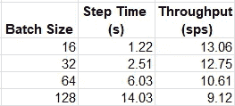
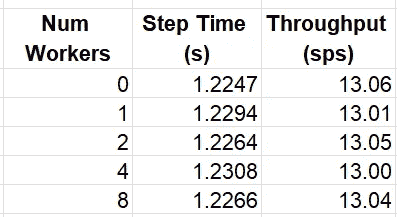
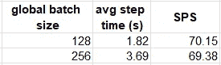
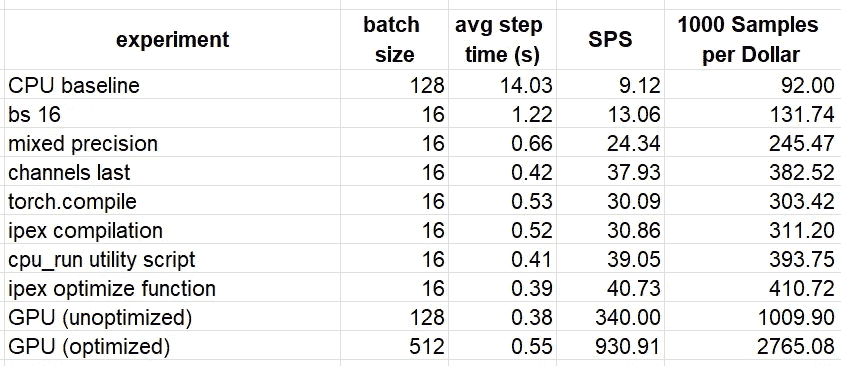

# 在 CPU 上训练 AI 模型

> 原文：[`towardsdatascience.com/training-ai-models-on-cpu-3903adc9f388?source=collection_archive---------1-----------------------#2024-09-01`](https://towardsdatascience.com/training-ai-models-on-cpu-3903adc9f388?source=collection_archive---------1-----------------------#2024-09-01)

## 在 GPU 稀缺时代重新审视 CPU 在机器学习中的作用

[](https://chaimrand.medium.com/?source=post_page---byline--3903adc9f388--------------------------------)[](https://towardsdatascience.com/?source=post_page---byline--3903adc9f388--------------------------------) [Chaim Rand](https://chaimrand.medium.com/?source=post_page---byline--3903adc9f388--------------------------------)

·发表于 [Towards Data Science](https://towardsdatascience.com/?source=post_page---byline--3903adc9f388--------------------------------) ·13 分钟阅读·2024 年 9 月 1 日

--


图片来源：[Quino Al](https://unsplash.com/@quinoal?utm_source=medium&utm_medium=referral) 于 [Unsplash](https://unsplash.com/?utm_source=medium&utm_medium=referral)

最近，人工智能的成功往往归功于 GPU 的出现和发展。GPU 的架构通常包括数千个多处理器、高速内存、专用张量核心等，非常适合满足人工智能和机器学习工作负载的高强度需求。不幸的是，人工智能发展的迅速增长导致了 GPU 需求的激增，使其变得难以获得。因此，机器学习开发者正越来越多地探索替代硬件选项来训练和运行他们的模型。在之前的文章中，我们讨论了使用专用人工智能 ASIC 的可能性，例如 Google Cloud TPU、Haban Gaudi 和 AWS Trainium。虽然这些选项提供了显著的成本节约机会，但它们并不适合所有的机器学习模型，且与 GPU 一样，也可能面临有限的可用性问题。在本文中，我们回归到传统的 CPU，并重新审视它在机器学习应用中的相关性。尽管与 GPU 相比，CPU 通常不太适合处理机器学习工作负载，但它们更容易获取。能够在 CPU 上运行（至少部分）工作负载可能对开发生产力产生重大影响。

在之前的文章中（例如，这里），我们强调了分析和优化 AI/ML 工作负载的运行时性能的重要性，这对于加速开发和降低成本至关重要。尽管无论使用何种计算引擎，这都是至关重要的，但不同平台上的性能分析工具和优化技术差异可能很大。在本篇文章中，我们将讨论一些与 CPU 相关的性能优化选项。我们的重点将放在 [Intel® Xeon® CPU](https://www.intel.com/content/www/us/en/products/details/processors/xeon.html) 处理器（搭载 [Intel® AVX-512](https://www.intel.com/content/www/us/en/architecture-and-technology/avx-512-overview.html)）以及 PyTorch（版本 2.4）框架上（尽管类似的技术也可以应用于其他 CPU 和框架）。更具体来说，我们将在一个 [Amazon EC2 c7i](https://aws.amazon.com/ec2/instance-types/c7i/) 实例上进行实验，该实例搭载 [AWS Deep Learning AMI](https://docs.aws.amazon.com/dlami/)。请不要将我们选择的云平台、CPU 版本、ML 框架或我们提到的任何其他工具或库视为对其替代品的推荐。

我们的目标是展示，尽管在 CPU 上进行机器学习开发可能不是我们的首选，但仍然有一些方法可以“缓解影响”，并且——在某些情况下——甚至可能使其成为一个可行的替代方案。

## 免责声明

本文的目的是展示在 CPU 上可以利用的少数机器学习优化机会。与大多数在线关于 CPU 上机器学习优化的教程相反，我们将重点关注训练工作负载，而不是推理工作负载。有许多专门针对推理的优化工具我们将不做介绍（例如，参见 [这里](https://pytorch.org/tutorials/intermediate/torchserve_with_ipex.html) 和 [这里](https://pytorch.org/blog/accelerated-cpu-inference/)）。

请不要将本文视为我们提到的任何工具或技术的官方文档替代品。请记住，鉴于 AI/ML 开发的快速发展，我们提到的一些内容、库和/或指令可能会在您阅读本文时已经过时。请务必参考最新的官方文档。

重要的是，我们将在讨论的优化对运行时性能的影响可能会根据模型和环境的细节（例如，参见官方 PyTorch [TouchInductor CPU 推理性能仪表盘](http://github.com/pytorch/pytorch/issues/93531#issuecomment-1457373890) 中模型之间的高度差异）而有很大的不同。我们将分享的比较性能数据是针对我们将使用的玩具模型和运行时环境的。请务必在您自己的模型和运行时环境中重新评估所有提议的优化。

最后，我们的重点将仅仅放在吞吐量性能上（以每秒样本数衡量）——而不是训练收敛性。然而，需要注意的是，一些优化技术（例如批量大小调整、混合精度等）可能会对某些模型的收敛性产生负面影响。在某些情况下，可以通过适当的超参数调整来克服这一问题。

# 示例 — ResNet-50

我们将在一个简单的图像分类模型上进行实验，该模型具有[ResNet-50](https://pytorch.org/vision/main/models/generated/torchvision.models.resnet50)骨干（来自[深度残差学习用于图像识别](https://arxiv.org/abs/1512.03385)）。我们将在一个虚拟数据集上训练该模型。完整的训练脚本如下所示（大致基于[这个示例](https://github.com/intel/intel-extension-for-pytorch/blob/main/examples/cpu/training/python-scripts/distributed_data_parallel_training.py)）：

```py
import torch
import torchvision
from torch.utils.data import Dataset, DataLoader
import time

# A dataset with random images and labels
class FakeDataset(Dataset):
    def __len__(self):
        return 1000000

    def __getitem__(self, index):
        rand_image = torch.randn([3, 224, 224], dtype=torch.float32)
        label = torch.tensor(data=index % 10, dtype=torch.uint8)
        return rand_image, label

train_set = FakeDataset()

batch_size=128
num_workers=0

train_loader = DataLoader(
    dataset=train_set,
    batch_size=batch_size,
    num_workers=num_workers
)

model = torchvision.models.resnet50()
criterion = torch.nn.CrossEntropyLoss()
optimizer = torch.optim.SGD(model.parameters())
model.train()

t0 = time.perf_counter()
summ = 0
count = 0

for idx, (data, target) in enumerate(train_loader):
    optimizer.zero_grad()
    output = model(data)
    loss = criterion(output, target)
    loss.backward()
    optimizer.step()
    batch_time = time.perf_counter() - t0
    if idx > 10:  # skip first steps
        summ += batch_time
        count += 1
    t0 = time.perf_counter()
    if idx > 100:
        break

print(f'average step time: {summ/count}')
print(f'throughput: {count*batch_size/summ}')
```

在一台 c7i.2xlarge（8 个 vCPU）实例上运行此脚本，并使用[CPU](https://download.pytorch.org/whl/cpu)版本的 PyTorch 2.4，得到的吞吐量为每秒 9.12 个样本。为了比较，我们注意到相同（未优化的脚本）在[Amazon EC2 g5.2xlarge](https://aws.amazon.com/ec2/instance-types/g5/)实例（1 个 GPU 和 8 个 vCPU）上的吞吐量为每秒 340 个样本。考虑到这两种实例类型的[比较成本](https://aws.amazon.com/ec2/pricing/on-demand/)（c7i.2xlarge 每小时$0.357，g5.2xlarge 每小时$1.212，截止至本文写作时），我们发现使用 GPU 实例进行训练的价格性能大约好十一倍（!!）。基于这些结果，使用 GPU 训练机器学习模型的偏好是非常有根据的。让我们评估一些减少这一差距的可能性。

# PyTorch 性能优化

本节将探讨一些增加我们训练工作负载运行时性能的基本方法。虽然你可能会在我们的文章中认出其中的一些内容，值得强调的是，CPU 和 GPU 平台上的训练优化有一个显著的区别。在 GPU 平台上，我们的大部分工作致力于最大化（CPU 上的训练数据预处理与）GPU 上的模型训练之间的并行化。而在 CPU 平台上，所有处理都发生在 CPU 上，我们的目标是最有效地分配其资源。

## 批量大小

增加训练批量大小可能通过减少模型参数更新的频率来提升性能。（在 GPU 上，这还可以减少 CPU 与 GPU 之间事务的开销，比如内核加载）。然而，在 GPU 上，我们的目标是找到最大化 GPU 内存利用率的批量大小，但在 CPU 上，这种策略可能会影响性能。由于 CPU 内存更为复杂，发现最优批量大小的最佳方法可能是通过反复试验。请记住，改变批量大小可能会影响训练收敛性。

下表总结了我们训练工作负载在几种（任意）批量大小选择下的吞吐量：



训练吞吐量与批量大小的关系（作者提供）

与我们在 GPU 上的发现相反，在 c7i.2xlarge 实例类型上，我们的模型似乎更喜欢较小的批量大小。

## 多进程数据加载

在 GPU 上常用的一种技术是[将多个进程分配给数据加载器](https://pytorch.org/docs/stable/data.html#single-and-multi-process-data-loading)，以减少 GPU 饥饿的可能性。在 GPU 平台上，通常的经验法则是根据 CPU 核心数量设置工作进程的数量。然而，在 CPU 平台上，由于模型训练和数据加载器使用相同的资源，这种方法可能适得其反。再次强调，选择最佳工作进程数的方法可能是通过反复试验。下表展示了不同*num_workers*选择下的平均吞吐量：



训练吞吐量与数据加载工作进程数的关系（作者提供）

## 混合精度

另一种流行的技术是使用低精度浮点数据类型，如`torch.float16`或`torch.bfloat16`，其中`torch.bfloat16`的动态范围通常被认为对 ML 训练更为友好。当然，减少数据类型的精度可能对收敛性产生不利影响，因此应谨慎操作。PyTorch 提供了[torch.amp](https://pytorch.org/docs/stable/amp.html)自动混合精度包，旨在优化这些数据类型的使用。英特尔® AVX-512 支持[bfloat16](https://pytorch.org/blog/empowering-pytorch-on-intel-xeon-scalable-processors-with-bfloat16/)数据类型。修改后的训练步骤如下：

```py
for idx, (data, target) in enumerate(train_loader):
    optimizer.zero_grad()
    with torch.amp.autocast('cpu',dtype=torch.bfloat16):
        output = model(data)
        loss = criterion(output, target)
    loss.backward()
    optimizer.step()
```

经过此优化后的吞吐量为每秒 24.34 个样本，增加了 86%！！

## Channels Last 内存格式

[Channels last 内存格式](https://pytorch.org/tutorials/intermediate/memory_format_tutorial.html)是一种处于测试阶段的优化（在本文写作时），主要涉及视觉模型，支持将四维（NCHW）张量存储在内存中，使得通道成为最后一个维度。这导致每个像素的所有数据被存储在一起。此优化主要针对视觉模型。[被认为对英特尔平台更“友好”](https://intel.github.io/intel-extension-for-pytorch/cpu/latest/tutorials/performance_tuning/tuning_guide.html#channels-last)，这种内存格式[报告](https://pytorch.org/blog/accelerating-pytorch-vision-models-with-channels-last-on-cpu/)能够提升在[英特尔® Xeon® CPU](https://www.intel.com/content/www/us/en/products/details/processors/xeon.html)上的 ResNet-50 的性能。调整后的训练步骤如下：

```py
for idx, (data, target) in enumerate(train_loader):
    data = data.to(memory_format=torch.channels_last)
    optimizer.zero_grad()
    with torch.amp.autocast('cpu',dtype=torch.bfloat16):
        output = model(data)
        loss = criterion(output, target)
    loss.backward()
    optimizer.step()
```

结果吞吐量为每秒 37.93 个样本——相比我们的基准实验，提升了 56%，总共提升了 415%！我们正在取得巨大的进展！！

## Torch 编译

在之前的文章中，我们介绍了 PyTorch 支持[图编译](https://pytorch.org/docs/stable/generated/torch.compile.html)的优点及其对运行时性能的潜在影响。与默认的急切执行模式（即每个操作独立运行，也就是“急切”模式）相反，[编译](https://pytorch.org/docs/stable/generated/torch.compile.html)API 将模型转换为中间计算图，然后通过 JIT 编译成低级机器代码，以最优方式适应底层训练引擎。该 API 支持通过不同的后端库进行编译，并提供多个配置选项。此处，我们将评估限制在*默认*（TorchInductor）后端和来自[英特尔® PyTorch 扩展](https://pytorch.org/tutorials/recipes/recipes/intel_extension_for_pytorch.html)的[*ipex*](https://github.com/intel/intel-extension-for-pytorch)后端，后者是一个专为英特尔硬件优化的库。请参阅[文档](https://intel.github.io/intel-extension-for-pytorch/index.html#installation?platform=cpu&version=v2.4.0%2bcpu&os=linux%2fwsl2&package=pip)了解适当的安装和使用说明。更新后的模型定义如下：

```py
import intel_extension_for_pytorch as ipex

model = torchvision.models.resnet50()
backend='inductor' # optionally change to 'ipex'
model = torch.compile(model, backend=backend)
```

在我们的示例模型中，只有当禁用“channels last”优化时，Torch 编译的影响才会显现（每个后端性能提高约 27%）。当应用“channels last”时，性能反而下降。因此，我们在后续实验中去除了此优化。

# 内存和线程优化

有许多机会可以[优化底层 CPU 资源的使用](https://pytorch.org/tutorials/recipes/recipes/tuning_guide.html#cpu-specific-optimizations)。这些包括优化内存管理和线程分配，以适应底层 CPU 硬件的[结构](https://intel.github.io/intel-extension-for-pytorch/cpu/latest/tutorials/performance_tuning/tuning_guide.html#intel-cpu-structure)。内存管理可以通过使用[高级内存分配器](https://pytorch.org/tutorials/recipes/recipes/tuning_guide.html#switch-memory-allocator)（如[Jemalloc](https://github.com/jemalloc/jemalloc)和[TCMalloc](https://google.github.io/tcmalloc/overview.html)）和/或减少慢速内存访问（即，跨[NUMA 节点](https://en.wikipedia.org/wiki/Non-uniform_memory_access)）来改进。线程分配可以通过适当的[OpenMP 线程库配置](https://pytorch.org/tutorials/recipes/recipes/tuning_guide.html#utilize-openmp)和/或使用[英特尔的 Open MP 库](https://pytorch.org/tutorials/recipes/recipes/tuning_guide.html#utilize-openmp)来改进。

一般来说，这类优化需要深入了解 CPU 架构及其支持的 SW 堆栈的特性。为了简化操作，PyTorch 提供了[*torch.backends.xeon.run_cpu*](https://pytorch.org/tutorials/recipes/xeon_run_cpu.html)脚本，用于自动配置内存和线程库，从而优化运行时性能。以下命令将启用专用的内存和线程库。我们将在讨论分布式训练选项时回到 NUMA 节点的话题。

我们验证了[TCMalloc](https://google.github.io/tcmalloc/overview.html)（`conda install conda-forge::gperftools`）和[英特尔的 Open MP 库](https://pypi.org/project/intel-openmp/)（`pip install intel-openmp`）的正确安装，并运行了以下命令。

```py
python -m torch.backends.xeon.run_cpu train.py
```

使用[*run_cpu*](https://pytorch.org/tutorials/recipes/xeon_run_cpu.html)脚本进一步提高了我们的运行时性能，达到了每秒 39.05 个样本。请注意，[*run_cpu*](https://pytorch.org/tutorials/recipes/xeon_run_cpu.html)脚本包括许多控制项，用于进一步调整性能。务必查阅文档，以便最大化其使用效果。

# Intel 扩展包用于 PyTorch

[Intel® 扩展包用于 PyTorch](https://pytorch.org/tutorials/recipes/recipes/intel_extension_for_pytorch.html)包括通过其[ipex.optimize](https://intel.github.io/intel-extension-for-pytorch/latest/tutorials/api_doc.html)函数进行[训练优化](https://intel.github.io/intel-extension-for-pytorch/cpu/latest/tutorials/performance_tuning/tuning_guide.html#non-uniform-memory-access-numa)的更多机会。在这里，我们展示了其默认使用方式。请参阅文档了解其全部功能。

```py
 model = torchvision.models.resnet50()
 criterion = torch.nn.CrossEntropyLoss()
 optimizer = torch.optim.SGD(model.parameters())
 model.train()
 model, optimizer = ipex.optimize(
    model, 
    optimizer=optimizer,
    dtype=torch.bfloat16
 )
```

结合上述讨论的内存和线程优化，最终的吞吐量为每秒 40.73 个样本。（请注意，禁用“通道最后”配置时也能得到类似的结果。）

# CPU 上的分布式训练

[Intel® Xeon®](https://www.intel.com/content/www/us/en/products/details/processors/xeon.html)处理器设计采用[非统一内存访问（NUMA）](https://intel.github.io/intel-extension-for-pytorch/cpu/latest/tutorials/performance_tuning/tuning_guide.html#non-uniform-memory-access-numa)架构，其中 CPU 内存被划分为多个组，也就是 NUMA 节点，并且每个 CPU 核心都分配给一个节点。尽管任何 CPU 核心都可以访问任何 NUMA 节点的内存，但访问其自身节点（即本地内存）要快得多。这就产生了[跨 NUMA 节点分布式训练](https://intel.github.io/intel-extension-for-pytorch/cpu/latest/tutorials/examples.html#distributed-training)的概念，其中分配给每个 NUMA 节点的 CPU 核心作为[分布式进程组](https://pytorch.org/docs/stable/distributed.html)中的一个进程进行操作，而节点之间的数据分布由[Intel® oneCCL](https://github.com/oneapi-src/oneCCL)，英特尔专用的集体通信库进行管理。

我们可以使用[*ipexrun*](https://intel.github.io/intel-extension-for-pytorch/latest/tutorials/performance_tuning/launch_script.html)工具轻松地在 NUMA 节点之间运行数据分布式训练。在以下代码块中（大致基于[这个示例](https://github.com/intel/intel-extension-for-pytorch/blob/main/examples/cpu/training/python-scripts/distributed_data_parallel_training.py)），我们调整脚本以运行数据分布式训练（具体用法详见[此处](https://github.com/intel/torch-ccl?tab=readme-ov-file#usage)）：

```py
import os, time
import torch
from torch.utils.data import Dataset, DataLoader
from torch.utils.data.distributed import DistributedSampler
import torch.distributed as dist
import torchvision
import oneccl_bindings_for_pytorch as torch_ccl
import intel_extension_for_pytorch as ipex

os.environ["MASTER_ADDR"] = "127.0.0.1"
os.environ["MASTER_PORT"] = "29500"
os.environ["RANK"] = os.environ.get("PMI_RANK", "0")
os.environ["WORLD_SIZE"] = os.environ.get("PMI_SIZE", "1")
dist.init_process_group(backend="ccl", init_method="env://")
rank = os.environ["RANK"]
world_size = os.environ["WORLD_SIZE"]

batch_size = 128
num_workers = 0

# define dataset and dataloader
class FakeDataset(Dataset):
    def __len__(self):
        return 1000000

    def __getitem__(self, index):
        rand_image = torch.randn([3, 224, 224], dtype=torch.float32)
        label = torch.tensor(data=index % 10, dtype=torch.uint8)
        return rand_image, label

train_dataset = FakeDataset()
dist_sampler = DistributedSampler(train_dataset)
train_loader = DataLoader(
    dataset=train_dataset, 
    batch_size=batch_size,
    num_workers=num_workers,
    sampler=dist_sampler
)

# define model artifacts
model = torchvision.models.resnet50()
criterion = torch.nn.CrossEntropyLoss()
optimizer = torch.optim.SGD(model.parameters())
model.train()
model, optimizer = ipex.optimize(
    model, 
    optimizer=optimizer,
    dtype=torch.bfloat16
)

# configure DDP
model = torch.nn.parallel.DistributedDataParallel(model)

# run training loop

# destroy the process group
dist.destroy_process_group() 
```

不幸的是，截至本文撰写时，[Amazon EC2 c7i](https://aws.amazon.com/ec2/instance-types/c7i/)实例家族并不包含多 NUMA 实例类型。为了测试我们的分布式训练脚本，我们回退到一个拥有 64 个 vCPU 和 2 个 NUMA 节点的[Amazon EC2 c6i.32xlarge](https://aws.amazon.com/ec2/instance-types/c6i/)实例。我们验证了[安装](https://github.com/intel/torch-ccl?tab=readme-ov-file#installation)了[Intel® oneCCL Bindings for PyTorch](https://github.com/intel/torch-ccl)，并运行以下命令（如[此处](https://github.com/intel/intel-extension-for-pytorch/tree/main/examples/cpu/training/python-scripts#running-example-scripts)文档所示）：

```py
source $(python -c "import oneccl_bindings_for_pytorch as torch_ccl;print(torch_ccl.cwd)")/env/setvars.sh

# This example command would utilize all the numa sockets of the processor, taking each socket as a rank.
ipexrun cpu --nnodes 1 --omp_runtime intel train.py 
```

下表比较了在[c6i.32xlarge](https://aws.amazon.com/ec2/instance-types/c6i/)实例上启用和未启用分布式训练时的性能结果：



跨 NUMA 节点的分布式训练（作者）

在我们的实验中，数据分布并没有*提升*运行时性能。有关额外的性能调优选项，请参阅[*ipexrun 文档*](https://intel.github.io/intel-extension-for-pytorch/latest/tutorials/performance_tuning/launch_script.html)。

# 使用 Torch/XLA 的 CPU 训练

在之前的文章中（例如，这里），我们讨论了[PyTorch/XLA](https://github.com/pytorch/xla)库及其利用[XLA 编译](https://openxla.org/xla)来支持基于 PyTorch 的训练，在[*XLA 设备*](https://github.com/pytorch/xla/blob/master/API_GUIDE.md)上运行，如 TPU、GPU，*以及*CPU。类似于 torch 编译，XLA 使用图编译生成针对目标设备优化的机器代码。随着[OpenXLA 项目](https://cloud.google.com/blog/products/ai-machine-learning/googles-open-source-momentum-openxla-new-partnerships)的建立，其中一个目标是支持所有硬件后端的高性能，包括 CPU（请参见 CPU RFC [这里](https://docs.google.com/document/d/1ZzMcrjxITJeN2IjjgbzUjHh-4W1YgDUus3j25Dvn9ng/edit#heading=h.w9ztr841aqk8)）。下面的代码块演示了我们原始（未优化）脚本的调整，旨在使用[PyTorch/XLA](https://pytorch.org/xla/release/r2.4/index.html#)进行训练：

```py
import torch
import torchvision
import timeimport torch_xla
import torch_xla.core.xla_model as xm

device = xm.xla_device()

model = torchvision.models.resnet50().to(device)
criterion = torch.nn.CrossEntropyLoss()
optimizer = torch.optim.SGD(model.parameters())
model.train()

for idx, (data, target) in enumerate(train_loader):
    data = data.to(device)
    target = target.to(device)
    optimizer.zero_grad()
    output = model(data)
    loss = criterion(output, target)
    loss.backward()
    optimizer.step()
    xm.mark_step()
```

不幸的是（截至本文撰写时），我们在玩具模型上的 XLA 结果似乎远逊于我们之前看到的（未优化的）结果（差距高达 7 倍）。我们预计随着 PyTorch/XLA 的 CPU 支持逐渐成熟，这一情况会有所改善。

# 结果

我们在下表中总结了部分实验的结果。为了便于对比，我们加入了在[Amazon EC2 g5.2xlarge](https://aws.amazon.com/ec2/instance-types/g5/) GPU 实例上训练我们模型的吞吐量，并采用了在这篇文章中讨论的优化步骤。*每美元样本数*是基于[Amazon EC2 按需定价](https://aws.amazon.com/ec2/pricing/on-demand/)页面计算的（截至本文撰写时，c7i.2xlarge 为每小时$0.357，g5.2xlarge 为每小时$1.212）。



性能优化结果（作者提供）

尽管我们成功地将玩具模型在 CPU 实例上的训练性能大幅提升了（446%），但其性能仍然逊色于 GPU 实例上的（优化后）性能。根据我们的结果，GPU 训练将便宜约 6.7 倍。很可能通过进一步的性能调优和/或应用额外的优化策略，我们能够进一步缩小这一差距。再次强调，我们得到的比较性能结果仅适用于该模型和运行时环境。

## Amazon EC2 Spot 实例折扣

与 GPU 实例类型相比，基于云的 CPU 实例类型的可用性增加，可能意味着以折扣价获得计算能力的机会更大，例如，通过 Spot 实例的利用。[Amazon EC2 Spot 实例](https://aws.amazon.com/ec2/spot/)是来自云服务冗余容量的实例，提供高达 90%的折扣，远低于按需定价。作为折扣价格的交换，AWS 保留随时中断实例的权利，且通常不提供警告。鉴于 GPU 需求旺盛，你可能会发现 CPU Spot 实例比 GPU 实例更容易获取。在撰写本文时，c7i.2xlarge [Spot 实例价格](https://aws.amazon.com/ec2/spot/pricing/)为$0.1291，这将使我们每美元的样本数提高到 1135.76，并进一步缩小优化后的 GPU 和 CPU 价格性能差距（缩小至 2.43 倍）。

尽管我们的小型模型（以及我们选择的环境）在优化后的 CPU 训练中的运行时性能低于 GPU 结果，但如果将相同的优化步骤应用于其他模型架构（例如，包含 GPU 不支持的组件的模型），可能会导致 CPU 性能达到或超越 GPU 性能。即便在性能差距未能弥合的情况下，仍然可能存在 GPU 计算能力短缺的情况，这种情况下将部分机器学习工作负载迁移到 CPU 上可能是合理的。

# 摘要

鉴于 CPU 的普遍性，有效地利用它们进行训练和/或运行机器学习工作负载，可能会对开发生产力和最终产品部署策略产生重大影响。虽然与 GPU 相比，CPU 架构在许多机器学习应用中的适应性较差，但仍有许多工具和技术可以提高其性能——我们在这篇文章中讨论并展示了一些精选的技术。

在这篇文章中，我们专注于优化 CPU 上的训练。请务必查看我们在[Medium 上的其他文章](https://chaimrand.medium.com/)，这些文章涵盖了关于机器学习工作负载性能分析和优化的广泛话题。
