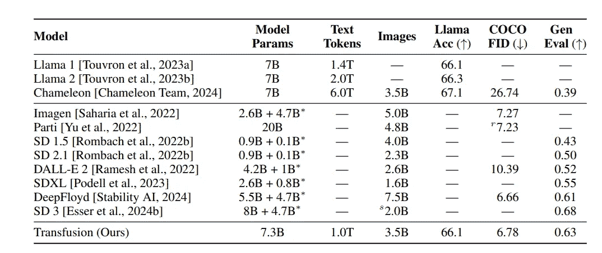

# 变换器？扩散？输血！

> 原文：[`towardsdatascience.com/transformer-diffusion-transfusion-d18d219f2a12?source=collection_archive---------4-----------------------#2024-09-12`](https://towardsdatascience.com/transformer-diffusion-transfusion-d18d219f2a12?source=collection_archive---------4-----------------------#2024-09-12)

## 对最新的多模态输血模型的温和介绍

 [Mengliu Zhao](https://mengliuz.medium.com/?source=post_page---byline--d18d219f2a12--------------------------------)

·发表于[Towards Data Science](https://towardsdatascience.com/?source=post_page---byline--d18d219f2a12--------------------------------) ·阅读时间 6 分钟·2024 年 9 月 12 日

--

最近，Meta 和 Waymo 发布了他们的最新论文——[*Transfusion: 用一个多模态模型预测下一个令牌并扩散图像*](https://www.arxiv.org/pdf/2408.11039)*，*该论文将流行的变换器模型与扩散模型结合，用于多模态训练和预测。

与 Meta 的[先前工作](https://arxiv.org/pdf/2405.09818)类似，Transfusion 模型基于[Llama 架构](https://arxiv.org/abs/2302.13971)，采用早期融合，既处理文本令牌序列，也处理图像令牌序列，并使用单一的变换器模型来生成预测。但与以往的工作不同，Transfusion 模型对图像令牌的处理方式有所不同：

+   图像令牌序列由预训练的变分自编码器部分生成。

+   图像序列的变换器注意力是双向的，而非因果的。

Transfusion 模型架构与预训练任务。文本预训练是下一个词预测任务。图像预训练是去噪扩散任务。图像来源：[`www.arxiv.org/pdf/2408.11039`](https://www.arxiv.org/pdf/2408.11039)

让我们详细讨论以下内容。我们将首先回顾基础知识，例如自回归和扩散模型，然后深入研究 Transfusion 架构。

**自回归模型**

目前，大型语言模型（LLMs）主要基于变换器架构，该架构在 2017 年的[《Attention is All You Need》](https://arxiv.org/abs/1706.03762)论文中提出。变换器架构包含两部分：编码器和解码器。

Transformer 架构。左—编码器；右—解码器。图像来源：[`arxiv.org/pdf/1706.03762`](https://arxiv.org/pdf/1706.03762)

像 BERT 这样的掩码语言模型使用预训练的编码器部分，通过随机双向掩码令牌预测任务（以及下一句预测）进行训练。而像最新的 LLM 这样的自回归模型，解码器部分通常通过下一令牌预测任务进行训练，其中语言模型的损失被最小化：

方程来源：[`www.arxiv.org/pdf/2408.11039`](https://www.arxiv.org/pdf/2408.11039)

在上面的方程中，θ是模型参数集，y_i 是长度为 n 的序列中索引为 i 的令牌，y<i 是所有位于 y_i 之前的令牌。

**扩散模型**

扩散模型是什么？它是一系列常用于计算机视觉（尤其是医学图像分析）中的深度学习模型，主要用于图像生成/去噪等任务。最著名的扩散模型之一是 DDPM，它来自于 2020 年发表的[去噪扩散概率模型](https://arxiv.org/pdf/2006.11239)论文。该模型是一个参数化的马尔可夫链，包含了前向和反向转移，如下所示。

扩散模型是一个双向马尔可夫链。图像来源：[`arxiv.org/pdf/2006.11239`](https://arxiv.org/pdf/2006.11239)

马尔可夫链是什么？它是一种统计过程，其中当前步骤仅依赖于前一步，反之亦然。通过假设一个马尔可夫过程，模型可以在前向过程中（图中从右到左）通过迭代添加高斯噪声来开始于一个干净的图像，并通过在反向过程中（图中从左到右）使用基于 UNet 的架构迭代“学习”噪声。这就是为什么我们有时可以将扩散模型看作生成模型（从左到右使用时），有时又可以看作去噪模型（从右到左使用时）。下面给出了 DDPM 损失，其中θ是模型参数集，\epsilon 是已知的噪声，而\epsilon_theta 是由深度学习模型（通常是 UNet）估计的噪声：

方程来源：[`www.arxiv.org/pdf/2408.11039`](https://www.arxiv.org/pdf/2408.11039)

**潜在空间中的扩散模型**

扩散的思想进一步扩展到潜在空间中，在[CVPR’22 论文](https://arxiv.org/pdf/2112.10752)中，图像首先通过使用预训练[变分自编码器](https://arxiv.org/pdf/1312.6114)（VAE）的编码器部分“压缩”到潜在空间。然后，扩散和反向过程在潜在空间中进行，并通过 VAE 的解码器部分将其映射回像素空间。这可以大大提高学习速度和效率，因为大部分计算是在较低维度的空间中进行的。

潜在扩散模型架构。 \Epsilon 和 D 分别是编码器和解码器。图像来源：[`arxiv.org/pdf/2112.10752`](https://arxiv.org/pdf/2112.10752)

**基于 VAE 的图像输送**

Transfusion 模型的核心部分是扩散模型与变压器模型在输入图像上的融合。首先，图像被划分为一个 8*8 的补丁序列；每个补丁被送入一个预训练的 VAE 编码器进行“压缩”，以得到一个 8 元素的潜在向量表示。然后，噪声被添加到潜在表示中，并通过一个线性层/U-Net 编码器进一步处理，生成“带噪声”的 x_t。接着，变压器模型处理这一序列的带噪声潜在表示。最后，输出通过另一个线性/U-Net 解码器反向处理，然后使用 VAE 解码器生成“真实”的 x_0 图像。

图像输入的扩散模块部分。噪声被添加到 VAE 编码的嵌入中。图像来源：[`www.arxiv.org/pdf/2408.11039`](https://www.arxiv.org/pdf/2408.11039)

在实际实现中，图像的开始（BOI）令牌和结束（EOI）令牌会被填充到图像表示序列的两侧，然后再与文本令牌进行拼接。图像训练的自注意力是双向注意力，而文本令牌的自注意力是因果的。在训练阶段，图像序列的损失是 DDPM 损失，而其余的文本令牌使用的是语言模型（LM）损失。

那为什么要费劲呢？为什么我们需要如此复杂的处理程序来处理图像补丁令牌？论文解释说，文本和图像的令牌空间是不同的。**虽然文本令牌是离散的，但图像令牌/补丁自然是连续的**。在以往的技术中，图像令牌需要在融合到变压器模型之前进行“离散化”，而直接整合扩散模型可以解决这一问题。

**与最先进技术比较**

论文比较的主要多模态模型是[Chameleon 模型](https://arxiv.org/abs/2405.09818)，这是 Meta 今年早些时候提出的。在这里，我们比较了 Chameleon-7B 和 Transfusion-7B 在架构和训练集大小上的差异。

Chameleon 7B 和 Transfusion 7B 之间的架构与训练差异。图片由作者提供。

论文列出了在 Llama2 预训练套件精度、COCO 零样本 Frechet Inception 距离（FID）和 GenEval 基准测试上的性能比较。我们可以看到，Transfusion 在与图像相关的基准（COCO 和 Gen）上表现远好于 Chameleon，而在与 Chameleon 相比时，仅略微有所失分，且参数量相同。

图像来源：[`www.arxiv.org/pdf/2408.11039`](https://www.arxiv.org/pdf/2408.11039)

**进一步的评论。**

尽管论文的思路非常有趣，但“Transfusion”中的“扩散”部分实际上并不是真正的扩散，因为在马尔可夫过程中只有两个时间戳。此外，预训练的 VAE 使得模型不再是严格的端到端。并且，VAE + 线性/UNet + Transformer 编码器 + 线性/UNet + VAE 设计看起来非常复杂，这让观众不禁问，是否有更优雅的方式来实现这个想法？此外，我之前写过关于[苹果公司最新出版的论文](https://medium.com/towards-data-science/from-masked-image-modeling-to-autoregressive-image-modeling-d9a3cadf72a1)，探讨了在图像上使用自回归建模的泛化效益，因此或许值得再次思考“MIM + 自回归”方法。

如果你觉得这篇文章有趣并且想讨论，欢迎留言，我很乐意在那儿进一步展开讨论 :)

**参考文献**

+   Zhou 等人，《Transfusion：用一个多模态模型预测下一个令牌并扩散图像》，arXiv 2024。

+   C. Team，《Chameleon：混合模态早期融合基础模型》，arXiv 预印本 2024。

+   Touvron 等人，《Llama：开放且高效的基础语言模型》，arXiv 2023。

+   Rombach 等人，《使用潜在扩散模型进行高分辨率图像合成》，CVPR 2022。

+   Ho 等人，《去噪扩散概率模型》，NeurIPS 2020。

+   Vaswani，《Attention is all you need》，NeurIPS 2017。

+   Kingma，《自编码变分贝叶斯》，arXiv 预印本 2013。
