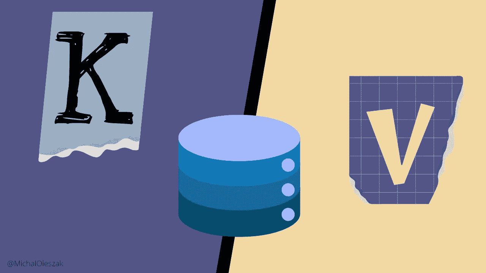

# Transformer 键值（KV）缓存解释

> 原文：[`towardsdatascience.com/transformers-key-value-kv-caching-explained-4d71de62d22d?source=collection_archive---------0-----------------------#2024-12-11`](https://towardsdatascience.com/transformers-key-value-kv-caching-explained-4d71de62d22d?source=collection_archive---------0-----------------------#2024-12-11)

## LLMOps

## 加速你的 LLM 推理

 [Michał Oleszak](https://michaloleszak.medium.com/?source=post_page---byline--4d71de62d22d--------------------------------)

·发布于 [Towards Data Science](https://towardsdatascience.com/?source=post_page---byline--4d71de62d22d--------------------------------) ·14 分钟阅读·2024 年 12 月 11 日

--

Transformer 架构可以说是现代深度学习中最具影响力的创新之一。它在著名的 [2017 年论文《Attention Is All You Need》](https://arxiv.org/abs/1706.03762)中提出，已经成为大多数与语言相关的建模方法，包括所有大型语言模型（LLMs），如 [GPT 系列](https://en.wikipedia.org/wiki/Generative_pre-trained_transformer)，以及许多计算机视觉任务。

随着这些模型的复杂性和规模的增长，它们推理速度优化的需求也在增加，尤其是在聊天应用中，用户期望即时回复。键值（KV）缓存是实现这一目标的一个巧妙技巧——让我们看看它是如何工作的，以及何时使用它。

# Transformer 架构概述

在深入了解 KV 缓存之前，我们需要稍作绕道，了解一下 transformers 中的注意力机制。理解其工作原理是发现和理解 KV 缓存如何优化 transformer 推理的关键。

我们将重点关注用于生成文本的自回归模型。这些所谓的解码器模型包括 [GPT 系列](https://platform.openai.com/docs/models)、[Gemini](https://gemini.google.com/)、[Claude](https://www.anthropic.com/claude) 或 [GitHub Copilot](https://github.com/features/copilot)。它们的训练任务很简单：预测序列中的下一个标记。在推理过程中，模型会收到一些文本，其任务是…
