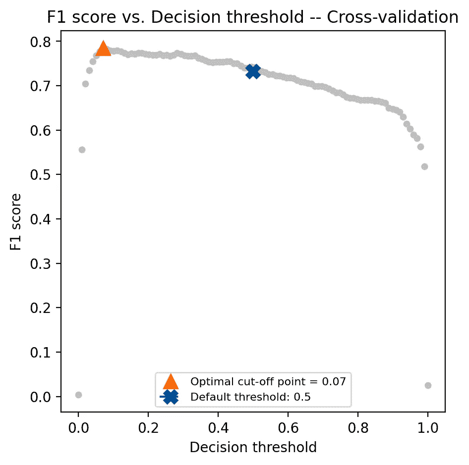
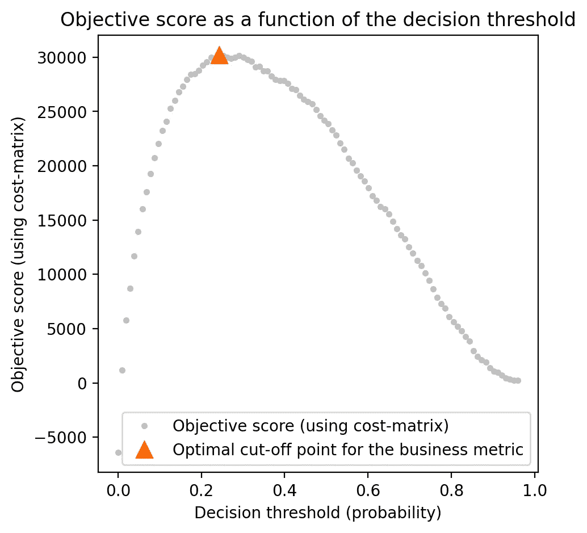
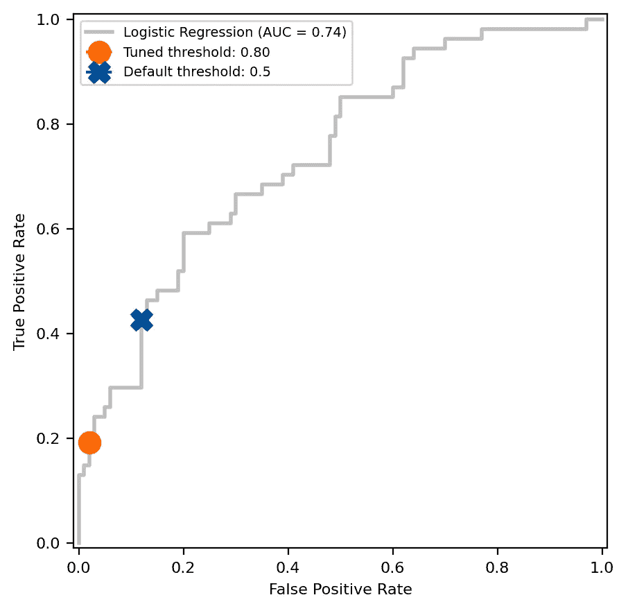

# 调整：使用 scikit-learn 的 TunedThresholdClassifierCV 进行决策阈值优化

> 原文：[`towardsdatascience.com/tune-in-decision-threshold-optimization-with-scikit-learns-tunedthresholdclassifiercv-7de558a2cf58?source=collection_archive---------0-----------------------#2024-05-27`](https://towardsdatascience.com/tune-in-decision-threshold-optimization-with-scikit-learns-tunedthresholdclassifiercv-7de558a2cf58?source=collection_archive---------0-----------------------#2024-05-27)

## 使用案例和代码来探索新类，帮助调整 scikit-learn 中的决策阈值

[](https://medium.com/@arvkevi?source=post_page---byline--7de558a2cf58--------------------------------)[](https://towardsdatascience.com/?source=post_page---byline--7de558a2cf58--------------------------------) [Kevin Arvai](https://medium.com/@arvkevi?source=post_page---byline--7de558a2cf58--------------------------------)

·发表于 [Towards Data Science](https://towardsdatascience.com/?source=post_page---byline--7de558a2cf58--------------------------------) ·阅读时间 10 分钟·2024 年 5 月 27 日

--

scikit-learn 1.5 版本引入了一个新类，[TunedThresholdClassifierCV](https://scikit-learn.org/stable/modules/generated/sklearn.model_selection.TunedThresholdClassifierCV.html)，使得优化来自 scikit-learn 分类器的决策阈值变得更加容易。决策阈值是一个临界点，它将机器学习模型输出的预测概率转换为离散类别。对于二分类任务，scikit-learn 分类器的 `.predict()` 方法的默认决策阈值是 0.5。虽然这是一个合理的默认值，但它很少是分类任务的最佳选择。

本文介绍了 TunedThresholdClassifierCV 类，并展示了它如何优化各种二分类任务的决策阈值。这个新类将帮助填补构建模型的数据科学家和根据模型输出做出决策的业务利益相关者之间的鸿沟。通过微调决策阈值，数据科学家可以提高模型性能，并更好地与业务目标对齐。

本文将涵盖以下几种调整决策阈值有益的情况：

1.  **最大化指标**：当选择一个阈值以最大化评分指标时，使用此方法，例如 F1 分数。

1.  **成本敏感学习**：当误分类的假阳性成本与误分类的假阴性成本不相等，并且你有成本估计时，调整阈值。

1.  **在约束下调优**：在 ROC 或精确度-召回曲线中优化操作点，以满足特定的性能约束。

本文中使用的代码及数据集链接可以在[GitHub](https://github.com/arvkevi/tunein-blog)上找到。

让我们开始吧！首先，导入必要的库，读取数据，并划分训练集和测试集。

```py
import matplotlib.pyplot as plt
import numpy as np
import pandas as pd
from sklearn.compose import ColumnTransformer
from sklearn.compose import make_column_selector as selector
from sklearn.ensemble import RandomForestClassifier
from sklearn.linear_model import LogisticRegression
from sklearn.metrics import (
    RocCurveDisplay,
    f1_score,
    make_scorer,
    recall_score,
    roc_curve,
    confusion_matrix,
)
from sklearn.model_selection import TunedThresholdClassifierCV, train_test_split
from sklearn.pipeline import make_pipeline
from sklearn.preprocessing import OneHotEncoder, StandardScaler

RANDOM_STATE = 26120
```

## 最大化一个指标

在任何机器学习项目中开始构建模型之前，与利益相关者一起确定需要优化的指标非常重要。提前做出这个决策能确保项目与其预期目标一致。

在欺诈检测应用中使用准确率作为评估模型性能的指标并不理想，因为数据通常是不平衡的，大多数交易是非欺诈性的。F1 得分是精确度和召回率的调和平均值，对于像欺诈检测这样的不平衡数据集来说，是一个更好的指标。让我们使用`TunedThresholdClassifierCV`类来优化逻辑回归模型的决策阈值，以最大化 F1 得分。

我们将使用[Kaggle 信用卡欺诈检测数据集](https://www.kaggle.com/datasets/mlg-ulb/creditcardfraud)来介绍我们需要调优决策阈值的第一个场景。首先，将数据划分为训练集和测试集，然后创建一个 scikit-learn 管道来缩放数据并训练一个逻辑回归模型。将管道拟合在训练数据上，以便我们可以将原始模型的表现与调优后的模型表现进行比较。

```py
creditcard = pd.read_csv("data/creditcard.csv")
y = creditcard["Class"]
X = creditcard.drop(columns=["Class"])

X_train, X_test, y_train, y_test = train_test_split(
    X, y, test_size=0.2, random_state=RANDOM_STATE, stratify=y
)

# Only Time and Amount need to be scaled
original_fraud_model = make_pipeline(
    ColumnTransformer(
        [("scaler", StandardScaler(), ["Time", "Amount"])],
        remainder="passthrough",
        force_int_remainder_cols=False,
    ),
    LogisticRegression(),
)
original_fraud_model.fit(X_train, y_train)
```

目前尚未进行调优，但将在下一个代码块中进行。`TunedThresholdClassifierCV`的参数与 scikit-learn 中的其他`CV`类类似，例如[GridSearchCV](https://scikit-learn.org/stable/modules/generated/sklearn.model_selection.GridSearchCV.html)。至少，用户只需传递原始估计器，`TunedThresholdClassifierCV`将使用 5 折分层 K 折交叉验证（默认）存储最大化平衡准确率的决策阈值（默认）。在调用`.predict()`时，它也会使用此阈值。然而，任何 scikit-learn 度量（或可调用对象）都可以作为`scoring`度量。此外，用户可以传递熟悉的`cv`参数来自定义交叉验证策略。

创建`TunedThresholdClassifierCV`实例并在训练数据上拟合模型。传递原始模型，并将评分设置为“f1”。我们还需要设置`store_cv_results=True`，以便在交叉验证期间访问评估的阈值，以便可视化。

```py
tuned_fraud_model = TunedThresholdClassifierCV(
    original_fraud_model,
    scoring="f1",
    store_cv_results=True,
)

tuned_fraud_model.fit(X_train, y_train)

# average F1 across folds
avg_f1_train = tuned_fraud_model.best_score_
# Compare F1 in the test set for the tuned model and the original model
f1_test = f1_score(y_test, tuned_fraud_model.predict(X_test))
f1_test_original = f1_score(y_test, original_fraud_model.predict(X_test))

print(f"Average F1 on the training set: {avg_f1_train:.3f}")
print(f"F1 on the test set: {f1_test:.3f}")
print(f"F1 on the test set (original model): {f1_test_original:.3f}")
print(f"Threshold: {tuned_fraud_model.best_threshold_: .3f}") 
```

```py
Average F1 on the training set: 0.784
F1 on the test set: 0.796
F1 on the test set (original model): 0.733
Threshold:  0.071
```

现在我们已经找到了最大化 F1 得分的阈值，可以检查`tuned_fraud_model.best_score_`以了解交叉验证中折叠的最佳平均 F1 得分。我们还可以使用`tuned_fraud_model.best_threshold_`查看生成这些结果的阈值。您可以使用`objective_scores_`和`decision_thresholds_`属性可视化交叉验证过程中不同决策阈值下的度量得分：

```py
fig, ax = plt.subplots(figsize=(5, 5))
ax.plot(
    tuned_fraud_model.cv_results_["thresholds"],
    tuned_fraud_model.cv_results_["scores"],
    marker="o",
    linewidth=1e-3,
    markersize=4,
    color="#c0c0c0",
)
ax.plot(
    tuned_fraud_model.best_threshold_,
    tuned_fraud_model.best_score_,
    "^",
    markersize=10,
    color="#ff6700",
    label=f"Optimal cut-off point = {tuned_fraud_model.best_threshold_:.2f}",
)
ax.plot(
    0.5,
    f1_test_original,
    label="Default threshold: 0.5",
    color="#004e98",
    linestyle="--",
    marker="X",
    markersize=10,
)
ax.legend(fontsize=8, loc="lower center")
ax.set_xlabel("Decision threshold", fontsize=10)
ax.set_ylabel("F1 score", fontsize=10)
ax.set_title("F1 score vs. Decision threshold -- Cross-validation", fontsize=12)
```



图片由作者创建。

```py
# Check that the coefficients from the original model and the tuned model are the same
assert (tuned_fraud_model.estimator_[-1].coef_ ==
        original_fraud_model[-1].coef_).all()
```

我们使用了相同的基础逻辑回归模型来评估两个不同的决策阈值。基础模型是相同的，上面的断言语句证明了系数的相等性。`TunedThresholdClassifierCV`中的优化是通过后处理技术实现的，这些技术直接应用于模型输出的预测概率。然而，值得注意的是，`TunedThresholdClassifierCV`默认使用交叉验证来确定决策阈值，以避免过拟合训练数据。

## 成本敏感学习

成本敏感学习是一种机器学习方法，它为每种类型的错误分类分配成本。这将模型性能转化为利益相关者能够理解的单位，比如节省的美元。

我们将使用[TELCO 客户流失数据集](https://accelerator.ca.analytics.ibm.com/bi/?perspective=authoring&pathRef=.public_folders%2FIBM%2BAccelerator%2BCatalog%2FContent%2FDAT00148&id=i9710CF25EF75468D95FFFC7D57D45204&objRef=i9710CF25EF75468D95FFFC7D57D45204&action=run&format=HTML&cmPropStr=%7B%22id%22%3A%22i9710CF25EF75468D95FFFC7D57D45204%22%2C%22type%22%3A%22reportView%22%2C%22defaultName%22%3A%22DAT00148%22%2C%22permissions%22%3A%5B%22execute%22%2C%22read%22%2C%22traverse%22%5D%7D)，这是一个二分类数据集，来展示成本敏感学习的价值。目标是根据客户的基本信息、合同详情及账户的其他技术信息预测客户是否会流失。使用这个数据集（以及部分代码）的动机来源于[Dan Becker 的决策阈值优化课程](https://www.wandb.courses/courses/decision-optimization)。

```py
data = pd.read_excel("data/Telco_customer_churn.xlsx")
drop_cols = [
    "Count", "Country", "State", "Lat Long", "Latitude", "Longitude",
    "Zip Code", "Churn Value", "Churn Score", "CLTV", "Churn Reason"
]
data.drop(columns=drop_cols, inplace=True)

# Preprocess the data
data["Churn Label"] = data["Churn Label"].map({"Yes": 1, "No": 0})
data.drop(columns=["Total Charges"], inplace=True)

X_train, X_test, y_train, y_test = train_test_split(
    data.drop(columns=["Churn Label"]),
    data["Churn Label"],
    test_size=0.2,
    random_state=RANDOM_STATE,
    stratify=data["Churn Label"],
)
```

设置一个基本的处理管道，使用随机森林模型生成预测概率。这将作为与`TunedThresholdClassifierCV`进行比较的基准。

```py
preprocessor = ColumnTransformer(
    transformers=[("one_hot", OneHotEncoder(),
                   selector(dtype_include="object"))],
    remainder="passthrough",
)

original_churn_model = make_pipeline(
    preprocessor, RandomForestClassifier(random_state=RANDOM_STATE)
)
original_churn_model.fit(X_train.drop(columns=["customerID"]), y_train);
```

对于本教程来说，预处理和模型类型的选择并不重要。公司希望向预测会流失的客户提供折扣。在与利益相关者的合作中，你了解到，给一个不会流失的客户（假阳性）提供折扣会花费 80 美元。你还了解到，向一个本来会流失的客户提供折扣价值 200 美元。你可以通过一个成本矩阵来表示这种关系：

```py
def cost_function(y, y_pred, neg_label, pos_label):
    cm = confusion_matrix(y, y_pred, labels=[neg_label, pos_label])
    cost_matrix = np.array([[0, -80], [0, 200]])
    return np.sum(cm * cost_matrix)

cost_scorer = make_scorer(cost_function, neg_label=0, pos_label=1)
```

我们还将成本函数包装在一个 scikit-learn 自定义评分器中。这个评分器将在 TunedThresholdClassifierCV 中作为`scoring`参数使用，并用于在测试集上评估利润。

```py
tuned_churn_model = TunedThresholdClassifierCV(
    original_churn_model,
    scoring=cost_scorer,
    store_cv_results=True,
)

tuned_churn_model.fit(X_train.drop(columns=["CustomerID"]), y_train)

# Calculate the profit on the test set
original_model_profit = cost_scorer(
    original_churn_model, X_test.drop(columns=["CustomerID"]), y_test
)
tuned_model_profit = cost_scorer(
    tuned_churn_model, X_test.drop(columns=["CustomerID"]), y_test
)

print(f"Original model profit: {original_model_profit}")
print(f"Tuned model profit: {tuned_model_profit}")
```

```py
Original model profit: 29640
Tuned model profit: 35600
```

与原始模型相比，调整后的模型的利润更高。同样，我们可以将目标指标与决策阈值进行绘图，以可视化在交叉验证过程中对训练数据的决策阈值选择：

```py
fig, ax = plt.subplots(figsize=(5, 5))
ax.plot(
    tuned_churn_model.cv_results_["thresholds"],
    tuned_churn_model.cv_results_["scores"],
    marker="o",
    markersize=3,
    linewidth=1e-3,
    color="#c0c0c0",
    label="Objective score (using cost-matrix)",
)
ax.plot(
    tuned_churn_model.best_threshold_,
    tuned_churn_model.best_score_,
    "^",
    markersize=10,
    color="#ff6700",
    label="Optimal cut-off point for the business metric",
)
ax.legend()
ax.set_xlabel("Decision threshold (probability)")
ax.set_ylabel("Objective score (using cost-matrix)")
ax.set_title("Objective score as a function of the decision threshold")
```



图片由作者创建。

实际上，从业务角度来看，给所有误分类实例分配一个固定的成本是不现实的。通过为数据集中的每个实例分配权重来调整阈值是更先进的方法。这一点在 [scikit-learn 的成本敏感学习示例](https://scikit-learn.org/stable/auto_examples/model_selection/plot_cost_sensitive_learning.html#sphx-glr-auto-examples-model-selection-plot-cost-sensitive-learning-py)中有介绍。

## 约束下调优

目前这个方法在 scikit-learn 文档中没有涉及，但它是二分类应用场景中常见的业务案例。约束下调优方法通过在 ROC 曲线或精确率-召回率曲线中找到一个点来确定决策阈值。曲线上的这个点是一个轴的最大值，同时约束另一个轴。在本次教程中，我们将使用 Pima 印第安人糖尿病数据集。这是一个二分类任务，用于预测一个人是否患有糖尿病。

假设您的模型将用于对一个平均风险群体进行筛查，且适用于数百万人。在美国，大约有 3800 万人患有糖尿病，这大约占总人口的 11.6%。因此，模型的特异性应该很高，以避免误诊数百万人患有糖尿病，并将其转诊进行不必要的确认性测试。假设您的虚拟 CEO 已经表明，他们不会容忍超过 2% 的假阳性率。让我们构建一个使用 `TunedThresholdClassifierCV` 达到这一目标的模型。

在本部分教程中，我们将定义一个约束函数，用于在 2% 假阳性率下找到最大真正阳性率。

```py
def max_tpr_at_tnr_constraint_score(y_true, y_pred, max_tnr=0.5):
    fpr, tpr, thresholds = roc_curve(y_true, y_pred, drop_intermediate=False)
    tnr = 1 - fpr
    tpr_at_tnr_constraint = tpr[tnr >= max_tnr].max()
    return tpr_at_tnr_constraint

max_tpr_at_tnr_scorer = make_scorer(
    max_tpr_at_tnr_constraint_score, max_tnr=0.98)
data = pd.read_csv("data/diabetes.csv")

X_train, X_test, y_train, y_test = train_test_split(
    data.drop(columns=["Outcome"]),
    data["Outcome"],
    stratify=data["Outcome"],
    test_size=0.2,
    random_state=RANDOM_STATE,
)
```

构建两个模型，一个是逻辑回归模型作为基线模型，另一个是 `TunedThresholdClassifierCV`，它将包装基线逻辑回归模型，以实现 CEO 所设定的目标。在调优模型中，设置 `scoring=max_tpr_at_tnr_scorer`。同样，本教程中的模型选择和预处理步骤并不重要。

```py
# A baseline model
original_model = make_pipeline(
    StandardScaler(), LogisticRegression(random_state=RANDOM_STATE)
)
original_model.fit(X_train, y_train)

# A tuned model
tuned_model = TunedThresholdClassifierCV(
    original_model,
    thresholds=np.linspace(0, 1, 150),
    scoring=max_tpr_at_tnr_scorer,
    store_cv_results=True,
    cv=8,
    random_state=RANDOM_STATE,
)
tuned_model.fit(X_train, y_train)
```

比较 scikit-learn 估计器默认决策阈值 0.5 和使用约束下调优方法在 ROC 曲线中找到的阈值之间的差异。

```py
# Get the fpr and tpr of the original model
original_model_proba = original_model.predict_proba(X_test)[:, 1]
fpr, tpr, thresholds = roc_curve(y_test, original_model_proba)
closest_threshold_to_05 = (np.abs(thresholds - 0.5)).argmin()
fpr_orig = fpr[closest_threshold_to_05]
tpr_orig = tpr[closest_threshold_to_05]

# Get the tnr and tpr of the tuned model
max_tpr = tuned_model.best_score_
constrained_tnr = 0.98

# Plot the ROC curve and compare the default threshold to the tuned threshold
fig, ax = plt.subplots(figsize=(5, 5))
# Note that this will be the same for both models
disp = RocCurveDisplay.from_estimator(
    original_model,
    X_test,
    y_test,
    name="Logistic Regression",
    color="#c0c0c0",
    linewidth=2,
    ax=ax,
)
disp.ax_.plot(
    1 - constrained_tnr,
    max_tpr,
    label=f"Tuned threshold: {tuned_model.best_threshold_:.2f}",
    color="#ff6700",
    linestyle="--",
    marker="o",
    markersize=11,
)
disp.ax_.plot(
    fpr_orig,
    tpr_orig,
    label="Default threshold: 0.5",
    color="#004e98",
    linestyle="--",
    marker="X",
    markersize=11,
)
disp.ax_.set_ylabel("True Positive Rate", fontsize=8)
disp.ax_.set_xlabel("False Positive Rate", fontsize=8)
disp.ax_.tick_params(labelsize=8)
disp.ax_.legend(fontsize=7)
```



图片由作者创建。

约束下调优方法找到了一个 0.80 的阈值，这导致在训练数据交叉验证过程中平均灵敏度为 19.2%。比较灵敏度和特异性，看看这个阈值在测试集中的表现如何。该模型在测试集中达到了 CEO 的特异性要求吗？

```py
# Average sensitivity and specificity on the training set
avg_sensitivity_train = tuned_model.best_score_

# Call predict from tuned_model to calculate sensitivity and specificity on the test set
specificity_test = recall_score(
    y_test, tuned_model.predict(X_test), pos_label=0)
sensitivity_test = recall_score(y_test, tuned_model.predict(X_test))

print(f"Average sensitivity on the training set: {avg_sensitivity_train:.3f}")
print(f"Sensitivity on the test set: {sensitivity_test:.3f}")
print(f"Specificity on the test set: {specificity_test:.3f}")
```

```py
Average sensitivity on the training set: 0.192
Sensitivity on the test set: 0.148
Specificity on the test set: 0.990
```

## 结论

新的`TunedThresholdClassifierCV`类是一个强大的工具，可以帮助你通过向商业领导者展示你如何得出决策阈值，成为更好的数据科学家。你学习了如何使用新的 scikit-learn `TunedThresholdClassifierCV`类来最大化一个指标，执行成本敏感学习，并在约束条件下调整指标。这个教程并不旨在全面或深入。我希望介绍这一新特性，并突出它在解决二分类问题时的强大功能和灵活性。请查阅 scikit-learn 文档、用户指南和示例，以获取详细的使用示例。

特别感谢[Guillaume Lemaitre](https://github.com/glemaitre)为此功能所做的工作。

感谢阅读，祝调优愉快。

数据许可证：

信用卡欺诈：DbCL

皮马印第安人糖尿病数据集：CC0

电信客户流失：[商业用途可用](https://developer.ibm.com/terms/download-of-content-agreement/)
