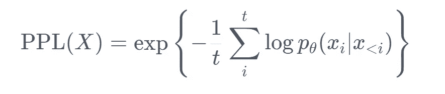
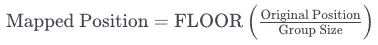
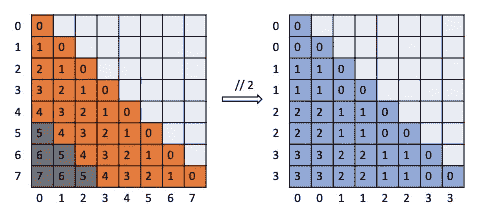
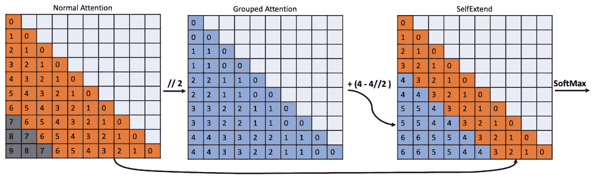
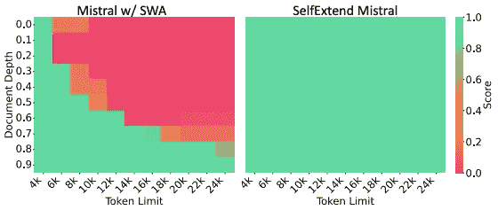

# 无需调优的 LLM 更长上下文长度——自我扩展（LLM 也许是 LongLM）评审

> 原文：[`towardsdatascience.com/tuning-free-longer-context-lengths-for-llms-a-review-of-self-extend-llm-maybe-longlm-4bbd9b1021bf?source=collection_archive---------12-----------------------#2024-01-04`](https://towardsdatascience.com/tuning-free-longer-context-lengths-for-llms-a-review-of-self-extend-llm-maybe-longlm-4bbd9b1021bf?source=collection_archive---------12-----------------------#2024-01-04)

## 一种简单的策略，使 LLM 在推理过程中能够处理更长的上下文输入，而无需进行微调。

 [Bhavin Jawade](https://bhavinjawade.medium.com/?source=post_page---byline--4bbd9b1021bf--------------------------------)

·发布于[Towards Data Science](https://towardsdatascience.com/?source=post_page---byline--4bbd9b1021bf--------------------------------) ·阅读时长 6 分钟·2024 年 1 月 4 日

--

来源：作者使用 DALL-E 3 创建的图像

在本文中，我们将查看 Hongye Jin 等人刚刚在 arxiv 发布的论文“[LLM 也许是 LongLM：自我扩展 LLM 上下文窗口无需调优](https://arxiv.org/abs/2401.01325#:~:text=This%20work%20elicits%20LLMs'%20inherent,long%20input%20sequences%20for%20inference.)”（2024 年 1 月 2 日发布）。

Github: [`github.com/datamllab/LongLM`](https://github.com/datamllab/LongLM)

像 GPT-3 或 BERT 这样的 LLM 通常是在固定长度的序列上进行训练的。这一设计选择源于实际的限制条件：管理计算资源并保持训练效率。因此，这些模型通常会在一个预定的最大长度的序列上进行训练（例如，BERT 的最大长度为 512 个标记，或对于更大的模型，可能是几千个标记）。这里的限制是，模型的自注意力机制——一个帮助模型理解和生成语言的关键组件——只能训练去关注这个固定长度范围内的上下文。

在训练过程中，模型学习创建输入序列的表示，结合了每个标记的**内容（标记）和位置**。**位置编码**是一种融合单词顺序的方法，在这里发挥着至关重要的作用。然而，由于训练是基于固定长度的序列，模型对位置关系的理解仅限于这个范围。当在推理时遇到更长的序列时，**模型会遇到它从未见过的位置和标记之间的相对距离**，这就导致了作者所说的“**位置 O.O.D（超出分布）**”问题。从本质上讲，模型的性能下降是因为它正在处理的输入结构与其训练时的输入不同。

因此，挑战在于使这些模型能够处理比它们训练时更长的序列，而不因位置的 O.O.D（超出分布）问题而导致性能下降。这个问题在现实世界的应用中尤为重要，因为输入序列通常比训练序列要长得多，而在这些更长的序列上保持上下文的能力对于任务如文档摘要、扩展对话理解或阅读长篇技术文档等至关重要。作者认为，LLMs 天生就能够处理比通常训练时更长的文本序列，唯一的主要瓶颈是 O.O.D 位置编码问题。

论文提出了一种简单而有效的策略，可以将较长的“推理时间”序列适配到在有限上下文长度上训练的模型，而无需进行任何微调。

在讨论论文的方法之前，我们先快速了解一下用于评估大语言模型（LLMs）的困惑度指标。

# **困惑度（PPL）**

困惑度（PPL）是自然语言处理（NLP）中常用的度量，用于评估语言模型的表现。它衡量的是一个概率模型对样本的预测能力。在语言模型的背景下，困惑度衡量的是模型对一系列单词的预测能力。困惑度被定义为一个单词序列的负对数似然的指数化平均值。数学上来说

来源：[`huggingface.co/docs/transformers/perplexity`](https://huggingface.co/docs/transformers/perplexity)

较低的困惑度分数意味着更好的语言模型。这意味着模型在处理测试样本时，平均会为其分配更高的概率。换句话说，模型对实际遇到的单词序列不那么“惊讶”，这也是为什么使用“困惑度”这一术语的原因。困惑度通常用于因果模型，如 GPT、Mistral 等（而不是用于 BERT 这类的 MLM）。关于困惑度的一个很棒的博客：[`huggingface.co/docs/transformers/perplexity`](https://huggingface.co/docs/transformers/perplexity)

# 自我扩展

在标准的大型语言模型（LLMs）中，序列中的每个标记都会关注到其他所有标记，考虑它们的相对位置。这种位置信息对于理解上下文和单词之间的关系至关重要。然而，这一机制是基于训练时看到的最大序列长度。当输入序列超过此长度时，模型会遇到它从未见过的位置（O.O.D.），导致性能下降。

**分组注意力**：为了将 O.O.D.位置转换为模型训练时看到的范围，将执行一个简单的数学“向下取整除法”操作（在编程中表示为“//”）。

例如，考虑一个包含 8 个标记的序列和一个大小为 2 的分组。原始位置`[0, 1, 2, 3, 4, 5, 6, 7]`将被映射为`[0, 0, 1, 1, 2, 2, 3, 3]`。通过分组标记，模型可以处理比其原始训练限制更长的序列，有效地扩展其上下文窗口。

来源：[`arxiv.org/pdf/2401.01325.pdf`](https://arxiv.org/pdf/2401.01325.pdf)

但是，当多个标记具有相同的位置信息时，位置的不准确可能会导致性能的下降。论文表明，当分组大小较小时，PPL（困惑度）略高于原始的大型语言模型。

邻近标记是生成下一个标记最重要的标记。对于彼此接近的标记，精确的相对位置对于理解即时上下文至关重要，例如句子的语法和语义。而当标记在文本中相隔较远时，它们之间的精确相对位置变得不那么重要，理解整体上下文或意义更依赖于它们之间的一般主题联系。

在这一点上，论文提出将带有 FLOOR 操作的分组注意力与常规注意力（具有常规位置）结合使用。作者建议对每个标记周围的预定义“邻居窗口”使用常规注意力，而对该窗口外的标记使用分组注意力。使用论文中的符号，‘*L*’：预训练上下文窗口大小，‘*G*’：分组注意力的组大小，‘*wn*’：邻居标记的窗口大小：

来源：[`arxiv.org/pdf/2401.01325.pdf`](https://arxiv.org/pdf/2401.01325.pdf)

作者通过`*wn* − (*wn // G)*`引入分组注意力的相对位置变化，以确保常规注意力区域和分组注意力区域之间的平滑过渡。最后，他们通过用分组注意力中的值替换邻居标记窗口外的注意力值，来合并两部分注意力。

例如，考虑一个序列，其中原始模型的上下文窗口为 7 个标记，组大小为 2，邻近窗口为 4 个标记。对于标记位置`[0, 1, 2, 3, 4, 5, 6]`，常规注意力应用于`[0, 1, 2, 3]`，而分组注意力应用于`[4, 5, 6]`。注意力矩阵将是两者的结合，前四个标记具有精确的注意力，而后三个标记则采用分组注意力。最终的注意力矩阵随后用于计算 Transformer 的注意力层的输出，从而保持了局部精度和长程上下文感知能力。

## **结论**

论文展示了与 LLaMA-2、Mistral 和 SOLAR 在有无自我扩展（Self-Extend）情况下的对比。根据论文内容，自我扩展显著降低了模型在长上下文窗口大小下的困惑度（perplexity）。这些模型还在多种任务上进行了测试，如单文档和多文档问答、摘要生成以及少样本学习。在大多数情况下，具有自我扩展的 LLM 在这些基准测试中超越了其原始版本，甚至超越了一些微调后的模型。模型还在 Hugging Face Open LLM 基准测试套件中的各种短上下文任务上进行了测试，这些任务的性能几乎没有受到影响，表明自我扩展不会对模型处理较短文本的能力产生不利影响。

该任务要求语言模型在一个冗长的、毫无意义的文本序列中找到一个基本密码（一个随机的五位数），该密码散布在各个层次。研究结果表明，在没有特定调整的情况下，自我扩展能够在所有测试深度和上下文长度下实现 100%的密码找回成功率。

来源：[`arxiv.org/pdf/2401.01325.pdf`](https://arxiv.org/pdf/2401.01325.pdf)

此外，结果表明，即使 Mistral w/ SWA（滑动窗口注意力）在其初始训练上下文范围之外的 PPL 值有所降低，它仅限于在其滑动窗口内提取信息（如密码）。

总的来说，这表明自我扩展成功地利用了 LLM 在扩展上下文中的固有能力。
