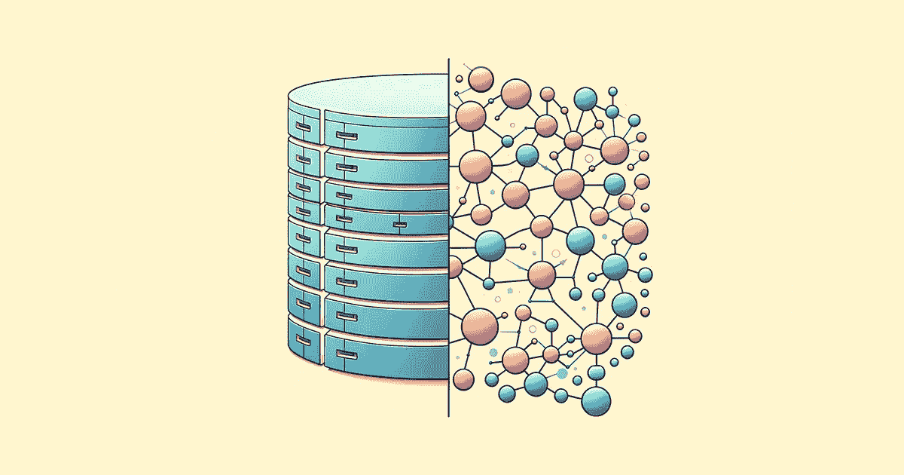

# 将您的关系型数据库转化为图形数据库

> 原文：[`towardsdatascience.com/turning-your-relational-database-into-a-graph-database-c4cee3d5c6d2?source=collection_archive---------3-----------------------#2024-04-14`](https://towardsdatascience.com/turning-your-relational-database-into-a-graph-database-c4cee3d5c6d2?source=collection_archive---------3-----------------------#2024-04-14)

## 利用大型语言模型（LLMs）增强您的数据

 [Katia Gil Guzman](https://blog.katia.gg/?source=post_page---byline--c4cee3d5c6d2--------------------------------)

·发布于 [Towards Data Science](https://towardsdatascience.com/?source=post_page---byline--c4cee3d5c6d2--------------------------------) ·6 分钟阅读·2024 年 4 月 14 日

--

图像由作者生成

关系型数据库数十年来一直是数据管理的支柱，利用其表格格式和严格的模式来处理结构化数据。

**但如果您的数据的真正潜力在于数据点之间的关系呢？这就是图形数据库发挥作用的地方。**

与传统的关系型数据库不同，图形数据库在每个数据点可以与多个其他实体相连接的场景中表现优越，这些关系可以被利用来发现新的洞察。

如果您需要浏览深层次的层级结构或发现隐藏的联系，使用图形数据库可能是一个合适的选择。

它们在构建推荐系统、客户关系管理（CRM）系统或分析客户行为的工具时尤其有用。

在本教程中，我将指导您如何将关系型数据库转换为 Python 中的动态图形数据库。我们将以 [Amazon 产品数据集](https://www.kaggle.com/datasets/asaniczka/amazon-uk-products-dataset-2023) 为例，从产品标题中提取实体，丰富数据集并将其转换为图形数据库。

为此，我们将利用 OpenAI 的 GPT-3.5-turbo 模型，然后使用 Cypher 查询将数据加载到 Neo4j 图形数据库中。
