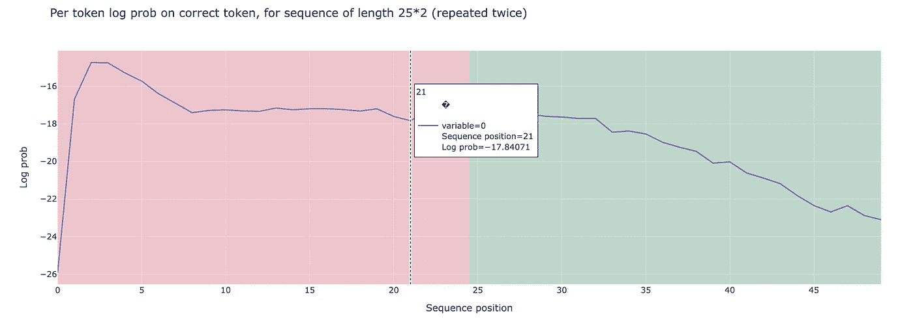
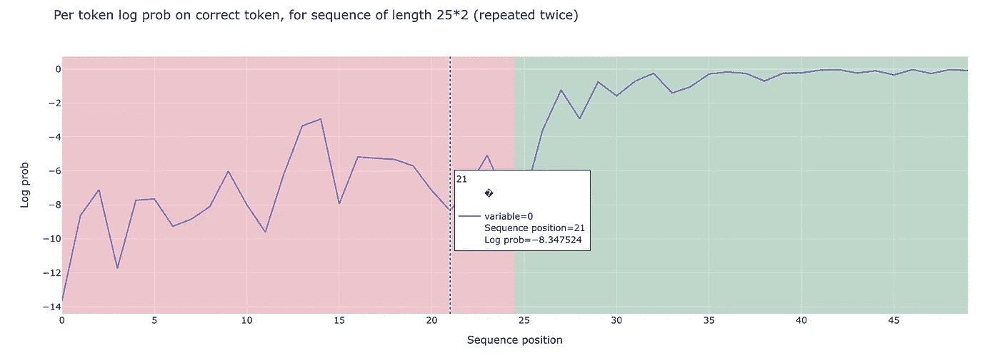

# 大型语言模型中的未充分训练和未使用标记

> 原文：[`towardsdatascience.com/under-trained-and-unused-tokens-in-large-language-models-db5fa17589ec?source=collection_archive---------14-----------------------#2024-10-01`](https://towardsdatascience.com/under-trained-and-unused-tokens-in-large-language-models-db5fa17589ec?source=collection_archive---------14-----------------------#2024-10-01)

## 以 GPT-2 Small 为例，探讨未使用和未充分训练的标记的存在及其识别技术

[](https://medium.com/@vanillaxiangshuyang?source=post_page---byline--db5fa17589ec--------------------------------)[](https://towardsdatascience.com/?source=post_page---byline--db5fa17589ec--------------------------------) [Shuyang Xiang](https://medium.com/@vanillaxiangshuyang?source=post_page---byline--db5fa17589ec--------------------------------)

·发表于[Towards Data Science](https://towardsdatascience.com/?source=post_page---byline--db5fa17589ec--------------------------------) ·7 分钟阅读·2024 年 10 月 1 日

--


图像由[deepai](https://deepai.org/machine-learning-mode)根据文本生成：LLM 的未充分训练标记化

# 引言：未使用和未充分训练的标记

我们在探索基于变换器的大型语言模型（如 ChatGPT）时观察到存在未使用和未充分训练的标记，其中标记化和模型训练是两个独立的过程。未使用的标记和未充分训练的标记具有以下不同的行为：

+   **未使用的标记**存在于大型语言模型的词汇中，并在训练过程中被包含，但没有被充分看到。

+   **未充分训练的标记**可能存在于大型语言模型的词汇中，也可能不存在，并且在训练数据中完全没有出现。

理想情况下，这两种类型的标记应该具有极低的生成概率，或者等效地，具有极其负的 logit 值，这样它们就不应该由大型语言模型生成。然而，在实际中，用户仍然发现一些未使用的标记具有重要的 logit 值，且模型有时不幸会预测到它们。这可能会导致大型语言模型出现不良行为。

让我们考虑一个大型语言模型，它由于一些在模型训练过程中从未训练过的标记，意外地生成了无意义或不恰当的文本。这样的情况有时会导致严重后果，例如幻觉现象，导致准确性和适当性缺失。

我们认为这个问题是由于令牌化和 LLM 训练过程之间的分离。通常，这两个方面从未一起训练过，确实发生了模型词汇表中的某个令牌未能被训练，并且随机出现在模型的输出中。

在本文中，我们将通过一些简单的实验，使用 GPT-2 Small 演示未使用令牌的存在，包括那些训练不足的令牌。我们还将讨论识别训练不足令牌的技术。

# 未使用令牌的存在：关于 GPT-2 Small 的实验

在许多 LLM 中，包括我们实验所用的 GPT-2 Small，存在未使用的令牌，即在 LLM 的词汇表中存在的令牌，这些令牌在训练过程中被包含在内，但没有被充分看到。

在以下示例中，我们给出了证明未使用令牌存在的两个案例：

## 示例 1：重现未使用的令牌

在这个实验中，我们旨在展示 GPT-2 Small 在重复未使用的令牌时的困难，即使是在非常简单的指令下。现在让我们考虑以下未使用的令牌：`"ú"` (`\u00fa`)。我们希望指示 GPT-2 Small 准确地重复输入给定的令牌。

这是一个非常简单的任务：对于给定的输入令牌`"ú"`，模型需要给出相同的令牌作为输出。

```py
from transformers import GPT2LMHeadModel, GPT2Tokenizer
```

```py
# Load pre-trained model (GPT-2 Small) and tokenizer
model_name = "gpt2"  # GPT-2 Small (124M parameters)
model = GPT2LMHeadModel.from_pretrained(model_name)
tokenizer = GPT2Tokenizer.from_pretrained(model_name)
tokenizer.pad_token = tokenizer.eos_token# Configure the model's `pad_token_id`
model.config.pad_token_id = model.config.eos_token_id# Encode a prompt to generate text
token= "\u00fa"
prompt_text = "Rpeats its input exactly" + ', '.join([f"Input: {token}, Output: {token}" for _ in range(20)])+ f"Input: {token}, Output: "
inputs = tokenizer(prompt_text, return_tensors="pt", padding=True)# Generate text with attention mask
output = model.generate(
    inputs['input_ids'],
    attention_mask=inputs['attention_mask'],  # Explicitly pass attention_mask
    max_new_tokens=10,  # Maximum length of the generated text
    num_return_sequences=1,  # Number of sequences to return
    no_repeat_ngram_size=2,  # Prevent repeating n-grams
    do_sample=True,  # Enable sampling
    top_k=50,  # Limit sampling to top k choices
    top_p=0.95,  # Use nucleus sampling
)
```

如上面的代码所示，我们设计了一个作为 n-shot 示例的提示，指示模型给出完全相同的特定令牌`"ú"`。我们看到的是，模型未能预测到这个令牌：它给出了一些杂乱无章的文本，如`"Output: - ß, *- *-, "`。相比之下，当我们用常见的令牌如`"a"`进行相同任务测试时，模型成功地预测了正确的输出，显示出常见令牌和未使用令牌之间在表现上的显著差异。

## 示例 2：令牌重复

我们现在考虑未使用令牌的范围，从索引 177 到 188，这是 GPT2 [1]的未使用令牌范围。

我们现在的目标是生成重复的随机令牌序列，并评估模型在重复序列上的表现。正如我在之前的博客文章中讨论的，**“**[**如何解释 GPT-2 Small：在重复令牌预测中的机械解释性**](https://medium.com/towards-data-science/how-to-interpret-gpt2-small-76e0536a588a)**”**，基于变换器的 LLM 在识别和预测重复模式方面具有强大的能力，即使对于像 GPT-2 Small 这样的小模型也是如此。

例如，当模型遇到一个‘A’时，它会在嵌入空间中寻找之前出现的‘A’或与‘A’紧密相关的令牌。然后它识别下一个令牌‘B’，并预测紧随‘A’之后的令牌将是‘B’或嵌入空间中与‘B’相似的令牌。

我们首先定义了一个函数`generate_repeated_tokens`，它生成一个序列，其中后半部分重复前半部分。

```py
import torch as t
from typing import Tuple
# Assuming HookedTransformer and other necessary components are defined elsewhere.
t.manual_seed(42)
def generate_repeated_tokens(
    model: HookedTransformer, seq_len: int, batch: int = 1
) -> Int[Tensor, "batch full_seq_len"]:
    '''
    Generates a sequence of repeated random tokens
    Outputs are:
        rep_tokens: [batch, 1+2*seq_len]
    '''
    bos_token = (t.ones(batch, 1) * model.tokenizer.bos_token_id).long()  # generate bos token for each batch
    rep_tokens_half = t.randint(177, 188, (batch, seq_len), dtype=t.int64)
    rep_tokens = t.cat([bos_token, rep_tokens_half, rep_tokens_half], dim=-1).to(device)
    return rep_tokens
```

接下来，我们定义了`run_and_cache_model_repeated_tokens`函数，该函数在生成的重复标记上运行模型，返回 logits 并缓存激活值。我们在这里只使用 logits。

```py
def run_and_cache_model_repeated_tokens(model: HookedTransformer, seq_len: int, batch: int = 1) -> Tuple[t.Tensor, t.Tensor, ActivationCache]:
    '''
    Generates a sequence of repeated random tokens, and runs the model on it, returning logits, tokens and cacheShould use the `generate_repeated_tokens` function above
    Outputs are:
        rep_tokens: [batch, 1+2*seq_len]
        rep_logits: [batch, 1+2*seq_len, d_vocab]
        rep_cache: The cache of the model run on rep_tokens
    '''
    rep_tokens = generate_repeated_tokens(model, seq_len, batch)
    rep_logits, rep_cache = model.run_with_cache(rep_tokens)
    return rep_tokens, rep_logits, rep_cache
```

现在，我们使用定义好的`run_and_cache_model_repeated_tokens`函数运行模型，生成标记和关联的 logits，使用以下代码：

```py
seq_len = 25
batch = 1
(rep_tokens, rep_logits, rep_cache) = run_and_cache_model_repeated_tokens(gpt2_small, seq_len, batch)
rep_cache.remove_batch_dim()
rep_str = gpt2_small.to_str_tokens(rep_tokens)
gpt2_small.reset_hooks()
log_probs = get_log_probs(rep_logits, rep_tokens).squeeze()Copy co
```

在运行模型后，我们分析了预测标记的 log 概率，分为两部分对重复序列的 log 概率进行分析。我们观察到标记序列的 log 概率均值分别为：前半部分为-17.270，后半部分为-19.675，索引范围为 177 到 188。



作者提供的图片：重复标记的 log 概率范围在 177 到 188 之间

另一方面，使用常见标记范围进行相同实验会得到不同的结果：当检查标记索引 100 到 110 时，我们观察到后半部分的表现显著更好，log 概率为-0.971，相比之下前半部分的 log 概率为-7.327。



作者提供的图片：重复标记的 log 概率范围在 100 到 111 之间

# 训练不足的标记

如果所有未使用的标记具有显著的负 logits，那么 LLM 的世界理想情况下会少一些惊讶，因此模型也就不会生成奇怪的文本。

不幸的是，现实要复杂得多。由于 tokenizer 的创建和 LLM 的训练并不是同时进行的，这导致了有时会出现训练不足的标记，而这些标记恰是 LLM 产生意外行为的罪魁祸首。

一个训练不足标记的例子是：`_SolidGoldMagikarp`[1]，它有时出现在 ChatGPT 的输出中。现在我们想证明 GPT-2 Small 模型中也存在训练不足的标记。

## 示例：再现未使用的标记

在我们以前使用 GPT-2 Small 模型再现未使用标记的实验中，我们证明了标记`"ú"`几乎没有被模型生成的机会。

现在，我们在运行模型后切片 logits 张量，以隔离未使用标记的输出，标记索引范围从 177 到 188：

```py
sliced_tensor = gpt2_logits[0, :, 177:188]
```

有趣的是，我们观察到在这个“未使用”范围内，某些标记的 logit 值约为-1.7，这意味着一些未使用的标记被生成的概率大约为 0.18。

这一发现突出了模型可能将非忽略性的概率分配给一些未使用的标记，尽管它们在大多数上下文中很少被使用。

# 识别训练不足的标记

近年来，研究人员提出了自动识别大语言模型（LLMs）中训练不足的标记（tokens）的方法。该领域的研究包括 Watkins 和 Rumbelow（2023 年）以及 Fell（2023 年）的工作，其中一种非常有趣的识别训练不足标记的方法是分析模型生成的输出嵌入（E_{out}）：

该方法计算未使用的标记的平均嵌入向量，并使用余弦距离来衡量该向量与模型中所有标记的嵌入向量的相似度。因此，余弦距离接近平均嵌入向量的标记被标记为潜在的训练不足标记。更多细节请参见[1]。

# 结论

总结来说，这篇博客文章讨论了 LLM 中的训练不足标记。我们通过 GPT-2 Small 做了一些实验，说明训练不足的标记可能意外地影响模型输出，有时会产生不可预测和不希望出现的行为。最近的研究提出了相应的检测训练不足标记的方法。对于那些对我的实现有兴趣的人，您可以查看我附带的[笔记本](https://colab.research.google.com/drive/13h_X8uvkai49yUWW2cndKDVMg-8RqlIb#scrollTo=ckKDzTnF1r3l)。

# 参考文献

[1] Land, S., & Bartolo, M. (2024). *Fishing for Magikarp: 自动检测大型语言模型中的训练不足标记*。arXiv。 [`doi.org/10.48550/arXiv.2405.05417`](https://doi.org/10.48550/arXiv.2405.05417)。

[2] Jessica Rumbelow 和 Matthew Watkins. 2023\. SolidGoldMagikarp（加上，提示生成）。博客文章。

[3] Martin Fell. 2023\. 寻找更多 ChatGPT / GPT-3.5 / GPT-4 “不可言说”的故障标记。博客文章。
