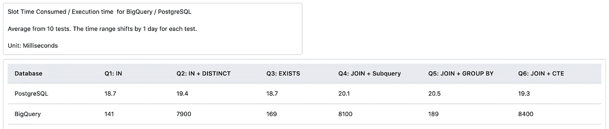
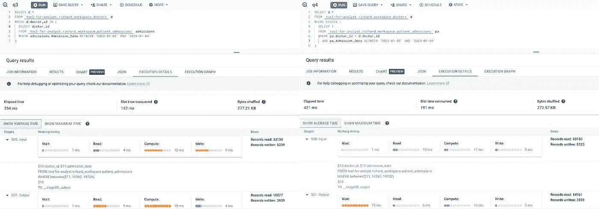
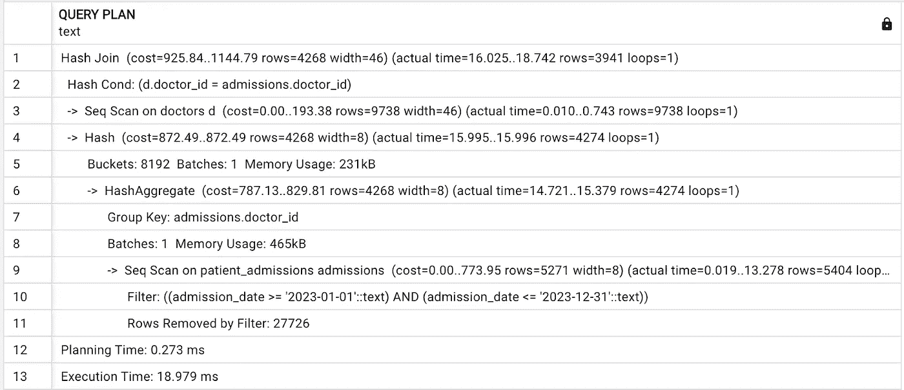

# 了解数据仓库：查询性能

> 原文：[`towardsdatascience.com/understand-data-warehouse-query-performance-23f53a30cc9f?source=collection_archive---------7-----------------------#2024-01-08`](https://towardsdatascience.com/understand-data-warehouse-query-performance-23f53a30cc9f?source=collection_archive---------7-----------------------#2024-01-08)

## 解读 SQL 查询性能：数据仓库和数据库管理系统中的实用分析

[](https://medium.com/@richard_79568?source=post_page---byline--23f53a30cc9f--------------------------------)[](https://towardsdatascience.com/?source=post_page---byline--23f53a30cc9f--------------------------------) [Richard Tang](https://medium.com/@richard_79568?source=post_page---byline--23f53a30cc9f--------------------------------)

·发布于[Towards Data Science](https://towardsdatascience.com/?source=post_page---byline--23f53a30cc9f--------------------------------) ·7 分钟阅读·2024 年 1 月 8 日

--


图片来自[Manuel Geissinger](https://www.pexels.com/@artunchained/)在[Pexels](https://www.pexels.com/photo/black-server-racks-on-a-room-325229/)上的照片

与 Python 和其他命令式编程语言不同，命令式编程语言需要按步骤详细说明算法以进行优化，SQL 是一种声明式编程语言，关注的不是操作的顺序，而是表达你想要实现的逻辑。查询在数据库中的执行方式取决于数据库系统本身，尤其是一个名为查询计划器（或优化器）的组件，它决定了执行查询的最佳方式。这就是为什么几乎相同的查询在数据仓库与传统数据库管理系统中执行方式差异如此之大。

对于大多数数据工作者来说，通常不需要过于关注这种差异，只要查询能够检索到正确的数据即可。然而，当创建交互式仪表盘或机器学习管道时，情况就不同了。在这些情况下，频繁执行的查询会显著影响查询效率和成本。设计良好的查询不仅能节省用户加载数据和指标的时间，还能为公司节省数千美元的 BigQuery 或 Snowflake 账单费用。

今天，我们将专注于一个常见的使用案例：比较多种查询语法和数据库。我们将看到并理解这些数据库在获取和计算数据时的不同处理方式。

这里有一个常见的问题：如何查找去年活跃的医生？假设有一个“医生”表记录了医生的信息，还有一个“病人入院”表记录了患者被医生接收的情况。目标是筛选出在过去一年中至少有一次患者入院的医生（这可以是机器学习管道或互动仪表板中的动态时间段）。

实际上，写这个查询有三种常见的方法：EXISTS、IN 和 JOIN。我们将对它们进行分析，并在 Bigquery 和 PostgreSQL 上运行实验，以验证我们的分析。

第一种方法：IN

对于 Python 用户来说，IN 操作符可能是最直观的方法。这种方法首先筛选出去年入院的记录，然后检查医生是否出现在这些记录中。我们还将测试添加 DISTINCT 是否能提高性能。

```py
SELECT d.*
FROM `tool-for-analyst.richard_workspace.doctors` d
WHERE d.doctor_id IN (
  SELECT doctor_id
  FROM `tool-for-analyst.richard_workspace.patient_admissions` admissions
  WHERE admissions.Admission_Date BETWEEN '2023–01–01' AND '2023–12–31'
);
```

第二种方法 EXISTS：

另一种方法是使用 EXISTS 操作符，它会筛选结果，仅包含那些子查询返回至少一条记录的结果。EXISTS 操作基于“半连接”的概念，这意味着它实际上并不会对右侧执行连接；相反，它仅检查连接是否会为任何给定元组产生结果。当找到一个匹配时，它会停止。这可能会带来一些性能优势。

```py
SELECT d.*
FROM `tool-for-analyst.richard_workspace.doctors` d
WHERE EXISTS (
  SELECT 1
  FROM `tool-for-analyst.richard_workspace.patient_admissions` pa
  WHERE pa.doctor_id = d.doctor_id
  AND pa.Admission_Date BETWEEN '2023–01–01' AND '2023–12–31'
)
```

第三种方法：

第三种方法涉及使用 JOIN，这是关系型数据库哲学中最经典的方法。论坛中经常有关于何时过滤以及是否使用子查询或公共表表达式（CTE）的争论。我们也将这些考虑因素纳入了实验。

在子查询中进行过滤后再执行 JOIN

```py
SELECT d.doctor_id, name, Hospital, Age, Gender
FROM `tool-for-analyst.richard_workspace.doctors` d
INNER JOIN (
  SELECT DISTINCT doctor_id
  FROM `tool-for-analyst.richard_workspace.patient_admissions`
  WHERE Admission_Date BETWEEN '2023–01–01' AND '2023–12–31'
) admissions 
  ON d.doctor_id = admissions.doctor_id;
```

在 JOIN 后进行过滤和 GROUP BY

```py
SELECT d.doctor_id, d.name, d.Hospital, d.Age, d.Gender
FROM `tool-for-analyst.richard_workspace.doctors` d
INNER JOIN `tool-for-analyst.richard_workspace.patient_admissions` pa
  ON d.doctor_id = pa.doctor_id
WHERE pa.Admission_Date BETWEEN '2023–01–01' AND '2023–12–31'
GROUP BY d.doctor_id, d.name, d.Hospital, d.Age, d.Gender;
```

CTE 过滤器在 JOIN 之前

```py
WITH filtered_admissions AS(
  SELECT DISTINCT doctor_id
  FROM `tool-for-analyst.richard_workspace.patient_admissions` admissions
  WHERE admissions.Admission_Date 
    BETWEEN '2023–01–01' AND '2023–12–31'
)
SELECT d.*
FROM `tool-for-analyst.richard_workspace.doctors` d
JOIN filtered_admissions
  ON d.doctor_id = filtered_admissions.doctor_id;
```

现在我们有六个查询要测试。它们都从数据库中获取相同的结果，但在逻辑或语法上有些微差异。

Q1: IN

Q2: 在子查询中使用 DISTINCT 的 IN

Q3: EXISTS

Q4: 使用子查询进行 JOIN，并过滤时间范围

Q5: 在任何过滤之前执行 JOIN，然后使用 GROUP BY 去重

Q6: 使用 CTE 进行 JOIN，并过滤时间范围

# 实验结果：



*作者提供的图片*

我们在生成的测试数据集上执行了每个查询 10 次，每次测试时将时间范围向前推移 1 天。通过使用 BigQuery 执行详情和 PostgreSQL 中的 EXPLAIN ANALYZE 命令，我们获得了关于执行时间和计划的详细信息。测试结果非常明确。如果这是一个真实世界的用例，我们可以简单地选择性能最佳的选项，然后继续。不过，在这篇博客中，我们将深入探讨并提出一个问题：为什么？

# 深入分析查询计划：

答案可以在执行计划中找到，它揭示了数据库引擎实际计算查询的方式。

## Bigquery:

Q1 'IN' 和 Q3 'EXISTS' 的执行计划完全相同。两步执行首先在子查询中进行了筛选，然后使用 SEMI JOIN 来识别至少有一个病人入院的医生。这正好是我们之前提到的一个完美例子：SQL 是一种声明式语言，它描述了你需要什么，而 BigQuery 会决定如何执行。即使 SQL 逻辑在解决问题的方式上有所不同，BigQuery 也意识到它们需要相同的结果，并决定使用相同的执行方式进行优化。



*图片由作者提供*

在 IN 子查询中添加 DISTINCT 导致性能大幅下降。观察到添加一个 DISTINCT 会对查询运行速度产生如此显著的影响，实在是令人很感兴趣。当我们查看查询执行计划时，可以看到单个 DISTINCT 会导致查询执行中多出两步。这导致在过程中保存了更多的临时表，进而导致执行时间显著变慢。

在三种 JOIN 方法中，令人惊讶的是 Q5 'JOIN before filter' 展现了最佳性能，而试图优化筛选和 JOIN 顺序的两种方法，Q4 'JOIN with subquery' 和 Q6 'JOIN with CTE'，表现较差。检查规划器时，似乎 BigQuery 实际上识别出在 JOIN 之前执行筛选可以优化效率。然而，当我们尝试通过强制筛选先于 JOIN 来手动控制顺序时，执行计划中出现了更多的步骤，导致执行时间显著变慢。有趣的是，子查询和 CTE 方法拥有完全相同的执行计划，这也与 Q2 'IN with DISTINCT' 的计划非常相似。唯一的区别是，在最后一步，它使用了 INNER JOIN 而不是 SEMI JOIN。

## PostgreSQL：

关于 Postgres，我们分析的六个查询之间的查询时间差异相对较小。这可能是因为测试数据集的规模不足以显著突出差异。随着数据集规模的增大，方法之间的性能差异可能会变得更加明显。

我们的分析基于 'EXPLAIN ANALYZE' 的结果。这个工具对于理解 PostgreSQL 查询的性能特征非常宝贵。'EXPLAIN' 提供了 PostgreSQL 查询规划器为给定语句生成的执行计划，而 'ANALYZE' 选项则实际执行语句，从而允许更准确地评估性能。

Q1 'IN' 和 Q3 'EXISTS' 拥有相同的执行计划，并且是最低成本的。与 BigQuery 类似，PostgreSQL 也识别出这两个查询需要相同的数据，并为它们进行了优化。

Q2、Q4 和 Q6 的执行计划完全相同，只是成本略高。尽管这些查询在逻辑或语法上有所不同，但 Postgres 的查询计划器决定执行相同的操作：过滤 -> 按(DISTINCT)分组 -> JOIN。



*图片来源：作者*

Q5 ‘JOIN before filter’有着成本最高的执行计划。尽管 PostgreSQL 的查询计划器仍然设法在 JOIN 之前应用了过滤器，但去重过程是应用到较大的表上，导致了更高的成本。

# 结论：

在我们的实验中，像是在 JOIN 之前强制加上过滤器或为 IN 操作符添加 DISTINCT 选项的做法并没有提高我们的查询性能；相反，它们使查询变得更慢。将 BigQuery 与 Postgres 进行比较，可以明显看出它们各自有自己的优势和特点。它们的查询计划器也针对不同的目标进行了优化，采用了不同的策略。

话虽如此，在像 SQL 这样的声明式语言中优化效率不仅仅取决于你的查询本身。数据库引擎如何解释、规划和执行查询同样重要。这个过程在很大程度上取决于数据库的设计，以及数据的结构和索引。

我们为博客进行的实验特定于某些特定的用例和数据集。了解性能的最有效方式是运行你自己的查询，检查查询执行计划，并查看它将如何执行。不要基于理论假设过度优化。实际的测试和观察应该始终是查询优化的指导原则。
