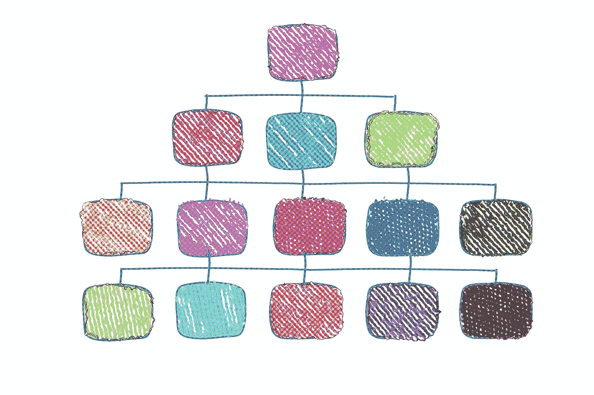

# 理解神经网络中的抽象

> 原文：[`towardsdatascience.com/understanding-abstractions-in-neural-networks-22cc2cd54597?source=collection_archive---------2-----------------------#2024-05-14`](https://towardsdatascience.com/understanding-abstractions-in-neural-networks-22cc2cd54597?source=collection_archive---------2-----------------------#2024-05-14)

## 思维机器如何实现认知中最重要的功能之一

 [林育任 (Yu-Jen Lin)](https://yujen-lin.medium.com/?source=post_page---byline--22cc2cd54597--------------------------------)

·发表于 [Towards Data Science](https://towardsdatascience.com/?source=post_page---byline--22cc2cd54597--------------------------------) ·阅读时间 12 分钟 ·2024 年 5 月 14 日

--

长久以来，人们一直认为神经网络具备抽象能力。当输入特征经过神经网络的各层时，输入特征会转变为越来越抽象的特征。例如，一个处理图像的模型接收到的只是低层次的像素输入，但较低的层可以学习构建表示边缘存在的抽象特征，而更高的层甚至可以编码人脸或物体。这些说法已经通过各种研究成果，展示了在卷积神经网络中学习到的特征。然而，这些深层特征到底在何种意义上比浅层特征“更加抽象”呢？在本文中，我将提供一个关于抽象的理解，不仅回答这个问题，还将解释神经网络中不同组件如何促成抽象的形成。在这个过程中，我还将揭示抽象与泛化之间有趣的二元性，从而展示抽象对于机器和我们人类来说有多么重要。

[图片](https://pixabay.com/illustrations/organization-chart-executive-staff-5957122/) 作者：[Gerd Altmann](https://pixabay.com/users/geralt-9301/?utm_source=link-attribution&utm_medium=referral&utm_campaign=image&utm_content=5957122) 来自 [Pixabay](https://pixabay.com//?utm_source=link-attribution&utm_medium=referral&utm_campaign=image&utm_content=5957122)

# 抽象，抽象定义

我认为，抽象的本质是

> “忽略无关细节，专注于相关部分的行为。”

例如，在设计一个算法时，我们只对输入做出少量抽象假设，而不关心输入的其他细节。更具体地说，考虑一个排序算法。排序函数通常仅假设输入是一个数字数组，或者更抽象地说，是一个具有定义比较规则的对象数组。至于这些数字或对象代表什么，或者比较操作符比较的内容，并不是排序算法关心的事情。

除了编程，抽象在数学中也很常见。在抽象代数中，只要满足几个要求，数学结构就可以被视为一个群。数学结构是否具备其他属性或操作并不重要。在证明一个定理时，我们只对讨论的结构做出关键假设，结构可能具有的其他属性并不重要。我们甚至不需要学习大学水平的数学就能发现抽象，因为即使是数学中最基本的对象也是抽象的产物。以自然数为例，我们将桌子上三只苹果的视觉表示转化为数学表达式“3”的过程，涉及了复杂的抽象。我们的认知系统能够丢弃所有无关的细节，如苹果的排列或成熟度，或者场景的背景，而专注于当前体验中的“数量感”。

在我们的日常生活中也有抽象的例子。实际上，它几乎存在于我们使用的每一个概念中。以“狗”的概念为例。尽管我们可能将这种概念描述为具体的，但它在复杂的层面上仍然是抽象的。我们的认知系统能够丢弃无关的细节，如颜色和具体大小，而专注于定义性特征，如狗的嘴部、耳朵、毛发、尾巴和叫声，从而将某物识别为一只狗。

# 抽象与泛化的二重性

每当出现抽象时，似乎也会伴随泛化，反之亦然。这两个概念紧密相连，以至于有时它们几乎可以互换使用。我认为这两个概念之间有趣的关系可以总结如下：

> 假设、接口或要求越抽象，结论、程序或概念就越普遍，适用范围越广。

通过重新审视前面提到的例子，可以更清楚地展示这一模式。考虑排序算法的第一个例子。数字可能具有的所有额外属性都不相关，只有“有序”这一属性对我们的任务才重要。因此，我们可以进一步抽象数字为“定义了比较的对象”。通过采用更抽象的假设，这个函数不仅可以应用于数字数组，还可以更广泛地应用。类似地，在数学中，定理的普适性取决于其假设的抽象性。对于规范空间证明的定理，比仅针对欧几里得空间证明的定理更具有普适性，因为欧几里得空间是更抽象的规范空间的一个特定实例。除了数学对象，我们对现实世界对象的理解也表现出不同的抽象层次。一个很好的例子是生物学中使用的分类法。狗作为一个概念，属于更一般的哺乳动物类别，而哺乳动物又是更一般的动物概念的子集。当我们从分类法的最低层级向更高层级移动时，这些类别被定义为具有越来越抽象的属性，这使得该概念可以应用于更多实例。

抽象与泛化之间的联系暗示了抽象的必要性。作为生物体，我们必须学习适用于不同情境的技能。在抽象层次做出决策使我们能够轻松应对许多在细节被去除后看起来相同的不同情境。换句话说，这项技能可以在不同情境中进行泛化。

# 神经网络中的抽象

我们已经定义了抽象并看到了它在我们生活中不同方面的重要性。现在是时候解决主要问题了：神经网络如何实现抽象？

首先，我们需要将抽象的定义转化为数学。假设一个数学函数实现了“去除细节”的功能，那么这个函数应该具备什么性质呢？答案是**非单射性**，这意味着存在不同的输入被映射到相同的输出。直观地说，这是因为某些区分不同输入的细节现在被丢弃了，使得它们在输出空间中被视为相同。因此，要在神经网络中找到抽象，我们只需要寻找非单射映射。

让我们从检查神经网络中最简单的结构开始，即线性层中的单个神经元。假设输入是一个维度为*D*的实数向量*x*。神经元的输出将是其权重*w*与*x*的点积，再加上一个偏置*b*，然后通过一个非线性激活函数σ：

很容易看出，丢弃无关细节的最简单方法是将无关特征的权重设置为零，这样该特征的变化就不会影响输出。这实际上为我们提供了一个非单射函数，因为在该特征上仅有差异的输入向量将具有相同的输出。

当然，特征往往不是以简单丢弃输入特征的形式呈现的，这样我们才能得到有用的抽象。例如，简单地丢弃输入图像中的一个固定像素可能并没有用。幸运的是，神经网络能够构建有用的特征，同时丢弃其他无关细节。一般来说，给定任何权重*w*，输入空间可以被分成一个与权重*w*平行的一维子空间，以及一个与*w*正交的其他(*D*−1)维子空间。其结果是，平行于该(*D*−1)维子空间的任何变化都不会影响输出，因此会被“抽象掉”。例如，一个检测边缘的卷积滤波器，同时忽略颜色或光照的均匀变化，可能就算是这种形式的抽象。

除了点积，激活函数也可能在抽象中发挥作用，因为它们中的大多数都是（或接近）非单射的。以 ReLU 为例，所有负输入值都会被映射为零，这意味着这些差异被忽略了。至于其他软激活函数，如 sigmoid 或 tanh，虽然在技术上是单射的，但饱和区域将不同的输入映射到非常接近的值，达到了类似的效果。

从上面的讨论中，我们可以看到，点积和激活函数都可以在单个神经元执行的抽象中发挥作用。然而，单个神经元未捕捉到的信息仍然可以被同一层中的其他神经元捕捉到。为了判断某一信息是否真的被忽略，我们还必须查看整个层的设计。对于一个线性层，有一种简单的设计能够强制执行抽象：降低维度。其原因类似于点积，实际上相当于将数据投影到一维空间。当一层*N*个神经元从上一层接收*M* > *N*个输入时，它涉及到矩阵乘法：

行空间中的输入组件被保留并转换到新的空间，而位于零空间中的输入组件（至少是*M*−*N*维度的）则全部映射为零。换句话说，任何平行于零空间的输入向量的变化都被认为是无关的，因此会被抽象掉。

我仅仅分析了现代深度学习中使用的一些基本组件。然而，通过对抽象的这种描述，我们应该能够很容易地看到，深度学习中使用的许多其他组件也允许它过滤并抽象掉无关细节。

# 引入信息理论

如上所述，也许你们中的一些人尚未完全相信这是一种有效的神经网络工作理解方式，因为它与通常聚焦于模式匹配、非线性变换和函数逼近的叙述有所不同。然而，我认为神经网络丢弃信息这一事实其实是从不同角度讲述的同一个故事。模式匹配、特征构建以及抽象掉无关特征的过程在网络中同时发生，正是通过结合这些视角，我们才能理解为什么神经网络能很好地进行泛化。让我引入一些基于信息论的神经网络研究来强化我的观点。

首先，让我们将抽象的概念转化为信息论的术语。我们可以将网络的输入视为一个随机变量*X*。然后，网络会通过每一层依次处理*X*，以产生中间表示*T*₁、*T*₂，……，最后得到预测结果*T*ₖ。

如我所定义的，抽象包括丢弃无关信息并保留相关部分。丢弃细节导致原本不同的*X*样本在中间特征空间中映射到相同的值。因此，这一过程对应于一种有损压缩，它减少了熵*H*(*Tᵢ*)或互信息*I*(*X*;*Tᵢ*)。那么，保留相关信息又是怎样的呢？为此，我们需要定义一个目标任务，以便评估不同信息片段的相关性。为了简化，我们假设我们正在训练一个分类器，其中真实标签是从随机变量*Y*中采样的。那么，保留相关信息就等同于在各层中保持*I*(*Y*;*Tᵢ*)，从而在最后一层做出可靠的*Y*预测。总结一下，如果神经网络正在进行抽象处理，我们应该看到*I*(*X*;*Tᵢ*)逐渐减小，同时理想情况下保持*I*(*Y*;*Tᵢ*)不变，随着分类器的层次加深。

有趣的是，这正是信息瓶颈原理[1]的核心内容。该原理认为，相对于*Y*，*X*的最优表示*T*是通过最小化*I*(*X*;*T*)同时保持*I*(*Y*;*T*) = *I*(*Y*;*X*)来实现的。尽管关于原始论文的一些观点存在争议，但许多研究中有一项共识：当数据从输入层流向更深的层时，*I*(*X*;*T*)减少，而*I*(*Y*;*T*)大多数情况下保持不变[1,2,3,4]，这表明存在抽象的过程。不仅如此，这些研究还验证了我的观点，即激活函数的饱和[2,3]和降维[3]确实在这一现象中发挥了作用。

# 一个统一的视角

通过阅读文献，我发现我所称之为抽象的现象，以不同的名字出现在各种文献中，尽管它们似乎都在描述同一现象：不变特征 [5]、越来越紧密的聚类 [3]、以及神经崩塌 [6]。在这里，我展示了抽象这一简单概念如何统一这些不同的概念，并提供一个直观的解释。

正如我之前提到的，去除无关信息的过程是通过非单射映射实现的，它忽略了输入空间中某些部分的差异。其结果，当然，就是产生对这些无关差异“具有不变性”的输出。当训练分类器时，相关信息是区分不同类别样本的特征，而不是区分同类别样本的特征。因此，当网络抽象掉无关细节时，我们看到同类别样本聚集（崩塌）在一起，而不同类别样本保持分离。

除了统一文献中的几个观察结果外，将神经网络视为在每一层抽象掉细节，也为我们提供了有关其预测如何在输入空间中泛化的线索。考虑一个简化的例子，我们有输入 *X*，被抽象成一个中间表示 *T*，然后用这个表示来生成预测 *P*。假设一组输入 *x*₁, *x*₂, *x*₃, …∼*X* 都被映射到相同的中间表示 *t*。因为预测 *P* 仅依赖于 *T*，所以对于 *t* 的预测必然适用于所有样本 *x*₁, *x*₂, *x*₃, …。换句话说，**由抽象引起的不变性的方向就是预测泛化的方向**。这类似于我之前提到的排序算法的例子。通过抽象输入的细节，算法自然地泛化到更大的输入空间。对于一个多层的深度网络，这种抽象可能发生在每一层。因此，最终的预测也会在输入空间中以复杂的方式进行泛化。

# 认知的核心

几年前，当我写第一篇关于抽象的文章时，我仅仅把它看作是数学和编程解决一系列相关问题的优雅方式。然而，事实证明，我错过了更大的图景。**抽象实际上无处不在，存在于我们每个人之内**。**它是认知的核心元素**。没有抽象，我们将淹没在低层次的细节中，无法理解任何事物。正是通过抽象，我们才能将这个极其细致的世界简化为可管理的部分，只有通过抽象，我们才能学到任何普遍的东西。

要理解抽象的关键性，只需尝试想出任何不涉及抽象的词语。我敢打赌你做不到，因为一个不涉及任何抽象的概念将过于具体而无法发挥作用。即使是“具体”的概念，如苹果、桌子或走路，也都涉及复杂的抽象。苹果和桌子都有不同的形状、大小和颜色。它们可能以真实物体的形式出现，也可能只是图片。然而，我们的大脑能够透过这些差异，捕捉事物的共同本质。

这种抽象的必要性与道格拉斯·霍夫施塔特（Douglas Hofstadter）关于类比是认知核心的观点相契合[7]。实际上，我认为它们本质上是同一枚硬币的两面。每当我们进行抽象时，都会有低层次的表示映射到相同的高层次表示。在这个过程中被丢弃的信息是这些实例之间不相关的差异，而留下的信息则对应于它们的共享本质。如果我们将映射到相同输出的低层次表示聚集在一起，它们就会在输入空间中形成等价类，或者霍夫施塔特所称的“类比包”。通过简单地比较这些高层次表示，我们就能发现两个经验实例之间的类比。

当然，我们进行这些抽象和使用类比的能力必须在大脑中通过计算实现，且有充分的证据表明，我们的大脑通过层次处理进行抽象，这与人工神经网络相似[8]。随着感官信号深入大脑，不同的模态被聚合，细节被忽略，产生了越来越抽象和不变的特征。

# 结论

在文献中，我们经常看到关于深度神经网络的深层次构建抽象特征的说法。然而，“抽象”一词的确切含义往往不清楚。在本文中，我给出了一个精确而又通用的抽象定义，统一了信息理论和深度表示几何学的观点。通过这一表述，我们可以详细看到，人工神经网络中的许多常见组件都为其抽象能力做出了贡献。我们通常认为神经网络在每一层中检测模式，这当然是正确的。然而，我建议将注意力转向在这一过程中被忽略的信息片段。通过这样做，我们可以更好地理解它如何在深层次中生成越来越抽象、因此更加不变的特征，以及它如何在输入空间中实现预测的泛化。

通过这些解释，我希望不仅能使抽象的意义更加清晰，而且更重要的是，展示它在认知中的核心作用。

## 参考文献

[1] R. Shwartz-Ziv 和 N. Tishby, [通过信息开启深度神经网络的黑箱](https://arxiv.org/abs/1703.00810)（2017）。arXiv。

[2] A. M. Saxe 等人, [深度学习的信息瓶颈理论](https://iopscience.iop.org/article/10.1088/1742-5468/ab3985)（2019 年），《统计力学杂志：理论与实验》 12:124020

[3] Z. Goldfeld 等人, [估计深度神经网络中的信息流](https://proceedings.mlr.press/v97/goldfeld19a.html)（2019 年），收录于第 36 届国际机器学习大会论文集，PMLR 97:2299–2308

[4] K. Wickstrøm, S. Løkse, M. Kampffmeyer, S. Yu, J. Principe 和 R. Jenssen, [通过基于矩阵的 Renyi 熵和张量核的深度神经网络信息平面分析](https://arxiv.org/abs/1909.11396)（2019 年）。arXiv。

[5] A. Achille 和 S. Soatto, [深度表示中的不变性与解缠的出现](https://www.jmlr.org/papers/v19/17-646.html)（2018 年），《机器学习研究杂志》，19(50):1−34。

[6] A. Rangamani, M. Lindegaard, T. Galanti 和 T. A. Poggio, [通过中间神经崩溃进行深度分类器的特征学习](https://proceedings.mlr.press/v202/rangamani23a.html)（2023 年），收录于第 40 届国际机器学习大会论文集，PMLR 202:28729–28745。

[7] D. R. Hofstadter, [尾声：类比作为认知的核心](https://mitpress.mit.edu/9780262571395/the-analogical-mind/)（2001 年）。《类比心智》。麻省理工学院出版社。

[8] P. Taylor, J. N. Hobbs, J. Burroni 和 H. T. Siegelmann, [认知的全球景观：层次聚合作为人类皮层网络和功能的组织原则](https://www.nature.com/articles/srep18112)（2015 年），《科学报告》，第 5 卷，第 1 期，文章编号 18112。
