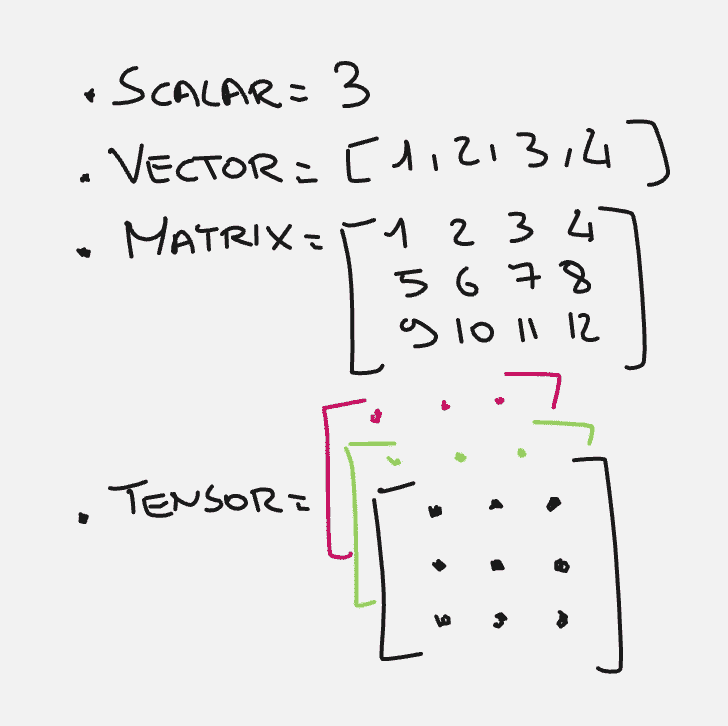

# 理解爱因斯坦符号和 einsum 乘法

> 原文：[`towardsdatascience.com/understanding-einsteins-notation-and-einsum-multiplication-a690bd4da0b2?source=collection_archive---------3-----------------------#2024-09-08`](https://towardsdatascience.com/understanding-einsteins-notation-and-einsum-multiplication-a690bd4da0b2?source=collection_archive---------3-----------------------#2024-09-08)


图片来源：[Taton Moïse](https://unsplash.com/@moyse?utm_source=medium&utm_medium=referral) 于 [Unsplash](https://unsplash.com/?utm_source=medium&utm_medium=referral)

## 使用字符串符号进行更高阶的张量操作

[](https://medium.com/@marcellopoliti?source=post_page---byline--a690bd4da0b2--------------------------------)[](https://towardsdatascience.com/?source=post_page---byline--a690bd4da0b2--------------------------------) [Marcello Politi](https://medium.com/@marcellopoliti?source=post_page---byline--a690bd4da0b2--------------------------------)

·发布于 [Towards Data Science](https://towardsdatascience.com/?source=post_page---byline--a690bd4da0b2--------------------------------) ·6 分钟阅读·2024 年 9 月 8 日

--

## 引言

机器学习在很大程度上依赖于线性代数运算，特别是，理解矩阵之间（更准确地说是张量之间）乘法如何工作至关重要。

我经常注意到，许多接触机器学习框架（如 PyTorch 或 TensorFlow）的人，在遇到张量尺寸不匹配的错误时，常常遇到很多问题。在这篇简短的文章中，我想对此做些澄清，并介绍 [einsum](https://numpy.org/doc/stable/reference/generated/numpy.einsum.html) 的使用。

## 从标量到张量

在机器学习中，我们根据数据的维度（dim）对其进行区分。常见的有：

+   标量 dim = 0

+   向量 dim = 1

+   矩阵 dim = 2

+   张量 dim = 3（或更多）



图片来源：作者

在 PyTorch 中，我们可以非常轻松地创建这些数据类型。

```py
import torch

# Create a scalar tensor
scalar…
```
