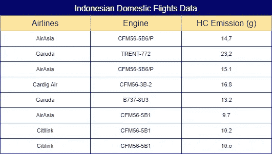
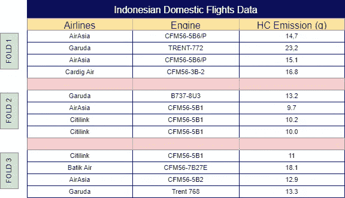
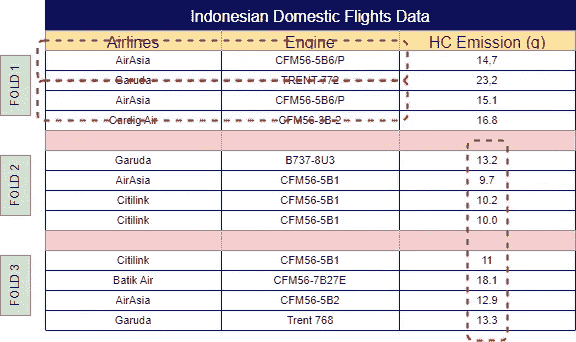
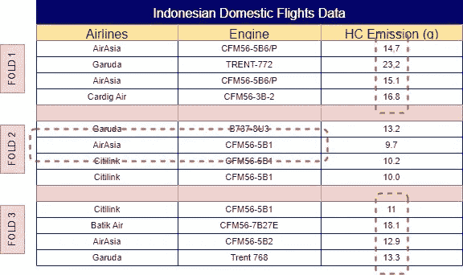
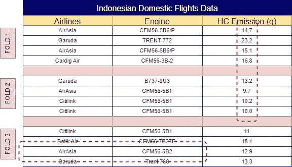
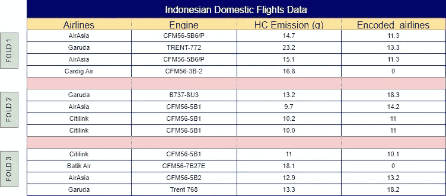
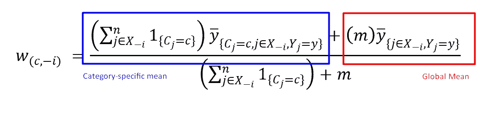
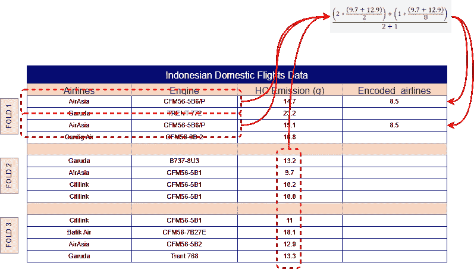
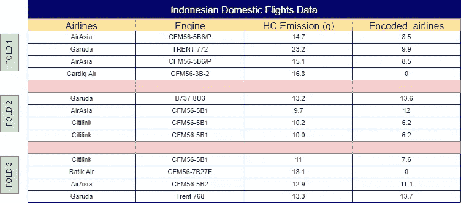

# 理解 K-Fold 目标编码以应对高基数问题

> 原文：[`towardsdatascience.com/understanding-k-fold-target-encoding-to-handle-high-cardinality-296387753e3f?source=collection_archive---------6-----------------------#2024-10-26`](https://towardsdatascience.com/understanding-k-fold-target-encoding-to-handle-high-cardinality-296387753e3f?source=collection_archive---------6-----------------------#2024-10-26)

## 平衡复杂性与性能：深入探讨 K-fold 目标编码

[](https://medium.com/@fhlpmah?source=post_page---byline--296387753e3f--------------------------------)[](https://towardsdatascience.com/?source=post_page---byline--296387753e3f--------------------------------) [Fhilipus Mahendra](https://medium.com/@fhlpmah?source=post_page---byline--296387753e3f--------------------------------)

·发表于 [Towards Data Science](https://towardsdatascience.com/?source=post_page---byline--296387753e3f--------------------------------) ·阅读时间 7 分钟·2024 年 10 月 26 日

--


图片由 [Mika Baumeister](https://unsplash.com/@kommumikation?utm_content=creditCopyText&utm_medium=referral&utm_source=unsplash) 提供，来源于 [Unsplash](https://unsplash.com/photos/white-printing-paper-with-numbers-Wpnoqo2plFA?utm_content=creditCopyText&utm_medium=referral&utm_source=unsplash)

# 引言

数据科学从业人员在处理不同项目中的多种数据类型时，常常会遇到许多挑战，每种数据类型都需要独特的处理方法。一个常见的障碍是处理传统机器学习模型难以有效处理的数据格式，导致模型性能不佳。由于大多数机器学习算法都是为数值数据优化的，因此将类别数据转换为数值形式至关重要。然而，这种转换往往会简化复杂的类别关系，特别是当特征具有高基数——即有大量独特的值时——这会使处理变得复杂，并影响模型的准确性。

高基数（High cardinality）指的是特征中唯一元素的数量，具体来说是机器学习中类别标签的不同计数。当一个特征拥有许多独特的类别标签时，它具有高基数，这可能会使模型处理变得复杂。为了使类别数据在机器学习中可用，这些标签通常会使用基于数据复杂性的编码方法转换为数值形式。一种常见的方法是独热编码（One-Hot Encoding），它为每个唯一标签分配一个独特的二进制向量。然而，面对高基数数据时，独热编码可能会显著增加数据的维度，导致复杂的高维数据集，这需要大量的计算能力来训练模型，并可能导致性能变慢。

考虑一个包含 2,000 个唯一 ID 的数据集，每个 ID 与仅三个国家中的一个相关联。在这种情况下，虽然 ID 特征的基数是 2,000（因为每个 ID 都是唯一的），但国家特征的基数只有 3。现在，假设有一个包含 100,000 个类别标签的特征，必须使用独热编码进行编码。这将创建一个极其高维的数据集，导致低效并消耗大量资源。

数据科学家广泛采用的解决方案是**K 折目标编码**。这种编码方法通过用基于 K 折交叉验证的目标均值替换类别标签，帮助减少特征的基数。通过聚焦于个别数据模式，K 折目标编码降低了过拟合的风险，帮助模型学习数据中的特定关系，而不是那些可能影响模型性能的过于一般化的模式。

# 它是如何工作的

K 折目标编码（K-Fold Target Encoding）涉及将数据集划分为几个大小相等的子集，称为“折叠”（folds），其中“K”表示这些子集的数量。通过将数据集折叠成多个组，这种方法为每个类别标签计算跨子集的加权平均值，从而增强编码的鲁棒性并减少过拟合的风险。



图 1\. 印尼国内航班数据集 [1]

使用**图 1**中的一个示例，考虑一个印尼国内航班排放数据集，该数据集包含每个航班周期的排放数据，我们可以将这种技术付诸实践。这个数据集需要问的基本问题是：“通过观察特征‘HC 排放’，每个‘航空公司’的类别标签的加权平均值是多少？”然而，你可能会提出和许多人一样的问题：“但是，如果你只是使用目标特征来计算它们，这是不是会导致另一个高基数特征？”简单的回答是：“是的，可能会。”

为什么？

在某些情况下，当数据集非常大且目标特征高度随机且没有明显的模式时，K 折目标编码可能会为每个类别标签生成各种均值，可能会保留高基数，而不是减少它。然而，K 折目标编码的主要目的是解决高基数问题，而不是必然大幅度地减少它。此方法最适用于目标特征与每个类别标签中数据片段之间存在有意义的相关性时。

K 折目标编码是如何操作的？最简单的解释方法是，在每个折叠中，你都计算来自其他折叠的目标特征均值。这种方法为每个类别标签提供一个独特的权重，以数字值表示，使其更具信息量。让我们通过使用我们的数据集进行一个示例计算，来更清楚地理解这一点。



图 2\. 印尼国内航班数据集经过 K 折分配后的结果。[1]

计算‘AirAsia’标签在第一次观测中的权重时，首先按照**图 2**所示将数据拆分为多个折叠。你可以手动分配折叠以确保均匀分布，或者使用以下示例代码自动化此过程：

```py
import seaborn as sns
import matplotlib.pyplot as plt

# In order to split our data into several parts equally lets assign KFold numbers to each of the data randomly.

# Calculate the number of samples per fold
num_samples = len(df) // 8

# Assign fold numbers
df['kfold'] = np.repeat(np.arange(1, 9), num_samples)

# Handle any remaining samples (if len(df) is not divisible by 8)
remaining_samples = len(df) % 8
if remaining_samples > 0:
    df.loc[-remaining_samples:, 'kfold'] = np.arange(1, remaining_samples + 1)

# Shuffle again to ensure randomness
fold_df = df.sample(frac=1, random_state=42).reset_index(drop=True)
```



图 3\. 类别特定均值计算过程[1]

现在数据集已经分割成多个折叠，下一步是计算同一标签在其他折叠中的均值。例如，‘AirAsia’在折叠 1 中的值会使用折叠 2、3、4、5、6 等的均值，得到一个均值为 11.3。这一过程会在所有折叠中继续进行，因此折叠 2 将会融合折叠 1、3、4、5、6 等的均值。所有这些计算的最终结果在**图 4**中有所展示。



图 4\. K 折目标编码（仅类别特定均值）结果[1]

该计算被称为“类别特定均值”，它定义了基于相似标签实例的每个类别标签的平均值。另一个重要的计算是“全局均值”，它定义了基于用户定义的全局均值权重的类别标签的平均强度。全局均值作为基准或“中立”编码，尤其对那些稀有类别有重要意义，因为这些类别的类别特定均值可能依赖于有限的数据点。

在 K 折目标编码中，类别特定均值和全局均值通常会结合在一起，以创建一个更加稳健和全面的表示。欲了解详细说明，请参见**图 5**。



图 5\. K 折目标编码的数学形式。[1]

数学公式使得理解这个计算过程变得更加容易。在这里，*m* 代表一个用户定义的权重，用于控制全局均值在最终计算中的影响。现在，我们可以将这个公式应用到**图 2**中的数据集，并使用以下代码实现它。



图 6\. K-Fold 目标编码过程（使用两种均值）。[1]

```py
# First we have to encode the categorical features using K-Fold target encoding

def useful_feature(df, target, weight):
  utilized_feature = [c for c in df.columns if c not in (target)]
  obj = [col for col in df.columns if df[col].dtype == 'object']
  global_mean = df[target].mean()

  for objek in obj:
        df[f"countperobject_{objek}"] = 0
        df[f"meanperobject_{objek}"] = 0

        # Compute aggregations
        agg = df.groupby(objek)[target].agg(['count', 'mean']).reset_index()

        counts = agg['count'].values
        mean = agg['mean'].values

        # Iterate over each row
        for i in range(1, 9): # design regarding to the length of the k-fold
          for index, row in df.iterrows():

              # Get the category and target value
              if row["kfold"] != i:
                  category = row[objek]
                  target_val = row[target]

                  # Get the count from agg
                  count_agg = agg[(agg[objek] == category)]['count'].values
                  if len(count_agg) > 0:
                      df.at[index, f"countperobject_{objek}"] = count_agg[0]

                  # Get the mean from agg
                  mean_agg = agg[(agg[objek] == category)]['mean'].values
                  if len(mean_agg) > 0:
                      df.at[index, f"meanperobject_{objek}"] = mean_agg[0]

        # Now find the weighted mean
        df[f"weightedmean_{objek}"] = ((df[f"countperobject_{objek}"] * df[f"meanperobject_{objek}"]) + (weight * global_mean))/(weight + df[f"countperobject_{objek}"])

  encoding_maps = {}
  for objek in obj:
      encoding_maps[objek] = df.groupby(objek)[[f"countperobject_{objek}", f"meanperobject_{objek}"]].mean().to_dict()

  return df, encoding_maps
```

现在，将相同的公式绘制到每个类别标签中，结果将类似于图 7。



图 7\. K-Fold 目标编码最终结果（两种均值）。[1]

需要记住的是，如果你的训练数据集和测试数据集之间存在显著差异，这种方法可能会有风险。例如，如果在训练数据中，亚航（AirAsia）始终产生大量的 HC 排放，而在测试数据中，鹰航（Garuda）排放的 HC 较高并且分布均匀，那么模型可能会过拟合训练数据的模式，从而在新数据上的准确性较低。

感谢阅读本文，希望你能更好地了解什么是 K-Fold 目标编码以及何时使用它。去查看我的社交媒体，帮助我为未来的数据人才建设更好的社区！！！：

Linkedin: [`www.linkedin.com/in/fhlpmah/`](https://www.linkedin.com/in/fhlpmah/)

Dev.to: [`dev.to/fhlpmah`](https://dev.to/fhlpmah)

Instagram: [`www.instagram.com/fmasmoro/`](https://www.instagram.com/fmasmoro/)

# 资源

[1] 图片由作者制作。

[2] 数据集由作者人工模拟。灵感来源：ICA 组织，2023，*ICAO 航空器发动机排放数据集* [`www.easa.europa.eu/en/domains/environment/icao-aircraft-engine-emissions-databank`](https://www.easa.europa.eu/en/domains/environment/icao-aircraft-engine-emissions-databank)。

[3] 所有代码均由作者编写。
