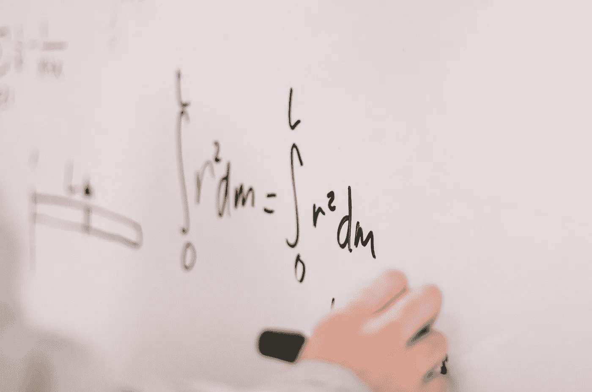

# 直观理解 KL 散度

> 原文：[`towardsdatascience.com/understanding-kl-divergence-intuitively-a4e876f9a532?source=collection_archive---------1-----------------------#2024-02-12`](https://towardsdatascience.com/understanding-kl-divergence-intuitively-a4e876f9a532?source=collection_archive---------1-----------------------#2024-02-12)

## 一种构建性的方法来衡量分布差异。

 [Mohammed Mohammed](https://mohammed249.medium.com/?source=post_page---byline--a4e876f9a532--------------------------------)

·发表于 [Towards Data Science](https://towardsdatascience.com/?source=post_page---byline--a4e876f9a532--------------------------------) ·6 分钟阅读·2024 年 2 月 12 日

--

图片由 [Jeswin Thomas](https://unsplash.com/@jeswinthomas?utm_source=medium&utm_medium=referral) 提供，来源于 [Unsplash](https://unsplash.com/?utm_source=medium&utm_medium=referral)

今天，我们将讨论 KL 散度，这是数据科学中常用的一个度量标准，用于衡量两个分布之间的差异。但在深入技术细节之前，我们先来解决一个常见的数学和统计学理解障碍。

许多时候，挑战在于方法。很多人将这些学科看作是一系列呈现为神圣真理的公式，导致学习者在理解其意义时感到困惑。以 KL 散度公式为例——乍一看它可能显得令人畏惧，容易让人产生沮丧和失败感。然而，数学并非在现实世界中是这样发展的。我们遇到的每一个公式，都是人类智慧的结晶，旨在解决特定的问题。

在本文中，我们将采用不同的视角，将数学视为一个创造性过程。我们将从问题开始，而不是从公式入手，提出这样一个问题：“*我们需要解决什么问题，我们如何制定度量标准来应对它？*”这种方法的转变可以为理解像 KL 散度这样的概念提供更直观的理解。

够了理论——让我们直面 KL 散度。想象一下，你是一个幼儿园老师，每年都对学生进行调查，询问他们最喜欢的水果，学生可以选择苹果、香蕉或哈密瓜。你每年都会对班上的所有学生进行调查，得到百分比数据，并将它们绘制在这些图表上。

考虑两个连续的年份：第一年，**50%**的人偏爱苹果，**40%**的人偏爱香蕉，**10%**的人选择哈密瓜。第二年，苹果偏好保持在**50%**，但分布发生了变化——现在，**10%**的人偏爱香蕉，**40%**的人偏爱哈密瓜。我们想要回答的问题是：第二年的分布与第一年相比有多大不同？

即使在深入数学之前，我们也认识到度量的一个关键标准。由于我们要衡量两个分布之间的差异，我们的度量（稍后我们将其定义为 KL 散度）必须是**不对称的**。换句话说，交换分布应该得到不同的结果，反映出每种情况中不同的参考点。

现在让我们进入这个构造过程。如果我们需要设计这个度量，我们该如何开始？一种方法是专注于每个分布中的元素——我们称它们为 A、B 和 C——并衡量它们在两年中的概率比。我们将在讨论中将这些分布表示为 P 和 Q，其中 Q 代表参考分布（第一年）。

例如，P(a)表示第二年学生喜欢苹果的比例（50%），而 Q(a)表示第一年学生有相同偏好的比例（也是 50%）。当我们将这些值相除时，我们得到 1，表示从一年到二年苹果偏好比例没有变化。类似地，我们计算 P(b)/Q(b) = 1/4，表示香蕉偏好有所下降，P(c)/Q(c) = 4，表示从第一年到第二年哈密瓜偏好的四倍增长。

这是一个好的第一步。为了保持数学上的简洁，如果我们对这三个比例取平均会怎样呢？每个比例反映了我们分布中元素之间的变化。通过将它们相加并除以三，我们可以得出一个初步的度量：

该度量提供了两个分布之间差异的指示。然而，让我们解决该方法引入的一个缺陷。我们知道，平均值可能会受到大数值的影响。在我们的例子中，比例¼和 4 代表了对立但相等的影响。然而，当取平均时，4 的影响占主导地位，可能会膨胀我们的度量。因此，简单的平均值可能不是理想的解决方案。

为了纠正这个问题，让我们探索一种变换。我们能否找到一个函数，记作 F，用来处理这些比例（1、¼、4），使其满足将对立影响视为相等的要求？我们寻求一个函数，其中，如果输入 4，得到一个特定值（y），而如果输入 1/4，得到(-y)。为了找出这个函数，我们将简单地映射函数的值，看看哪种我们已知的函数可能符合这种形式。

假设 F(4) = y 且 F(¼) = -y。这个属性并不仅限于数字 4 和¼；它适用于任何一对倒数数值。例如，如果 F(2) = z，那么 F(½) = -z。再加上一个点，F(1) = F(1/1) = x，我们发现 x 应该等于 0。

绘制这些点时，我们可以观察到一个独特的模式出现：

我相信我们许多人都同意，整体形状类似于对数曲线，这表明我们可以使用 log(x)作为我们的函数 F。我们不仅仅计算 P(x)/Q(x)，而是应用对数变换，得到 log(P(x)/Q(x))。这种变换有助于消除大数值扭曲平均值的问题。如果我们对三种水果的对数变换进行求和并取平均，结果如下：

如果这就是我们的度量标准，那会有什么问题吗？

一个可能的担忧是，我们希望我们的度量能够优先考虑当前分布中流行的 x 值。更简单来说，如果在第二年，50 个学生喜欢苹果，10 个学生喜欢香蕉，40 个学生喜欢哈密瓜，那么我们应该更加重视苹果和哈密瓜的变化，而不是香蕉的变化，因为只有 10 个学生关心香蕉，因此它对当前人群的影响不会太大。

目前，我们给每次变化分配的权重是 1/n，其中 n 代表元素的总数。

让我们用基于当前分布中喜欢某种水果的学生比例的概率权重来代替这种等权重，表示为***P(x)。***

我所做的唯一变化是，将我们关心的每一项的权重替换为基于概率的权重，我们关注的程度与它在当前分布中的频率成正比，非常流行的事物获得更多优先权，而当前不流行的事物（即使它们在过去的分布中很受欢迎）对这个 KL 散度的贡献较小。

这个公式表示了 KL 散度的公认定义。该符号通常表示为***KL(P||Q)***，表示 P 相对于 Q 的变化程度。

现在记住我们希望我们的度量是非对称的。我们满足这个条件了吗？在公式中交换 P 和 Q 会得到不同的结果，这与我们对非对称度量的要求一致。

# 总结

首先，我希望你能理解这里的 KL 散度，但更重要的是，我希望它没有像我们从一开始就从公式出发然后尽力理解它为什么是这样的那样让人害怕。

我在这里还想说的是，这是 KL 散度的离散形式，适用于我们讨论过的离散类别。对于连续分布，原理保持不变，唯一的区别是我们将求和替换为积分（∫）。

*注意：除非另有说明，所有图片均为作者提供。*
