# 从零开始使用中学数学理解 LLM

> 原文：[`towardsdatascience.com/understanding-llms-from-scratch-using-middle-school-math-e602d27ec876?source=collection_archive---------0-----------------------#2024-10-19`](https://towardsdatascience.com/understanding-llms-from-scratch-using-middle-school-math-e602d27ec876?source=collection_archive---------0-----------------------#2024-10-19)

## 一篇完整的、关于 LLM 内部工作原理的自包含解释

 [Rohit Patel](https://rohit-patel.medium.com/?source=post_page---byline--e602d27ec876--------------------------------)

·发表于 [Towards Data Science](https://towardsdatascience.com/?source=post_page---byline--e602d27ec876--------------------------------) ·40 分钟阅读·2024 年 10 月 19 日

--

在本文中，我们将讨论大型语言模型（LLMs）是如何工作的，从零开始——假设你只知道如何加法和乘法两个数字。本文旨在完全自包含。我们从在纸上构建一个简单的生成式 AI 开始，然后逐步讲解我们需要了解现代 LLM 和 Transformer 架构的所有内容。文章将去除所有机器学习中的复杂语言和术语，将一切简单呈现为它们本身：数字。我们仍然会指出每个概念的名称，以帮助你在阅读术语较多的内容时保持思路清晰。

从加法/乘法到今天最先进的 AI 模型，而不假设任何其他知识或参考其他来源，这意味着我们涵盖了大量的内容。这不是一个玩具版的 LLM 解释——一个有决心的人理论上可以从所有这些信息中重建一个现代的 LLM。我已删除了所有不必要的词/行，因此本文并不适合随便浏览。

# 我们将涵盖哪些内容？

1.  一个简单的神经网络

1.  这些模型是如何训练的？

1.  这一切是如何生成语言的？

1.  什么使得 LLM 能够如此高效地工作？

1.  嵌入

1.  子词分词器

1.  自注意力

1.  Softmax

1.  残差连接

1.  层归一化

1.  Dropout（丢弃法）

1.  多头注意力

1.  位置嵌入

1.  GPT 架构

1.  Transformer 架构

让我们开始吧。

首先要注意的是，神经网络只能接受数字作为输入，并且只能输出数字。没有例外。关键在于如何将输入作为数字馈送到网络中，以一种实现目标的方式解释输出数字。最后，构建神经网络，使其接受您提供的输入并给出您想要的输出（考虑到您为这些输出选择的解释）。让我们看看如何从加法和乘法数字到像[Llama 3.1](https://ai.meta.com/blog/meta-llama-3-1/)这样的事物。

# 一个简单的神经网络：

让我们来看一个简单的可以对对象进行分类的神经网络：

+   **可用的对象数据：** 主要颜色（RGB）和体积（毫升）

+   **分类为：** 叶子 或 花朵

以下是叶子和向日葵的数据示例：

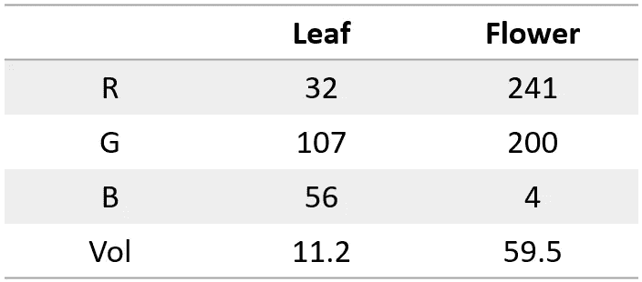

作者提供的图片

现在让我们构建一个可以进行这种分类的神经网络。我们需要决定输入/输出的解释。我们的输入已经是数字，所以我们可以直接将它们馈送到网络中。我们的输出是两个对象，叶子和花朵，神经网络无法直接输出。让我们看看我们可以在这里使用的几种方案：

+   我们可以使网络输出一个数字。如果这个数字是正的，我们说它是叶子，如果是负的，我们说它是花朵。

+   或者，我们可以使网络输出两个数字。我们将第一个解释为叶子的数字，第二个解释为花朵的数字，我们将选择较大的数字作为选择。

这两种方案都允许网络输出我们可以解释为叶子或花朵的数字。让我们选择第二种方案，因为它对我们稍后将要查看的其他事物具有很好的泛化能力。这里是一个使用这种方案进行分类的神经网络。让我们逐步进行：

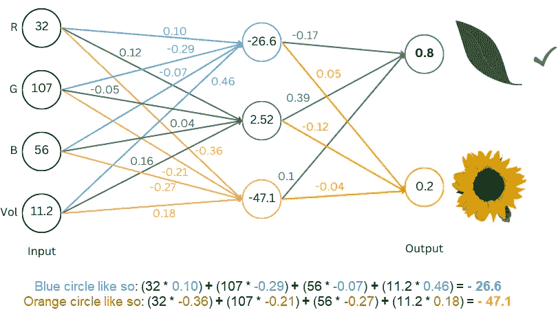

作者提供的图片

一些行话：

***神经元/节点***：圆圈中的数字

***权重***：线上的有色数字

***层***：一组神经元称为一层。你可以将这个网络看作有 3 层：具有 4 个神经元的输入层，具有 3 个神经元的中间层，以及具有 2 个神经元的输出层。

要计算这个网络的预测/输出（称为“**前向传播**”），你从左边开始。我们有输入层神经元的数据可用。要向“前”移动到下一层，你将圆圈中的数字与相应神经元配对的权重相乘，然后将它们全部加起来。我们在上面展示了蓝色和橙色圆圈的数学运算。运行整个网络，我们看到输出层中的第一个数字较高，因此我们将其解释为“网络将这些（RGB，Vol）值分类为叶子”。一个训练良好的网络可以接受各种（RGB，Vol）的输入，并正确地对对象进行分类。

模型不知道叶子或花是什么，也不知道（RGB，Vol）是什么。它的任务是接收确切的 4 个数字并输出确切的 2 个数字。我们的解释是，这 4 个输入数字是（RGB，Vol），我们也决定查看输出数字并推断，如果第一个数字较大，则是叶子等。最后，我们还可以选择正确的权重，使模型接受我们的输入数字并给出我们需要的正确两个数字，这样当我们解释它们时，我们得到我们想要的解释。

这样做的一个有趣的副作用是，你可以拿同样的网络，而不是输入 RGB、Vol，而是输入其他 4 个数字，比如云量、湿度等，然后将这两个数字解释为“一个小时后晴天”或“一个小时后下雨”，如果你的权重校准得当，你可以让同一个网络同时做两件事情——分类叶子/花朵和预测一个小时后的降雨情况！网络只会给你两个数字，你如何解释它，是分类还是预测或其他什么，完全取决于你。

简化的内容已被省略（可以忽略而不影响理解）：

+   **激活层**：这个网络缺少的一个关键部分是“激活层”。这是一个花哨的说法，意思是我们取每个圆圈中的数字并对其应用一个非线性函数（**RELU**是一个常见的函数，如果数字为负数，则将其设为零，如果为正数则保持不变）。所以基本上在我们上面的例子中，我们会取中间层并在继续到下一层之前用零替换这两个数字（-26.6 和-47.1）。当然，我们必须重新训练这里的权重，使网络再次变得有用。没有激活层，网络中的所有加法和乘法可以折叠成一个单一层。在我们的情况下，你可以将绿色圆圈写成 RGB 的和直接乘以一些权重，而不需要中间层。它会类似于（0.10 * -0.17 + 0.12 * 0.39–0.36 * 0.1）* R + (-0.29 * -0.17–0.05 * 0.39–0.21 * 0.1) * G …等等。如果我们在那里没有非线性，通常是不可能的。这有助于网络处理更复杂的情况。

+   **偏差**：网络通常还会包含与每个节点相关的另一个数字，这个数字简单地添加到计算节点值的乘积中，这个数字称为“偏差”。因此，如果顶部蓝色节点的偏差为 0.25，则节点中的值将是：（32 * 0.10）+（107 * -0.29）+（56 * -0.07）+（11.2 * 0.46）**+ 0.25** = — 26.35。参数这个词通常用来指代模型中所有这些不是神经元/节点的数字。

+   **Softmax：**我们通常不会像在我们的模型中那样直接解释输出层的值。我们将数字转换为概率（即使所有数字都是正数并且加起来等于 1）。如果输出层中的所有数字已经是正数，一种方法是将每个数字除以输出层所有数字的总和。尽管通常会使用“softmax”函数，它可以处理正数和负数。

# 这些模型是如何训练的？

在上面的例子中，我们神奇地得到了使得数据能够输入模型并获得良好输出的权重。但是这些权重是如何确定的呢？设置这些权重（或“参数”）的过程叫做“**训练模型**”，而我们需要一些训练数据来训练模型。

假设我们有一些数据，其中包含输入数据，并且我们已经知道每个输入是否对应叶子或花朵，这就是我们的“**训练数据**”，而由于我们对每一组（R, G, B, Vol）数据都知道是叶子还是花朵的标签，这就是“**标注数据**”。

这是其工作原理：

+   从随机数开始，即将每个参数/权重设置为随机数。

+   现在，我们知道当输入对应叶子时（R=32, G=107, B=56, Vol=11.2）。假设我们希望在输出层中叶子对应的数字更大。我们假设叶子的数字应为 0.8，花朵的数字应为 0.2（如上例所示，但这些数字只是为了演示训练，实际上我们不会希望是 0.8 和 0.2，实际情况是这些数字应该是概率值，而不是这里的值，实际上我们会希望它们分别为 1 和 0）。

+   我们知道输出层中我们想要的数字，以及我们从随机选择的参数中得到的数字（这些数字与我们想要的不同）。因此，对于输出层中的所有神经元，我们计算想要的数字和得到的数字之间的差异。然后将这些差异加总。例如，如果输出层中有两个神经元分别为 0.6 和 0.4，那么我们得到：(0.8–0.6)=0.2 和 (0.2–0.4)=-0.2，总和为 0.4（忽略负号后相加）。我们可以称之为我们的“**损失**”。理想情况下，我们希望损失接近零，即我们想要“**最小化损失**”。

+   一旦我们得到损失值，我们可以稍微调整每个参数，看看增加或减少它是否会增加损失。这被称为该参数的“**梯度**”。然后我们可以稍微调整每个参数，朝着损失减小的方向（即梯度的反方向）移动。一旦我们轻微调整了所有参数，损失应该会降低。

+   不断重复这个过程，你会减少损失，最终得到一组“**训练好的**”权重/参数。整个过程被称为“**梯度下降**”。

几个备注：

+   通常你会有多个训练样本，因此当你稍微调整权重以最小化一个样本的损失时，它可能会使另一个样本的损失变得更糟。解决这个问题的方法是将损失定义为所有样本的平均损失，然后对该平均损失进行梯度计算。这样可以减少整个训练数据集的平均损失。每一个这样的周期称为“**轮次**”。然后你可以不断重复这些轮次，从而找到能减少平均损失的权重。

+   我们实际上不需要“调整权重”来计算每个权重的梯度——我们可以从公式中推导出它（例如，如果上一步的权重是 0.17，且神经元的值为正，我们希望输出的数值更大，那么我们可以看到将这个数字增加到 0.18 会有所帮助）。

在实践中，训练深度网络是一个困难且复杂的过程，因为梯度在训练过程中很容易失控，可能会变为零或无穷大（这被称为“消失梯度”和“爆炸梯度”问题）。我们在这里讨论的简单损失定义是完全有效的，但很少使用，因为有更好的功能形式可以很好地解决特定目的。随着现代模型包含数十亿个参数，训练一个模型需要巨大的计算资源，这也带来了自身的问题（如内存限制、并行化等）。

# 所有这些如何帮助生成语言呢？

记住，神经网络接受一些数字，基于训练好的参数进行一些数学运算，然后输出一些其他的数字。一切都与解释和训练参数（即将它们设置为某些数字）有关。如果我们能将这两个数字解释为“叶子/花”或“一小时后的雨或晴”，我们也可以将它们解释为“句子中的下一个字符”。

但英语中不仅仅有两个字母，因此我们必须将输出层的神经元数量扩展到英语中的 26 个字母（我们还可以加入一些符号，如空格、句号等）。每个神经元可以对应一个字符，我们查看输出层中大约 26 个神经元，并说输出层中对应最大编号的神经元所代表的字符就是输出字符。现在我们有了一个可以接受一些输入并输出字符的网络。

如果我们用这些字符替换网络中的输入：“Humpty Dumpt”，并要求它输出一个字符并将其解释为“网络对我们刚输入的序列中下一个字符的建议”，我们可能可以将权重设置得足够好，使其输出“y”——从而完成“Humpty Dumpty”。除了一个问题，我们如何将这些字符列表输入到网络中呢？我们的网络只接受数字！！

一个简单的解决方案是为每个字符分配一个数字。假设 a=1，b=2，依此类推。现在我们可以输入“humpty dumpt”，并训练它给出“y”。我们的网络大概是这样的：

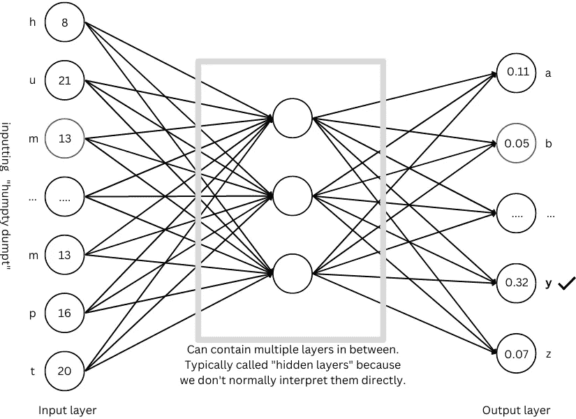

图片来源：作者

好的，现在我们可以通过给网络输入一个字符列表来预测下一个字符。我们可以利用这个事实来构建一个完整的句子。例如，一旦我们预测出了“y”，我们就可以把这个“y”加到我们已有的字符列表中，再次输入到网络中并让它预测下一个字符。如果训练得当，它应该给我们一个空格，依此类推。最终，我们应该能够递归地生成“Humpty Dumpty sat on a wall”。这就是生成式 AI。而且，***我们现在有了一个能够生成语言的网络！***现在，没有人会真正地输入随机分配的数字，我们将看到更为合理的编码方案。如果你迫不及待，欢迎查看附录中的独热编码部分。

精明的读者会注意到，我们实际上无法将“Humpty Dumpty”输入到网络中，因为根据图示，输入层只有 12 个神经元，每个神经元对应“humpty dumpt”中的一个字符（包括空格）。那么，我们该如何输入下一个“y”呢？如果放一个第 13 个神经元，我们就需要修改整个网络，这是不可行的。解决方案很简单，让我们把“h”去掉，输入最近的 12 个字符。所以我们将输入“umpty dumpty”，网络会预测一个空格。然后我们再输入“mpty dumpty ”，它会输出一个“s”，依此类推。它看起来像这样：

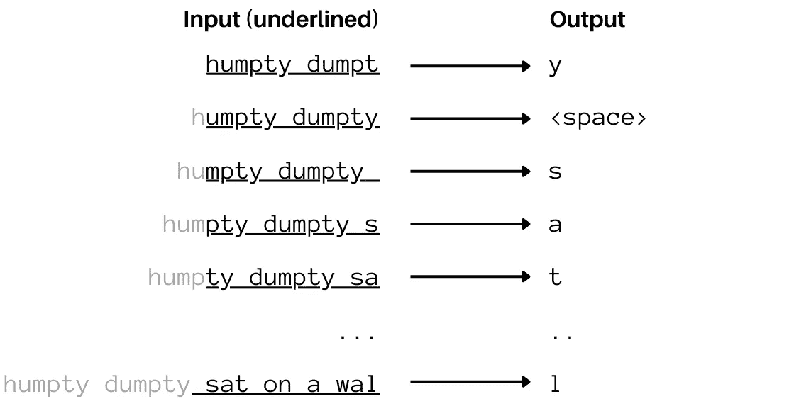

作者提供的图片

通过只给模型输入“ sat on the wal”，我们在最后一行丢失了很多信息。那么，今天最新最强大的网络是如何做的呢？或多或少，正是这样。我们能够输入到网络中的输入长度是固定的（由输入层的大小决定）。这叫做“上下文长度”——即提供给网络的上下文，用于进行未来的预测。现代网络可以有非常大的上下文长度（几千个单词），这有助于提升效果。虽然有一些方法可以输入无限长度的序列，但这些方法的表现虽然令人印象深刻，但后来被其他具有大（但固定）上下文长度的模型所超越。

另外，细心的读者会注意到，我们对同一个字母的输入和输出有不同的解释！例如，当输入“h”时，我们只是用数字 8 表示它，但在输出层，我们并不是让模型输出一个单一的数字（“h”是 8，“i”是 9，依此类推），而是让模型输出 26 个数字，然后查看哪个数字最大，如果第 8 个数字最大，我们就把输出解释为“h”。为什么我们不在两端使用相同的一致解释呢？我们可以这样做，只是对于语言来说，允许自己在不同解释之间选择，会给你更大的机会去构建更好的模型。恰好目前已知最有效的输入和输出解释是不同的。事实上，我们目前在模型中输入数字的方式并不是最好的做法，我们很快就会讨论更好的方法。

# 是什么让大型语言模型如此高效？

逐个字符生成“Humpty Dumpty sat on a wall”与现代大型语言模型所能做到的差距很大。从我们上面讨论的简单生成式人工智能，到类人机器人的这一过程中，有许多差异和创新。让我们一一梳理：

# 嵌入

记得我们提到过，我们将字符输入模型的方式并不是最好的方法。我们只是随意地为每个字符选择了一个数字。如果我们能分配更好的数字来帮助我们训练出更好的网络，那会怎么样呢？我们如何找到这些更好的数字？这里有一个巧妙的技巧：

当我们训练上面提到的模型时，我们的做法是通过调整权重并观察最终能带来更小的损失值，然后不断递归地改变权重。在每次调整时，我们会：

+   输入数据

+   计算输出层

+   与我们理想中想要的输出进行比较，并计算平均损失

+   调整权重并重新开始

在这个过程中，输入是固定的。当输入是（RGB，Vol）时这是有意义的。但是我们现在放入的数字 a、b、c 等等是我们随意选择的。如果在每次迭代中，除了稍微调整权重外，我们还移动输入并看看是否可以通过使用不同的数字来表示“a”等等来获得更低的损失？我们肯定在减少损失并使模型更好（这是我们设计的 a 的输入移动的方向）。基本上，不仅对权重应用梯度下降，还对输入的数字表示应用梯度下降，因为它们无论如何都是任意选择的数字。这被称为“**嵌入**”。这是将输入映射到数字的过程，正如你刚刚看到的，它需要被训练。训练嵌入的过程很像训练参数的过程。不过，其中一个很大的优势是，一旦你训练了一个嵌入，你可以在另一个模型中使用它。请记住，你将始终使用相同的嵌入来表示单个标记/字符/单词。

我们谈到的嵌入只是每个字符一个数字。然而，在现实中，嵌入不止一个数字。这是因为用一个数字很难捕捉概念的丰富性。如果我们看看我们的叶子和花朵的例子，我们为每个对象有四个数字（输入层的大小）。这四个数字中的每一个传达了一个属性，模型能够有效地使用所有这些数字来猜测对象。如果我们只有一个数字，比如颜色的红色通道，对于模型来说可能会更难。我们正在捕捉人类语言 —— 我们需要不止一个数字。

所以，与其用一个数字代表每个字符，也许我们可以用多个数字来捕捉丰富性？让我们为每个字符分配一堆数字。让我们把一组有序的数字称为“向量”（有序的意思是每个数字都有一个位置，如果我们交换两个数字的位置，就会得到一个不同的向量。这在我们的叶子/花朵数据中是这样的，如果我们交换叶子的 R 和 G 数字，我们会得到一个不同的颜色，它不再是同一个向量了）。向量的长度就是它包含的数字数量。我们将为每个字符分配一个向量。有两个问题出现：

+   如果我们为每个字符分配一个向量而不是一个数字，那么我们现在如何将“humpty dumpt”输入到网络中？答案很简单。假设我们为每个字符分配了一个由 10 个数字组成的向量。那么，输入层不再有 12 个神经元，而是放置 120 个神经元，因为“humpty dumpt”中的每个 12 个字符都有 10 个数字要输入。现在我们只需将神经元放在一起，就可以开始了。

+   我们如何找到这些向量？幸运的是，我们刚刚学会了如何训练嵌入向量。训练嵌入向量和训练数字没有什么不同。你现在有 120 个输入，而不是 12 个，但你所做的只是移动它们，看看如何最小化损失。然后，你取其中的前 10 个，那就是对应“h”的向量，依此类推。

所有的嵌入向量当然必须是相同长度的，否则我们就无法将所有字符组合输入到网络中。例如，“humpty dumpt”和下一次迭代中的“umpty dumpty”——在这两种情况下，我们都在输入 12 个字符到网络中，如果这 12 个字符中的每个没有被表示为长度为 10 的向量，我们就无法将它们可靠地输入到一个长度为 120 的输入层中。让我们来可视化这些嵌入向量：

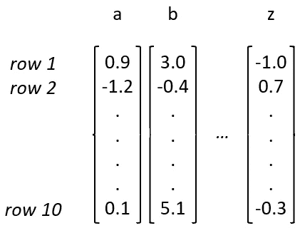

图片由作者提供

让我们称一组大小相同的向量为矩阵。上面的矩阵叫做**嵌入矩阵**。你给它一个对应字母的列号，然后查看矩阵中的那一列，你就能得到表示那个字母的向量。这个方法更一般地应用于嵌入任意事物的集合——你只需要保证矩阵中的列数等于你要表示的事物数量。

# 子词 Token 化器

到目前为止，我们一直在使用字符作为语言的基本构建块。这有其局限性。神经网络的权重需要做大量的工作，它们必须理解特定字符序列（即单词）如何相邻出现，然后再与其他单词相邻。如果我们直接为单词分配嵌入并让网络预测下一个单词会怎么样呢？反正网络只理解数字，所以我们可以为单词“humpty”、“dumpty”、“sat”、“on”等分配一个 10 维的向量，然后我们只需要输入两个单词，它就能给我们预测下一个单词。“**Token**”是我们嵌入并传递给模型的单一单位。我们目前的模型使用字符作为 Token，现在我们提出使用整个单词作为 Token（如果你愿意，你当然可以使用整个句子或短语作为 Token）。

使用词汇分词对我们的模型有一个深远的影响。英语中有超过 18 万个单词。采用我们输出解释方案，即每个可能的输出对应一个神经元，我们需要数十万个神经元来构成输出层，而不是大约 26 个神经元。随着隐层规模的增大，以达到现代网络所需的有意义结果，这个问题变得不那么紧迫。然而需要注意的是，由于我们是将每个单词单独处理，并且我们从每个单词的随机数嵌入开始——非常相似的单词（例如“cat”和“cats”）将从无关联开始。你会期望这两个单词的嵌入应该相互接近——这无疑是模型会学习到的。但是，我们是否可以以某种方式利用这种显而易见的相似性来加速启动并简化问题呢？

是的，我们可以。今天语言模型中最常见的嵌入方案是将单词分解成子词，然后进行嵌入。在“cat”这个例子中，我们将“cats”分解成两个标记——“cat”和“s”。现在，模型更容易理解“s”后面跟随其他熟悉单词的概念，依此类推。这也减少了我们需要的标记数量（[sentencepiece](https://github.com/google/sentencepiece)是一个常见的分词器，其词汇量选项在几万到数十万个单词之间，而英语则有数十万个单词）。分词器是一个工具，它接受输入文本（例如“Humpty Dumpt”）并将其拆分为标记，随后返回对应的数字，以便在嵌入矩阵中查找该标记的嵌入向量。例如，在“humpty dumpty”这个例子中，如果我们使用字符级分词器，并且按照上图排列嵌入矩阵，那么分词器将首先把“humpty dumpt”拆分成字符[‘h’,‘u’,…‘t’]，然后返回数字[8,21,…20]，因为你需要查找嵌入矩阵中的第 8 列，以获得'h'的嵌入向量（嵌入向量是你要输入到模型中的内容，而不是数字 8，与之前不同）。矩阵列的排列完全无关紧要，我们可以为'h'指定任何列，只要每次输入'h'时查找相同的向量就可以。分词器给我们一个任意（但固定）的数字，使查找变得容易。我们真正需要它们做的主要任务是将句子拆分成标记。

使用嵌入和子词分词时，模型可能是这样的：

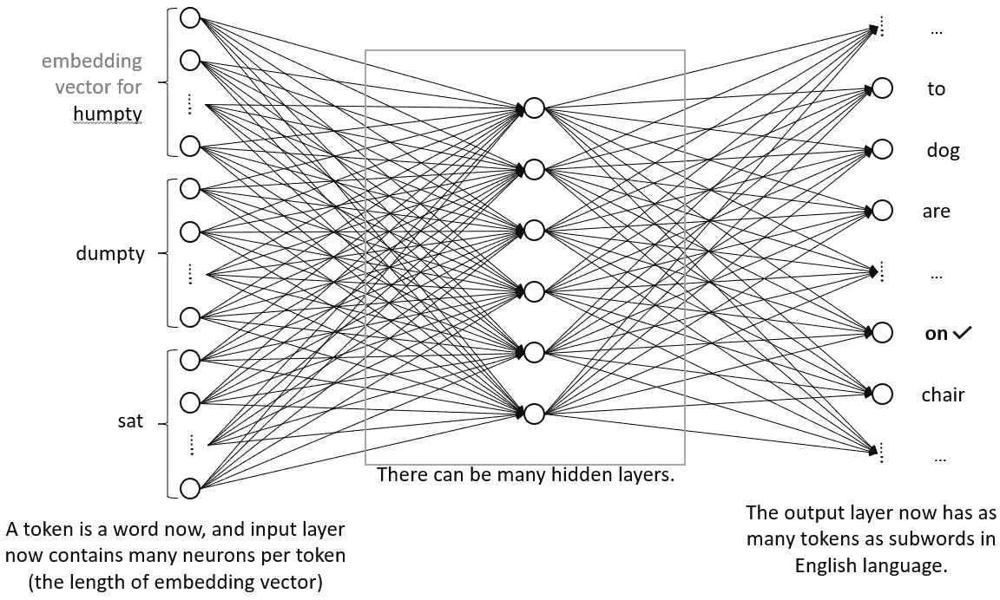

作者提供的图片

接下来的几节将讨论语言模型中的一些最新进展，以及使 LLM（大型语言模型）如此强大的技术。然而，为了理解这些进展，你需要掌握一些基本的数学概念。以下是这些概念：

+   矩阵和矩阵乘法

+   数学中函数的一般概念

+   数字的幂运算（例如 a³ = a * a * a）

+   样本均值、方差和标准差

我已在附录中添加了这些概念的总结。

# 自注意力

到目前为止，我们只看到了一个简单的神经网络结构（称为前馈网络），它包含多个层，每一层都与下一层完全连接（即，连续层之间有连接线），并且只与下一层连接（例如，第 1 层和第 3 层之间没有连接等）。然而，正如你可以想象的那样，没有什么能阻止我们移除或建立其他连接，甚至可以构建更复杂的结构。让我们来探讨一个特别重要的结构：自注意力。

如果你看一下人类语言的结构，我们想要预测的下一个单词将依赖于之前的所有单词。然而，它们可能比其他单词更依赖于某些前面的单词。例如，如果我们试图预测“Damian had a secret child, a girl, and he had written in his will that all his belongings, along with the magical orb, will belong to ____”中的下一个单词，这个单词可以是“her”或“him”，它特别依赖于句子中更早的一个单词：*girl/boy*。

好消息是，我们简单的前馈模型连接了上下文中的所有单词，因此它可以学习重要单词的适当权重。但问题在于，通过前馈层连接我们模型中特定位置的权重是固定的（对于每个位置都是如此）。如果重要单词总是出现在相同的位置，它将适当地学习权重，我们就可以顺利进行。然而，下一次预测的相关单词可能出现在系统的任何位置。我们可以改写上述句子，在猜测“her”与“his”时，对于这个预测而言，无论该单词出现在句子中的哪个位置，“boy/girl”这个单词都是一个非常重要的单词。因此，我们需要的权重不仅取决于位置，还要依赖于该位置的内容。我们如何实现这一点呢？

自注意力做的是类似于将每个单词的嵌入向量相加，但它不是直接相加，而是对每个向量应用一些权重。因此，如果“humpty”、“dumpty”和“sat”的嵌入向量分别是 x1、x2、x3，那么它会在相加之前将每个向量与一个权重（一个数字）相乘。类似于输出 = 0.5 x1 + 0.25 x2 + 0.25 x3，其中 output 是自注意力的输出。如果我们将权重写作 u1、u2、u3，使得输出 = u1x1 + u2x2 + u3x3，那么我们如何找到这些权重 u1、u2、u3 呢？

理想情况下，我们希望这些权重依赖于我们正在加权的向量——正如我们所看到的，有些可能比其他的更重要。但对于谁来说更重要？对于我们即将预测的单词。所以我们也希望权重依赖于我们即将预测的单词。现在这是一个问题，因为在预测之前我们当然不知道我们将要预测哪个单词。那么，自注意力机制使用的是我们即将预测的单词前面的那个单词，即句子中可用的最后一个单词（我其实不知道为什么是这样，而不是别的什么，但深度学习中的许多事情都是试错法，我怀疑这种方法效果很好）。

很好，所以我们需要这些向量的权重，并且我们希望每个权重依赖于我们正在聚合的单词和即将预测单词前面的那个单词。基本上，我们希望有一个函数 u1 = F(x1, x3)，其中 x1 是我们将要加权的单词，x3 是我们所拥有的序列中的最后一个单词（假设我们只有 3 个单词）。现在，达成这一目标的一种直接方法是为 x1 建立一个向量（我们称之为 k1），为 x3 建立一个单独的向量（我们称之为 q3），然后简单地计算它们的点积。这样我们就能得到一个数值，它将依赖于 x1 和 x3。那么我们如何获得这些向量 k1 和 q3 呢？我们构建一个小型的单层神经网络，将 x1 映射到 k1（或者 x2 映射到 k2，x3 映射到 k3，依此类推）。我们再构建另一个网络，将 x3 映射到 q3，依此类推… 使用我们的矩阵表示法，基本上我们会得到权重矩阵 Wk 和 Wq，使得 k1 = Wk * x1，q1 = Wq * x1，依此类推。现在，我们可以计算 k1 和 q3 的点积来得到一个标量，因此 u1 = F(x1, x3) = Wk * x1 **·** Wq * x3。

自注意力机制中还有一个额外的事情是，我们不会直接对嵌入向量本身进行加权求和。相反，我们对该嵌入向量的一些“值”进行加权求和，这些值是通过另一个小型的单层网络获得的。这意味着，类似于 k1 和 q1，我们现在也有了 x1 这个单词的 v1，并且通过矩阵 Wv 获得它，公式为 v1 = Wv * x1。然后，v1 会被聚合。所以如果我们只有 3 个单词并且试图预测第四个单词，它大致看起来是这样的：

自注意力机制。图像由作者提供

加号表示向量的简单相加，意味着它们必须具有相同的长度。这里没有展示的最后一个修改是，标量 u1、u2、u3 等不一定加起来等于 1。如果我们需要它们作为权重，我们应该使它们相加为 1。因此，我们在这里使用一个熟悉的技巧——应用 softmax 函数。

这是自注意力机制。还有交叉注意力机制，其中你可以让 q3 来自于最后一个单词，但 k 和 v 可以来自于完全不同的句子。例如，在翻译任务中，这非常有价值。现在我们知道什么是注意力机制了。

现在，可以将整个过程放入一个框中，称之为“自注意力模块”。基本上，这个自注意力模块接收嵌入向量，并输出一个用户选择长度的单一输出向量。这个模块有三个参数，Wk、Wq、Wv——它不需要比这更复杂。在机器学习文献中有很多这样的模块，它们通常在图表中以框的形式表示，并标有它们的名称。类似这样：

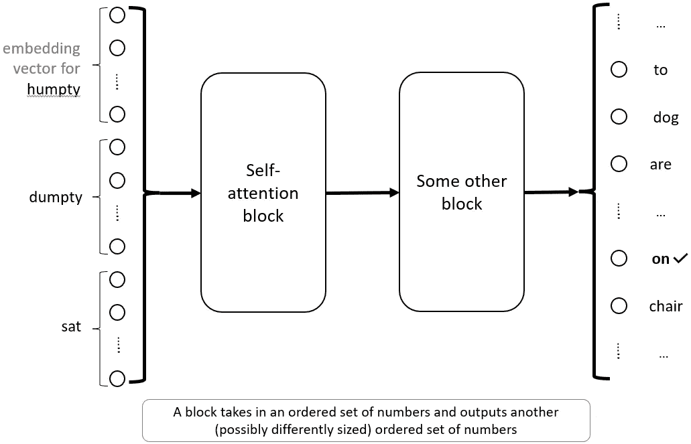

作者提供的图片

你会注意到，使用自注意力时，到目前为止，事物的位置似乎并不重要。我们在所有地方都使用相同的 W，因此交换“Humpty”和“Dumpty”并不会真正产生区别——所有数字最终都会是一样的。这意味着，虽然注意力机制可以决定关注什么，但这并不依赖于词语的位置。然而，我们知道，词语的位置在英语中是重要的，我们可能通过给模型一些词语位置的感知来提高性能。

因此，当使用注意力机制时，我们通常不会直接将嵌入向量输入到自注意力模块中。我们稍后将看到如何在将嵌入向量输入到注意力模块之前，添加“位置编码”。

*预备知识提示*：对于那些并非第一次阅读自注意力机制的人来说，可能会注意到我们并没有提到任何 K 和 Q 矩阵，或者应用掩码等。这是因为这些细节属于实现层面的内容，源于这些模型通常的训练方式。一批数据被输入，模型被同时训练以预测“dumpty”从“humpty”，从“humpty dumpty”预测“sat”，等等。这是为了提高效率，与解释或模型输出无关，我们选择在这里省略训练效率的技巧。

# Softmax

我们在第一条笔记中简要提到过 softmax。这里是 softmax 试图解决的问题：在我们的输出解释中，我们有和我们希望网络选择的选项一样多的神经元。我们说我们将网络的选择解释为值最大的神经元。然后我们说我们将计算损失值，作为网络提供的值与我们希望的理想值之间的差异。但我们希望的理想值是什么呢？在叶子/花卉的例子中，我们将其设置为 0.8。但为什么是 0.8？为什么不是 5，或者 10，或者 1000 万？在这个训练示例中，值越大越好。理想情况下，我们希望它是无限大！但这将使问题变得无法解决——所有损失值都将是无限大，我们通过调整参数（记住“梯度下降”）来最小化损失的计划将失败。我们该如何处理呢？

我们可以做的一件简单的事情是限制我们想要的值。假设在 0 和 1 之间？这会让所有的损失是有限的，但现在我们面临一个问题，那就是当网络超出范围时会发生什么。假设它在某个情况下输出（5,1）作为（leaf，flower），而在另一个情况下输出（0,1）。第一个情况做出了正确的选择，但损失更大！好吧，那么现在我们需要一种方法，将最后一层的输出也转换到（0,1）的范围内，从而保持顺序。我们可以在这里使用任何函数（在数学中，“**函数**”指的是将一个数字映射到另一个数字——一个数字输入，另一个数字输出——这基于规则来决定给定输入会输出什么）来完成这项工作。一个可能的选择是逻辑函数（见下图），它将所有数字映射到（0,1）之间，并保持顺序：

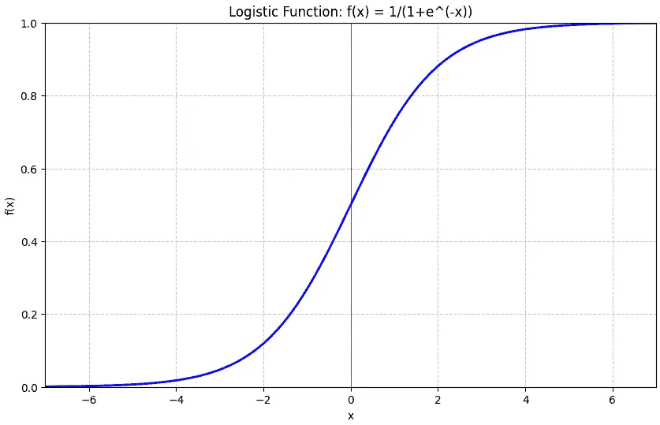

图片由作者提供

现在，我们为最后一层的每个神经元都得到了一个 0 到 1 之间的数字，我们可以通过将正确的神经元设置为 1，其他神经元设置为 0，并计算它与网络提供的结果之间的差异来计算损失。这是可行的，但我们能做得更好吗？

回到我们“Humpty Dumpty”的例子，假设我们正在尝试逐字符生成“dumpty”，而模型在预测“dumpty”中的“m”时出错。它没有给出“m”作为最高值，而是给出了“u”作为最高值，但“m”是接近的第二选择。

现在我们可以继续“duu”，并尝试预测下一个字符，以此类推，但模型的置信度会较低，因为从“humpty duu..”开始并没有很多好的续写方式。另一方面，“m”是一个接近的第二选择，因此我们也可以尝试“m”，预测接下来的几个字符，看看会发生什么？也许它能给我们一个更好的整体单词？

所以我们在这里讨论的不仅仅是盲目选择最大值，而是尝试几种选择。什么是一个好的方法呢？嗯，我们需要为每个选择分配一个概率——比如说，选择第一个的概率为 50%，第二个的概率为 25%，以此类推。这是一个好的方法。但也许我们希望概率取决于底层模型的预测。如果模型预测的“m”和“u”值非常接近（与其他值相比）——那么也许探索这两者之间 50-50 的机会是一个好主意？

所以我们需要一个好的规则，将这些数字转化为概率。这就是 softmax 所做的。它是上面逻辑函数的推广，具有附加功能。如果你给它 10 个任意的数字——它会给你 10 个输出，每个输出都在 0 和 1 之间，而且重要的是，所有 10 个输出加起来等于 1，这样我们就可以将它们解释为概率。你会在几乎所有的语言模型中发现 softmax 作为最后一层。

# 残差连接

随着章节的推进，我们逐渐改变了对网络的可视化表示。现在我们使用框/块来表示某些概念。这种符号在表示残差连接这一特别有用的概念时非常有用。让我们看一下结合自注意力块的残差连接：

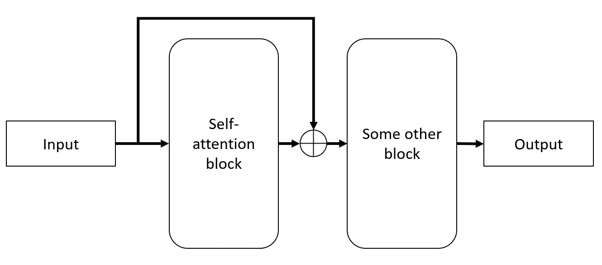

残差连接。图片来源：作者

请注意，我们将“输入”和“输出”表示为框，以简化理解，但这些基本上仍然只是与上面显示的神经元/数字的集合。

那么这里发生了什么呢？我们基本上是将自注意力块的输出，在传递到下一个块之前，加入原始输入。首先需要注意的是，这要求自注意力块的输出维度必须与输入的维度相同。由于自注意力的输出是由用户决定的，所以这不是问题。但是为什么要这样做呢？我们在这里不深入探讨所有细节，但关键是，随着网络加深（输入和输出之间的层数增多），训练它们变得越来越困难。残差连接已被证明有助于解决这些训练挑战。

# 层归一化

层归一化是一个相当简单的层，它接收进入该层的数据，通过减去均值并除以标准差来进行归一化（可能会有些许变化，正如下文所示）。例如，如果我们在输入后立即应用层归一化，它将取输入层中的所有神经元，然后计算两个统计量：它们的均值和标准差。假设均值为 M，标准差为 D，那么层归一化所做的就是将每个神经元替换为(x-M)/D，其中 x 表示任意给定神经元的原始值。

那么这有什么帮助呢？它基本上稳定了输入向量，并有助于训练深度网络。一个担心的问题是，通过归一化输入，我们是否去除了其中一些可能对学习我们目标有所帮助的有用信息？为了解决这个问题，层归一化层有一个缩放和偏置参数。基本上，对于每个神经元，您只需将其与一个标量相乘，然后加上一个偏置。这个标量和偏置值是可以训练的参数。这允许网络学习一些可能对预测有价值的变化。而且由于这些是唯一的参数，LayerNorm 块并没有很多需要训练的参数。整个过程看起来大致如下：

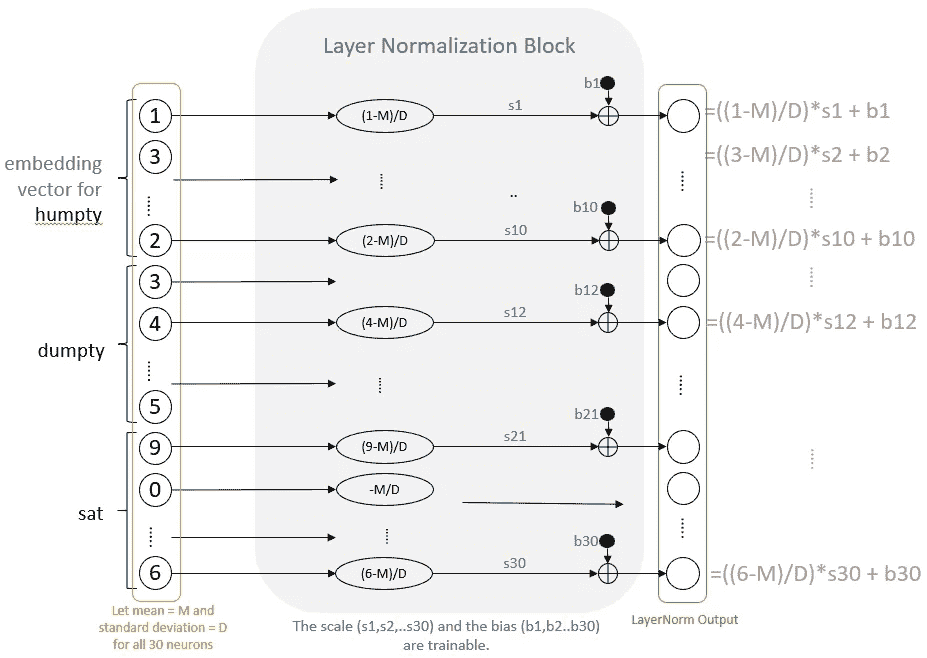

层归一化。图片来源：作者

缩放和偏差是可训练的参数。你可以看到，层归一化（layer norm）是一个相对简单的模块，其中每个数值仅在点对点操作下进行处理（在初步计算均值和标准差之后）。这让人联想到激活层（如 RELU），唯一的关键区别是这里我们有一些可训练的参数（尽管由于简单的点对点操作，它们远少于其他层的参数）。

标准差是一个统计量，用来衡量数据分布的离散程度。例如，如果所有的值都相同，你会说标准差为零。如果一般情况下，每个值都远离这些值的均值，那么标准差就会很高。计算标准差的公式是：从每个数值中减去这些数值的均值，然后将每个差值平方。将这些平方后的结果相加，再除以数据的数量 N。最后对结果取平方根。

对于已了解相关内容的读者：有经验的机器学习（ML）专业人士会注意到，这里没有讨论批归一化（batch norm）。事实上，本文中甚至没有引入批次（batches）这一概念。大多数情况下，我认为批次是另一种训练加速手段，与理解核心概念无关（除了批归一化，我们在这里不需要讨论）。

# Dropout  

Dropout 是一种简单而有效的方法，用于避免模型过拟合。过拟合是指当你在训练数据上训练模型时，它在该数据集上表现良好，但在模型未见过的样本上却无法很好地泛化。帮助我们避免过拟合的技术被称为“**正则化技术**”，而 Dropout 正是其中之一。

如果你训练一个模型，它可能会对数据产生误差，或者以某种特定方式对数据进行过拟合。如果你训练另一个模型，它可能也会出现类似情况，但表现方式不同。如果你训练多个这样的模型并将它们的输出进行平均呢？这些通常被称为“**集成模型**”，因为它们通过结合多个模型的输出预测结果，而集成模型通常比任何单一模型表现得更好。

在神经网络中，你也可以做类似的操作。你可以构建多个（略有不同的）模型，然后将它们的输出结合起来以获得更好的模型。然而，这可能会计算开销较大。Dropout 是一种技术，它并不完全构建集成模型，但确实捕捉到了一些集成方法的精髓。

这个概念很简单，通过在训练过程中插入一个 Dropout 层，你所做的就是随机删除 Dropout 层插入位置之间的神经元连接的某一百分比。考虑我们的初始网络，并在输入层和中间层之间插入一个 Dropout 层，设定 50%的丢弃率，效果可能如下所示：

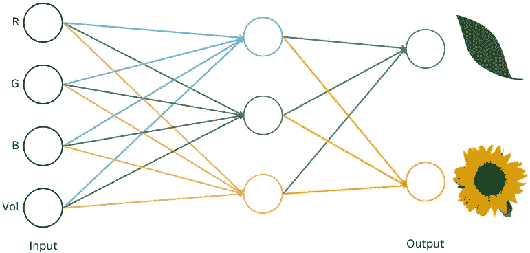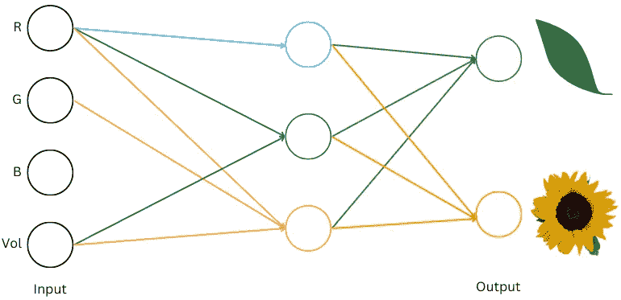

图片来自作者

现在，这迫使网络在训练时有大量冗余。实质上，你是在同时训练多个不同的模型——但它们共享权重。

现在，为了进行推理，我们可以采用与集成模型相同的方法。我们可以使用 dropout 做出多个预测，然后将它们组合起来。然而，由于这在计算上比较耗时——并且由于我们的模型共享共同的权重——为什么不直接使用所有权重进行预测（即一次性使用所有的权重，而不是每次只使用 50%的权重）呢？这应该能给我们提供一个集成方法的近似结果。

其中一个问题是：使用 50%权重训练的模型在中间神经元中的数值与使用所有权重的模型差异很大。我们想要的是这里更像是集成式的平均方法。我们该怎么做呢？一种简单的方法是将所有权重乘以 0.5，因为我们现在使用了两倍数量的权重。这就是 Dropout 在推理过程中做的事情。它会使用包含所有权重的完整网络，并将权重乘以(1 - p)，其中 p 是删除的概率。研究表明，这种方法作为正则化技术效果非常好。

# 多头注意力

这是变换器架构中的关键模块。我们已经看到过什么是注意力模块。记住，注意力模块的输出是由用户决定的，且它的长度是 v 的长度。多头注意力基本上是并行运行多个注意力头（它们都采用相同的输入）。然后我们将它们的所有输出连接在一起。它大概长这样：

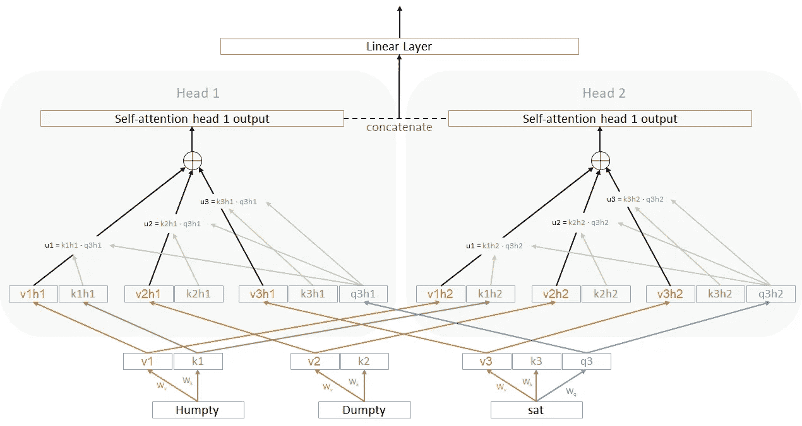

多头注意力。图片来自作者

请记住，从 v1 -> v1h1 的箭头是线性层——每条箭头上都有一个矩阵来进行变换。我只是没有显示它们，以避免杂乱。

这里发生的事情是，我们为每个头生成相同的 key、query 和 value。但接着我们基本上是在这些值上应用一个线性变换（分别对每个 k、q、v 和每个头进行处理），然后使用这些 k、q、v 值。这一额外的层在自注意力中并不存在。

另一个旁注是，对我而言，这种创建多头注意力的方式有点出乎意料。例如，为什么不为每个头创建单独的 Wk、Wq、Wv 矩阵，而是通过增加一个新层并共享这些权重呢？如果你知道，请告诉我——我真的不清楚。

# 位置编码和嵌入

我们在自注意力部分简要讨论了使用位置编码的动机。这些是什么？虽然图片显示了位置编码，但使用位置嵌入比使用编码更常见。因此，我们在这里讨论了一种常见的位置嵌入，但附录中也涵盖了原始论文中使用的位置编码。位置嵌入与任何其他嵌入没有什么不同，只是不同于嵌入词汇，我们将嵌入数字 1、2、3 等。因此，这种嵌入是与词嵌入相同长度的矩阵，每列对应一个数字。就是这样简单。

# GPT 架构

让我们谈谈 GPT 架构。这是大多数 GPT 模型中使用的架构（可能会有一些变化）。如果你迄今为止一直在关注本文，那么这应该很容易理解。使用方框表示法，这是高层次上架构的样子：

GPT 架构。作者提供的图片

到目前为止，除了“GPT 变压器块”外，所有其他块都已经详细讨论过了。这里的+号简单地表示两个向量相加（这意味着两个嵌入必须是相同大小）。让我们看看这个 GPT 变压器块：

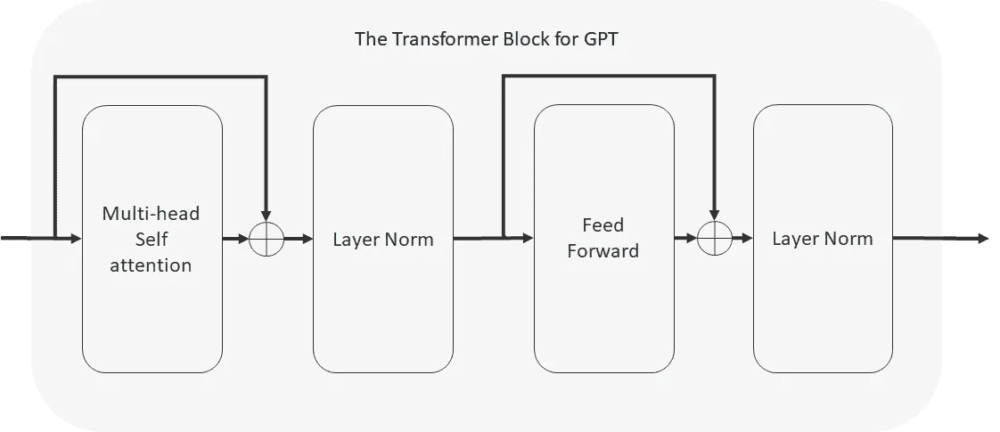

就是这样。这里称为“变压器”，因为它源自并且是一种变压器类型——这是我们将在下一节中讨论的架构。这不会影响理解，因为我们已经在之前涵盖了这里显示的所有构建块。让我们回顾一下到目前为止我们所讨论的所有内容，以构建这个 GPT 架构：

+   我们看到神经网络如何将数字作为输入并输出其他数字，并具有可训练的参数权重

+   我们可以将这些输入/输出数字附加解释，并赋予神经网络现实世界的含义

+   我们可以串联神经网络以创建更大的网络，我们可以称每个网络为一个“块”，并用一个方框表示它，以便更容易绘制图表。每个块仍然做同样的事情，接收一堆数字并输出另一堆数字

+   我们学习了许多不同类型的块，用于不同的目的

+   GPT 只是这些块的特殊排列，如上所示，并且具有我们在第一部分讨论过的解释

随着公司构建强大的现代 LLM，对此进行了一些修改，但基本原理保持不变。

现在，这个 GPT 变压器实际上是原始变压器论文中所称的“解码器”。让我们来看看。

# 变压器架构

这是推动最近语言模型能力快速提升的关键创新之一。Transformer 不仅提高了预测准确性，而且比以前的模型更易于训练/更高效，使得更大的模型规模成为可能。这正是上面提到的 GPT 架构的基础。

如果你看看 GPT 架构，你会发现它非常适合生成序列中的下一个词。它基本上遵循我们在第一部分讨论的相同逻辑。从几个词开始，然后继续一次生成一个。但如果你想做翻译怎么办？假设你有一个德语句子（例如：“Wo wohnst du?” = “Where do you live?”），你想将其翻译成英语。我们如何训练模型来完成这个任务？

好的，首先我们需要做的是找出一种输入德语单词的方法。这意味着我们必须扩展我们的嵌入，包含德语和英语。现在，我想这里有一种简单的输入信息的方法。为什么不把德语句子连接到当前生成的任何英语句子的开头，然后将其传递给上下文呢？为了使模型更容易理解，我们可以添加一个分隔符。每一步的样子大致如下：

图片来自作者

这样做是可行的，但仍有改进空间：

+   如果上下文长度是固定的，有时候原始句子会丢失。

+   这个模型需要学习很多东西。它同时处理两种语言，还需要知道 <SEP> 是分隔符标记，模型需要从这里开始翻译。

+   你在处理整个德语句子时，每生成一个词都有不同的偏移量。这意味着相同的内容会有不同的内部表示，模型应该能够处理所有这些内容来进行翻译。

Transformer 最初是为这个任务创建的，由一个“编码器”和一个“解码器”组成——基本上是两个独立的模块。一个模块仅仅是接收德语句子并给出一个中间表示（再次说明，是一堆数字，基本上是这样的）——这个过程叫做编码器。

第二个模块生成词语（到目前为止我们已经看到过很多）。唯一的区别是，除了将已生成的词传递给它之外，我们还将编码后的德语句子（来自编码器模块）传递给它。因此，当它生成语言时，它的上下文基本上是到目前为止所有已生成的词，加上德语。这一模块叫做解码器。

这些编码器和解码器每个由几个模块组成，特别是夹在其他层之间的注意力模块。让我们来看一下论文《Attention is all you need》中的一个 Transformer 插图，并试着理解它：

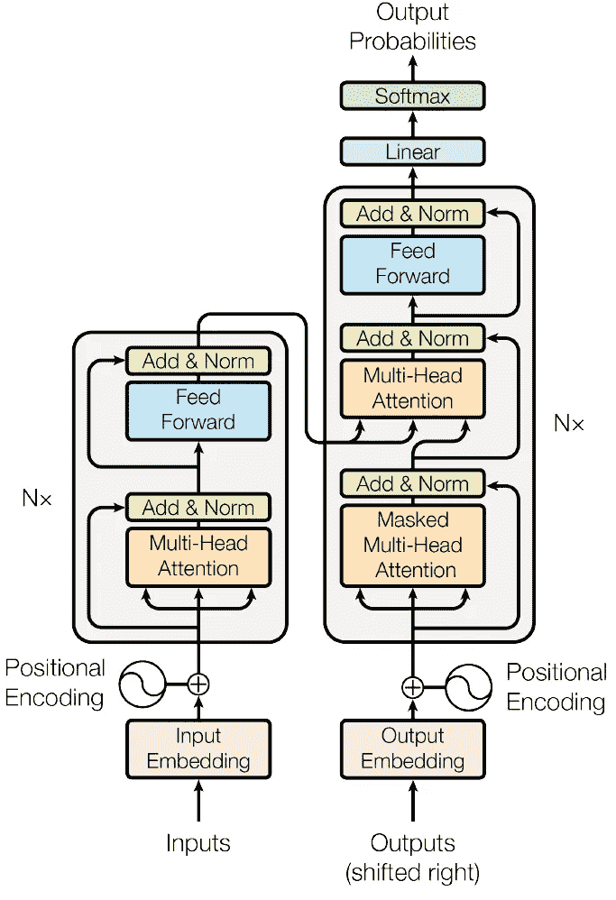

图片来自 Vaswani 等人（2017）

左侧垂直排列的一组模块叫做“编码器”，右侧的模块叫做“解码器”。让我们一起来理解一下之前没有涉及到的部分：

*图示解读：* 这里的每一个方框都是一个块，它接收一些神经元形式的输入，并输出一组神经元，输出的神经元可以被下一个块处理或由我们进行解读。箭头显示了块的输出去向。如你所见，我们通常会将一个块的输出作为输入传递给多个块。让我们逐个解释这里的内容：

前馈：前馈网络是指不包含循环的网络。我们在第一部分中的原始网络就是一个前馈网络。实际上，这个块使用的结构非常相似。它包含两个线性层，每个线性层后面跟着一个 RELU（请参见第一部分中关于 RELU 的说明）和一个丢弃层。请记住，这个前馈网络适用于每个位置的独立处理。这意味着位置 0 上的信息有一个前馈网络，位置 1 也有一个，以此类推。但是，位置 x 的神经元并没有与位置 y 的前馈网络连接。这一点很重要，因为如果不这样做，网络在训练过程中就可能通过向前查看来作弊。

*跨注意力：* 你会注意到解码器有一个多头注意力机制，箭头从编码器指向解码器。那么这里发生了什么呢？还记得自注意力和多头注意力中的值、键、查询吗？它们都是来自同一个序列。查询实际上只是来自序列中的最后一个单词。那么，如果我们保留查询，但从完全不同的序列中提取值和键会怎样呢？这就是这里发生的事情。值和键来自编码器的输出。数学上没有变化，唯一的不同是键和值的输入来源发生了变化。

*Nx：* 这里的 Nx 表示该块会重复 N 次。因此，基本上你将块一个接一个地堆叠起来，并将上一个块的输入传递给下一个块。这是一种让神经网络更深的方法。现在，从图示来看，可能会对编码器的输出是如何传递给解码器产生混淆。假设 N=5。我们是否将每个编码器层的输出传递给对应的解码器层？不。基本上，你只需要运行一次完整的编码器。然后，你只需将该表示传递给每一个解码器层。

*加法与规范化块：* 这基本上和下面的内容相同（猜测作者只是想节省空间）

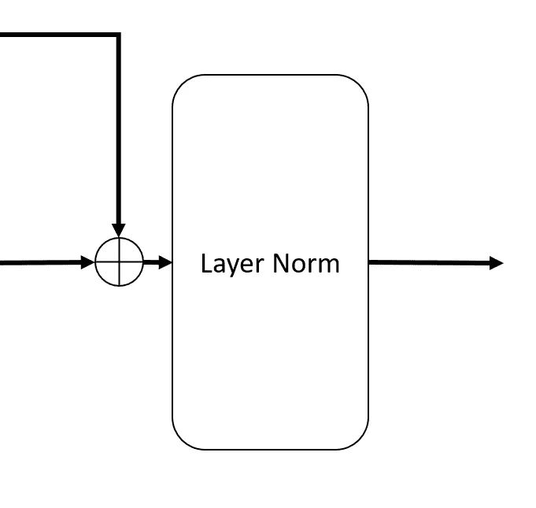

作者提供的图片

其他的内容已经讨论过了。现在你已经对变换器架构有了完整的理解，从简单的加法和乘法运算开始，完全自包含！你知道每一行、每个加法、每个框和每个词在从零开始构建时的含义。从理论上讲，这些笔记包含了你从头开始编写变换器所需的内容。事实上，如果你感兴趣的话，[这个仓库](https://github.com/karpathy/nanoGPT)已经实现了上述 GPT 架构。

# 附录

## 矩阵乘法

我们在上文中介绍了嵌入的背景下的向量和矩阵。矩阵有两个维度（行数和列数）。向量也可以看作是一个矩阵，其中一个维度等于一。两个矩阵的乘积定义为：

作者提供的图片

点表示乘法。现在我们再看看第一张图片中蓝色和有机神经元的计算。如果我们把权重写成矩阵，把输入写成向量，那么我们可以用以下方式表达整个操作：

作者提供的图片

如果权重矩阵叫做“W”，输入叫做“x”，那么 Wx 就是结果（在这种情况下是中间层）。我们也可以对它们进行转置，写成 xW——这只是一个个人偏好的问题。

## 标准差

我们在层归一化部分使用了标准差的概念。标准差是一个统计量，用来衡量一组数据的离散程度（即数据值的分布情况）。例如，如果所有数据值相同，那么标准差就是零。如果每个数据值都远离这些数据的均值，那么标准差会很高。计算一组数字（比如 N 个数字 a1、a2、a3……）的标准差的公式如下：首先从每个数字中减去这些数字的均值，然后对每个差值进行平方。将所有这些平方值加在一起，再除以 N。最后，对这个结果取平方根。

## 位置编码

我们在上面讨论了位置嵌入。位置编码只是一个与词嵌入向量长度相同的向量，只不过它不是嵌入，意思是它不是经过训练的。我们简单地为每个位置分配一个唯一的向量，例如，位置 1 和位置 2 的向量不同，依此类推。实现这种方法的一种简单方式是让该位置的向量全部由该位置的编号组成。因此，位置 1 的向量将是[1,1,1...1]，位置 2 的向量将是[2,2,2...2]，依此类推（请记住，每个向量的长度必须与嵌入长度匹配，以便进行加法操作）。这种方法有问题，因为我们可能会在向量中得到很大的数字，这会在训练过程中带来挑战。当然，我们可以通过将每个数字除以位置的最大值来对这些向量进行归一化处理。如果总共有 3 个词，那么位置 1 的向量将是[.33, .33, ... , .33]，位置 2 的向量将是[.67, .67, ... , .67]，依此类推。现在的问题是，我们不断地改变位置 1 的编码（这些数字会随着我们输入四个单词的句子而不同），这使得网络难以学习。所以在这里，我们需要一个方案，为每个位置分配一个唯一的向量，而且数值不会爆炸。基本上，如果上下文长度是 d（即，我们可以输入到网络中以预测下一个词/标记的最大令牌/词的数量，请参见“如何生成语言？”部分中的讨论），而嵌入向量的长度是 10（假设如此），那么我们需要一个有 10 行和 d 列的矩阵，其中所有列都是唯一的，且所有数值都位于 0 和 1 之间。考虑到在 0 和 1 之间有无限多个数，而矩阵的大小是有限的，因此可以用多种方式来实现。

“Attention is all you need”论文中使用的方法大致如下：

+   绘制 10 个正弦曲线，每个曲线为 si(p) = sin(p/10000(i/d))（即 10 的 k 次方到 i/d 次方）

+   填充编码矩阵，使得(i,p)位置的数值为 si(p)，例如，对于位置 1，编码向量的第 5 个元素为 s5(1)=sin(1/10000(5/d))

为什么选择这种方法？通过改变 10 的幂次，你会改变正弦函数在 p 轴上的振幅。如果你有 10 个不同的正弦函数，每个函数的振幅不同，那么当 p 的值变化时，过很长时间才能得到重复的值（即所有 10 个值相同）。这有助于为我们提供唯一的值。实际上，论文中使用了正弦和余弦函数，编码形式是：si(p) = sin(p/10000(i/d))，当 i 为偶数时；si(p) = cos(p/10000(i/d))，当 i 为奇数时。
