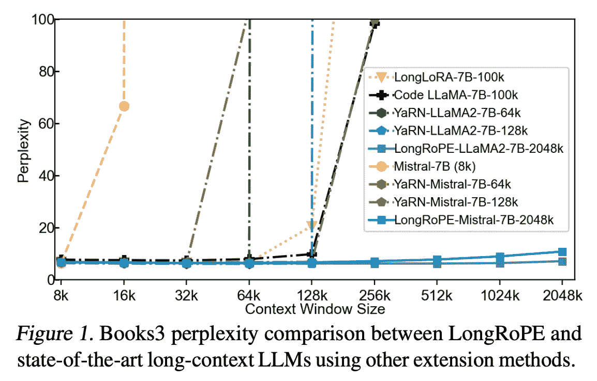

# 理解 LLM 中的 Long RoPE

> 原文：[`towardsdatascience.com/understanding-long-rope-in-llms-29337dc7e4a9?source=collection_archive---------1-----------------------#2024-05-15`](https://towardsdatascience.com/understanding-long-rope-in-llms-29337dc7e4a9?source=collection_archive---------1-----------------------#2024-05-15)

## 本文将详细介绍 Long RoPE 方法，该方法用于扩展 LLM 中的上下文长度，而不会显著降低性能。

 [Matthew Gunton](https://medium.com/@mgunton7?source=post_page---byline--29337dc7e4a9--------------------------------)

·发表于[Towards Data Science](https://towardsdatascience.com/?source=post_page---byline--29337dc7e4a9--------------------------------) ·8 分钟阅读·2024 年 5 月 15 日

--

图片由作者提供 — 由 Stable Diffusion 2.1 生成

随着公众开始在日常生活中使用 LLM，一个重要的问题浮现出来，那就是在进行长时间对话时，LLM 有时会完全忘记之前说过的内容！在后台，每一行对话都被输入到 LLM 的上下文中，你可以将其视为对模型的巨大输入。一旦对话超出了上下文的处理能力，就必须删除一些数据。

这不仅是糟糕的客户体验，还限制了 LLM 合理处理信息的能力。因此，相关工作一直在进行，以构建具有越来越大上下文的 LLM。

今天的论文《LongRoPE：将 LLM 上下文窗口扩展到超 2 百万个标记》就实现了这一目标。

来自[论文](https://arxiv.org/pdf/2402.13753)的图 1

从上面的图表来看，我们可以看到困惑度（一个衡量损失的指标，反映 LLM 预测下一个标记的准确性）对于 LongRoPE 保持较低，但却出现了峰值…
