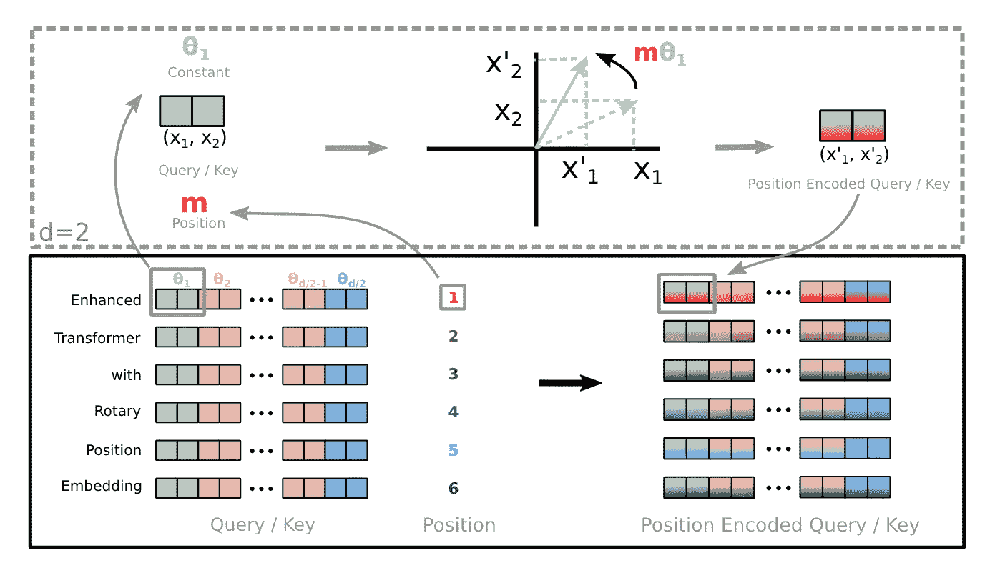

# 理解变压器中的位置嵌入：从绝对到旋转

> 原文：[`towardsdatascience.com/understanding-positional-embeddings-in-transformers-from-absolute-to-rotary-31c082e16b26?source=collection_archive---------2-----------------------#2024-07-20`](https://towardsdatascience.com/understanding-positional-embeddings-in-transformers-from-absolute-to-rotary-31c082e16b26?source=collection_archive---------2-----------------------#2024-07-20)

## 深入分析绝对位置、相对位置和旋转位置嵌入，并附有代码示例

 [Mina Ghashami](https://medium.com/@mina.ghashami?source=post_page---byline--31c082e16b26--------------------------------)

·发表于 [Towards Data Science](https://towardsdatascience.com/?source=post_page---byline--31c082e16b26--------------------------------) ·阅读时间 17 分钟·2024 年 7 月 20 日

--

旋转位置嵌入 — 图片来自 [[6](https://arxiv.org/pdf/2104.09864)]

变压器（transformers）的一个关键组件是**位置嵌入**。你可能会问：为什么？因为变压器中的自注意力机制是置换不变的；这意味着它计算每个输入标记从序列中其他标记接收到的`注意力`的量，但它并不考虑标记的顺序。事实上，*注意力机制将序列视为标记的集合*。因此，我们需要另一个组件，称为位置嵌入，用于表示标记的顺序，并影响标记的嵌入。但不同类型的位置嵌入是什么，它们是如何实现的呢？

在这篇文章中，我们将深入探讨三种主要的位置信息嵌入，并深入了解它们的实现方式。

**以下是本文的目录：**

1\. 背景与概述

2\. 绝对位置嵌入

+   2.1 学习方法

+   2.2 固定方法（正弦波）

+   2.3 代码示例：RoBERTa 实现
