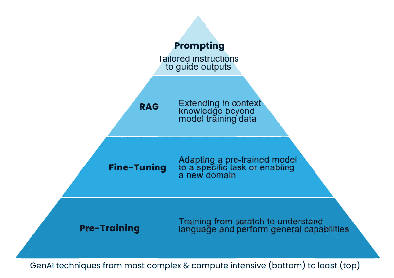
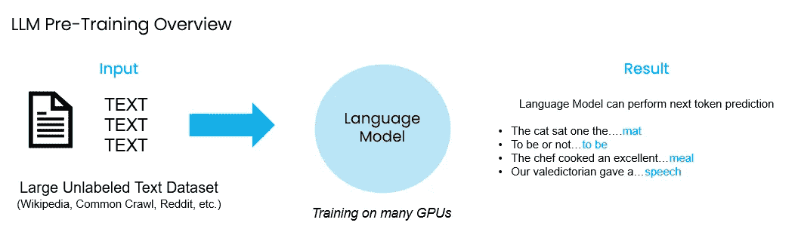
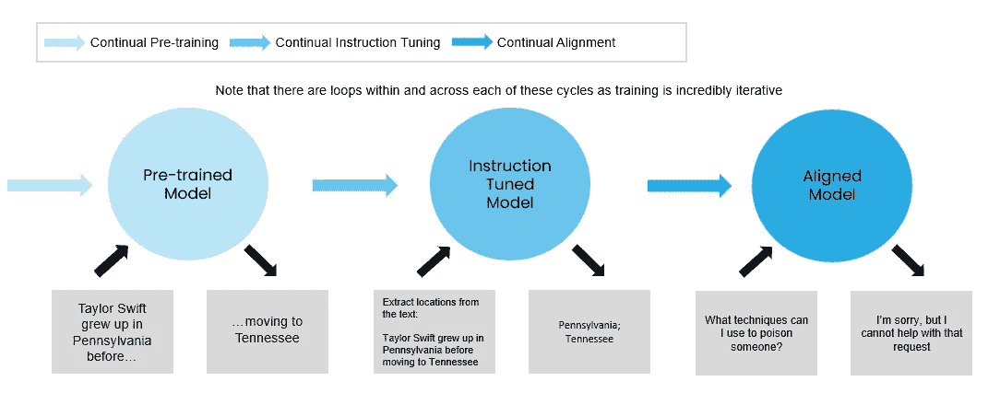
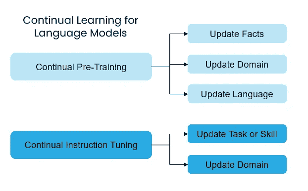
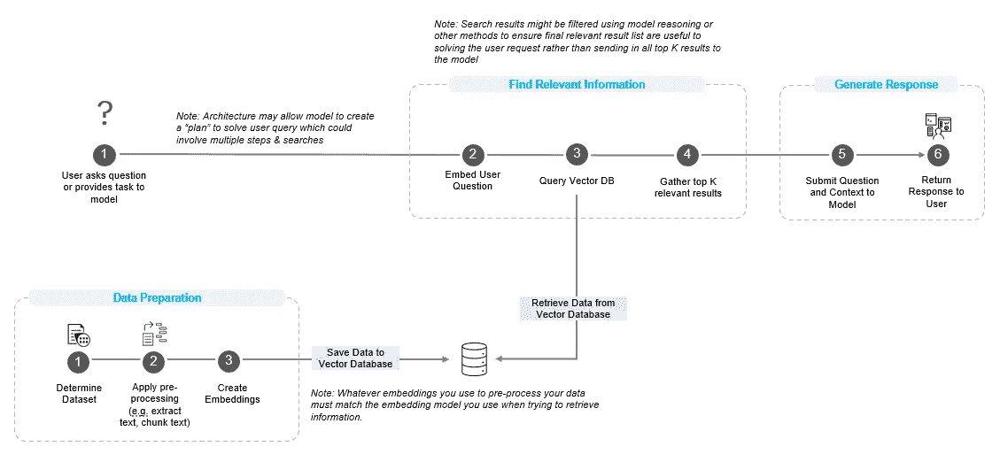
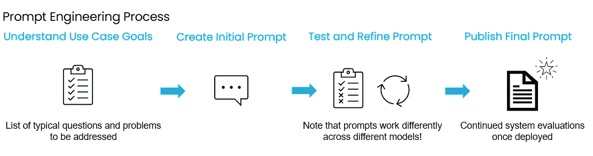

# 了解解决 GenAI 挑战的技术

> 原文：[`towardsdatascience.com/understanding-techniques-for-solving-genai-challenges-83a7ad4650bd?source=collection_archive---------5-----------------------#2024-06-20`](https://towardsdatascience.com/understanding-techniques-for-solving-genai-challenges-83a7ad4650bd?source=collection_archive---------5-----------------------#2024-06-20)

## *深入了解模型预训练、微调、RAG、提示工程等技术！*

 [Tula Masterman](https://medium.com/@tula.masterman?source=post_page---byline--83a7ad4650bd--------------------------------)

·发表于 [Towards Data Science](https://towardsdatascience.com/?source=post_page---byline--83a7ad4650bd--------------------------------) ·15 分钟阅读·2024 年 6 月 20 日

--

来源：作者及 GPT4o。图片设计旨在展示语言模型学习和发展其大脑的过程！

# 引言

生成性人工智能的应用正在快速增长，涵盖个人和企业。最近的一项[Gartner 研究](https://www.gartner.com/en/newsroom/press-releases/2024-05-07-gartner-survey-finds-generative-ai-is-now-the-most-frequently-deployed-ai-solution-in-organizations)发现，生成性 AI 解决方案是组织中使用最广泛的 AI 解决方案，大多数公司都在利用内置于现有工具中的 GenAI 功能，如 Microsoft 365 Copilot。根据我的经验，大多数企业都在寻求某种形式的“私有 ChatGPT”，希望通过它从独特的组织数据中获得更多价值。公司的目标各不相同，从在特定文档中查找信息、基于表格数据生成报告和总结内容，到查找与某个领域相关的所有项目等等。

本文探讨了解决这些问题的各种方法，概述了每种方法的优缺点和应用场景。我的目标是提供指导，帮助你在何时考虑不同的方法，并如何将它们结合起来，以实现最佳效果，涵盖从最复杂、最昂贵的预训练方法到最简单、最具成本效益的提示工程技术。

文章的结构旨在从模型训练的基础概念（预训练、继续预训练和微调）开始，逐步过渡到更常见的技术（RAG 和提示工程），这些技术用于与现有模型进行交互。

作者提供的图片

# 背景

解决 GenAI 问题没有“一刀切”的方法。大多数使用场景需要结合多种技术才能取得成功的结果。通常，组织从像 GPT-4、Llama3 70b Instruct 或 DBRX Instruct 这样的模型开始，这些模型已经在万亿级别的标记上进行了预训练，用于执行下一个标记预测，然后为特定任务（如指令或对话）进行微调。基于指令的模型经过训练和优化，能够遵循提示中给出的具体指令，而基于对话的模型则经过训练和优化，能够处理多轮对话格式，保持对话的上下文和一致性。

使用现有模型使组织能够利用像 OpenAI、Meta 和 Databricks 等公司在数据集策划、创新架构创建以及模型训练和评估上所做的大量时间和资金投资。

尽管并不是每个公司都需要预训练或进行指令微调他们的模型，但任何使用大型语言模型（LLM）的人都受益于这些行业领袖所打下的基础。这一基础使得其他公司能够应对独特的挑战，而无需从零开始。

在接下来的章节中，我们将探讨预训练、微调（包括指令微调和继续预训练）、检索增强生成（RAG）、RAG 的嵌入微调以及提示工程，讨论如何以及何时使用或考虑每种方法。

## 通过预训练设定基线

**概述**：预训练模型创建了一个基础，作为所有下游任务的基础。这个过程包括定义模型的架构、策划一个庞大的数据集（通常是万亿级的标记）、训练模型并评估其表现。在 LLM 和 SLM 的上下文中，预训练阶段用于将知识注入模型，使其能够预测序列中的下一个单词或标记。例如，在句子“the cat sat on the ___”中，模型学习预测“mat”。

像 OpenAI 这样的公司已经在其 GPT 模型的预训练阶段投入了大量资金，但由于像 GPT-3.5、GPT-4 和 GPT-4o 这样的模型是闭源的，因此无法使用底层架构，并在不同的数据集和参数上预训练该模型。然而，借助像 Mosaic AI 的预训练 API 这样的资源，能够对像 DBRX 这样的开源模型进行预训练。

**优点**：

+   **完全控制**：预训练模型的好处在于，你可以完全控制整个模型创建过程。你可以根据需求定制架构、数据集和训练参数，并通过代表你所在领域的评估进行测试，而不是主要集中在常见的基准测试上。

+   **固有的领域特定知识**：通过策划专注于特定领域的数据集，模型可以比通用模型更深入地理解该领域。

**缺点**：

+   **最昂贵的选项**：预训练需要极大量的计算能力（许多 GPU），这意味着预训练的成本通常在数百万到数千万甚至上亿美元，并且通常需要数周才能完成训练。

+   **知识截止时间**：最终模型也是在某一时间点完成的，因此它不会固有地理解实时信息，除非通过像 RAG 或函数调用这样的技术进行增强。

+   **高级要求**：这种方法需要最多的数据和最先进的专业知识才能取得有意义的结果。

**应用**：一般来说，只有当其他方法不足以满足你的用例时，预训练你自己的模型才是**必要的**。例如，如果你想训练一个模型来理解一种它以前没有接触过的新语言，你可以考虑先进行预训练，然后再根据你的需求进行微调。

一旦基础训练完成，模型通常需要进行微调，以便能够有效执行任务。当你看到一个标记为聊天模型或指令模型时，这意味着基础模型已经针对这些目的进行了微调。如今你与之互动的几乎所有模型都已经针对这些目的进行了微调，以便最终用户能够高效地与模型互动。

由于预训练模型所需的巨大成本和复杂过程，大多数组织决定在其 GenAI 用例中利用现有模型。要开始进行预训练，请查看 [Mosaic AI 的预训练 API](https://docs.mosaicml.com/projects/mcli/en/latest/pretraining/pretraining.html)，它允许你使用不同参数大小的 Databricks DBRX 模型进行预训练。

作者提供的图片。LLM 和 SLM 预训练概览。

## 使用持续预训练（CPT）添加知识

**概述**：CPT 是一种微调方法，它允许扩展现有模型的知识，而不是从零开始训练整个模型。经过 CPT 的模型输出仍然会预测下一个标记。通常建议先使用 CPT，再进行指令微调（IFT），这样你可以先扩展模型的知识，然后将其调优为特定任务，如执行指令或聊天。如果顺序反过来，模型可能会忘记在 IFT 阶段学到的指令。

**优点**：

+   **无需标签训练数据**：CPT 不需要标签训练数据。如果你有大量领域特定或新的信息想要教给模型，这是非常好的选择。由于输出仍然集中在下一个标记的预测上，CPT 的输出对你想要一个文本补全模型时非常有帮助。

+   **比预训练更快且更具成本效益**：CPT 可以在数小时或几天内完成，使用的 GPU 比预训练少，因此更快且更便宜！

**缺点**：

+   **仍然相对昂贵**：虽然 CPT 比预训练便宜得多，但仍然可能很昂贵，根据数据量和所需 GPU 数量的不同，训练一个模型可能需要花费数万美元。

+   **需要精心设计的评估**：此外，你需要创建自己的评估方法，以确保模型在你所教的新领域中表现良好。

+   **通常需要后续的 IFT**：对于大多数使用案例，在 CPT 完成后，你仍然需要对模型进行 IFT，以便最终模型能够正确地回答问题或进行对话。这最终会增加时间和成本，直到你得到一个可以使用的模型。

**应用场景**：对于那些**具有高度领域特定内容的行业，如医疗或法律，CPT 可能是向模型介绍新话题的一个不错选择**。使用像[Mosaic AI 的微调 API](https://docs.mosaicml.com/projects/mcli/en/latest/finetuning/finetuning.html)这样的工具，你可以轻松开始 CPT，只需要一系列用于训练的文本文件。对于 CPT 过程，所有文本文件将被连接在一起，并在每个文档之间加上分隔符，Mosaic 会在幕后处理如何将这些文件输入模型进行训练的复杂性。

举个例子，假设我们使用 CPT 处理一系列关于负责任的人工智能和 AI 政策的文本文件。如果我提示模型“告诉我负责任的人工智能中三个重要的原则”，我很可能会得到一个与我提示内容高度相关的回答，比如“我需要理解负责任人工智能的关键原则，以便我能训练一个有效的模型”。尽管这个回答与我的提示有关，但它并没有直接回答问题。这表明需要通过 IFT 来改进模型的指令跟随能力。

图像由作者提供，灵感来源于[大规模语言模型的持续学习：一项综述](https://arxiv.org/pdf/2402.01364)

## 通过指令微调（IFT）定制回答

**概述**：IFT 用于教导模型如何执行特定任务。通常需要成千上万的示例，并且可以用于特定目的，如改善问答、提取关键信息或采用某种语气。

**优点**：

+   **速度和成本效益**：IFT 完成的时间显著更短，这种类型的训练可以在几分钟内实现，使其不仅更快，而且相比预训练或 CPT 更便宜。

+   **任务特定定制**：这是一种很好的方法，可以通过指导模型以特定的语气响应、分类文档、修订某些文档等方式，获得定制化的结果。

**缺点**：

+   **需要标注数据集：** IFT 需要标注数据来教模型如何应对特定任务。虽然有许多开源数据集可供使用，但根据你特定的应用场景，创建和标注一个合适的数据集可能需要一些时间。  

+   **潜在的通用能力下降：** 通过 IFT 引入新技能可能会降低模型在通用任务上的表现。如果你担心保持模型的泛化能力，可以在训练和评估集中特意包括通用技能的示例，这样你可以在测试新技能的同时，衡量模型在通用任务上的表现。  

**应用：** IFT 帮助模型**更好地执行特定任务，如问答**。例如，使用提示语“告诉我三个对负责任的人工智能很重要的原则”，经过 IFT 训练的模型可能会回应类似这样的回答：“负责任的人工智能对于确保模型的道德使用至关重要，基于透明性、公平性和隐私等核心原则进行构建。遵循负责任的 AI 原则有助于将解决方案与更广泛的社会价值和道德标准对齐。”与仅由 CPT 或 PT 模型生成的回答相比，这种回应对最终用户更具实用性，因为它直接解答了问题。

*请注意，存在多种微调方法和技术，旨在提高整体模型性能并减少训练过程中的时间和成本。*  

  

图片来源：作者。灵感来源于[《大规模语言模型的持续学习：一项综述》](https://arxiv.org/pdf/2402.01364)  

## 使用检索增强生成（RAG）技术查找实时或私密信息  

**概述：** RAG 使语言模型能够使用训练数据之外的信息回答问题。在 RAG 过程中，用户查询触发从向量索引中检索相关信息，随后将这些信息与原始查询一起集成到新的提示中，以生成响应。由于其有效性和简便性，这一技术是当前最常用的技术之一。  

**优点：**  

+   **访问实时信息和训练数据之外的信息：** RAG 允许模型利用来自不同且不断更新的来源（如互联网或内部文档数据库）的查询信息。任何可以存储在向量索引中或通过插件/工具检索的信息，都可以在 RAG 过程中使用。  

+   **实现简便：** RAG 不需要自定义训练，这使其既具有成本效益，又易于上手。它也是一个非常有文献支持和研究的领域，许多文章提供了关于如何改善 RAG 系统响应的见解。  

+   **可追溯性和引用**：所有生成的响应可以包含用于回答查询的文档引用，这使得用户能够轻松验证信息并了解回答是如何生成的。由于你清楚知道哪些信息被发送给模型以回答问题，因此很容易向最终用户提供可追溯的答案，如果需要，最终用户还可以查看引用的文档以获取更多信息。相比之下，如果你直接查询模型，很难知道它是如何回答问题的，或者使用了哪些参考资料来生成回答。

**缺点**：

+   **上下文窗口的限制**：第一个主要问题是不同模型的上下文窗口大小，例如，GPT-4 和 4o 有 128k 令牌的上下文窗口，而 Llama-3 系列仍然只有 8k 令牌。上下文窗口较小意味着你无法向模型传递足够的信息来回答问题。因此，拥有强大的文本分块和分块重排名技术变得尤为重要，这样你可以检索到正确的上下文，并利用这些上下文正确地回应用户。

+   **“中间丢失问题”**：即使使用更长的上下文窗口，仍然存在一个常见的“中间丢失问题”，即模型往往更关注提示中的开头或结尾信息，这意味着如果问题的答案位于上下文的中间，即使提供了回答问题所需的所有信息，模型仍然可能会回答错误。类似地，模型可能会混淆它们检索到的信息，导致只部分正确地回答问题。例如，我曾见过在要求模型查找关于两家公司的信息并返回它们对人工智能的看法时，模型偶尔会混淆两家公司的政策。

+   **Top K 检索挑战**：在典型的 RAG（检索增强生成）管道中，只有与查询相关的前 K 个文档（或文本块）会被检索并传递给模型以生成最终响应。当需要在文档库中查找特定细节时，这种模式能够取得更好的效果，但在回答需要广泛搜索的问题时往往无法正确回答。例如，提示“给我所有关于负责任的人工智能的文档”需要额外的逻辑来继续在向量索引中搜索所有相关的负责任 AI 文档，而不是在返回前 K 个相关块后就停止。

+   **过于相似的文档**：如果向量索引包含的文档在语义上都非常相似，模型可能很难检索到与任务最相关的具体文档。特别是在专业领域或语言统一的领域中尤为如此。在文档内容多样化的向量索引中可能不会出现这个问题，但如果你在一个包含医学文档的索引中使用 RAG，而所有语言都非常相似，且不是典型嵌入模型所训练的内容，那么可能会更难找到你需要的文档/答案。

**应用场景**：任何涉及**在一组文档上进行问答的使用案例通常都会涉及 RAG**。这是一种非常实用的方式，可以让你快速开始使用生成性人工智能，并且不需要额外的模型训练。新兴的 AI 代理概念也通常会至少有一个用于 RAG 的工具。许多代理实现将为不同的数据源提供基于 RAG 的工具。例如，一个内部支持代理可能能够访问 HR 工具和 IT 支持工具。在这种设置中，HR 和 IT 文档都可能有一个 RAG 组件，每个工具背后可能运行相同的管道，唯一的区别是文档数据集。

作者提供的图像。RAG 过程概览。

## 通过微调嵌入来改进 RAG 中的 R

**概述**：微调嵌入可以改善 RAG 的检索组件。微调嵌入的目标是使向量嵌入在向量空间中进一步分开，使它们彼此之间更加不同，从而更容易找到与问题最相关的文档。

**优点**：

+   **通常具有成本效益**：与其他训练方法相比，微调嵌入的成本相对较低。

+   **领域特定的定制化**：这种方法对于区分那些嵌入模型在训练时没有充分接触过的领域的文本非常有效。例如，针对高度专业化的法律或医疗保健文档，可以在 RAG 管道中为这些语料库微调嵌入。

**缺点**：

+   **需要标注数据并且通常需要重新训练**：微调嵌入模型需要一个标注的数据集。此外，在你向索引中添加更多信息时，可能需要持续重新训练嵌入模型。

+   **跨索引的额外维护**：根据你查询的数据源数量，你可能还需要跟踪多个嵌入模型及其相关数据源。需要记住的是，无论使用哪个嵌入模型来嵌入文档语料库，检索时用于嵌入查询的模型必须是相同的。如果你查询的是多个索引，并且每个索引使用不同的嵌入模型，那么你需要确保在检索时你的模型是一致的。

**应用**：如果传统的 RAG 方法效果不佳，因为索引中的文档彼此过于相似，微调嵌入是一个**很好的选择**。通过微调嵌入，你可以教会模型更好地区分领域特定的概念，并改进你的 RAG 结果。

## 与模型进行提示工程对话

**概述**：提示工程是与生成型 AI 模型互动的最常见方式，它只是向模型发送一条旨在获得你想要输出的信息的消息。它可以像“讲一个关于德国牧羊犬的故事”那么简单，或者它也可以非常复杂，涉及你希望模型执行的具体细节。

**优点**：

+   **即时结果**：使用不同的提示进行实验，可以在任何时候访问语言模型时进行，并且结果在几秒钟内（甚至更少）就能返回！一旦灵感来了，你可以开始优化提示，直到模型给出期望的回应。

+   **在通用任务中的高性能**：仅靠提示工程对于不需要获取特定业务信息或实时信息的通用任务非常有效。

+   **与其他技术的兼容性**：它适用于已经预训练、持续预训练或微调的模型，并且可以与 RAG 结合使用，使其成为最常用和最具多样性的方式。

**缺点**：

+   **单独能力有限**：仅仅依赖提示工程通常不足以让模型按你希望的方式表现。大多数情况下，人们希望模型与某些外部数据交互，无论是文档数据库、API 调用还是 SQL 表，这些都需要将提示工程与 RAG 或其他专门的工具调用结合使用。

+   **精度挑战**：编写完美的提示可能具有挑战性，通常需要大量的调整，直到模型按预期表现为止。一个在某个模型上效果很好提示可能在另一个模型上失败，要求在多个模型和提示变体之间进行大量的迭代和实验。

**应用**：提示工程将**与上述所有技术结合使用，以产生预期的回应**。有许多不同的提示工程技术可以帮助将模型引导到正确的方向。如需更多关于这些技术的信息，我推荐这篇[微软的提示工程指南](https://developer.microsoft.com/en-us/reactor/events/22001/)，他们提供了从链式思维提示到更复杂技巧的多种示例。

作者提供的图片。提示工程流程概览。

# 结论

生成式人工智能技术每天都在变化和进步。大多数应用程序将需要利用本文中描述的各种技术。开始使用已经针对指令或对话能力进行微调的现有语言模型，并重点关注提示工程和 RAG，是一个很好的起点！从这里开始，寻找更多需要微调/指令微调的定制用例，可以带来更大的好处。

展望未来，AI 代理提供了一种有前景的方式，可以利用最新的进展，包括在大量公共数据上预训练并针对对话/指令跟随进行了微调的闭源和开源模型。只要拥有合适的工具，这些代理可以代你执行令人惊叹的任务，从使用 RAG 进行信息检索到帮助规划公司活动或假期。

此外，随着拥有大量专业数据的组织开始预训练自己的模型，我们可以预期会看到更多领域特定模型的出现。例如，像[Harvey](https://www.harvey.ai/)这样的公司已经在开发量身定制的人工智能解决方案，能够处理法律行业的独特需求。这一趋势可能会持续下去，导致高度专业化的模型在各个领域提供更精确和相关的结果。

通过结合不同 AI 技术的优势，利用 AI 代理和领域特定模型的力量，组织可以释放生成式 AI 的全部潜力。

## 其他参考文献

+   [Gartner 调查发现生成式 AI 现已成为组织中最常部署的 AI 解决方案](https://www.gartner.com/en/newsroom/press-releases/2024-05-07-gartner-survey-finds-generative-ai-is-now-the-most-frequently-deployed-ai-solution-in-organizations)

+   [大型语言模型的指令调优：一项调查](https://arxiv.org/abs/2308.10792v5)

+   [大型语言模型的持续预训练：如何（重新）加热你的模型？](https://arxiv.org/pdf/2308.04014)

+   [大型语言模型的持续学习：一项调查](https://arxiv.org/abs/2402.01364)

+   [困在中间：语言模型如何使用长上下文](https://arxiv.org/abs/2307.03172)

+   [Mosaic AI 微调文档](https://docs.mosaicml.com/projects/mcli/en/latest/finetuning/finetuning.html)

+   [Microsoft 的提示工程指南 / 录音](https://developer.microsoft.com/en-us/reactor/events/22001/)

+   [Anthropic 的提示工程指南](https://docs.anthropic.com/en/docs/prompt-engineering)

+   [Cudo Compute: 训练大型语言模型的成本是多少](https://www.cudocompute.com/blog/what-is-the-cost-of-training-large-language-models)

*有兴趣进一步讨论或合作吗？请通过* [*LinkedIn*](https://www.linkedin.com/in/tula-masterman/) *与我联系！*
