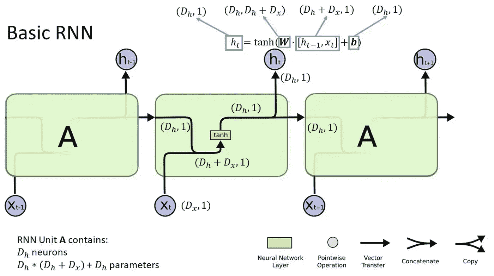
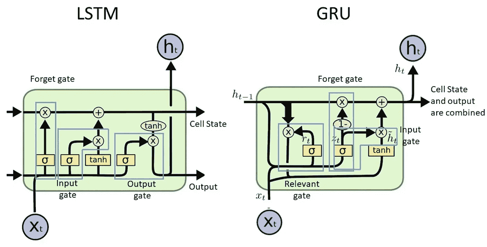
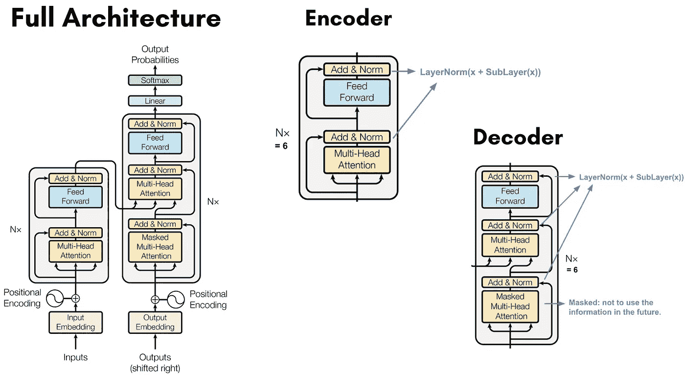
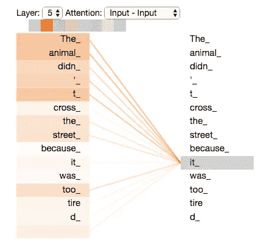
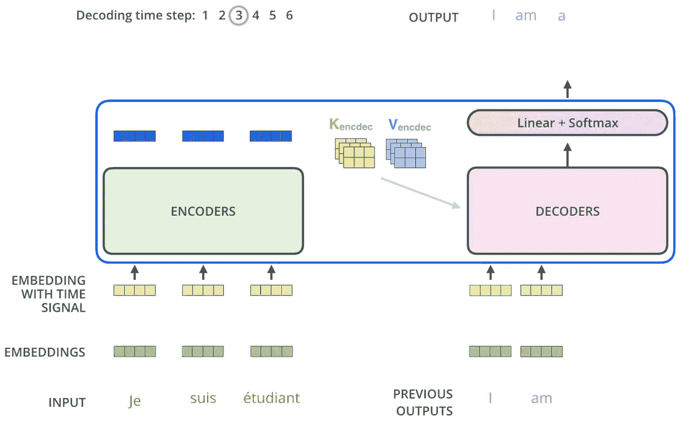
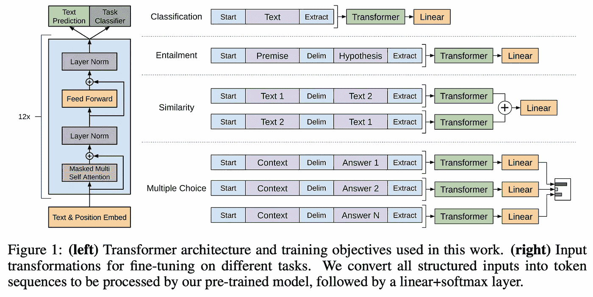

# 理解 Transformer

> 原文：[`towardsdatascience.com/understanding-transformers-3344d16c8c36?source=collection_archive---------0-----------------------#2024-06-27`](https://towardsdatascience.com/understanding-transformers-3344d16c8c36?source=collection_archive---------0-----------------------#2024-06-27)

## 《Attention is All You Need》¹的简明分解

 [Aveek Goswami](https://medium.com/@aveekgoswami?source=post_page---byline--3344d16c8c36--------------------------------)

·发布于 [Towards Data Science](https://towardsdatascience.com/?source=post_page---byline--3344d16c8c36--------------------------------) ·阅读时间：10 分钟·2024 年 6 月 27 日

--

Transformer 于 2017 年发布。尽管已有许多文章解释其工作原理，但我经常发现它们要么深入探讨数学内容，要么对细节的讲解过于浅显。我往往需要花费与阅读同样多的时间去谷歌搜索（或使用 ChatGPT），这显然不是理解一个主题的最佳方法。因此，我写了这篇文章，试图简洁明了地解释 Transformer 最具革命性的方面，让任何人都能轻松阅读。

> 本文假设读者对机器学习原理有一般性的理解。

Transformer，正在转变。图片来源：DALL-E（反正我们也在学习生成式人工智能）

## Transformer 背后的理念将我们带入了生成式人工智能的时代。

Transformer 代表了一种新的**序列转导模型架构**。序列模型是一种将输入序列转化为输出序列的模型。这些输入序列可以是各种数据类型，例如字符、单词、符号、字节、数字、音素（语音识别），也可以是多模态的¹。

在 Transformer 出现之前，序列模型主要基于递归神经网络（RNN）、长短期记忆网络（LSTM）、门控递归单元（GRU）和卷积神经网络（CNN）。这些模型通常包含某种形式的注意力机制，用于考虑序列中各个位置的元素所提供的上下文。

# 以前模型的缺点

RNN 插图。图片来源：[Christopher Olah](http://colah.github.io/posts/2015-08-Understanding-LSTMs/)

+   **RNNs**：该模型按顺序处理数据，因此从前一次计算中学到的任何内容都会在下一次计算中得到考虑²。然而，它的顺序性质带来了一些问题：模型在处理较长序列时难以考虑长期依赖关系（即**梯度消失或爆炸**问题），并且**阻止了输入序列的并行处理**，因为你无法在同一时间对输入的不同部分进行训练（批处理），否则会失去前部分的上下文。这使得训练变得更加计算密集。

LSTM 和 GRU 概述。图片来源：[Christopher Olah](http://colah.github.io/posts/2015-08-Understanding-LSTMs/)

+   **LSTM 和 GRUs**：利用**门控机制**来保持长期依赖关系³。该模型具有一个*单元状态*，包含整个序列的相关信息。单元状态通过门控（如**遗忘门、输入门、输出门（LSTM）**、**更新门、重置门（GRU）**）进行变化。这些门控决定了在每一次顺序迭代中，应该保留前一状态的多少信息，应该添加多少来自新更新的信息，然后在最终保留新单元状态的哪个部分。虽然这解决了梯度消失问题，但模型仍然是**顺序工作的**，因此由于并行化有限，尤其是当序列变长时，**训练较慢**。

+   **CNNs**：以更并行的方式处理数据，但从技术上讲仍然是顺序操作。它们**擅长捕捉局部模式**，但由于卷积工作的方式，**难以处理长期依赖关系**。捕捉两个输入位置之间关系所需的操作数量**随着位置之间的距离增加**。

因此，引入了**Transformer**，该模型完全依赖**注意力机制**，并且不再使用循环和卷积。注意力机制是模型在每一步生成输出时，用来集中关注输入序列不同部分的机制。Transformer 是第一个不依赖顺序处理而使用注意力机制的模型，**允许并行化**，因此**在不丧失长期依赖关系的情况下加速训练**。它还在输入位置之间执行**恒定数量的操作**，无论这些位置相距多远。

# **深入了解 Transformer 模型架构**

Transformer 架构。图片来源：[Attention is All You Need](https://arxiv.org/pdf/1706.03762)

Transformer 的关键特性有：**分词**，**嵌入层**，**注意力机制**，**编码器**和**解码器**。假设有一个法语输入序列：“*Je suis etudiant*”和一个目标输出序列为英语“*I am a student*”（我在这里直接复制了这个[链接](http://jalammar.github.io/illustrated-transformer/)，它非常详细地解释了这个过程）

## **分词**

输入的单词序列会转换成长度为 3 到 4 个字符的标记

## **嵌入**

输入和输出序列会映射到一个连续表示的序列**z**，该序列代表了**输入和输出的嵌入**。每个标记会通过嵌入表示，从而捕获某种**含义**，这有助于**计算它与其他标记的关系**；该嵌入将作为向量表示。为了创建这些嵌入，我们使用训练数据集的**词汇表**，它包含了用于训练模型的每个唯一输出标记。接着，我们确定一个合适的嵌入维度，这对应于每个标记的向量表示的大小；较高的嵌入维度将更好地捕获更复杂/多样/精细的含义和关系。因此，嵌入矩阵的维度，对于词汇表大小 V 和嵌入维度 D，变成 V x D，从而使其成为一个**高维向量**。

在初始化时，这些嵌入可以随机初始化，并且更精确的嵌入会在**训练过程中学习**。嵌入矩阵随后会在训练过程中更新。

**位置编码**会添加到这些嵌入中，因为 Transformer 没有内置的标记顺序感知能力。

计算标记“it”的注意力分数。如你所见，模型将大量注意力集中在标记“The”和“Animal”上。图片来源：[Jay Alammar](http://jalammar.github.io/illustrated-transformer/)

## **注意力机制**

自注意力机制是每个标记在序列中**与每个其他标记计算注意力分数**，以**理解标记之间的关系**，不管它们彼此之间的距离如何。我会避免在本文中过多涉及数学内容，但你可以在[这里](http://jalammar.github.io/illustrated-transformer/)了解用于计算注意力分数的不同矩阵，从而捕获每个标记与其他标记之间的关系。

这些注意力分数将生成每个标记的**新一组表示⁴**，然后在下一层处理中使用。在训练过程中，**权重矩阵会通过反向传播进行更新**，以便模型能够更好地考虑标记之间的关系。

多头注意力是自注意力的扩展。计算不同的注意力得分，结果被拼接并转换，最终的表示增强了模型**捕捉词汇间各种复杂关系**的能力。

## **编码器**

输入词嵌入（由输入序列生成）带有位置编码，被输入到编码器中。编码器有 6 层，每一层包含 2 个子层：**多头注意力**和**前馈网络**。此外，还有一个残差连接，导致每一层的输出为 LayerNorm(x+Sublayer(x))，如图所示。编码器的输出是一系列向量，这些向量是**考虑注意力得分后的输入的上下文化表示**。这些向量随后被传送到解码器中。

## **解码器**

输出词嵌入（由目标输出序列生成）带有位置编码，被输入到解码器中。解码器也包含 6 层，与编码器有两个不同之处。

首先，输出词嵌入通过**掩蔽的** **多头注意力**层，这意味着计算注意力得分时会忽略序列中后续位置的嵌入。这是因为在生成当前位置 i 的词时，我们应该**忽略位置 i 之后的所有输出词**。此外，输出词嵌入会向右偏移一个位置，使得位置 i 的预测词仅依赖于小于它的输出位置的词。

例如，假设输入是“*je suis étudiant à l’école*”，目标输出是“*i am a student in school*”。在预测*student*这个词时，编码器会提取*“je suis etudiant”*的词嵌入，而解码器则会隐藏“a”之后的词汇，这样预测*student*时仅考虑句子中之前的词汇，即“I am a”。这训练模型按顺序预测词汇。当然，“*in school*”这些词为模型的预测提供了额外的上下文，但我们在训练模型时，是让它从**输入词汇“**etudiant**”**以及**后续输入词汇**“*à l’école*”中捕捉到这个上下文。

解码器是如何获取上下文的呢？这就引出了第二个区别：解码器中的第二个多头注意力层接收**在输入传入前经过上下文化表示的输入**，以确保输出表示能够捕捉到输入词汇和之前输出的完整上下文。这为每个目标词生成一系列向量，即**上下文化的目标表示**。

图像来源：[Jay Alammar](http://jalammar.github.io/illustrated-transformer/)

## **使用线性层和 Softmax 层进行预测**

现在，我们希望使用这些上下文化的目标表示来确定下一个标记是什么。使用解码器中的上下文化目标表示，线性层将向量序列投影到一个更大的**logits 向量**中，该向量的长度与我们的模型词汇表的长度相同，假设长度为 L。线性层包含一个权重矩阵，乘以解码器的输出并加上一个偏置向量，生成一个大小为 1 x L 的 logits 向量。每个单元格表示一个独特标记的分数，softmax 层随后对该向量进行归一化，使整个向量的和为 1；此时每个单元格**表示每个标记的概率**。选择概率最高的标记， voilà！我们得到了预测标记。

## **训练模型**

接下来，我们将预测的标记概率与实际的标记概率进行比较（实际标记概率对于每个标记来说是一个全为 0 的 logits 向量，除了目标标记，其概率为 1.0）。我们为每个标记预测计算合适的**损失函数**，并将整个目标序列上的损失进行平均。然后，我们**反向传播**这个损失，计算所有模型参数的合适梯度，并使用合适的优化算法来**更新模型参数**。因此，对于经典的变换器架构，这会导致以下更新：

1.  嵌入矩阵

1.  用于计算注意力分数的不同矩阵

1.  与前馈神经网络相关的矩阵

1.  用于生成 logits 向量的线性矩阵

> 第 2 至第 4 行中的矩阵是权重矩阵，每个输出还附有额外的偏置项，这些偏置项在训练过程中也会更新。
> 
> **注意：** 线性矩阵和嵌入矩阵通常是彼此的转置。这是《Attention is All You Need》论文中的情况；这一技术称为“权重绑定”。因此，需要训练的参数数量得以减少。

这代表了**一次训练周期**。训练包含多个周期，周期数取决于数据集的大小、模型的大小以及模型的任务。

# **回到为什么变换器如此优秀**

如前所述，RNN、CNN、LSTM 等的缺点包括缺乏并行处理、顺序架构以及无法充分捕捉长期依赖关系。上述的变换器架构解决了这些问题，因为…

1.  注意力机制允许**整个序列并行处理而不是顺序处理**。通过自注意力机制，输入序列中的每个标记都会关注输入序列中的其他所有标记（在下文解释的该小批次中）。这会同时捕捉所有关系，而不是按顺序捕捉。

1.  在每个 epoch 中进行输入的小批量处理允许**并行处理、加快训练**，并且**更容易扩展模型**。在一个充满示例的大文本中，小批量表示这些示例的较小集合。数据集中的示例在被放入小批量之前会被打乱，并在每个 epoch 开始时重新洗牌。每个小批量会同时传入模型。

1.  通过使用位置编码和批处理，考虑到序列中标记的顺序。标记之间的距离也会被**平等地考虑，无论它们之间的距离有多远**，而小批量处理进一步确保了这一点。

## 正如论文中所示，结果非常出色。

欢迎来到变换器的世界。

# 关于 GPT 架构的简要介绍

Transformer 架构由研究员 Ashish Vaswani 于 2017 年提出，当时他在 Google Brain 工作。生成式预训练变换器（GPT）由 OpenAI 于 2018 年推出。两者的主要区别在于 GPT 的架构中没有编码器堆栈。编码器-解码器结构在直接将一个序列转换为另一个序列时非常有用。而 GPT 的设计侧重于生成能力，它去除了编码器，同时保持了其他组件相似。

图片来源：[通过生成预训练提高语言理解](https://cdn.openai.com/research-covers/language-unsupervised/language_understanding_paper.pdf)

GPT 模型是在一个大型文本语料库上进行预训练的，采用无监督学习，以了解所有单词和标记之间的关系⁵。经过针对不同应用场景（如通用聊天机器人）的微调后，它们在生成任务中已被证明非常有效。

## 示例

当你问它一个问题时，预测的步骤与常规的变换器大致相同。如果你问它问题：“GPT 如何预测回应”，这些词会被标记化，生成嵌入，计算注意力分数，计算下一个词的概率，并选择一个标记作为下一个预测的标记。例如，模型可能会一步步生成回应，从“GPT 通过…预测回应”开始，并根据概率继续，直到形成完整且连贯的回应。（*猜猜看，最后一句话来自 chatGPT*）。

我希望这一切足够容易理解。如果没有，那也许是时候让别人来尝试解释一下变换器了。

如果这篇文章对你有启发，欢迎分享你的想法并与我联系！

+   LinkedIn：[`www.linkedin.com/in/aveekg00/`](https://www.linkedin.com/in/aveekg00/)

+   网站：[aveek.info](http://aveek.info)

## 参考文献：

1.  [`arxiv.org/pdf/1706.03762`](https://arxiv.org/pdf/1706.03762)

1.  [`deeplearningmath.org/sequence-models`](https://deeplearningmath.org/sequence-models)

1.  [`colah.github.io/posts/2015-08-Understanding-LSTMs/`](http://colah.github.io/posts/2015-08-Understanding-LSTMs/)

1.  [`jalammar.github.io/illustrated-transformer/`](http://jalammar.github.io/illustrated-transformer/)

1.  [`openai.com/index/language-unsupervised/`](https://openai.com/index/language-unsupervised/)

## 其他值得参考的优秀文章：

+   [`lilianweng.github.io/posts/2018-06-24-attention/`](https://lilianweng.github.io/posts/2018-06-24-attention/)

+   [`bastings.github.io/annotated_encoder_decoder/`](https://bastings.github.io/annotated_encoder_decoder/)

+   [`nlp.seas.harvard.edu/annotated-transformer/#prelims`](https://nlp.seas.harvard.edu/annotated-transformer/#prelims)
